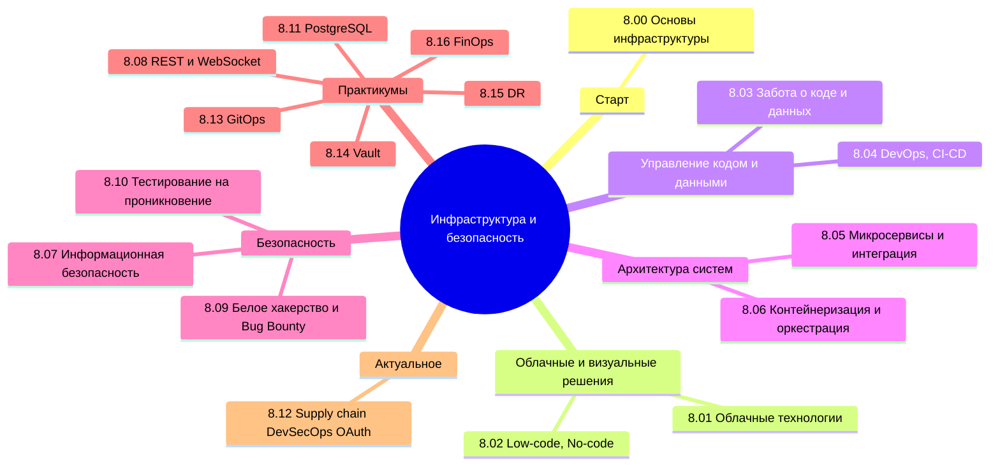

  ОБЯЗАТЕЛЬНО
  ДЛЯ НОВИЧКОВ

---

## О разделе

Текущая часть не для каждого. Не каждому аналитику нужно знать контейнеризацию, не каждому разработчику надо углубляться в облачные технологии.

Вообще, лучше воспользуйтесь содержанием или перейдите к Базе знаний. Начните с **[Основы инфраструктуры](/encyclopedia/8-infra-security/8-00-osnovy-infrastruktury/1)** — там маршруты для разработчика, DevOps и ИБ. Ниже — ссылки на основные главы:

---

## Основы инфраструктуры

<ul class="it-toc-articles">
  <li><a href="/encyclopedia/8-infra-security/8-00-osnovy-infrastruktury/1">8.00. Основы инфраструктуры</a></li>
  <li><a href="/encyclopedia/8-infra-security/8-00-osnovy-infrastruktury/2">8.00. Основы развития информационных систем</a></li>
  <li><a href="/encyclopedia/8-infra-security/8-00-osnovy-infrastruktury/3">8.00. Как развёртывают приложения</a></li>
  <li><a href="/encyclopedia/8-infra-security/8-00-osnovy-infrastruktury/998">8.00. Основы инфраструктуры — итоги</a></li>
  <li><a href="/encyclopedia/8-infra-security/8-00-osnovy-infrastruktury/999">8.00. Основы инфраструктуры — чек-лист</a></li>
</ul>

---

## Облачные технологии

<ul class="it-toc-articles">
  <li><a href="/encyclopedia/8-infra-security/8-01-oblachnye-tehnologii/1">8.01. Модели и сервисы облачных технологий</a></li>
  <li><a href="/encyclopedia/8-infra-security/8-01-oblachnye-tehnologii/2">8.01. Облачные технологии — итоги</a></li>
  <li><a href="/encyclopedia/8-infra-security/8-01-oblachnye-tehnologii/3">8.01. Облачные технологии — чек-лист</a></li>
  <li><a href="/encyclopedia/8-infra-security/8-01-oblachnye-tehnologii/11">8.01. Безопасность в облаке</a></li>
  <li><a href="/encyclopedia/8-infra-security/8-01-oblachnye-tehnologii/12">8.01. Облачные концепции и модель ответственности</a></li>
</ul>

---

## Low-code, No-code

<ul class="it-toc-articles">
  <li><a href="/encyclopedia/8-infra-security/8-02-low-code-no-code/1">8.02. Low-code и No-code платформы</a></li>
  <li><a href="/encyclopedia/8-infra-security/8-02-low-code-no-code/2">8.02. Low-code, No-code — итоги</a></li>
  <li><a href="/encyclopedia/8-infra-security/8-02-low-code-no-code/3">8.02. Low-code, No-code — чек-лист</a></li>
  <li><a href="/encyclopedia/8-infra-security/8-02-low-code-no-code/11">8.02. Пример No-Code приложения</a></li>
  <li><a href="/encyclopedia/8-infra-security/8-02-low-code-no-code/111">8.02. Внедрение Low-Code и No-code в бизнес</a></li>
</ul>

---

## Забота о коде и данных

<ul class="it-toc-articles">
  <li><a href="/encyclopedia/8-infra-security/8-03-zabota-o-kode-i-dannyh/1">8.03. Безопасность кода</a></li>
  <li><a href="/encyclopedia/8-infra-security/8-03-zabota-o-kode-i-dannyh/11">8.03. Защита кода от изменений</a></li>
  <li><a href="/encyclopedia/8-infra-security/8-03-zabota-o-kode-i-dannyh/101">8.03. Опасные скрипты</a></li>
  <li><a href="/encyclopedia/8-infra-security/8-03-zabota-o-kode-i-dannyh/111">8.03. Архитектура системы контроля версий Git</a></li>
  <li><a href="/encyclopedia/8-infra-security/8-03-zabota-o-kode-i-dannyh/112">8.03. Внутреннее устройство Git</a></li>
  <li><a href="/encyclopedia/8-infra-security/8-03-zabota-o-kode-i-dannyh/113">8.03. Особенности работы с репозиториями в Git</a></li>
  <li><a href="/encyclopedia/8-infra-security/8-03-zabota-o-kode-i-dannyh/114">8.03. Команды Git для повседневной разработки</a></li>
  <li><a href="/encyclopedia/8-infra-security/8-03-zabota-o-kode-i-dannyh/115">8.03. Настройка и параметры Git</a></li>
  <li><a href="/encyclopedia/8-infra-security/8-03-zabota-o-kode-i-dannyh/116">8.03. Сравнение Git и Subversion (SVN)</a></li>
  <li><a href="/encyclopedia/8-infra-security/8-03-zabota-o-kode-i-dannyh/117">8.03. Методы защиты пользовательских и корпоративных данных</a></li>
  <li><a href="/encyclopedia/8-infra-security/8-03-zabota-o-kode-i-dannyh/998">8.03. Забота о коде и данных — итоги</a></li>
  <li><a href="/encyclopedia/8-infra-security/8-03-zabota-o-kode-i-dannyh/999">8.03. Забота о коде и данных — чек-лист</a></li>
  <li><a href="/encyclopedia/8-infra-security/8-03-zabota-o-kode-i-dannyh/1111">8.03. Модель ветвления GitFlow</a></li>
  <li><a href="/encyclopedia/8-infra-security/8-03-zabota-o-kode-i-dannyh/1181">8.03. Gitverse - отечественная альтернатива Git</a></li>
  <li><a href="/encyclopedia/8-infra-security/8-03-zabota-o-kode-i-dannyh/1182">8.03. SourceCraft - отечественная альтернатива Git</a></li>
  <li><a href="/encyclopedia/8-infra-security/8-03-zabota-o-kode-i-dannyh/1183">8.03. Множественные сервисы Git на одном компьютере</a></li>
</ul>

---

## DevOps, CI-CD

<ul class="it-toc-articles">
  <li><a href="/encyclopedia/8-infra-security/8-04-devops-ci-cd/1">8.04. Основы DevOps</a></li>
  <li><a href="/encyclopedia/8-infra-security/8-04-devops-ci-cd/2">8.04. Terraform</a></li>
  <li><a href="/encyclopedia/8-infra-security/8-04-devops-ci-cd/3">8.04. Справочник по Terraform</a></li>
  <li><a href="/encyclopedia/8-infra-security/8-04-devops-ci-cd/11">8.04. CI/CD. Принципы непрерывной интеграции и доставки</a></li>
  <li><a href="/encyclopedia/8-infra-security/8-04-devops-ci-cd/12">8.04. Использование Git и GitFlow в DevOps-процессах</a></li>
  <li><a href="/encyclopedia/8-infra-security/8-04-devops-ci-cd/13">8.04. Особенности настройки и эксплуатации CI/CD-конвейеров</a></li>
  <li><a href="/encyclopedia/8-infra-security/8-04-devops-ci-cd/14">8.04. Жизненный цикл пайплайна CI/CD</a></li>
  <li><a href="/encyclopedia/8-infra-security/8-04-devops-ci-cd/15">8.04. Azure Repos и Team Foundation Server (TFS)</a></li>
  <li><a href="/encyclopedia/8-infra-security/8-04-devops-ci-cd/16">8.04. Инструменты автоматизации и оркестрации</a></li>
  <li><a href="/encyclopedia/8-infra-security/8-04-devops-ci-cd/17">8.04. Роль DevOps-инженера и отличия от системного администратора</a></li>
  <li><a href="/encyclopedia/8-infra-security/8-04-devops-ci-cd/18">8.04. Автоматизация сборки, тестирования и развёртывания</a></li>
  <li><a href="/encyclopedia/8-infra-security/8-04-devops-ci-cd/19">8.04. Логирование, мониторинг и наблюдаемость систем</a></li>
  <li><a href="/encyclopedia/8-infra-security/8-04-devops-ci-cd/21">8.04. Pulumi</a></li>
  <li><a href="/encyclopedia/8-infra-security/8-04-devops-ci-cd/22">8.04. Terraform — практический путь</a></li>
  <li><a href="/encyclopedia/8-infra-security/8-04-devops-ci-cd/23">8.04. Terraform — модули и структура репозитория</a></li>
  <li><a href="/encyclopedia/8-infra-security/8-04-devops-ci-cd/24">8.04. Тестирование Terraform</a></li>
  <li><a href="/encyclopedia/8-infra-security/8-04-devops-ci-cd/25">8.04. Terraform в команде</a></li>
  <li><a href="/encyclopedia/8-infra-security/8-04-devops-ci-cd/111">8.04. Стратегии развертывания</a></li>
  <li><a href="/encyclopedia/8-infra-security/8-04-devops-ci-cd/211">8.04. Аутентификация и авторизация в CI/CD-средах</a></li>
  <li><a href="/encyclopedia/8-infra-security/8-04-devops-ci-cd/212">8.04. Webhooks</a></li>
  <li><a href="/encyclopedia/8-infra-security/8-04-devops-ci-cd/213">8.04. Хранение и обработка данных в Data Warehouse</a></li>
  <li><a href="/encyclopedia/8-infra-security/8-04-devops-ci-cd/214">8.04. Упаковка приложений в формате .deb</a></li>
  <li><a href="/encyclopedia/8-infra-security/8-04-devops-ci-cd/215">8.04. Инфраструктура как код (Infrastructure as Code)</a></li>
  <li><a href="/encyclopedia/8-infra-security/8-04-devops-ci-cd/216">8.04. Ansible</a></li>
  <li><a href="/encyclopedia/8-infra-security/8-04-devops-ci-cd/217">8.04. Наблюдаемость и автоматизация</a></li>
  <li><a href="/encyclopedia/8-infra-security/8-04-devops-ci-cd/218">8.04. Service Mesh</a></li>
  <li><a href="/encyclopedia/8-infra-security/8-04-devops-ci-cd/219">8.04. Корпоративный доступ, SSO и платформенные инструменты</a></li>
  <li><a href="/encyclopedia/8-infra-security/8-04-devops-ci-cd/998">8.04. DevOps, CI-CD — итоги</a></li>
  <li><a href="/encyclopedia/8-infra-security/8-04-devops-ci-cd/999">8.04. DevOps, CI-CD — чек-лист</a></li>
  <li><a href="/encyclopedia/8-infra-security/8-04-devops-ci-cd/2111">8.04. Инженерия надежности (SRE) для разработчиков</a></li>
  <li><a href="/encyclopedia/8-infra-security/8-04-devops-ci-cd/2112">8.04. GitHub Actions</a></li>
  <li><a href="/encyclopedia/8-infra-security/8-04-devops-ci-cd/2113">8.04. GitLab CI</a></li>
  <li><a href="/encyclopedia/8-infra-security/8-04-devops-ci-cd/2151">8.04. AgentOps — операции с ИИ-агентами</a></li>
  <li><a href="/encyclopedia/8-infra-security/8-04-devops-ci-cd/2152">8.04. Мультиагентные команды и DevOps-pipeline</a></li>
  <li><a href="/encyclopedia/8-infra-security/8-04-devops-ci-cd/2153">8.04. Контекст агента — AGENTS, skills, rules</a></li>
  <li><a href="/encyclopedia/8-infra-security/8-04-devops-ci-cd/2154">8.04. Инструменты AgentOps</a></li>
  <li><a href="/encyclopedia/8-infra-security/8-04-devops-ci-cd/3111">8.04. Справочник по Ansible</a></li>
  <li><a href="/encyclopedia/8-infra-security/8-04-devops-ci-cd/3112">8.04. Справочник по Nginx</a></li>
  <li><a href="/encyclopedia/8-infra-security/8-04-devops-ci-cd/3113">8.04. Справочник по GitHub Actions</a></li>
  <li><a href="/encyclopedia/8-infra-security/8-04-devops-ci-cd/3114">8.04. Справочник по Jenkins</a></li>
  <li><a href="/encyclopedia/8-infra-security/8-04-devops-ci-cd/3115">8.04. Справочник по Prometheus</a></li>
  <li><a href="/encyclopedia/8-infra-security/8-04-devops-ci-cd/3116">8.04. Справочник по Grafana</a></li>
  <li><a href="/encyclopedia/8-infra-security/8-04-devops-ci-cd/3117">8.04. Справочник по Elasticsearch</a></li>
  <li><a href="/encyclopedia/8-infra-security/8-04-devops-ci-cd/3118">8.04. Справочник по AWS</a></li>
  <li><a href="/encyclopedia/8-infra-security/8-04-devops-ci-cd/3119">8.04. Справочник по Logstash</a></li>
  <li><a href="/encyclopedia/8-infra-security/8-04-devops-ci-cd/3120">8.04. Справочник по Kibana</a></li>
  <li><a href="/encyclopedia/8-infra-security/8-04-devops-ci-cd/3121">8.04. Справочник по Loki</a></li>
  <li><a href="/encyclopedia/8-infra-security/8-04-devops-ci-cd/3122">8.04. Справочник по Tempo</a></li>
  <li><a href="/encyclopedia/8-infra-security/8-04-devops-ci-cd/3123">8.04. E2E-тесты и CI с Playwright и GitHub Actions</a></li>
  <li><a href="/encyclopedia/8-infra-security/8-04-devops-ci-cd/3124">8.04. Справочник по Azure Repos Git</a></li>
  <li><a href="/encyclopedia/8-infra-security/8-04-devops-ci-cd/3125">8.04. Справочник по Apache HTTP Server</a></li>
</ul>

---

## Микросервисы и интеграция

<ul class="it-toc-articles">
  <li><a href="/encyclopedia/8-infra-security/8-05-mikroservisy-i-integratsiya/1">8.05. Масштабирование микросервисных систем</a></li>
  <li><a href="/encyclopedia/8-infra-security/8-05-mikroservisy-i-integratsiya/2">8.05. Транспортные механизмы</a></li>
  <li><a href="/encyclopedia/8-infra-security/8-05-mikroservisy-i-integratsiya/101">8.05. Первые шаги к микросервисам</a></li>
  <li><a href="/encyclopedia/8-infra-security/8-05-mikroservisy-i-integratsiya/102">8.05. Go для микросервисов</a></li>
  <li><a href="/encyclopedia/8-infra-security/8-05-mikroservisy-i-integratsiya/111">8.05. Балансировка нагрузки</a></li>
  <li><a href="/encyclopedia/8-infra-security/8-05-mikroservisy-i-integratsiya/112">8.05. Архитектура микросервисов (MSA) и распределённые системы</a></li>
  <li><a href="/encyclopedia/8-infra-security/8-05-mikroservisy-i-integratsiya/113">8.05. Коммуникация и интеграция</a></li>
  <li><a href="/encyclopedia/8-infra-security/8-05-mikroservisy-i-integratsiya/114">8.05. Асинхронная коммуникация</a></li>
  <li><a href="/encyclopedia/8-infra-security/8-05-mikroservisy-i-integratsiya/115">8.05. Синхронная коммуникация</a></li>
  <li><a href="/encyclopedia/8-infra-security/8-05-mikroservisy-i-integratsiya/116">8.05. Реактивная коммуникация</a></li>
  <li><a href="/encyclopedia/8-infra-security/8-05-mikroservisy-i-integratsiya/117">8.05. Брокеры сообщений и как они устроены</a></li>
  <li><a href="/encyclopedia/8-infra-security/8-05-mikroservisy-i-integratsiya/118">8.05. RabbitMQ</a></li>
  <li><a href="/encyclopedia/8-infra-security/8-05-mikroservisy-i-integratsiya/119">8.05. Kafka</a></li>
  <li><a href="/encyclopedia/8-infra-security/8-05-mikroservisy-i-integratsiya/120">8.05. Push, Pull, Webhooks</a></li>
  <li><a href="/encyclopedia/8-infra-security/8-05-mikroservisy-i-integratsiya/121">8.05. Реализация интеграции</a></li>
  <li><a href="/encyclopedia/8-infra-security/8-05-mikroservisy-i-integratsiya/122">8.05. Проектирование API</a></li>
  <li><a href="/encyclopedia/8-infra-security/8-05-mikroservisy-i-integratsiya/124">8.05. PACELC и компромиссы распределённых систем</a></li>
  <li><a href="/encyclopedia/8-infra-security/8-05-mikroservisy-i-integratsiya/134">8.05. Интеграции — Basic, Bearer и mTLS на практике</a></li>
  <li><a href="/encyclopedia/8-infra-security/8-05-mikroservisy-i-integratsiya/998">8.05. Микросервисы и интеграция — итоги</a></li>
  <li><a href="/encyclopedia/8-infra-security/8-05-mikroservisy-i-integratsiya/999">8.05. Микросервисы и интеграция — чек-лист</a></li>
  <li><a href="/encyclopedia/8-infra-security/8-05-mikroservisy-i-integratsiya/1121">8.05. Авторизация в интеграционных сценариях</a></li>
  <li><a href="/encyclopedia/8-infra-security/8-05-mikroservisy-i-integratsiya/1151">8.05. REST</a></li>
  <li><a href="/encyclopedia/8-infra-security/8-05-mikroservisy-i-integratsiya/1191">8.05. Java-приложение с Apache Kafka и PostgreSQL</a></li>
  <li><a href="/encyclopedia/8-infra-security/8-05-mikroservisy-i-integratsiya/1201">8.05. Справочник по SOAP</a></li>
  <li><a href="/encyclopedia/8-infra-security/8-05-mikroservisy-i-integratsiya/1202">8.05. Справочник по gRPC</a></li>
  <li><a href="/encyclopedia/8-infra-security/8-05-mikroservisy-i-integratsiya/1203">8.05. Справочник по GraphQL</a></li>
  <li><a href="/encyclopedia/8-infra-security/8-05-mikroservisy-i-integratsiya/1204">8.05. Справочник по RabbitMQ</a></li>
  <li><a href="/encyclopedia/8-infra-security/8-05-mikroservisy-i-integratsiya/1205">8.05. Справочник по Apache Kafka</a></li>
</ul>

---

## Контейнеризация и оркестрация

<ul class="it-toc-articles">
  <li><a href="/encyclopedia/8-infra-security/8-06-konteynerizatsiya-i-orkestratsiya/1">8.06. Контейнеризация</a></li>
  <li><a href="/encyclopedia/8-infra-security/8-06-konteynerizatsiya-i-orkestratsiya/2">8.06. Справочник по Docker</a></li>
  <li><a href="/encyclopedia/8-infra-security/8-06-konteynerizatsiya-i-orkestratsiya/111">8.06. Docker</a></li>
  <li><a href="/encyclopedia/8-infra-security/8-06-konteynerizatsiya-i-orkestratsiya/112">8.06. Объекты Docker</a></li>
  <li><a href="/encyclopedia/8-infra-security/8-06-konteynerizatsiya-i-orkestratsiya/113">8.06. DockerHub и реестры образов</a></li>
  <li><a href="/encyclopedia/8-infra-security/8-06-konteynerizatsiya-i-orkestratsiya/114">8.06. Работа с Docker</a></li>
  <li><a href="/encyclopedia/8-infra-security/8-06-konteynerizatsiya-i-orkestratsiya/115">8.06. Сеть в контейнерах</a></li>
  <li><a href="/encyclopedia/8-infra-security/8-06-konteynerizatsiya-i-orkestratsiya/116">8.06. Dockerfile и инструкции для сборки Docker-образа</a></li>
  <li><a href="/encyclopedia/8-infra-security/8-06-konteynerizatsiya-i-orkestratsiya/117">8.06. Docker Swarm и Kubernetes</a></li>
  <li><a href="/encyclopedia/8-infra-security/8-06-konteynerizatsiya-i-orkestratsiya/118">8.06. DevOps — шпаргалка</a></li>
  <li><a href="/encyclopedia/8-infra-security/8-06-konteynerizatsiya-i-orkestratsiya/119">8.06. Графический интерфейс для управления Kubernetes</a></li>
  <li><a href="/encyclopedia/8-infra-security/8-06-konteynerizatsiya-i-orkestratsiya/120">8.06. Ingress Controller и сетевой путь трафика в Kubernetes</a></li>
  <li><a href="/encyclopedia/8-infra-security/8-06-konteynerizatsiya-i-orkestratsiya/121">8.06. Kubelet и ReplicaSet — управление репликами в Kubernetes</a></li>
  <li><a href="/encyclopedia/8-infra-security/8-06-konteynerizatsiya-i-orkestratsiya/122">8.06. StatefulSet и Deployment в Kubernetes</a></li>
  <li><a href="/encyclopedia/8-infra-security/8-06-konteynerizatsiya-i-orkestratsiya/211">8.06. Справочник по Kubernetes</a></li>
  <li><a href="/encyclopedia/8-infra-security/8-06-konteynerizatsiya-i-orkestratsiya/998">8.06. Контейнеризация и оркестрация — итоги</a></li>
  <li><a href="/encyclopedia/8-infra-security/8-06-konteynerizatsiya-i-orkestratsiya/999">8.06. Контейнеризация и оркестрация — чек-лист</a></li>
  <li><a href="/encyclopedia/8-infra-security/8-06-konteynerizatsiya-i-orkestratsiya/1111">8.06. docker-compose</a></li>
  <li><a href="/encyclopedia/8-infra-security/8-06-konteynerizatsiya-i-orkestratsiya/1121">8.06. Docker Desktop</a></li>
  <li><a href="/encyclopedia/8-infra-security/8-06-konteynerizatsiya-i-orkestratsiya/1171">8.06. Реализация Kubernetes</a></li>
  <li><a href="/encyclopedia/8-infra-security/8-06-konteynerizatsiya-i-orkestratsiya/1172">8.06. Первые шаги с Docker и Kubernetes</a></li>
</ul>

---

## Информационная безопасность

<ul class="it-toc-articles">
  <li><a href="/encyclopedia/8-infra-security/8-07-informatsionnaya-bezopasnost/1">8.07. Информационная безопасность</a></li>
  <li><a href="/encyclopedia/8-infra-security/8-07-informatsionnaya-bezopasnost/2">8.07. Обеспечение безопасности</a></li>
  <li><a href="/encyclopedia/8-infra-security/8-07-informatsionnaya-bezopasnost/111">8.07. Методы защиты информации</a></li>
  <li><a href="/encyclopedia/8-infra-security/8-07-informatsionnaya-bezopasnost/112">8.07. Сертификация и сертификаты</a></li>
  <li><a href="/encyclopedia/8-infra-security/8-07-informatsionnaya-bezopasnost/113">8.07. Безопасность приложений</a></li>
  <li><a href="/encyclopedia/8-infra-security/8-07-informatsionnaya-bezopasnost/114">8.07. Контроль и отслеживание</a></li>
  <li><a href="/encyclopedia/8-infra-security/8-07-informatsionnaya-bezopasnost/115">8.07. Шифрование</a></li>
  <li><a href="/encyclopedia/8-infra-security/8-07-informatsionnaya-bezopasnost/116">8.07. Авторизация и аутентификация</a></li>
  <li><a href="/encyclopedia/8-infra-security/8-07-informatsionnaya-bezopasnost/117">8.07. Устаревшие подходы</a></li>
  <li><a href="/encyclopedia/8-infra-security/8-07-informatsionnaya-bezopasnost/118">8.07. Уровни доверия и SSL TLS</a></li>
  <li><a href="/encyclopedia/8-infra-security/8-07-informatsionnaya-bezopasnost/119">8.07. Вирусы и вредоносные программы</a></li>
  <li><a href="/encyclopedia/8-infra-security/8-07-informatsionnaya-bezopasnost/120">8.07. Антивирусы</a></li>
  <li><a href="/encyclopedia/8-infra-security/8-07-informatsionnaya-bezopasnost/121">8.07. Zero Trust и облачная безопасность</a></li>
  <li><a href="/encyclopedia/8-infra-security/8-07-informatsionnaya-bezopasnost/122">8.07. Легальный сбор информации</a></li>
  <li><a href="/encyclopedia/8-infra-security/8-07-informatsionnaya-bezopasnost/123">8.07. Инъекции</a></li>
  <li><a href="/encyclopedia/8-infra-security/8-07-informatsionnaya-bezopasnost/124">8.07. Аудит</a></li>
  <li><a href="/encyclopedia/8-infra-security/8-07-informatsionnaya-bezopasnost/125">8.07. Безопасность в Docker</a></li>
  <li><a href="/encyclopedia/8-infra-security/8-07-informatsionnaya-bezopasnost/126">8.07. Пессимистическая и оптимистическая блокировки в базах данных</a></li>
  <li><a href="/encyclopedia/8-infra-security/8-07-informatsionnaya-bezopasnost/127">8.07. Взаимоблокировка</a></li>
  <li><a href="/encyclopedia/8-infra-security/8-07-informatsionnaya-bezopasnost/128">8.07. Уязвимости и атаки на API</a></li>
  <li><a href="/encyclopedia/8-infra-security/8-07-informatsionnaya-bezopasnost/129">8.07. Жизненный цикл атаки</a></li>
  <li><a href="/encyclopedia/8-infra-security/8-07-informatsionnaya-bezopasnost/130">8.07. Honeypots и приманки</a></li>
  <li><a href="/encyclopedia/8-infra-security/8-07-informatsionnaya-bezopasnost/131">8.07. Безопасность IoT</a></li>
  <li><a href="/encyclopedia/8-infra-security/8-07-informatsionnaya-bezopasnost/132">8.07. Патчи и управление уязвимостями</a></li>
  <li><a href="/encyclopedia/8-infra-security/8-07-informatsionnaya-bezopasnost/133">8.07. Кейс — захват аккаунтов через AI-поддержку и дипфейк</a></li>
  <li><a href="/encyclopedia/8-infra-security/8-07-informatsionnaya-bezopasnost/134">8.07. Стилеры (info-stealer)</a></li>
  <li><a href="/encyclopedia/8-infra-security/8-07-informatsionnaya-bezopasnost/135">8.07. Как выявлять замаскированные вирусы?</a></li>
  <li><a href="/encyclopedia/8-infra-security/8-07-informatsionnaya-bezopasnost/998">8.07. Информационная безопасность — итоги</a></li>
  <li><a href="/encyclopedia/8-infra-security/8-07-informatsionnaya-bezopasnost/999">8.07. Информационная безопасность — чек-лист</a></li>
  <li><a href="/encyclopedia/8-infra-security/8-07-informatsionnaya-bezopasnost/1111">8.07. Государственные требования к информационной безопасности</a></li>
  <li><a href="/encyclopedia/8-infra-security/8-07-informatsionnaya-bezopasnost/1112">8.07. Средства защиты информации</a></li>
  <li><a href="/encyclopedia/8-infra-security/8-07-informatsionnaya-bezopasnost/1131">8.07. Анализ и тестирование безопасности</a></li>
  <li><a href="/encyclopedia/8-infra-security/8-07-informatsionnaya-bezopasnost/1132">8.07. Безопасность на ранних этапах разработки</a></li>
  <li><a href="/encyclopedia/8-infra-security/8-07-informatsionnaya-bezopasnost/1151">8.07. SSH и HTTPS</a></li>
  <li><a href="/encyclopedia/8-infra-security/8-07-informatsionnaya-bezopasnost/1152">8.07. Архитектура взаимодействия мессенджеров</a></li>
  <li><a href="/encyclopedia/8-infra-security/8-07-informatsionnaya-bezopasnost/1153">8.07. Управление конфигурациями и окружениями</a></li>
  <li><a href="/encyclopedia/8-infra-security/8-07-informatsionnaya-bezopasnost/1291">8.07. Социальная инженерия</a></li>
</ul>

---

## Практикум REST и WebSocket

<ul class="it-toc-articles">
  <li><a href="/encyclopedia/8-infra-security/8-08-praktikum-rest-i-websocket/1">8.08. Практикум — сценарий и архитектура OrderDesk</a></li>
  <li><a href="/encyclopedia/8-infra-security/8-08-praktikum-rest-i-websocket/2">8.08. Практикум — проектирование контракта API</a></li>
  <li><a href="/encyclopedia/8-infra-security/8-08-praktikum-rest-i-websocket/3">8.08. Практикум — модели данных и маппинг DTO</a></li>
  <li><a href="/encyclopedia/8-infra-security/8-08-praktikum-rest-i-websocket/4">8.08. Практикум — сервис каталога на Python</a></li>
  <li><a href="/encyclopedia/8-infra-security/8-08-praktikum-rest-i-websocket/5">8.08. Практикум — сервис заказов на C#</a></li>
  <li><a href="/encyclopedia/8-infra-security/8-08-praktikum-rest-i-websocket/6">8.08. Практикум — безопасность и устойчивость</a></li>
  <li><a href="/encyclopedia/8-infra-security/8-08-praktikum-rest-i-websocket/7">8.08. Практикум — WebSocket и события заказов</a></li>
  <li><a href="/encyclopedia/8-infra-security/8-08-praktikum-rest-i-websocket/8">8.08. Практикум — проверка в Postman</a></li>
  <li><a href="/encyclopedia/8-infra-security/8-08-praktikum-rest-i-websocket/998">8.08. Практикум REST и WebSocket — итоги</a></li>
  <li><a href="/encyclopedia/8-infra-security/8-08-praktikum-rest-i-websocket/999">8.08. Практикум REST и WebSocket — чек-лист самопроверки</a></li>
</ul>

---

## Белое хакерство и Bug Bounty

<ul class="it-toc-articles">
  <li><a href="/encyclopedia/8-infra-security/8-09-belyy-haking-i-bug-bounty/1">8.09. Белое хакерство — основы</a></li>
  <li><a href="/encyclopedia/8-infra-security/8-09-belyy-haking-i-bug-bounty/2">8.09. Как ищут и оформляют уязвимости</a></li>
  <li><a href="/encyclopedia/8-infra-security/8-09-belyy-haking-i-bug-bounty/3">8.09. Bug Bounty и координированное раскрытие</a></li>
  <li><a href="/encyclopedia/8-infra-security/8-09-belyy-haking-i-bug-bounty/4">8.09. Программы Bug Bounty техгигантов</a></li>
  <li><a href="/encyclopedia/8-infra-security/8-09-belyy-haking-i-bug-bounty/5">8.09. Карьера в белом хакерстве</a></li>
  <li><a href="/encyclopedia/8-infra-security/8-09-belyy-haking-i-bug-bounty/6">8.09. Когда доверие между вендором и исследователем ломается</a></li>
  <li><a href="/encyclopedia/8-infra-security/8-09-belyy-haking-i-bug-bounty/998">8.09. Белое хакерство — итоги</a></li>
  <li><a href="/encyclopedia/8-infra-security/8-09-belyy-haking-i-bug-bounty/999">8.09. Белое хакерство — чек-лист самопроверки</a></li>
</ul>

---

## Тестирование на проникновение

<ul class="it-toc-articles">
  <li><a href="/encyclopedia/8-infra-security/8-10-testirovanie-na-proniknovenie/1">8.10. Kali Linux — установка и настройка</a></li>
  <li><a href="/encyclopedia/8-infra-security/8-10-testirovanie-na-proniknovenie/2">8.10. Инструменты Kali и сбор информации</a></li>
  <li><a href="/encyclopedia/8-infra-security/8-10-testirovanie-na-proniknovenie/3">8.10. Тестирование беспроводных сетей</a></li>
  <li><a href="/encyclopedia/8-infra-security/8-10-testirovanie-na-proniknovenie/4">8.10. Уязвимости веб-приложений и серверов</a></li>
  <li><a href="/encyclopedia/8-infra-security/8-10-testirovanie-na-proniknovenie/5">8.10. Сканирование, перехват и брутфорс</a></li>
  <li><a href="/encyclopedia/8-infra-security/8-10-testirovanie-na-proniknovenie/6">8.10. Процессы пентестинга</a></li>
  <li><a href="/encyclopedia/8-infra-security/8-10-testirovanie-na-proniknovenie/7">8.10. Оценка уязвимостей и эксплуатация</a></li>
  <li><a href="/encyclopedia/8-infra-security/8-10-testirovanie-na-proniknovenie/8">8.10. Active Directory и типовые сервисы</a></li>
  <li><a href="/encyclopedia/8-infra-security/8-10-testirovanie-na-proniknovenie/9">8.10. Pivoting, post-exploitation и отчёты</a></li>
  <li><a href="/encyclopedia/8-infra-security/8-10-testirovanie-na-proniknovenie/998">8.10. Тестирование на проникновение — итоги</a></li>
  <li><a href="/encyclopedia/8-infra-security/8-10-testirovanie-na-proniknovenie/999">8.10. Тестирование на проникновение — чек-лист самопроверки</a></li>
</ul>

---

## Практикум PostgreSQL

<ul class="it-toc-articles">
  <li><a href="/encyclopedia/8-infra-security/8-11-praktikum-postgresql/1">8.11. Архитектура PostgreSQL и внутреннее устройство</a></li>
  <li><a href="/encyclopedia/8-infra-security/8-11-praktikum-postgresql/2">8.11. Продвинутая оптимизация PostgreSQL и индексы</a></li>
  <li><a href="/encyclopedia/8-infra-security/8-11-praktikum-postgresql/3">8.11. Конфигурация PostgreSQL — postgresql.conf</a></li>
  <li><a href="/encyclopedia/8-infra-security/8-11-praktikum-postgresql/4">8.11. JSONB, партиционирование и расширения SQL в PostgreSQL</a></li>
  <li><a href="/encyclopedia/8-infra-security/8-11-praktikum-postgresql/5">8.11. PL/pgSQL, триггеры и NOTIFY/LISTEN в PostgreSQL</a></li>
  <li><a href="/encyclopedia/8-infra-security/8-11-praktikum-postgresql/6">8.11. Репликация PostgreSQL, Hot Standby и PgBouncer</a></li>
  <li><a href="/encyclopedia/8-infra-security/8-11-praktikum-postgresql/7">8.11. PostgreSQL в Docker</a></li>
  <li><a href="/encyclopedia/8-infra-security/8-11-praktikum-postgresql/8">8.11. PostgreSQL в облаке и Kubernetes</a></li>
  <li><a href="/encyclopedia/8-infra-security/8-11-praktikum-postgresql/9">8.11. HA-кластеры PostgreSQL и распределённые СУБД</a></li>
  <li><a href="/encyclopedia/8-infra-security/8-11-praktikum-postgresql/10">8.11. Бэкапы PostgreSQL и восстановление</a></li>
  <li><a href="/encyclopedia/8-infra-security/8-11-praktikum-postgresql/11">8.11. Профилирование и мониторинг PostgreSQL</a></li>
  <li><a href="/encyclopedia/8-infra-security/8-11-praktikum-postgresql/12">8.11. Автоматизация PostgreSQL — Ansible и Terraform</a></li>
  <li><a href="/encyclopedia/8-infra-security/8-11-praktikum-postgresql/998">8.11. Практикум PostgreSQL — итоги</a></li>
  <li><a href="/encyclopedia/8-infra-security/8-11-praktikum-postgresql/999">8.11. Практикум PostgreSQL — чек-лист самопроверки</a></li>
</ul>

---

## Актуальные практики

<ul class="it-toc-articles">
  <li><a href="/encyclopedia/8-infra-security/8-12-aktualnye-praktiki/1">8.12. Supply chain и SBOM</a></li>
  <li><a href="/encyclopedia/8-infra-security/8-12-aktualnye-praktiki/2">8.12. Passkeys и WebAuthn</a></li>
  <li><a href="/encyclopedia/8-infra-security/8-12-aktualnye-praktiki/3">8.12. DevSecOps</a></li>
  <li><a href="/encyclopedia/8-infra-security/8-12-aktualnye-praktiki/4">8.12. GitOps</a></li>
  <li><a href="/encyclopedia/8-infra-security/8-12-aktualnye-praktiki/5">8.12. Облачные сервисы в РФ</a></li>
  <li><a href="/encyclopedia/8-infra-security/8-12-aktualnye-praktiki/6">8.12. Platform Engineering</a></li>
  <li><a href="/encyclopedia/8-infra-security/8-12-aktualnye-praktiki/7">8.12. Безопасность ИИ в инфраструктуре</a></li>
  <li><a href="/encyclopedia/8-infra-security/8-12-aktualnye-praktiki/8">8.12. OIDC и OAuth для разработчика</a></li>
  <li><a href="/encyclopedia/8-infra-security/8-12-aktualnye-praktiki/9">8.12. API Gateway</a></li>
  <li><a href="/encyclopedia/8-infra-security/8-12-aktualnye-praktiki/10">8.12. Secure SDLC — маршрут для команды</a></li>
  <li><a href="/encyclopedia/8-infra-security/8-12-aktualnye-praktiki/11">8.12. Фишинг — учебная симуляция для команды</a></li>
  <li><a href="/encyclopedia/8-infra-security/8-12-aktualnye-praktiki/998">8.12. Актуальные практики — итоги</a></li>
  <li><a href="/encyclopedia/8-infra-security/8-12-aktualnye-praktiki/999">8.12. Актуальные практики — чек-лист</a></li>
</ul>

---

## Практикум GitOps

<ul class="it-toc-articles">
  <li><a href="/encyclopedia/8-infra-security/8-13-praktikum-gitops/1">8.13. Практикум GitOps — подготовка кластера</a></li>
  <li><a href="/encyclopedia/8-infra-security/8-13-praktikum-gitops/2">8.13. Практикум GitOps — репозиторий и Application</a></li>
  <li><a href="/encyclopedia/8-infra-security/8-13-praktikum-gitops/3">8.13. Практикум GitOps — обновление через Git</a></li>
  <li><a href="/encyclopedia/8-infra-security/8-13-praktikum-gitops/4">8.13. Практикум GitOps — drift и откат</a></li>
  <li><a href="/encyclopedia/8-infra-security/8-13-praktikum-gitops/998">8.13. Практикум GitOps — итоги</a></li>
  <li><a href="/encyclopedia/8-infra-security/8-13-praktikum-gitops/999">8.13. Практикум GitOps — чек-лист</a></li>
</ul>

---

## Практикум Vault

<ul class="it-toc-articles">
  <li><a href="/encyclopedia/8-infra-security/8-14-praktikum-vault/1">8.14. Практикум Vault — запуск и KV</a></li>
  <li><a href="/encyclopedia/8-infra-security/8-14-praktikum-vault/2">8.14. Практикум Vault — policies и AppRole</a></li>
  <li><a href="/encyclopedia/8-infra-security/8-14-praktikum-vault/3">8.14. Практикум Vault — приложение и CI</a></li>
  <li><a href="/encyclopedia/8-infra-security/8-14-praktikum-vault/998">8.14. Практикум Vault — итоги</a></li>
  <li><a href="/encyclopedia/8-infra-security/8-14-praktikum-vault/999">8.14. Практикум Vault — чек-лист</a></li>
</ul>

---

## Практикум DR

<ul class="it-toc-articles">
  <li><a href="/encyclopedia/8-infra-security/8-15-praktikum-dr/1">8.15. Практикум DR — RTO, RPO и 3-2-1</a></li>
  <li><a href="/encyclopedia/8-infra-security/8-15-praktikum-dr/2">8.15. Практикум DR — стенд и бэкап</a></li>
  <li><a href="/encyclopedia/8-infra-security/8-15-praktikum-dr/3">8.15. Практикум DR — катастрофа и restore</a></li>
  <li><a href="/encyclopedia/8-infra-security/8-15-praktikum-dr/998">8.15. Практикум DR — итоги</a></li>
  <li><a href="/encyclopedia/8-infra-security/8-15-praktikum-dr/999">8.15. Практикум DR — чек-лист</a></li>
</ul>

---

## FinOps для pet-проекта

<ul class="it-toc-articles">
  <li><a href="/encyclopedia/8-infra-security/8-16-finops-pet-project/1">8.16. FinOps для pet-проекта</a></li>
</ul>
