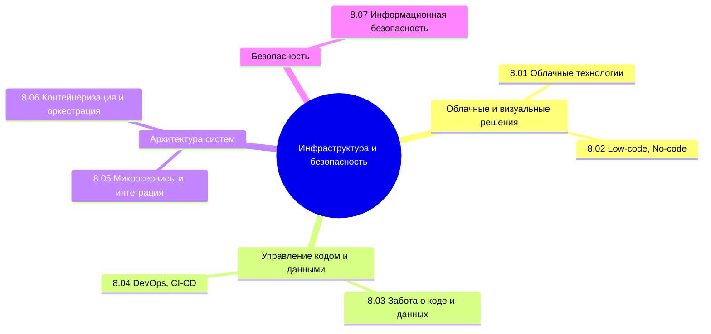

  ОБЯЗАТЕЛЬНО
  ДЛЯ НОВИЧКОВ

## О разделе

Текущая часть не для каждого. Не каждому аналитику нужно знать контейнеризацию, не каждому разработчику надо углубляться в облачные технологии.

Вообще, лучше воспользуйтесь содержанием или перейдите к Базе знаний. Но для удобства, я размещу здесь ссылки на основные главы раздела:

## Облачные технологии

<ul>
  <li>
  <ul>
  Облачные технологии
  <li><a href="/encyclopedia/8-infra-security/8-01-oblachnye-tehnologii/1">8-01-oblachnye-tehnologii</a></li>
  <li><a href="/encyclopedia/8-infra-security/8-01-oblachnye-tehnologii/2">8.01. Итоги</a></li>
  <li><a href="/encyclopedia/8-infra-security/8-01-oblachnye-tehnologii/3">8.01. Чек-лист самопроверки</a></li>
  </ul>
  </li>
  
</ul>

## Low-code, No-code

<ul>
  
  <li>
  <ul>
  Low-code, No-code
  <li><a href="/encyclopedia/8-infra-security/8-02-low-code-no-code/1">8-02-low-code-no-code</a></li>
  <li><a href="/encyclopedia/8-infra-security/8-02-low-code-no-code/2">8.02. Итоги</a></li>
  <li><a href="/encyclopedia/8-infra-security/8-02-low-code-no-code/3">8.02. Чек-лист самопроверки</a></li>
  </ul>
  </li>
  
</ul>

## Забота о коде и данных

<ul>
  
  <li>
  <ul>
  Забота о коде и данных
  <li><a href="/encyclopedia/8-infra-security/8-03-zabota-o-kode-i-dannyh/1">8.03. Безопасность кода</a></li>
  <li><a href="/encyclopedia/8-infra-security/8-03-zabota-o-kode-i-dannyh/11">8.03. Защита кода от изменений</a></li>
  <li><a href="/encyclopedia/8-infra-security/8-03-zabota-o-kode-i-dannyh/111">8.03. Как работает Git</a></li>
  <li><a href="/encyclopedia/8-infra-security/8-03-zabota-o-kode-i-dannyh/1111">8.03. GitFlow</a></li>
  <li><a href="/encyclopedia/8-infra-security/8-03-zabota-o-kode-i-dannyh/112">8.03. Внутренности Git</a></li>
  <li><a href="/encyclopedia/8-infra-security/8-03-zabota-o-kode-i-dannyh/113">8.03. Особенности Git</a></li>
  <li><a href="/encyclopedia/8-infra-security/8-03-zabota-o-kode-i-dannyh/114">8.03. Git команды</a></li>
  <li><a href="/encyclopedia/8-infra-security/8-03-zabota-o-kode-i-dannyh/115">8.03. Параметры Git</a></li>
  <li><a href="/encyclopedia/8-infra-security/8-03-zabota-o-kode-i-dannyh/116">8.03. Отличия SVN от Git</a></li>
  <li><a href="/encyclopedia/8-infra-security/8-03-zabota-o-kode-i-dannyh/117">8.03. Защита данных</a></li>
  <li><a href="/encyclopedia/8-infra-security/8-03-zabota-o-kode-i-dannyh/998">8.03. Итоги</a></li>
  <li><a href="/encyclopedia/8-infra-security/8-03-zabota-o-kode-i-dannyh/999">8.03. Чек-лист самопроверки</a></li>
  </ul>
  </li>
  
</ul>

## DevOps, CI-CD

<ul>
  
  <li>
  <ul>
  DevOps, CI-CD
  <li><a href="/encyclopedia/8-infra-security/8-04-devops-ci-cd/1">8.04. Основы DevOps</a></li>
  <li><a href="/encyclopedia/8-infra-security/8-04-devops-ci-cd/11">8.04. Как работает CI CD</a></li>
  <li><a href="/encyclopedia/8-infra-security/8-04-devops-ci-cd/111">8.04. Стратегии развертывания</a></li>
  <li><a href="/encyclopedia/8-infra-security/8-04-devops-ci-cd/12">8.04. GitFlow и Git в работе DevOps</a></li>
  <li><a href="/encyclopedia/8-infra-security/8-04-devops-ci-cd/13">8.04. Особенности работы с CI и CD</a></li>
  <li><a href="/encyclopedia/8-infra-security/8-04-devops-ci-cd/14">8.04. Процесс в CI CD</a></li>
  <li><a href="/encyclopedia/8-infra-security/8-04-devops-ci-cd/15">8.04. Azure Repos и TFS</a></li>
  <li><a href="/encyclopedia/8-infra-security/8-04-devops-ci-cd/16">8.04. Инструменты</a></li>
  <li><a href="/encyclopedia/8-infra-security/8-04-devops-ci-cd/17">8.04. Чем отличается DevOps от сисадмина</a></li>
  <li><a href="/encyclopedia/8-infra-security/8-04-devops-ci-cd/18">8.04. Автоматизация</a></li>
  <li><a href="/encyclopedia/8-infra-security/8-04-devops-ci-cd/19">8.04. Логирование и мониторинг</a></li>
  <li><a href="/encyclopedia/8-infra-security/8-04-devops-ci-cd/2">8.04. Terraform</a></li>
  <li><a href="/encyclopedia/8-infra-security/8-04-devops-ci-cd/21">8.04. Pulumi</a></li>
  <li><a href="/encyclopedia/8-infra-security/8-04-devops-ci-cd/211">8.04. Аутентификация и авторизация</a></li>
  <li><a href="/encyclopedia/8-infra-security/8-04-devops-ci-cd/212">8.04. Webhooks</a></li>
  <li><a href="/encyclopedia/8-infra-security/8-04-devops-ci-cd/213">8.04. Данные Warehouse</a></li>
  <li><a href="/encyclopedia/8-infra-security/8-04-devops-ci-cd/214">8.04. Deb-пакеты</a></li>
  <li><a href="/encyclopedia/8-infra-security/8-04-devops-ci-cd/215">8.04. Инфраструктура как код (IaC)</a></li>
  <li><a href="/encyclopedia/8-infra-security/8-04-devops-ci-cd/216">8.04. Ansible</a></li>
  <li><a href="/encyclopedia/8-infra-security/8-04-devops-ci-cd/217">8.04. Наблюдаемость и автоматизация</a></li>
  <li><a href="/encyclopedia/8-infra-security/8-04-devops-ci-cd/218">8.04. Service Mesh</a></li>
  <li><a href="/encyclopedia/8-infra-security/8-04-devops-ci-cd/3">8.04. Справочник по Terraform</a></li>
  <li><a href="/encyclopedia/8-infra-security/8-04-devops-ci-cd/3111">8.04. Справочник по Ansible</a></li>
  <li><a href="/encyclopedia/8-infra-security/8-04-devops-ci-cd/3112">8.04. Справочник по Nginx</a></li>
  <li><a href="/encyclopedia/8-infra-security/8-04-devops-ci-cd/3113">8.04. Справочник по GitHub Actions</a></li>
  <li><a href="/encyclopedia/8-infra-security/8-04-devops-ci-cd/3114">8.04. Справочник по Jenkins</a></li>
  <li><a href="/encyclopedia/8-infra-security/8-04-devops-ci-cd/3115">8.04. Справочник по Prometheus</a></li>
  <li><a href="/encyclopedia/8-infra-security/8-04-devops-ci-cd/3116">8.04. Справочник по Grafana</a></li>
  <li><a href="/encyclopedia/8-infra-security/8-04-devops-ci-cd/3117">8.04. Справочник по Elasticsearch</a></li>
  <li><a href="/encyclopedia/8-infra-security/8-04-devops-ci-cd/3118">8.04. Справочник по AWS</a></li>
  <li><a href="/encyclopedia/8-infra-security/8-04-devops-ci-cd/3119">8.04. Справочник по Logstash</a></li>
  <li><a href="/encyclopedia/8-infra-security/8-04-devops-ci-cd/3120">8.04. Справочник по Kibana</a></li>
  <li><a href="/encyclopedia/8-infra-security/8-04-devops-ci-cd/3121">8.04. Справочник по Loki</a></li>
  <li><a href="/encyclopedia/8-infra-security/8-04-devops-ci-cd/3122">8.04. Справочник по Tempo</a></li>
  <li><a href="/encyclopedia/8-infra-security/8-04-devops-ci-cd/3123">8.04. Справочник по Mimir</a></li>
  <li><a href="/encyclopedia/8-infra-security/8-04-devops-ci-cd/3124">8.04. Справочник по Azure Repos Git</a></li>
  <li><a href="/encyclopedia/8-infra-security/8-04-devops-ci-cd/998">8.04. Итоги</a></li>
  <li><a href="/encyclopedia/8-infra-security/8-04-devops-ci-cd/999">8.04. Чек-лист самопроверки</a></li>
  </ul>
  </li>
  
</ul>

## Микросервисы и интеграция

<ul>
  
  <li>
  <ul>
  Микросервисы и интеграция
  <li><a href="/encyclopedia/8-infra-security/8-05-mikroservisy-i-integratsiya/1">8.05. Масштабирование</a></li>
  <li><a href="/encyclopedia/8-infra-security/8-05-mikroservisy-i-integratsiya/111">8.05. Балансировка нагрузки</a></li>
  <li><a href="/encyclopedia/8-infra-security/8-05-mikroservisy-i-integratsiya/112">8.05. Распределение и MSA</a></li>
  <li><a href="/encyclopedia/8-infra-security/8-05-mikroservisy-i-integratsiya/113">8.05. Коммуникация и интеграция</a></li>
  <li><a href="/encyclopedia/8-infra-security/8-05-mikroservisy-i-integratsiya/114">8.05. Асинхронная коммуникация</a></li>
  <li><a href="/encyclopedia/8-infra-security/8-05-mikroservisy-i-integratsiya/115">8.05. Синхронная коммуникация</a></li>
  <li><a href="/encyclopedia/8-infra-security/8-05-mikroservisy-i-integratsiya/116">8.05. Реактивная коммуникация</a></li>
  <li><a href="/encyclopedia/8-infra-security/8-05-mikroservisy-i-integratsiya/117">8.05. Брокеры сообщений</a></li>
  <li><a href="/encyclopedia/8-infra-security/8-05-mikroservisy-i-integratsiya/118">8.05. RabbitMQ</a></li>
  <li><a href="/encyclopedia/8-infra-security/8-05-mikroservisy-i-integratsiya/119">8.05. Kafka</a></li>
  <li><a href="/encyclopedia/8-infra-security/8-05-mikroservisy-i-integratsiya/120">8.05. Push, Pull, Webhooks</a></li>
  <li><a href="/encyclopedia/8-infra-security/8-05-mikroservisy-i-integratsiya/1201">8.05. Справочник по SOAP</a></li>
  <li><a href="/encyclopedia/8-infra-security/8-05-mikroservisy-i-integratsiya/1202">8.05. Справочник по gRPC</a></li>
  <li><a href="/encyclopedia/8-infra-security/8-05-mikroservisy-i-integratsiya/1203">8.05. Справочник по GraphQL</a></li>
  <li><a href="/encyclopedia/8-infra-security/8-05-mikroservisy-i-integratsiya/121">8.05. Реализация интеграции</a></li>
  <li><a href="/encyclopedia/8-infra-security/8-05-mikroservisy-i-integratsiya/122">8.05. Проектирование API</a></li>
  <li><a href="/encyclopedia/8-infra-security/8-05-mikroservisy-i-integratsiya/123">8.05. Транспортные механизмы</a></li>
  <li><a href="/encyclopedia/8-infra-security/8-05-mikroservisy-i-integratsiya/998">8.05. Итоги</a></li>
  <li><a href="/encyclopedia/8-infra-security/8-05-mikroservisy-i-integratsiya/999">8.05. Чек-лист самопроверки</a></li>
  </ul>
  </li>
  
</ul>

## Контейнеризация и оркестрация

<ul>
  
  <li>
  <ul>
  Контейнеризация и оркестрация
  <li><a href="/encyclopedia/8-infra-security/8-06-konteynerizatsiya-i-orkestratsiya/1">8.06. Контейнеризация</a></li>
  <li><a href="/encyclopedia/8-infra-security/8-06-konteynerizatsiya-i-orkestratsiya/111">8.06. Docker</a></li>
  <li><a href="/encyclopedia/8-infra-security/8-06-konteynerizatsiya-i-orkestratsiya/112">8.06. Объекты Docker</a></li>
  <li><a href="/encyclopedia/8-infra-security/8-06-konteynerizatsiya-i-orkestratsiya/113">8.06. DockerHub и реестры образов</a></li>
  <li><a href="/encyclopedia/8-infra-security/8-06-konteynerizatsiya-i-orkestratsiya/114">8.06. Работа с Docker</a></li>
  <li><a href="/encyclopedia/8-infra-security/8-06-konteynerizatsiya-i-orkestratsiya/115">8.06. Сеть в контейнерах</a></li>
  <li><a href="/encyclopedia/8-infra-security/8-06-konteynerizatsiya-i-orkestratsiya/116">8.06. Dockerfile</a></li>
  <li><a href="/encyclopedia/8-infra-security/8-06-konteynerizatsiya-i-orkestratsiya/117">8.06. Docker Swarm и Kubernetes</a></li>
  <li><a href="/encyclopedia/8-infra-security/8-06-konteynerizatsiya-i-orkestratsiya/118">8.06. Универсальная шпаргалка</a></li>
  <li><a href="/encyclopedia/8-infra-security/8-06-konteynerizatsiya-i-orkestratsiya/2">8.06. Справочник по Docker</a></li>
  <li><a href="/encyclopedia/8-infra-security/8-06-konteynerizatsiya-i-orkestratsiya/211">8.06. Справочник по Kubernetes</a></li>
  <li><a href="/encyclopedia/8-infra-security/8-06-konteynerizatsiya-i-orkestratsiya/998">8.06. Итоги</a></li>
  <li><a href="/encyclopedia/8-infra-security/8-06-konteynerizatsiya-i-orkestratsiya/999">8.06. Чек-лист самопроверки</a></li>
  </ul>
  </li>
  
</ul>

## Информационная безопасность

<ul>
  
  <li>
  <ul>
  Информационная безопасность
  <li><a href="/encyclopedia/8-infra-security/8-07-informatsionnaya-bezopasnost/1">8-07-informatsionnaya-bezopasnost</a></li>
  <li><a href="/encyclopedia/8-infra-security/8-07-informatsionnaya-bezopasnost/111">8.07. Методы защиты информации</a></li>
  <li><a href="/encyclopedia/8-infra-security/8-07-informatsionnaya-bezopasnost/1111">8.07. Государственные требования к информационной безопасности</a></li>
  <li><a href="/encyclopedia/8-infra-security/8-07-informatsionnaya-bezopasnost/1112">8.07. Средства защиты информации</a></li>
  <li><a href="/encyclopedia/8-infra-security/8-07-informatsionnaya-bezopasnost/112">8.07. Сертификация и сертификаты</a></li>
  <li><a href="/encyclopedia/8-infra-security/8-07-informatsionnaya-bezopasnost/113">8.07. Безопасность приложений</a></li>
  <li><a href="/encyclopedia/8-infra-security/8-07-informatsionnaya-bezopasnost/1131">8.07. Анализ и тестирование безопасности</a></li>
  <li><a href="/encyclopedia/8-infra-security/8-07-informatsionnaya-bezopasnost/114">8.07. Контроль и отслеживание</a></li>
  <li><a href="/encyclopedia/8-infra-security/8-07-informatsionnaya-bezopasnost/115">8.07. Шифрование</a></li>
  <li><a href="/encyclopedia/8-infra-security/8-07-informatsionnaya-bezopasnost/116">8.07. Авторизация и аутентификация</a></li>
  <li><a href="/encyclopedia/8-infra-security/8-07-informatsionnaya-bezopasnost/117">8.07. Устаревшие подходы</a></li>
  <li><a href="/encyclopedia/8-infra-security/8-07-informatsionnaya-bezopasnost/118">8.07. Уровни доверия и SSL TLS</a></li>
  <li><a href="/encyclopedia/8-infra-security/8-07-informatsionnaya-bezopasnost/119">8.07. Вирусы и вредоносные программы</a></li>
  <li><a href="/encyclopedia/8-infra-security/8-07-informatsionnaya-bezopasnost/120">8.07. Антивирусы</a></li>
  <li><a href="/encyclopedia/8-infra-security/8-07-informatsionnaya-bezopasnost/121">8.07. Сливы и утечки данных</a></li>
  <li><a href="/encyclopedia/8-infra-security/8-07-informatsionnaya-bezopasnost/122">8.07. Легальный сбор информации</a></li>
  <li><a href="/encyclopedia/8-infra-security/8-07-informatsionnaya-bezopasnost/123">8.07. Инъекции</a></li>
  <li><a href="/encyclopedia/8-infra-security/8-07-informatsionnaya-bezopasnost/124">8.07. Аудит</a></li>
  <li><a href="/encyclopedia/8-infra-security/8-07-informatsionnaya-bezopasnost/125">8.07. Безопасность в Docker</a></li>
  <li><a href="/encyclopedia/8-infra-security/8-07-informatsionnaya-bezopasnost/126">8.07. Пессимистическая и оптимистическая блокировки в базах данных</a></li>
  <li><a href="/encyclopedia/8-infra-security/8-07-informatsionnaya-bezopasnost/127">8.07. Взаимоблокировка</a></li>
  <li><a href="/encyclopedia/8-infra-security/8-07-informatsionnaya-bezopasnost/2">8.07. Обеспечение безопасности</a></li>
  <li><a href="/encyclopedia/8-infra-security/8-07-informatsionnaya-bezopasnost/998">8.07. Итоги</a></li>
  <li><a href="/encyclopedia/8-infra-security/8-07-informatsionnaya-bezopasnost/999">8.07. Чек-лист самопроверки</a></li>
  </ul>
  </li>
</ul>

Но всё же это важная и крупная часть IT, которая предназначена для целого направления специалистов - инженеров, в том числе администраторов и DevOps.

Так, программа написана, код проверен, проект запущен, но как поддерживать это всё в рабочем состоянии? С одной стороны, кажется, что можно просто установить и запустить. А потом, при увеличении нагрузки, всё падает, рушится. А хакеры и вовсе могут нагрянуть внезапно и всё испортить. В один обычный день вся цифровая инфраструктура страны просто… перестаёт существовать. Готовы ли мы?

Представьте: государственные порталы, электронные почты, образовательные системы, облачные хранилища с миллионами документов — всё исчезает за считанные минуты. В 2025 году в Южной Корее пожар в дата-центре Национальной службы информационных ресурсов буквально выключил цифровую жизнь страны. Возгорание литий-ионной батарии уничтожило 647 государственных сервисов, включая аналог Госуслуг, систему идентификации граждан и государственное облако G-Drive. 858 терабайт данных — сожжены. Может даже цифры и больше, но суть не в этом. Знаете, что самое страшное? Резервные копии тоже были там же, в том же здании. Они сгорели вместе с основными серверами. Никакого offsite-бэкапа, географической избыточности, только полная потеря. А высокопоставленный чиновник, отвечавший за восстановление, покончил с собой.

Также был инцидент и в России - крупнейшим был взлом серверов компании «Аэрофлот». Это реальность, когда инфраструктура строится без учёта отказоустойчивости, а безопасность сводится к надежде на удачу.

В России ежегодно проводятся тысячи тестов на проникновение (pentest). Белые хакеры находят критические дыры в системах банков, IT-компаний, сервисов электронной коммерции. За год — более 13 тысяч отчётов об уязвимостях, из них — тысячи критических. И что делают компании? Молча игнорируют - по данным экспертов, менее половины найденных проблем устраняются, часть руководств считает, что это «слишком дорого», часть, что это «не срочно». А через год те же хакеры снова находят те же самые уязвимости — и получают за них новое вознаграждение. И да, закон о персональных данных вводит оборотные штрафы — но только за повторную утечку. А первая? Часто остаётся просто «уроком».

Помимо команды разработки и инициаторов, есть ещё важный пласт людей, которые заботятся о том, чтобы всё было хорошо. Это своего рода «иммунитет» проекта. Специалисты по безопасности, инженеры, администраторы - официально трудоустроенные сотрудники, которые работают над структурой.

Причём, не только они развивают эту часть IT. Есть отдельная категория специалистов, называемая хакерами (взломщиками). Думаю, каждый из нас слышал это слово. Они делятся на три группы:

Белые хакеры — те, кто ищет уязвимости, чтобы помочь. Они получают bounty, признание, иногда — благодарность.

Чёрные хакеры — те, кто использует эти же дыры, чтобы украсть, выманить, продать, шантажировать.

Серые — пираты вроде SKIDROW или Empress, которые взламывают игры и ПО, чтобы выложить их бесплатно. Они могут быть героями для одной аудитории и преступниками для другой.

Черные и серые хакеры - преступники, их деятельность наказуема, и существуют они исключительно благодаря грамотности в своей анонимности. Они внимательно относятся к своему поведению в сети, из-за чего их вычислить и не получается. Есть мнение, что они на самом деле представляют собой проекты, компаниям известно, кто это, а они лишь играют свою роль. Забавно?

Кто знает, может быть, ваше призвание в этой области? Разумеется, речь о легальной части - специалисты-сотрудники и белые хакеры. Пока не попробуете, не узнаете! Поэтому здесь мы рассмотрим всё, что связано с инфраструктурой и безопасностью. 

Начнём с необычного решения (ведь обычные мы изучили) - облачные технологии, вроде AWS, Azure, GCP, и прочего. Затем рассмотрим Low-code/No-code платформы, которые представляют собой значительную часть рынка IT, ведь они являются «коробочными», готовыми решениями, которые нужно лишь правильно настраивать и поддерживать. Также нам нужно научиться защищать код и защищать данные. Это продвинутая работа с Git, изучение аналогов вроде SVN, а также резервное копирование и прочие способы «сохранить то, что важно».

Другая важная часть - DevOps и CI/CD. Нужно знать, что такое CI, что такое CD, ка кработать с Git в разрезе DevOps-инженерии, чем собственно такой инженер отличается от системного администратора, какие инструменты он использует. Потом пойдём уже по инструментам и подходам. Сначала - микросервисы и интеграция, что такое масштабирование и балансировка нагрузки, как выстраиваются распределенные системы, как настраивается интеграция и коммуникация между ними, что такое брокеры сообщений и тому подобное. Нужно погрузиться в Docker, контейнеризацию и оркестрацию, кластеризацию, шардирование и прочее-прочее. 

А добъём всё это изучением информационной безопасности, включая как кибербезопасность, вирусы, сливы и инъекции, так и защиту API, безопасность фронта/бэка, отслеживание действий и прочие важные аспекты.
---