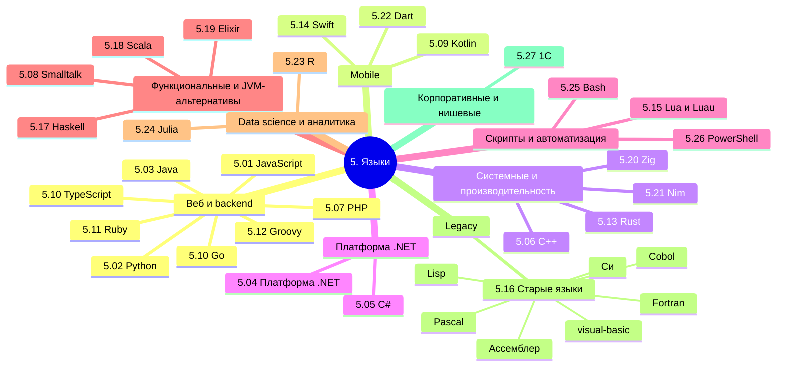

  ОБЯЗАТЕЛЬНО
  ДЛЯ НОВИЧКОВ

---

## О разделе

<ul class="it-toc-articles">
  <li><a href="/encyclopedia/5-languages/kak-vybrat-yazyk-programmirovaniya">Какой язык программирования выбрать</a></li>
  <li><a href="/encyclopedia/5-languages/languages">5. Языки - о разделе</a></li>
</ul>

Мы изучили, как пишут программы, теперь пора посмотреть, на чём пишут. Что используется для фронтенда, что для бэкенда - какие инструменты и технологии нужны в разных областях.

Технически, языки по большей части универсальны. Они обычно появляются с определённой целью (JavaScript для оживления страниц, C/C++ для системного программирования, а Java чтобы обезопасить и упростить разработку), но в дальнейшем развиваются, получая новый функционал, новые фичи и возможности.

В интернете часто можно найти громкие заголовки вроде "Какой язык программирования выбрать?" И почти всегда вы встретите от года в год одно и то же - Python лучше всех, JavaScript и Java нужны везде, а C# никому не нужен. Но не всё так просто.

Вообще, лучше воспользуйтесь содержанием или перейдите к Базе знаний. Но для удобства, я размещу здесь ссылки на основные главы раздела:

---

## JavaScript

<ul class="it-toc-articles">
  <li><a href="/encyclopedia/5-languages/5-01-javascript/1">5.01. Основы JavaScript</a></li>
  <li><a href="/encyclopedia/5-languages/5-01-javascript/11">5.01. История языка JavaScript</a></li>
  <li><a href="/encyclopedia/5-languages/5-01-javascript/12">5.01. Синтаксис и пунктуация в JavaScript</a></li>
  <li><a href="/encyclopedia/5-languages/5-01-javascript/13">5.01. Структура и подключение JavaScript-кода</a></li>
  <li><a href="/encyclopedia/5-languages/5-01-javascript/14">5.01. Применение JavaScript в вебе и за его пределами</a></li>
  <li><a href="/encyclopedia/5-languages/5-01-javascript/15">5.01. Функции в JavaScript</a></li>
  <li><a href="/encyclopedia/5-languages/5-01-javascript/16">5.01. Область видимости и замыкания в JavaScript</a></li>
  <li><a href="/encyclopedia/5-languages/5-01-javascript/17">5.01. Переменные в JavaScript</a></li>
  <li><a href="/encyclopedia/5-languages/5-01-javascript/18">5.01. Типы данных в JavaScript</a></li>
  <li><a href="/encyclopedia/5-languages/5-01-javascript/19">5.01. Выражения и операторы в JavaScript</a></li>
  <li><a href="/encyclopedia/5-languages/5-01-javascript/20">5.01. Циклы в JavaScript</a></li>
  <li><a href="/encyclopedia/5-languages/5-01-javascript/21">5.01. Асинхронное программирование в JavaScript</a></li>
  <li><a href="/encyclopedia/5-languages/5-01-javascript/22">5.01. Работа с объектами и прототипами</a></li>
  <li><a href="/encyclopedia/5-languages/5-01-javascript/23">5.01. События и обработка событий в браузере</a></li>
  <li><a href="/encyclopedia/5-languages/5-01-javascript/24">5.01. Консоль, отладка и боль</a></li>
  <li><a href="/encyclopedia/5-languages/5-01-javascript/25">5.01. Экосистема JavaScript - инструменты и фреймворки</a></li>
  <li><a href="/encyclopedia/5-languages/5-01-javascript/30">5.01. TypeScript</a></li>
  <li><a href="/encyclopedia/5-languages/5-01-javascript/32">5.01. JavaScript — практика</a></li>
  <li><a href="/encyclopedia/5-languages/5-01-javascript/33">5.01. Тестирование JavaScript — Vitest и Testing Library</a></li>
  <li><a href="/encyclopedia/5-languages/5-01-javascript/34">5.01. Виджеты интерфейса на ванильном JavaScript</a></li>
  <li><a href="/encyclopedia/5-languages/5-01-javascript/35">5.01. Регулярные выражения в JavaScript</a></li>
  <li><a href="/encyclopedia/5-languages/5-01-javascript/36">5.01. Валидация форм в JavaScript</a></li>
  <li><a href="/encyclopedia/5-languages/5-01-javascript/37">5.01. Отмена запросов и поток событий с сервера</a></li>
  <li><a href="/encyclopedia/5-languages/5-01-javascript/38">5.01. Наблюдатели DOM — Intersection, Resize и Mutation</a></li>
  <li><a href="/encyclopedia/5-languages/5-01-javascript/39">5.01. Хранение данных в браузере</a></li>
  <li><a href="/encyclopedia/5-languages/5-01-javascript/40">5.01. ES-модули в браузере и обзор Temporal API</a></li>
  <li><a href="/encyclopedia/5-languages/5-01-javascript/41">5.01. Объектная модель браузера (BOM)</a></li>
  <li><a href="/encyclopedia/5-languages/5-01-javascript/42">5.01. Чтение файлов в браузере</a></li>
  <li><a href="/encyclopedia/5-languages/5-01-javascript/43">5.01. Web Components — Custom Elements и Shadow DOM</a></li>
  <li><a href="/encyclopedia/5-languages/5-01-javascript/44">5.01. Кнопка &quot;Поделиться&quot; — DOM, события и Web Share API</a></li>
  <li><a href="/encyclopedia/5-languages/5-01-javascript/46">5.01. Нативные уведомления в браузере — Notification API</a></li>
  <li><a href="/encyclopedia/5-languages/5-01-javascript/47">5.01. Canvas 2D — программируемая графика в браузере</a></li>
  <li><a href="/encyclopedia/5-languages/5-01-javascript/101">5.01. Рекомендации по разработке на JavaScript</a></li>
  <li><a href="/encyclopedia/5-languages/5-01-javascript/102">5.01. Работа с HTML в JavaScript</a></li>
  <li><a href="/encyclopedia/5-languages/5-01-javascript/103">5.01. Простые приложения на JavaScript</a></li>
  <li><a href="/encyclopedia/5-languages/5-01-javascript/104">5.01. Форматы JavaScript</a></li>
  <li><a href="/encyclopedia/5-languages/5-01-javascript/121">5.01. Ключевые слова языка JavaScript</a></li>
  <li><a href="/encyclopedia/5-languages/5-01-javascript/122">5.01. Встроенные функции JavaScript</a></li>
  <li><a href="/encyclopedia/5-languages/5-01-javascript/211">5.01. Массивы в JavaScript</a></li>
  <li><a href="/encyclopedia/5-languages/5-01-javascript/241">5.01. Встроенные типы ошибок и их обработка</a></li>
  <li><a href="/encyclopedia/5-languages/5-01-javascript/242">5.01. Обработка исключений в JavaScript</a></li>
  <li><a href="/encyclopedia/5-languages/5-01-javascript/251">5.01. Справочник по JavaScript</a></li>
  <li><a href="/encyclopedia/5-languages/5-01-javascript/301">5.01. Шпаргалка по TypeScript</a></li>
  <li><a href="/encyclopedia/5-languages/5-01-javascript/998">5.01. JavaScript — итоги</a></li>
  <li><a href="/encyclopedia/5-languages/5-01-javascript/999">5.01. JavaScript — чек-лист</a></li>
  <li><a href="/encyclopedia/5-languages/5-01-javascript/1001">5.01. Что требуется знать перед началом изучения языка программирования JavaScript</a></li>
</ul>

---

## Node.js

<ul class="it-toc-articles">
  <li><a href="/encyclopedia/5-languages/5-01-javascript/3-ecosystem/1-runtime-node/26">5.01. Node.js - серверный JavaScript</a></li>
  <li><a href="/encyclopedia/5-languages/5-01-javascript/3-ecosystem/1-runtime-node/48">5.01. Точка входа в Node.js — require.main и import.meta</a></li>
  <li><a href="/encyclopedia/5-languages/5-01-javascript/3-ecosystem/1-runtime-node/261">5.01. Справочник по Node</a></li>
  <li><a href="/encyclopedia/5-languages/5-01-javascript/3-ecosystem/1-runtime-node/262">5.01. Первая программа на Node.js</a></li>
  <li><a href="/encyclopedia/5-languages/5-01-javascript/3-ecosystem/1-runtime-node/263">5.01. Express — middleware, маршруты и ошибки</a></li>
  <li><a href="/encyclopedia/5-languages/5-01-javascript/3-ecosystem/1-runtime-node/264">5.01. Fullstack на JavaScript — API и фронтенд</a></li>
  <li><a href="/encyclopedia/5-languages/5-01-javascript/3-ecosystem/1-runtime-node/265">5.01. npm — команды, зависимости и lock-файлы</a></li>
  <li><a href="/encyclopedia/5-languages/5-01-javascript/3-ecosystem/1-runtime-node/266">5.01. Структура Node-проекта и правила разработки</a></li>
  <li><a href="/encyclopedia/5-languages/5-01-javascript/3-ecosystem/1-runtime-node/267">5.01. CLI Node.js — запуск, отладка и деплой</a></li>
  <li><a href="/encyclopedia/5-languages/5-01-javascript/3-ecosystem/1-runtime-node/268">5.01. Встроенные модули Node.js — fs, потоки и http</a></li>
  <li><a href="/encyclopedia/5-languages/5-01-javascript/3-ecosystem/1-runtime-node/269">5.01. Первая программа на NestJS</a></li>
  <li><a href="/encyclopedia/5-languages/5-01-javascript/3-ecosystem/1-runtime-node/2691">5.01. Prisma ORM — первая программа</a></li>
  <li><a href="/encyclopedia/5-languages/5-01-javascript/3-ecosystem/1-runtime-node/2692">5.01. Drizzle ORM — первая программа</a></li>
</ul>

---

## Frontend Frameworks

<ul class="it-toc-articles">
  <li><a href="/encyclopedia/5-languages/5-01-javascript/3-ecosystem/2-frontend-frameworks/270">5.01. SPA и выбор frontend-фреймворка</a></li>
  <li><a href="/encyclopedia/5-languages/5-01-javascript/3-ecosystem/2-frontend-frameworks/286">5.01. Первая программа на Svelte</a></li>
  <li><a href="/encyclopedia/5-languages/5-01-javascript/3-ecosystem/2-frontend-frameworks/287">5.01. Первая программа на Astro</a></li>
  <li><a href="/encyclopedia/5-languages/5-01-javascript/3-ecosystem/2-frontend-frameworks/288">5.01. Vite — сборка и dev-server</a></li>
</ul>

---

## jQuery

<ul class="it-toc-articles">
  <li><a href="/encyclopedia/5-languages/5-01-javascript/3-ecosystem/2-frontend-frameworks/5-jquery/289">5.01. jQuery — обзор библиотеки</a></li>
  <li><a href="/encyclopedia/5-languages/5-01-javascript/3-ecosystem/2-frontend-frameworks/5-jquery/2891">5.01. Справочник по jQuery</a></li>
</ul>

---

## React

<ul class="it-toc-articles">
  <li><a href="/encyclopedia/5-languages/5-01-javascript/3-ecosystem/2-frontend-frameworks/1-react/27">5.01. React - библиотека для пользовательских интерфейсов</a></li>
  <li><a href="/encyclopedia/5-languages/5-01-javascript/3-ecosystem/2-frontend-frameworks/1-react/45">5.01. Кнопка с загрузкой — React, Promise и поток обновлений</a></li>
  <li><a href="/encyclopedia/5-languages/5-01-javascript/3-ecosystem/2-frontend-frameworks/1-react/271">5.01. Справочник по React</a></li>
  <li><a href="/encyclopedia/5-languages/5-01-javascript/3-ecosystem/2-frontend-frameworks/1-react/272">5.01. Первая программа на React</a></li>
  <li><a href="/encyclopedia/5-languages/5-01-javascript/3-ecosystem/2-frontend-frameworks/1-react/275">5.01. React — компоненты, JSX и поток данных</a></li>
  <li><a href="/encyclopedia/5-languages/5-01-javascript/3-ecosystem/2-frontend-frameworks/1-react/276">5.01. React — хуки, состояние и формы</a></li>
  <li><a href="/encyclopedia/5-languages/5-01-javascript/3-ecosystem/2-frontend-frameworks/1-react/277">5.01. React — Router, данные с API и оптимизация</a></li>
</ul>

---

## Vue.js

<ul class="it-toc-articles">
  <li><a href="/encyclopedia/5-languages/5-01-javascript/3-ecosystem/2-frontend-frameworks/2-vue/28">5.01. Vue.js</a></li>
  <li><a href="/encyclopedia/5-languages/5-01-javascript/3-ecosystem/2-frontend-frameworks/2-vue/281">5.01. Справочник по Vue.js</a></li>
  <li><a href="/encyclopedia/5-languages/5-01-javascript/3-ecosystem/2-frontend-frameworks/2-vue/282">5.01. Первая программа на Vue.js</a></li>
  <li><a href="/encyclopedia/5-languages/5-01-javascript/3-ecosystem/2-frontend-frameworks/2-vue/283">5.01. Vue — реактивность и Composition API</a></li>
  <li><a href="/encyclopedia/5-languages/5-01-javascript/3-ecosystem/2-frontend-frameworks/2-vue/284">5.01. Vue — Router, Pinia и Vite</a></li>
  <li><a href="/encyclopedia/5-languages/5-01-javascript/3-ecosystem/2-frontend-frameworks/2-vue/285">5.01. Vue — SSR, тесты и production</a></li>
</ul>

---

## Angular

<ul class="it-toc-articles">
  <li><a href="/encyclopedia/5-languages/5-01-javascript/3-ecosystem/2-frontend-frameworks/3-angular/29">5.01. Angular</a></li>
  <li><a href="/encyclopedia/5-languages/5-01-javascript/3-ecosystem/2-frontend-frameworks/3-angular/291">5.01. Справочник по Angular</a></li>
  <li><a href="/encyclopedia/5-languages/5-01-javascript/3-ecosystem/2-frontend-frameworks/3-angular/292">5.01. Первая программа на Angular</a></li>
  <li><a href="/encyclopedia/5-languages/5-01-javascript/3-ecosystem/2-frontend-frameworks/3-angular/293">5.01. Angular — DI, RxJS и формы</a></li>
</ul>

---

## Ext JS

<ul class="it-toc-articles">
  <li><a href="/encyclopedia/5-languages/5-01-javascript/3-ecosystem/2-frontend-frameworks/4-ext-js/31">5.01. Ext JS</a></li>
  <li><a href="/encyclopedia/5-languages/5-01-javascript/3-ecosystem/2-frontend-frameworks/4-ext-js/311">5.01. Справочник по Ext JS</a></li>
  <li><a href="/encyclopedia/5-languages/5-01-javascript/3-ecosystem/2-frontend-frameworks/4-ext-js/312">5.01. Первая программа на Ext JS</a></li>
  <li><a href="/encyclopedia/5-languages/5-01-javascript/3-ecosystem/2-frontend-frameworks/4-ext-js/313">5.01. Ext JS — Model, Store и proxy</a></li>
</ul>

---

## Meta Frameworks

<ul class="it-toc-articles">
  <li><a href="/encyclopedia/5-languages/5-01-javascript/3-ecosystem/3-meta-frameworks/273">5.01. Next.js</a></li>
  <li><a href="/encyclopedia/5-languages/5-01-javascript/3-ecosystem/3-meta-frameworks/2731">5.01. Первая программа на Next.js</a></li>
</ul>

---

## CLI экосистемы

<ul class="it-toc-articles">
  <li><a href="/encyclopedia/5-languages/5-01-javascript/3-ecosystem/4-cli-tools/1">5.01. Справочник CLI экосистемы JavaScript</a></li>
</ul>

---

## Python

<ul class="it-toc-articles">
  <li><a href="/encyclopedia/5-languages/5-02-python/1">5.02. Python - язык общего назначения</a></li>
  <li><a href="/encyclopedia/5-languages/5-02-python/11">5.02. Архитектура интерпретатора Python</a></li>
  <li><a href="/encyclopedia/5-languages/5-02-python/12">5.02. Фреймворки и библиотеки Python</a></li>
  <li><a href="/encyclopedia/5-languages/5-02-python/13">5.02. Виртуальные окружения и управление зависимостями</a></li>
  <li><a href="/encyclopedia/5-languages/5-02-python/14">5.02. История языка Python</a></li>
  <li><a href="/encyclopedia/5-languages/5-02-python/15">5.02. Философия Python - Zen of Python</a></li>
  <li><a href="/encyclopedia/5-languages/5-02-python/16">5.02. Первая программа на Python</a></li>
  <li><a href="/encyclopedia/5-languages/5-02-python/17">5.02. Синтаксис и пунктуация в Python</a></li>
  <li><a href="/encyclopedia/5-languages/5-02-python/18">5.02. Алгоритмы и структуры данных в Python</a></li>
  <li><a href="/encyclopedia/5-languages/5-02-python/19">5.02. Типы данных в Python</a></li>
  <li><a href="/encyclopedia/5-languages/5-02-python/20">5.02. Переменные и присваивание</a></li>
  <li><a href="/encyclopedia/5-languages/5-02-python/21">5.02. Работа с типами данных в Python</a></li>
  <li><a href="/encyclopedia/5-languages/5-02-python/22">5.02. Коллекции - списки, кортежи, словари, множества</a></li>
  <li><a href="/encyclopedia/5-languages/5-02-python/23">5.02. Управляющие конструкции - if, for, while</a></li>
  <li><a href="/encyclopedia/5-languages/5-02-python/24">5.02. Функции - определение, аргументы, возврат значений</a></li>
  <li><a href="/encyclopedia/5-languages/5-02-python/25">5.02. Итераторы, генераторы и контекстные менеджеры</a></li>
  <li><a href="/encyclopedia/5-languages/5-02-python/26">5.02. Объектно-ориентированное программирование в Python</a></li>
  <li><a href="/encyclopedia/5-languages/5-02-python/27">5.02. Архитектура выполнения и сборка мусора</a></li>
  <li><a href="/encyclopedia/5-languages/5-02-python/28">5.02. Обработка исключений в Python</a></li>
  <li><a href="/encyclopedia/5-languages/5-02-python/29">5.02. Асинхронность и многопоточность в Python</a></li>
  <li><a href="/encyclopedia/5-languages/5-02-python/30">5.02. Django в Python</a></li>
  <li><a href="/encyclopedia/5-languages/5-02-python/31">5.02. Работа с файлами, сетью и внешними API</a></li>
  <li><a href="/encyclopedia/5-languages/5-02-python/32">5.02. Turtle</a></li>
  <li><a href="/encyclopedia/5-languages/5-02-python/33">5.02. Анализ данных - pandas, NumPy, SciPy</a></li>
  <li><a href="/encyclopedia/5-languages/5-02-python/34">5.02. Веб-разработка и REST API на Python</a></li>
  <li><a href="/encyclopedia/5-languages/5-02-python/35">5.02. Автоматизация задач и DevOps-скрипты</a></li>
  <li><a href="/encyclopedia/5-languages/5-02-python/36">5.02. Справочник по Python</a></li>
  <li><a href="/encyclopedia/5-languages/5-02-python/37">5.02. Тестирование на pytest</a></li>
  <li><a href="/encyclopedia/5-languages/5-02-python/38">5.02. Однострочные приёмы Python</a></li>
  <li><a href="/encyclopedia/5-languages/5-02-python/39">5.02. Зависимости Python — requirements.txt, pyproject.toml и pip</a></li>
  <li><a href="/encyclopedia/5-languages/5-02-python/40">5.02. if __name__ == &quot;__main__&quot; — точка входа при запуске файла</a></li>
  <li><a href="/encyclopedia/5-languages/5-02-python/41">5.02. Pydantic — валидация входящих данных</a></li>
  <li><a href="/encyclopedia/5-languages/5-02-python/101">5.02. Рекомендации по разработке на Python</a></li>
  <li><a href="/encyclopedia/5-languages/5-02-python/102">5.02. Простые приложения на Python</a></li>
  <li><a href="/encyclopedia/5-languages/5-02-python/103">5.02. Встроенный модуль builtins и типизация в Python</a></li>
  <li><a href="/encyclopedia/5-languages/5-02-python/121">5.02. Экосистема Python-приложений</a></li>
  <li><a href="/encyclopedia/5-languages/5-02-python/122">5.02. Модули в Python</a></li>
  <li><a href="/encyclopedia/5-languages/5-02-python/171">5.02. Ключевые слова языка Python</a></li>
  <li><a href="/encyclopedia/5-languages/5-02-python/172">5.02. Встроенные функции Python</a></li>
  <li><a href="/encyclopedia/5-languages/5-02-python/173">5.02. Магические методы и дандер-методы</a></li>
  <li><a href="/encyclopedia/5-languages/5-02-python/231">5.02. Сопоставление с образцом (match / case)</a></li>
  <li><a href="/encyclopedia/5-languages/5-02-python/232">5.02. Даты и время в Python</a></li>
  <li><a href="/encyclopedia/5-languages/5-02-python/281">5.02. Распространённые типы исключений</a></li>
  <li><a href="/encyclopedia/5-languages/5-02-python/291">5.02. Основы asyncio в Python</a></li>
  <li><a href="/encyclopedia/5-languages/5-02-python/301">5.02. Справочник по Django</a></li>
  <li><a href="/encyclopedia/5-languages/5-02-python/311">5.02. Tkinter и GUI</a></li>
  <li><a href="/encyclopedia/5-languages/5-02-python/312">5.02. Разработка игр на Python</a></li>
  <li><a href="/encyclopedia/5-languages/5-02-python/313">5.02. PyQt, PySide и Flet — GUI beyond Tkinter</a></li>
  <li><a href="/encyclopedia/5-languages/5-02-python/314">5.02. Работа с базами данных в Python</a></li>
  <li><a href="/encyclopedia/5-languages/5-02-python/315">5.02. Сетевое программирование на Python</a></li>
  <li><a href="/encyclopedia/5-languages/5-02-python/316">5.02. Парсинг на Python</a></li>
  <li><a href="/encyclopedia/5-languages/5-02-python/317">5.02. BeautifulSoup — парсинг HTML</a></li>
  <li><a href="/encyclopedia/5-languages/5-02-python/318">5.02. Трёхмерная графика и Panda3D</a></li>
  <li><a href="/encyclopedia/5-languages/5-02-python/319">5.02. Matplotlib — графики</a></li>
  <li><a href="/encyclopedia/5-languages/5-02-python/320">5.02. Kivy — мобильные приложения и игры на Python</a></li>
  <li><a href="/encyclopedia/5-languages/5-02-python/321">5.02. Справочник по модулю Turtle</a></li>
  <li><a href="/encyclopedia/5-languages/5-02-python/331">5.02. Pandas — объединение таблиц, своды и временные ряды</a></li>
  <li><a href="/encyclopedia/5-languages/5-02-python/332">5.02. Классическое машинное обучение на Python</a></li>
  <li><a href="/encyclopedia/5-languages/5-02-python/333">5.02. PyTorch для разработчика</a></li>
  <li><a href="/encyclopedia/5-languages/5-02-python/334">5.02. Практикум — Pandas Data Viewer</a></li>
  <li><a href="/encyclopedia/5-languages/5-02-python/335">5.02. Практикум — распознавание цифр на PyTorch</a></li>
  <li><a href="/encyclopedia/5-languages/5-02-python/336">5.02. Практикум — тональность отзывов на PyTorch</a></li>
  <li><a href="/encyclopedia/5-languages/5-02-python/337">5.02. NumPy — массивы, векторы и матрицы</a></li>
  <li><a href="/encyclopedia/5-languages/5-02-python/341">5.02. Flask</a></li>
  <li><a href="/encyclopedia/5-languages/5-02-python/342">5.02. Справочник по Flask</a></li>
  <li><a href="/encyclopedia/5-languages/5-02-python/343">5.02. Создание собственного API на Python</a></li>
  <li><a href="/encyclopedia/5-languages/5-02-python/391">5.02. Poetry и uv — управление зависимостями Python</a></li>
  <li><a href="/encyclopedia/5-languages/5-02-python/392">5.02. Python для ML — мост к PyTorch</a></li>
  <li><a href="/encyclopedia/5-languages/5-02-python/998">5.02. Python — итоги</a></li>
  <li><a href="/encyclopedia/5-languages/5-02-python/999">5.02. Python — чек-лист</a></li>
  <li><a href="/encyclopedia/5-languages/5-02-python/1001">5.02. Что требуется знать перед началом изучения языка программирования Python</a></li>
  <li><a href="/encyclopedia/5-languages/5-02-python/3011">5.02. Первая программа на Django</a></li>
  <li><a href="/encyclopedia/5-languages/5-02-python/3012">5.02. Первая программа на Django REST Framework</a></li>
  <li><a href="/encyclopedia/5-languages/5-02-python/3013">5.02. Практикум — доска объявлений на Django</a></li>
  <li><a href="/encyclopedia/5-languages/5-02-python/3111">5.02. Первая программа на Tkinter</a></li>
  <li><a href="/encyclopedia/5-languages/5-02-python/3112">5.02. Справочник по Tkinter — элементы UI</a></li>
  <li><a href="/encyclopedia/5-languages/5-02-python/3121">5.02. Справочник по pygame.sprite</a></li>
  <li><a href="/encyclopedia/5-languages/5-02-python/3131">5.02. Первая программа на PyQt6</a></li>
  <li><a href="/encyclopedia/5-languages/5-02-python/3411">5.02. Первая программа на Flask</a></li>
  <li><a href="/encyclopedia/5-languages/5-02-python/3431">5.02. FastAPI</a></li>
  <li><a href="/encyclopedia/5-languages/5-02-python/3432">5.02. Первая программа на FastAPI</a></li>
  <li><a href="/encyclopedia/5-languages/5-02-python/3433">5.02. FastAPI и база данных</a></li>
  <li><a href="/encyclopedia/5-languages/5-02-python/3434">5.02. pyTelegramBot — боты в Telegram</a></li>
</ul>

---

## Практикум Kivy

<ul class="it-toc-articles">
  <li><a href="/encyclopedia/5-languages/5-02-python/kivy-praktikum/1">5.02. Kivy — 2048</a></li>
  <li><a href="/encyclopedia/5-languages/5-02-python/kivy-praktikum/2">5.02. Kivy — Pong</a></li>
  <li><a href="/encyclopedia/5-languages/5-02-python/kivy-praktikum/3">5.02. Kivy — Snake</a></li>
</ul>

---

## Java

<ul class="it-toc-articles">
  <li><a href="/encyclopedia/5-languages/5-03-java/1">5.03. Основы языка Java</a></li>
  <li><a href="/encyclopedia/5-languages/5-03-java/3">5.03. Справочник по Java</a></li>
  <li><a href="/encyclopedia/5-languages/5-03-java/11">5.03. История языка Java</a></li>
  <li><a href="/encyclopedia/5-languages/5-03-java/12">5.03. Структура и сборки Java-проектов</a></li>
  <li><a href="/encyclopedia/5-languages/5-03-java/13">5.03. Первая программа на Java</a></li>
  <li><a href="/encyclopedia/5-languages/5-03-java/14">5.03. Синтаксис и пунктуация в Java</a></li>
  <li><a href="/encyclopedia/5-languages/5-03-java/15">5.03. Типы данных и переменные в Java</a></li>
  <li><a href="/encyclopedia/5-languages/5-03-java/16">5.03. Основные конструкции языка Java</a></li>
  <li><a href="/encyclopedia/5-languages/5-03-java/17">5.03. Операторы и циклы в Java</a></li>
  <li><a href="/encyclopedia/5-languages/5-03-java/18">5.03. Объектно-ориентированное программирование в Java</a></li>
  <li><a href="/encyclopedia/5-languages/5-03-java/19">5.03. Особенности и расширения языка Java</a></li>
  <li><a href="/encyclopedia/5-languages/5-03-java/20">5.03. Стандартные библиотеки и утилиты Java</a></li>
  <li><a href="/encyclopedia/5-languages/5-03-java/21">5.03. Обработка исключений в Java</a></li>
  <li><a href="/encyclopedia/5-languages/5-03-java/22">5.03. Работа с базами данных из Java</a></li>
  <li><a href="/encyclopedia/5-languages/5-03-java/23">5.03. JVM, память и потоки</a></li>
  <li><a href="/encyclopedia/5-languages/5-03-java/24">5.03. Коллекции в Java</a></li>
  <li><a href="/encyclopedia/5-languages/5-03-java/25">5.03. JavaServer Faces - фреймворк для веб-интерфейсов</a></li>
  <li><a href="/encyclopedia/5-languages/5-03-java/26">5.03. JavaBeans - компонентная модель</a></li>
  <li><a href="/encyclopedia/5-languages/5-03-java/27">5.03. Spring Framework</a></li>
  <li><a href="/encyclopedia/5-languages/5-03-java/28">5.03. Ключевые классы и интерфейсы стандартной библиотеки</a></li>
  <li><a href="/encyclopedia/5-languages/5-03-java/40">5.03. public static void main — точка входа JVM</a></li>
  <li><a href="/encyclopedia/5-languages/5-03-java/101">5.03. Рекомендации по разработке на Java</a></li>
  <li><a href="/encyclopedia/5-languages/5-03-java/102">5.03. Ввод и вывод в Java</a></li>
  <li><a href="/encyclopedia/5-languages/5-03-java/103">5.03. IntelliJ IDEA — IDE для разработки на Java</a></li>
  <li><a href="/encyclopedia/5-languages/5-03-java/110">5.03. Экосистема Java-приложений</a></li>
  <li><a href="/encyclopedia/5-languages/5-03-java/121">5.03. Справочник по конфигурациям в Java</a></li>
  <li><a href="/encyclopedia/5-languages/5-03-java/131">5.03. Простые приложения на Java</a></li>
  <li><a href="/encyclopedia/5-languages/5-03-java/132">5.03. Отладка Java-кода в IDE</a></li>
  <li><a href="/encyclopedia/5-languages/5-03-java/141">5.03. Ключевые слова в Java</a></li>
  <li><a href="/encyclopedia/5-languages/5-03-java/142">5.03. Встроенные функции и методы Java</a></li>
  <li><a href="/encyclopedia/5-languages/5-03-java/211">5.03. Иерархия классов исключений в Java</a></li>
  <li><a href="/encyclopedia/5-languages/5-03-java/231">5.03. Массивы в Java</a></li>
  <li><a href="/encyclopedia/5-languages/5-03-java/251">5.03. Первая программа на JavaServer Faces</a></li>
  <li><a href="/encyclopedia/5-languages/5-03-java/252">5.03. Практикум JSF — список задач</a></li>
  <li><a href="/encyclopedia/5-languages/5-03-java/253">5.03. Практикум Swing — XML-валидатор</a></li>
  <li><a href="/encyclopedia/5-languages/5-03-java/254">5.03. Практикум Spring Boot — Simple CRM</a></li>
  <li><a href="/encyclopedia/5-languages/5-03-java/261">5.03. Первая программа на JavaBean</a></li>
  <li><a href="/encyclopedia/5-languages/5-03-java/271">5.03. Первая программа на Spring Framework</a></li>
  <li><a href="/encyclopedia/5-languages/5-03-java/272">5.03. Spring Security — практический старт</a></li>
  <li><a href="/encyclopedia/5-languages/5-03-java/273">5.03. Testcontainers — интеграционные тесты с реальной БД</a></li>
  <li><a href="/encyclopedia/5-languages/5-03-java/274">5.03. JWT и OAuth2 Resource Server в Spring Boot</a></li>
  <li><a href="/encyclopedia/5-languages/5-03-java/275">5.03. Spring Boot — безопасность в продакшене</a></li>
  <li><a href="/encyclopedia/5-languages/5-03-java/291">5.03. JUnit 5 и тестирование Java</a></li>
  <li><a href="/encyclopedia/5-languages/5-03-java/292">5.03. Gradle — практический старт</a></li>
  <li><a href="/encyclopedia/5-languages/5-03-java/293">5.03. Hibernate и JPA — практический старт</a></li>
  <li><a href="/encyclopedia/5-languages/5-03-java/294">5.03. Документация и инструменты Java (Microsoft)</a></li>
  <li><a href="/encyclopedia/5-languages/5-03-java/295">5.03. Stream API в Java</a></li>
  <li><a href="/encyclopedia/5-languages/5-03-java/296">5.03. Строки в Java</a></li>
  <li><a href="/encyclopedia/5-languages/5-03-java/297">5.03. Ввод-вывод и файлы в Java</a></li>
  <li><a href="/encyclopedia/5-languages/5-03-java/298">5.03. Асинхронность в Java</a></li>
  <li><a href="/encyclopedia/5-languages/5-03-java/299">5.03. Аннотации и рефлексия в Java</a></li>
  <li><a href="/encyclopedia/5-languages/5-03-java/300">5.03. Современные конструкции Java</a></li>
  <li><a href="/encyclopedia/5-languages/5-03-java/301">5.03. Вопросы на собеседовании — Core Java</a></li>
  <li><a href="/encyclopedia/5-languages/5-03-java/302">5.03. JVM в проде — jcmd, дамп памяти и JFR</a></li>
  <li><a href="/encyclopedia/5-languages/5-03-java/303">5.03. Ошибки REST — @Valid и @ControllerAdvice</a></li>
  <li><a href="/encyclopedia/5-languages/5-03-java/304">5.03. Аннотации Spring Boot</a></li>
  <li><a href="/encyclopedia/5-languages/5-03-java/308">5.03. Virtual Threads в Java (Java 21+)</a></li>
  <li><a href="/encyclopedia/5-languages/5-03-java/309">5.03. Quarkus — первая программа</a></li>
  <li><a href="/encyclopedia/5-languages/5-03-java/310">5.03. Micronaut — первая программа</a></li>
  <li><a href="/encyclopedia/5-languages/5-03-java/311">5.03. JavaFX и GUI</a></li>
  <li><a href="/encyclopedia/5-languages/5-03-java/312">5.03. Records в Java — практическое руководство</a></li>
  <li><a href="/encyclopedia/5-languages/5-03-java/998">5.03. Java — итоги</a></li>
  <li><a href="/encyclopedia/5-languages/5-03-java/999">5.03. Java — чек-лист</a></li>
  <li><a href="/encyclopedia/5-languages/5-03-java/1001">5.03. Что требуется знать перед началом изучения языка программирования Java</a></li>
  <li><a href="/encyclopedia/5-languages/5-03-java/3111">5.03. Первая программа на JavaFX</a></li>
  <li><a href="/encyclopedia/5-languages/5-03-java/3112">5.03. Справочник по JavaFX и Swing — элементы UI</a></li>
</ul>

---

## Платформа .NET

<ul class="it-toc-articles">
  <li><a href="/encyclopedia/5-languages/5-04-platforma-dotnet/1">5.04. Платформа .NET</a></li>
  <li><a href="/encyclopedia/5-languages/5-04-platforma-dotnet/2">5.04. SignalR - реализация реального времени в .NET</a></li>
  <li><a href="/encyclopedia/5-languages/5-04-platforma-dotnet/11">5.04. История платформы .NET</a></li>
  <li><a href="/encyclopedia/5-languages/5-04-platforma-dotnet/12">5.04. Архитектурные особенности .NET</a></li>
  <li><a href="/encyclopedia/5-languages/5-04-platforma-dotnet/13">5.04. Типы приложений на платформе .NET</a></li>
  <li><a href="/encyclopedia/5-languages/5-04-platforma-dotnet/14">5.04. Сборка и развёртывание .NET-приложений</a></li>
  <li><a href="/encyclopedia/5-languages/5-04-platforma-dotnet/15">5.04. Пакеты и зависимости в .NET</a></li>
  <li><a href="/encyclopedia/5-languages/5-04-platforma-dotnet/16">5.04. Инструменты разработки для .NET</a></li>
  <li><a href="/encyclopedia/5-languages/5-04-platforma-dotnet/17">5.04. NuGet - система управления пакетами</a></li>
  <li><a href="/encyclopedia/5-languages/5-04-platforma-dotnet/18">5.04. F# - функциональный язык в экосистеме .NET</a></li>
  <li><a href="/encyclopedia/5-languages/5-04-platforma-dotnet/171">5.04. ADO.NET - доступ к данным</a></li>
  <li><a href="/encyclopedia/5-languages/5-04-platforma-dotnet/172">5.04. ASP.NET - веб-платформа Microsoft</a></li>
  <li><a href="/encyclopedia/5-languages/5-04-platforma-dotnet/173">5.04. Экосистема .NET-приложений</a></li>
  <li><a href="/encyclopedia/5-languages/5-04-platforma-dotnet/181">5.04. Справочник по F#</a></li>
  <li><a href="/encyclopedia/5-languages/5-04-platforma-dotnet/182">5.04. Первая программа на F#</a></li>
  <li><a href="/encyclopedia/5-languages/5-04-platforma-dotnet/183">5.04. Справочник .NET API</a></li>
  <li><a href="/encyclopedia/5-languages/5-04-platforma-dotnet/184">5.04. Справочник языка F# (Microsoft Learn)</a></li>
  <li><a href="/encyclopedia/5-languages/5-04-platforma-dotnet/185">5.04. Интерактивная работа с F# (FSI)</a></li>
  <li><a href="/encyclopedia/5-languages/5-04-platforma-dotnet/186">5.04. Сопоставление с образцом в F# — практикум</a></li>
  <li><a href="/encyclopedia/5-languages/5-04-platforma-dotnet/187">5.04. Императивные конструкции в F#</a></li>
  <li><a href="/encyclopedia/5-languages/5-04-platforma-dotnet/188">5.04. ООП в F# для взаимодействия с .NET</a></li>
  <li><a href="/encyclopedia/5-languages/5-04-platforma-dotnet/189">5.04. Асинхронность в F#: async, task и агенты</a></li>
  <li><a href="/encyclopedia/5-languages/5-04-platforma-dotnet/190">5.04. Структура F#-проекта</a></li>
  <li><a href="/encyclopedia/5-languages/5-04-platforma-dotnet/191">5.04. Native AOT</a></li>
  <li><a href="/encyclopedia/5-languages/5-04-platforma-dotnet/192">5.04. Semantic Kernel и AI</a></li>
  <li><a href="/encyclopedia/5-languages/5-04-platforma-dotnet/998">5.04. Платформа .NET — итоги</a></li>
  <li><a href="/encyclopedia/5-languages/5-04-platforma-dotnet/999">5.04. Платформа .NET — чек-лист</a></li>
</ul>

---

## C#

<ul class="it-toc-articles">
  <li><a href="/encyclopedia/5-languages/5-05-csharp/1">5.05. C# - язык программирования платформы .NET</a></li>
  <li><a href="/encyclopedia/5-languages/5-05-csharp/11">5.05. Синтаксис и пунктуация в C#</a></li>
  <li><a href="/encyclopedia/5-languages/5-05-csharp/12">5.05. Пространства имён в C#</a></li>
  <li><a href="/encyclopedia/5-languages/5-05-csharp/13">5.05. Управляющие конструкции и логические операторы</a></li>
  <li><a href="/encyclopedia/5-languages/5-05-csharp/14">5.05. Условные выражения и ветвления</a></li>
  <li><a href="/encyclopedia/5-languages/5-05-csharp/15">5.05. Обработка исключений в C#</a></li>
  <li><a href="/encyclopedia/5-languages/5-05-csharp/16">5.05. Первая программа на C#</a></li>
  <li><a href="/encyclopedia/5-languages/5-05-csharp/17">5.05. Переменные и их области видимости</a></li>
  <li><a href="/encyclopedia/5-languages/5-05-csharp/18">5.05. Типы данных в C#</a></li>
  <li><a href="/encyclopedia/5-languages/5-05-csharp/19">5.05. Стек и куча</a></li>
  <li><a href="/encyclopedia/5-languages/5-05-csharp/20">5.05. Преобразование типов и система типизации</a></li>
  <li><a href="/encyclopedia/5-languages/5-05-csharp/21">5.05. Работа с типами данных в C#</a></li>
  <li><a href="/encyclopedia/5-languages/5-05-csharp/22">5.05. Обработка значения null и nullable-типы</a></li>
  <li><a href="/encyclopedia/5-languages/5-05-csharp/23">5.05. Массивы, списки и диапазоны</a></li>
  <li><a href="/encyclopedia/5-languages/5-05-csharp/24">5.05. Анонимные типы и кортежи</a></li>
  <li><a href="/encyclopedia/5-languages/5-05-csharp/25">5.05. Объектно-ориентированное программирование в C#</a></li>
  <li><a href="/encyclopedia/5-languages/5-05-csharp/26">5.05. Обобщения (generics)</a></li>
  <li><a href="/encyclopedia/5-languages/5-05-csharp/27">5.05. Ковариантность, контравариантность, инвариантность</a></li>
  <li><a href="/encyclopedia/5-languages/5-05-csharp/28">5.05. Коллекции и структуры данных в C#</a></li>
  <li><a href="/encyclopedia/5-languages/5-05-csharp/29">5.05. LINQ - язык интегрированных запросов</a></li>
  <li><a href="/encyclopedia/5-languages/5-05-csharp/30">5.05. Итераторы и ключевое слово yield</a></li>
  <li><a href="/encyclopedia/5-languages/5-05-csharp/31">5.05. Сериализация и десериализация объектов</a></li>
  <li><a href="/encyclopedia/5-languages/5-05-csharp/32">5.05. Служебные классы и утилиты .NET</a></li>
  <li><a href="/encyclopedia/5-languages/5-05-csharp/33">5.05. Делегаты, события и обратные вызовы</a></li>
  <li><a href="/encyclopedia/5-languages/5-05-csharp/34">5.05. Методы расширения и вложенные типы</a></li>
  <li><a href="/encyclopedia/5-languages/5-05-csharp/35">5.05. Внедрение зависимостей (Dependency Injection) в C#</a></li>
  <li><a href="/encyclopedia/5-languages/5-05-csharp/36">5.05. Лямбда-выражения и отложенная инициализация</a></li>
  <li><a href="/encyclopedia/5-languages/5-05-csharp/37">5.05. Регулярные выражения в C#</a></li>
  <li><a href="/encyclopedia/5-languages/5-05-csharp/38">5.05. Синтаксический сахар и нововведения</a></li>
  <li><a href="/encyclopedia/5-languages/5-05-csharp/39">5.05. Асинхронное программирование, многопоточность и параллелизм</a></li>
  <li><a href="/encyclopedia/5-languages/5-05-csharp/40">5.05. Инфраструктура .NET и метаданные сборок</a></li>
  <li><a href="/encyclopedia/5-languages/5-05-csharp/41">5.05. Управление ресурсами и профилирование производительности</a></li>
  <li><a href="/encyclopedia/5-languages/5-05-csharp/42">5.05. Сетевое взаимодействие в C#</a></li>
  <li><a href="/encyclopedia/5-languages/5-05-csharp/43">5.05. Безопасность приложений на C#</a></li>
  <li><a href="/encyclopedia/5-languages/5-05-csharp/44">5.05. Работа с базами данных и ORM в C#</a></li>
  <li><a href="/encyclopedia/5-languages/5-05-csharp/45">5.05. Веб-разработка и API на C#</a></li>
  <li><a href="/encyclopedia/5-languages/5-05-csharp/46">5.05. Популярные библиотеки и пакеты для C#</a></li>
  <li><a href="/encyclopedia/5-languages/5-05-csharp/47">5.05. Пример реализации бэкенда на C#</a></li>
  <li><a href="/encyclopedia/5-languages/5-05-csharp/48">5.05. Версии C# и .NET</a></li>
  <li><a href="/encyclopedia/5-languages/5-05-csharp/49">5.05. Main и top-level statements — точка входа в .NET</a></li>
  <li><a href="/encyclopedia/5-languages/5-05-csharp/50">5.05. C# и Java</a></li>
  <li><a href="/encyclopedia/5-languages/5-05-csharp/101">5.05. Справочник по конфигурациям в C#</a></li>
  <li><a href="/encyclopedia/5-languages/5-05-csharp/102">5.05. Рекомендации по разработке на C#</a></li>
  <li><a href="/encyclopedia/5-languages/5-05-csharp/103">5.05. Visual Studio — IDE для разработки на C#</a></li>
  <li><a href="/encyclopedia/5-languages/5-05-csharp/111">5.05. Ключевые слова языка C#</a></li>
  <li><a href="/encyclopedia/5-languages/5-05-csharp/112">5.05. Встроенные функции и методы C#</a></li>
  <li><a href="/encyclopedia/5-languages/5-05-csharp/151">5.05. Иерархия классов исключений в C#</a></li>
  <li><a href="/encyclopedia/5-languages/5-05-csharp/161">5.05. Простые приложения на C#</a></li>
  <li><a href="/encyclopedia/5-languages/5-05-csharp/181">5.05. Передача параметров в C# — числа, объекты, ref, out, in</a></li>
  <li><a href="/encyclopedia/5-languages/5-05-csharp/291">5.05. Справочник по LINQ</a></li>
  <li><a href="/encyclopedia/5-languages/5-05-csharp/391">5.05. Класс Thread в C# — создание, Start, фоновые потоки и практика</a></li>
  <li><a href="/encyclopedia/5-languages/5-05-csharp/392">5.05. Task и async/await в C#</a></li>
  <li><a href="/encyclopedia/5-languages/5-05-csharp/441">5.05. EF Core — первая программа</a></li>
  <li><a href="/encyclopedia/5-languages/5-05-csharp/442">5.05. ADO.NET / Dapper — первая программа</a></li>
  <li><a href="/encyclopedia/5-languages/5-05-csharp/443">5.05. EF Core — продвинутое</a></li>
  <li><a href="/encyclopedia/5-languages/5-05-csharp/451">5.05. ASP.NET - фреймворк для веб-приложений</a></li>
  <li><a href="/encyclopedia/5-languages/5-05-csharp/452">5.05. Справочник по ASP.NET</a></li>
  <li><a href="/encyclopedia/5-languages/5-05-csharp/453">5.05. Приложение с S3, PostgreSQL и ASP.NET Core Web API</a></li>
  <li><a href="/encyclopedia/5-languages/5-05-csharp/454">5.05. Практика C# на Microsoft Learn</a></li>
  <li><a href="/encyclopedia/5-languages/5-05-csharp/455">5.05. Документация и практика ASP.NET (Microsoft Learn)</a></li>
  <li><a href="/encyclopedia/5-languages/5-05-csharp/471">5.05. Справочник по C#</a></li>
  <li><a href="/encyclopedia/5-languages/5-05-csharp/472">5.05. Справочник языка C# (Microsoft Learn)</a></li>
  <li><a href="/encyclopedia/5-languages/5-05-csharp/473">5.05. Справочник .NET API (BCL)</a></li>
  <li><a href="/encyclopedia/5-languages/5-05-csharp/474">5.05. Собеседование .NET/C#</a></li>
  <li><a href="/encyclopedia/5-languages/5-05-csharp/475">5.05. Маршрут Junior → Senior</a></li>
  <li><a href="/encyclopedia/5-languages/5-05-csharp/476">5.05. Архитектура под сценарий</a></li>
  <li><a href="/encyclopedia/5-languages/5-05-csharp/493">5.05. Guid в C# — шпаргалка</a></li>
  <li><a href="/encyclopedia/5-languages/5-05-csharp/998">5.05. C# — итоги</a></li>
  <li><a href="/encyclopedia/5-languages/5-05-csharp/999">5.05. C# — чек-лист</a></li>
  <li><a href="/encyclopedia/5-languages/5-05-csharp/1001">5.05. Что требуется знать перед началом изучения языка программирования C#</a></li>
  <li><a href="/encyclopedia/5-languages/5-05-csharp/4511">5.05. Первая программа на ASP.NET Core</a></li>
  <li><a href="/encyclopedia/5-languages/5-05-csharp/4512">5.05. Blazor — первая программа</a></li>
  <li><a href="/encyclopedia/5-languages/5-05-csharp/4513">5.05. .NET MAUI — первая программа</a></li>
  <li><a href="/encyclopedia/5-languages/5-05-csharp/4514">5.05. Razor Pages — первая программа</a></li>
  <li><a href="/encyclopedia/5-languages/5-05-csharp/4515">5.05. Identity — JWT и cookie</a></li>
  <li><a href="/encyclopedia/5-languages/5-05-csharp/4516">5.05. Тесты ASP.NET Core</a></li>
  <li><a href="/encyclopedia/5-languages/5-05-csharp/4517">5.05. Minimal API и OpenAPI</a></li>
  <li><a href="/encyclopedia/5-languages/5-05-csharp/4518">5.05. MediatR и pipeline</a></li>
  <li><a href="/encyclopedia/5-languages/5-05-csharp/4519">5.05. Валидация и устойчивость API</a></li>
</ul>

---

## C++

<ul class="it-toc-articles">
  <li><a href="/encyclopedia/5-languages/5-06-cpp/1">5.06. C++ - язык системного программирования</a></li>
  <li><a href="/encyclopedia/5-languages/5-06-cpp/3">5.06. Справочник по C++</a></li>
  <li><a href="/encyclopedia/5-languages/5-06-cpp/10">5.06. Экосистема приложений на C++</a></li>
  <li><a href="/encyclopedia/5-languages/5-06-cpp/11">5.06. Типы данных в C++</a></li>
  <li><a href="/encyclopedia/5-languages/5-06-cpp/12">5.06. Операторы и выражения в C++</a></li>
  <li><a href="/encyclopedia/5-languages/5-06-cpp/13">5.06. Циклы и управляющие конструкции в C++</a></li>
  <li><a href="/encyclopedia/5-languages/5-06-cpp/14">5.06. Объектно-ориентированное программирование в C++</a></li>
  <li><a href="/encyclopedia/5-languages/5-06-cpp/15">5.06. Синтаксис и пунктуация в C++</a></li>
  <li><a href="/encyclopedia/5-languages/5-06-cpp/16">5.06. Переменные и области видимости в C++</a></li>
  <li><a href="/encyclopedia/5-languages/5-06-cpp/17">5.06. Функции и лямбда-выражения в C++</a></li>
  <li><a href="/encyclopedia/5-languages/5-06-cpp/18">5.06. Стандартные и сторонние библиотеки C++</a></li>
  <li><a href="/encyclopedia/5-languages/5-06-cpp/19">5.06. Управление памятью в C++</a></li>
  <li><a href="/encyclopedia/5-languages/5-06-cpp/20">5.06. Многопоточность и асинхронное выполнение в C++</a></li>
  <li><a href="/encyclopedia/5-languages/5-06-cpp/21">5.06. Системное программирование на C++</a></li>
  <li><a href="/encyclopedia/5-languages/5-06-cpp/22">5.06. Разработка игр с использованием C++</a></li>
  <li><a href="/encyclopedia/5-languages/5-06-cpp/23">5.06. Работа с типами данных в C++</a></li>
  <li><a href="/encyclopedia/5-languages/5-06-cpp/24">5.06. Работа с данными</a></li>
  <li><a href="/encyclopedia/5-languages/5-06-cpp/25">5.06. Сетевое взаимодействие в C++</a></li>
  <li><a href="/encyclopedia/5-languages/5-06-cpp/26">5.06. Особенности и расширения языка C++</a></li>
  <li><a href="/encyclopedia/5-languages/5-06-cpp/27">5.06. Qt - кроссплатформенный фреймворк на C++</a></li>
  <li><a href="/encyclopedia/5-languages/5-06-cpp/28">5.06. C++ — углублённые темы</a></li>
  <li><a href="/encyclopedia/5-languages/5-06-cpp/29">5.06. Vulkan и низкоуровневая графика на C++</a></li>
  <li><a href="/encyclopedia/5-languages/5-06-cpp/30">5.06. Идиомы современного C++</a></li>
  <li><a href="/encyclopedia/5-languages/5-06-cpp/31">5.06. Диапазоны и представления в C++20</a></li>
  <li><a href="/encyclopedia/5-languages/5-06-cpp/32">5.06. Компиляторы и toolchain C++</a></li>
  <li><a href="/encyclopedia/5-languages/5-06-cpp/33">5.06. Легаси — C++ Builder и Win32 RAD</a></li>
  <li><a href="/encyclopedia/5-languages/5-06-cpp/101">5.06. Рекомендации по разработке на C++</a></li>
  <li><a href="/encyclopedia/5-languages/5-06-cpp/141">5.06. Композиция и наследование в C++</a></li>
  <li><a href="/encyclopedia/5-languages/5-06-cpp/142">5.06. RTTI в C++ — typeid и dynamic_cast</a></li>
  <li><a href="/encyclopedia/5-languages/5-06-cpp/143">5.06. Класс в C++ — this, static, friend и вложенные типы</a></li>
  <li><a href="/encyclopedia/5-languages/5-06-cpp/151">5.06. Ключевые слова языка C++</a></li>
  <li><a href="/encyclopedia/5-languages/5-06-cpp/152">5.06. Встроенные функции и методы стандартной библиотеки</a></li>
  <li><a href="/encyclopedia/5-languages/5-06-cpp/191">5.06. Иерархия исключений в стандартной библиотеке C++</a></li>
  <li><a href="/encyclopedia/5-languages/5-06-cpp/192">5.06. Обработка исключений в C++</a></li>
  <li><a href="/encyclopedia/5-languages/5-06-cpp/998">5.06. C++ — итоги</a></li>
  <li><a href="/encyclopedia/5-languages/5-06-cpp/999">5.06. C++ — чек-лист</a></li>
  <li><a href="/encyclopedia/5-languages/5-06-cpp/1001">5.06. Что требуется знать перед началом изучения языка программирования C++</a></li>
  <li><a href="/encyclopedia/5-languages/5-06-cpp/1002">5.06. Первая программа на C++</a></li>
  <li><a href="/encyclopedia/5-languages/5-06-cpp/1003">5.06. Начало работы с C++</a></li>
  <li><a href="/encyclopedia/5-languages/5-06-cpp/1004">5.06. Конфигурация и сборка в C++</a></li>
  <li><a href="/encyclopedia/5-languages/5-06-cpp/1005">5.06. Простые приложения на C++</a></li>
  <li><a href="/encyclopedia/5-languages/5-06-cpp/1006">5.06. CMake — первая программа</a></li>
  <li><a href="/encyclopedia/5-languages/5-06-cpp/1007">5.06. Google Test и Catch2 в C++</a></li>
  <li><a href="/encyclopedia/5-languages/5-06-cpp/1008">5.06. Практические задания по C++</a></li>
  <li><a href="/encyclopedia/5-languages/5-06-cpp/2731">5.06. Qt — первая программа</a></li>
  <li><a href="/encyclopedia/5-languages/5-06-cpp/2732">5.06. Qt Quick — первая программа на QML</a></li>
  <li><a href="/encyclopedia/5-languages/5-06-cpp/2741">5.06. SFML — 2D-графика и мультимедиа на C++</a></li>
  <li><a href="/encyclopedia/5-languages/5-06-cpp/2742">5.06. SDL — мультимедиа и окна на C++</a></li>
  <li><a href="/encyclopedia/5-languages/5-06-cpp/2743">5.06. Siv3D — 2D/3D и мультимедиа на C++</a></li>
  <li><a href="/encyclopedia/5-languages/5-06-cpp/2744">5.06. Raylib — быстрые 2D/3D прототипы на C++</a></li>
  <li><a href="/encyclopedia/5-languages/5-06-cpp/2745">5.06. OpenGL — 3D-графика на C++</a></li>
  <li><a href="/encyclopedia/5-languages/5-06-cpp/2746">5.06. DirectX — графика и мультимедиа на Windows</a></li>
</ul>

---

## PHP

<ul class="it-toc-articles">
  <li><a href="/encyclopedia/5-languages/5-07-php/1">5.07. PHP - язык веб-разработки</a></li>
  <li><a href="/encyclopedia/5-languages/5-07-php/10">5.07. Экосистема PHP-приложений</a></li>
  <li><a href="/encyclopedia/5-languages/5-07-php/11">5.07. История языка PHP</a></li>
  <li><a href="/encyclopedia/5-languages/5-07-php/12">5.07. Фреймворки и библиотеки PHP</a></li>
  <li><a href="/encyclopedia/5-languages/5-07-php/13">5.07. Первая программа на PHP</a></li>
  <li><a href="/encyclopedia/5-languages/5-07-php/14">5.07. Синтаксис, операторы и пунктуация в PHP</a></li>
  <li><a href="/encyclopedia/5-languages/5-07-php/15">5.07. Переменные и типы данных в PHP</a></li>
  <li><a href="/encyclopedia/5-languages/5-07-php/16">5.07. Управляющие конструкции и циклы в PHP</a></li>
  <li><a href="/encyclopedia/5-languages/5-07-php/17">5.07. Функции и замыкания в PHP</a></li>
  <li><a href="/encyclopedia/5-languages/5-07-php/18">5.07. Объектно-ориентированное программирование в PHP</a></li>
  <li><a href="/encyclopedia/5-languages/5-07-php/19">5.07. Важные встроенные классы и интерфейсы</a></li>
  <li><a href="/encyclopedia/5-languages/5-07-php/20">5.07. Работа с базами данных из PHP</a></li>
  <li><a href="/encyclopedia/5-languages/5-07-php/21">5.07. Глобальные функции и константы PHP</a></li>
  <li><a href="/encyclopedia/5-languages/5-07-php/40">5.07. index.php и require — точка входа и подключение</a></li>
  <li><a href="/encyclopedia/5-languages/5-07-php/101">5.07. Модель исполнения PHP</a></li>
  <li><a href="/encyclopedia/5-languages/5-07-php/111">5.07. Composer - управление зависимостями в PHP</a></li>
  <li><a href="/encyclopedia/5-languages/5-07-php/112">5.07. Настройка веб-сервера для работы с PHP</a></li>
  <li><a href="/encyclopedia/5-languages/5-07-php/113">5.07. Локальная среда разработки на PHP</a></li>
  <li><a href="/encyclopedia/5-languages/5-07-php/114">5.07. Рекомендации по разработке на PHP</a></li>
  <li><a href="/encyclopedia/5-languages/5-07-php/131">5.07. Простые приложения на PHP</a></li>
  <li><a href="/encyclopedia/5-languages/5-07-php/141">5.07. Ключевые слова языка PHP</a></li>
  <li><a href="/encyclopedia/5-languages/5-07-php/142">5.07. Встроенные функции и расширения PHP</a></li>
  <li><a href="/encyclopedia/5-languages/5-07-php/143">5.07. Laravel - MVC-фреймворк и паттерны проектирования</a></li>
  <li><a href="/encyclopedia/5-languages/5-07-php/144">5.07. Symfony</a></li>
  <li><a href="/encyclopedia/5-languages/5-07-php/145">5.07. PHPUnit и тестирование PHP</a></li>
  <li><a href="/encyclopedia/5-languages/5-07-php/146">5.07. WordPress</a></li>
  <li><a href="/encyclopedia/5-languages/5-07-php/151">5.07. Работа с данными со страницы в PHP</a></li>
  <li><a href="/encyclopedia/5-languages/5-07-php/152">5.07. Работа со скалярными типами в PHP</a></li>
  <li><a href="/encyclopedia/5-languages/5-07-php/153">5.07. Работа с составными типами в PHP</a></li>
  <li><a href="/encyclopedia/5-languages/5-07-php/154">5.07. Глобальные переменные и суперглобальные массивы в PHP</a></li>
  <li><a href="/encyclopedia/5-languages/5-07-php/155">5.07. Работа с сессиями в PHP</a></li>
  <li><a href="/encyclopedia/5-languages/5-07-php/156">5.07. Шаблоны простых элементов веб-страниц</a></li>
  <li><a href="/encyclopedia/5-languages/5-07-php/157">5.07. Пространства имён и автозагрузка в PHP</a></li>
  <li><a href="/encyclopedia/5-languages/5-07-php/158">5.07. Современный PHP 8 — enum, readonly и атрибуты</a></li>
  <li><a href="/encyclopedia/5-languages/5-07-php/159">5.07. Обработка исключений в прикладном коде PHP</a></li>
  <li><a href="/encyclopedia/5-languages/5-07-php/160">5.07. PDO в PHP — подключение и безопасные запросы</a></li>
  <li><a href="/encyclopedia/5-languages/5-07-php/161">5.07. От HTML-формы до записи в базу данных на PHP</a></li>
  <li><a href="/encyclopedia/5-languages/5-07-php/162">5.07. Загрузка файлов и валидация в PHP</a></li>
  <li><a href="/encyclopedia/5-languages/5-07-php/163">5.07. Symfony — первая программа</a></li>
  <li><a href="/encyclopedia/5-languages/5-07-php/164">5.07. WordPress — разработка для начинающих</a></li>
  <li><a href="/encyclopedia/5-languages/5-07-php/181">5.07. Иерархия исключений в PHP</a></li>
  <li><a href="/encyclopedia/5-languages/5-07-php/211">5.07. Справочник по PHP</a></li>
  <li><a href="/encyclopedia/5-languages/5-07-php/998">5.07. PHP — итоги</a></li>
  <li><a href="/encyclopedia/5-languages/5-07-php/999">5.07. PHP — чек-лист</a></li>
  <li><a href="/encyclopedia/5-languages/5-07-php/1001">5.07. Что требуется знать перед началом изучения языка программирования PHP</a></li>
  <li><a href="/encyclopedia/5-languages/5-07-php/1431">5.07. Первая программа на Laravel</a></li>
  <li><a href="/encyclopedia/5-languages/5-07-php/1432">5.07. Laravel — очереди и политики</a></li>
  <li><a href="/encyclopedia/5-languages/5-07-php/1433">5.07. Laravel API с Sanctum</a></li>
  <li><a href="/encyclopedia/5-languages/5-07-php/1434">5.07. Laravel и Livewire</a></li>
  <li><a href="/encyclopedia/5-languages/5-07-php/1435">5.07. Laravel Filament — админ-панель</a></li>
  <li><a href="/encyclopedia/5-languages/5-07-php/1441">5.07. Первая программа на Symfony</a></li>
  <li><a href="/encyclopedia/5-languages/5-07-php/1442">5.07. Справочник по Symfony</a></li>
  <li><a href="/encyclopedia/5-languages/5-07-php/1461">5.07. Первая тема WordPress</a></li>
</ul>

---

## phpMyAdmin

<ul class="it-toc-articles">
  <li><a href="/encyclopedia/5-languages/5-07-php/phpmyadmin/1">5.07. phpMyAdmin — что это и где встретить</a></li>
  <li><a href="/encyclopedia/5-languages/5-07-php/phpmyadmin/2">5.07. phpMyAdmin — требования, установка и подключение</a></li>
  <li><a href="/encyclopedia/5-languages/5-07-php/phpmyadmin/3">5.07. phpMyAdmin — SQL, DDL и DML</a></li>
  <li><a href="/encyclopedia/5-languages/5-07-php/phpmyadmin/4">5.07. phpMyAdmin — импорт, экспорт, настройка и FAQ</a></li>
  <li><a href="/encyclopedia/5-languages/5-07-php/phpmyadmin/5">5.07. История phpMyAdmin, phpPgAdmin и веб-админок БД на PHP</a></li>
</ul>

---

## phpPgAdmin

<ul class="it-toc-articles">
  <li><a href="/encyclopedia/5-languages/5-07-php/phppgadmin/1">5.07. phpPgAdmin — что это и где встретить</a></li>
  <li><a href="/encyclopedia/5-languages/5-07-php/phppgadmin/2">5.07. phpPgAdmin — требования, установка и подключение</a></li>
  <li><a href="/encyclopedia/5-languages/5-07-php/phppgadmin/3">5.07. phpPgAdmin — SQL, DDL и DML</a></li>
  <li><a href="/encyclopedia/5-languages/5-07-php/phppgadmin/4">5.07. phpPgAdmin — дампы, безопасность и FAQ</a></li>
</ul>

---

## Smalltalk

<ul class="it-toc-articles">
  <li><a href="/encyclopedia/5-languages/5-08-smalltalk/1">5.08. Smalltalk - язык объектно-ориентированного программирования</a></li>
  <li><a href="/encyclopedia/5-languages/5-08-smalltalk/2">5.08. История языка Smalltalk</a></li>
  <li><a href="/encyclopedia/5-languages/5-08-smalltalk/3">5.08. Синтаксис и особенности языка</a></li>
  <li><a href="/encyclopedia/5-languages/5-08-smalltalk/4">5.08. Объектно-ориентированная модель Smalltalk</a></li>
  <li><a href="/encyclopedia/5-languages/5-08-smalltalk/5">5.08. Справочник по Smalltalk</a></li>
  <li><a href="/encyclopedia/5-languages/5-08-smalltalk/11">5.08. Первая программа на Smalltalk</a></li>
  <li><a href="/encyclopedia/5-languages/5-08-smalltalk/12">5.08. Крестики-нолики на Morphic — практикум</a></li>
  <li><a href="/encyclopedia/5-languages/5-08-smalltalk/13">5.08. Pharo</a></li>
  <li><a href="/encyclopedia/5-languages/5-08-smalltalk/14">5.08. Squeak</a></li>
  <li><a href="/encyclopedia/5-languages/5-08-smalltalk/15">5.08. Morphic — графическая система</a></li>
  <li><a href="/encyclopedia/5-languages/5-08-smalltalk/16">5.08. Raylib в Pharo</a></li>
  <li><a href="/encyclopedia/5-languages/5-08-smalltalk/17">5.08. Glamorous Toolkit</a></li>
  <li><a href="/encyclopedia/5-languages/5-08-smalltalk/21">5.08. SmallDesktop на Morphic — практикум</a></li>
  <li><a href="/encyclopedia/5-languages/5-08-smalltalk/22">5.08. Философия и принципы Smalltalk</a></li>
  <li><a href="/encyclopedia/5-languages/5-08-smalltalk/31">5.08. SmallPong на Morphic — практикум</a></li>
  <li><a href="/encyclopedia/5-languages/5-08-smalltalk/33">5.08. Типы данных и переменные в Smalltalk</a></li>
  <li><a href="/encyclopedia/5-languages/5-08-smalltalk/44">5.08. Smalltalk — SmallShooter</a></li>
  <li><a href="/encyclopedia/5-languages/5-08-smalltalk/101">5.08. Рекомендации по разработке на Smalltalk</a></li>
  <li><a href="/encyclopedia/5-languages/5-08-smalltalk/998">5.08. Smalltalk — итоги</a></li>
  <li><a href="/encyclopedia/5-languages/5-08-smalltalk/999">5.08. Smalltalk — чек-лист</a></li>
</ul>

---

## Kotlin

<ul class="it-toc-articles">
  <li><a href="/encyclopedia/5-languages/5-09-kotlin/1">5.09. История языка Kotlin</a></li>
  <li><a href="/encyclopedia/5-languages/5-09-kotlin/2">5.09. Первая программа на Kotlin</a></li>
  <li><a href="/encyclopedia/5-languages/5-09-kotlin/3">5.09. Справочник по Kotlin</a></li>
  <li><a href="/encyclopedia/5-languages/5-09-kotlin/10">5.09. Экосистема Kotlin-приложений</a></li>
  <li><a href="/encyclopedia/5-languages/5-09-kotlin/11">5.09. Основы языка Kotlin</a></li>
  <li><a href="/encyclopedia/5-languages/5-09-kotlin/12">5.09. Типы данных и объявление переменных в Kotlin</a></li>
  <li><a href="/encyclopedia/5-languages/5-09-kotlin/13">5.09. Операторы и выражения в Kotlin</a></li>
  <li><a href="/encyclopedia/5-languages/5-09-kotlin/14">5.09. Циклы и управляющие конструкции в Kotlin</a></li>
  <li><a href="/encyclopedia/5-languages/5-09-kotlin/15">5.09. Объектно-ориентированное программирование в Kotlin</a></li>
  <li><a href="/encyclopedia/5-languages/5-09-kotlin/16">5.09. Синтаксис и пунктуация в Kotlin</a></li>
  <li><a href="/encyclopedia/5-languages/5-09-kotlin/17">5.09. Синтаксические конструкции Kotlin</a></li>
  <li><a href="/encyclopedia/5-languages/5-09-kotlin/18">5.09. Работа с базами данных из Kotlin</a></li>
  <li><a href="/encyclopedia/5-languages/5-09-kotlin/19">5.09. Важные классы и интерфейсы стандартной библиотеки</a></li>
  <li><a href="/encyclopedia/5-languages/5-09-kotlin/21">5.09. Простые приложения на Kotlin</a></li>
  <li><a href="/encyclopedia/5-languages/5-09-kotlin/22">5.09. Kotlin — KotlinMobileApp</a></li>
  <li><a href="/encyclopedia/5-languages/5-09-kotlin/23">5.09. Kotlin — Kotlinochi</a></li>
  <li><a href="/encyclopedia/5-languages/5-09-kotlin/40">5.09. fun main() — точка входа Kotlin</a></li>
  <li><a href="/encyclopedia/5-languages/5-09-kotlin/101">5.09. Рекомендации по разработке на Kotlin</a></li>
  <li><a href="/encyclopedia/5-languages/5-09-kotlin/161">5.09. Ключевые слова языка Kotlin</a></li>
  <li><a href="/encyclopedia/5-languages/5-09-kotlin/162">5.09. Встроенные функции и расширения Kotlin</a></li>
  <li><a href="/encyclopedia/5-languages/5-09-kotlin/171">5.09. Иерархия исключений в Kotlin</a></li>
  <li><a href="/encyclopedia/5-languages/5-09-kotlin/221">5.09. Ktor — первая программа</a></li>
  <li><a href="/encyclopedia/5-languages/5-09-kotlin/222">5.09. Корутины в Kotlin</a></li>
  <li><a href="/encyclopedia/5-languages/5-09-kotlin/223">5.09. Тестирование на Kotlin</a></li>
  <li><a href="/encyclopedia/5-languages/5-09-kotlin/224">5.09. Compose Multiplatform — первая программа</a></li>
  <li><a href="/encyclopedia/5-languages/5-09-kotlin/225">5.09. Коллекции и Sequence в Kotlin</a></li>
  <li><a href="/encyclopedia/5-languages/5-09-kotlin/226">5.09. Flow в Kotlin</a></li>
  <li><a href="/encyclopedia/5-languages/5-09-kotlin/227">5.09. Консольный ввод и вывод в Kotlin</a></li>
  <li><a href="/encyclopedia/5-languages/5-09-kotlin/228">5.09. Ktor Client — HTTP-запросы</a></li>
  <li><a href="/encyclopedia/5-languages/5-09-kotlin/229">5.09. Jetpack Compose — первый экран</a></li>
  <li><a href="/encyclopedia/5-languages/5-09-kotlin/230">5.09. DSL и функции с получателем в Kotlin</a></li>
  <li><a href="/encyclopedia/5-languages/5-09-kotlin/231">5.09. Room, ViewModel и Compose — список заметок</a></li>
  <li><a href="/encyclopedia/5-languages/5-09-kotlin/232">5.09. Spring Boot на Kotlin — первая программа</a></li>
  <li><a href="/encyclopedia/5-languages/5-09-kotlin/233">5.09. Kotlin и Java — совместимость на практике</a></li>
  <li><a href="/encyclopedia/5-languages/5-09-kotlin/234">5.09. Мобильные приложения на Kotlin</a></li>
  <li><a href="/encyclopedia/5-languages/5-09-kotlin/235">5.09. Java и Kotlin</a></li>
  <li><a href="/encyclopedia/5-languages/5-09-kotlin/998">5.09. Kotlin — итоги</a></li>
  <li><a href="/encyclopedia/5-languages/5-09-kotlin/999">5.09. Kotlin — чек-лист</a></li>
  <li><a href="/encyclopedia/5-languages/5-09-kotlin/1001">5.09. Что требуется знать перед началом изучения языка программирования Kotlin</a></li>
</ul>

---

## Go

<ul class="it-toc-articles">
  <li><a href="/encyclopedia/5-languages/5-10-go/1">5.10. Основы языка Go</a></li>
  <li><a href="/encyclopedia/5-languages/5-10-go/3">5.10. Справочник по языку Go</a></li>
  <li><a href="/encyclopedia/5-languages/5-10-go/11">5.10. История языка Go</a></li>
  <li><a href="/encyclopedia/5-languages/5-10-go/12">5.10. Синтаксис и пунктуация в Go</a></li>
  <li><a href="/encyclopedia/5-languages/5-10-go/13">5.10. Особенности языка Go</a></li>
  <li><a href="/encyclopedia/5-languages/5-10-go/14">5.10. Синтаксические конструкции Go</a></li>
  <li><a href="/encyclopedia/5-languages/5-10-go/15">5.10. Области применения Go</a></li>
  <li><a href="/encyclopedia/5-languages/5-10-go/16">5.10. Типы данных и объявление переменных в Go</a></li>
  <li><a href="/encyclopedia/5-languages/5-10-go/17">5.10. Операторы и управляющие конструкции в Go</a></li>
  <li><a href="/encyclopedia/5-languages/5-10-go/18">5.10. Функции и методы в Go</a></li>
  <li><a href="/encyclopedia/5-languages/5-10-go/19">5.10. Фреймворки и библиотеки Go</a></li>
  <li><a href="/encyclopedia/5-languages/5-10-go/20">5.10. Работа с базами данных из Go</a></li>
  <li><a href="/encyclopedia/5-languages/5-10-go/21">5.10. Асинхронность и горутины</a></li>
  <li><a href="/encyclopedia/5-languages/5-10-go/22">5.10. Популярные проекты на языке Go</a></li>
  <li><a href="/encyclopedia/5-languages/5-10-go/23">5.10. Важные интерфейсы и типы Go</a></li>
  <li><a href="/encyclopedia/5-languages/5-10-go/24">5.10. Первая программа на Go</a></li>
  <li><a href="/encyclopedia/5-languages/5-10-go/25">5.10. Веб на стандартной библиотеке Go</a></li>
  <li><a href="/encyclopedia/5-languages/5-10-go/26">5.10. Строки, руны и Unicode в Go</a></li>
  <li><a href="/encyclopedia/5-languages/5-10-go/27">5.10. TCP и UDP в Go</a></li>
  <li><a href="/encyclopedia/5-languages/5-10-go/28">5.10. Рефлексия в Go</a></li>
  <li><a href="/encyclopedia/5-languages/5-10-go/29">5.10. Модули, workspace, embed и slog</a></li>
  <li><a href="/encyclopedia/5-languages/5-10-go/30">5.10. Механика языка и гонки данных</a></li>
  <li><a href="/encyclopedia/5-languages/5-10-go/31">5.10. Дженерики в Go</a></li>
  <li><a href="/encyclopedia/5-languages/5-10-go/32">5.10. gRPC в Go</a></li>
  <li><a href="/encyclopedia/5-languages/5-10-go/33">5.10. CLI на cobra и viper</a></li>
  <li><a href="/encyclopedia/5-languages/5-10-go/34">5.10. WebSocket в Go</a></li>
  <li><a href="/encyclopedia/5-languages/5-10-go/35">5.10. Профилирование, trace и fuzz в Go</a></li>
  <li><a href="/encyclopedia/5-languages/5-10-go/40">5.10. package main и func main() — исполняемая программа Go</a></li>
  <li><a href="/encyclopedia/5-languages/5-10-go/101">5.10. Рекомендации по разработке на Go</a></li>
  <li><a href="/encyclopedia/5-languages/5-10-go/102">5.10. GoLand — IDE для разработки на Go</a></li>
  <li><a href="/encyclopedia/5-languages/5-10-go/111">5.10. Экосистема приложений на Go</a></li>
  <li><a href="/encyclopedia/5-languages/5-10-go/121">5.10. Ключевые слова языка Go</a></li>
  <li><a href="/encyclopedia/5-languages/5-10-go/122">5.10. Встроенные функции и пакеты Go</a></li>
  <li><a href="/encyclopedia/5-languages/5-10-go/191">5.10. Обработка ошибок в Go</a></li>
  <li><a href="/encyclopedia/5-languages/5-10-go/192">5.10. Тестирование в Go</a></li>
  <li><a href="/encyclopedia/5-languages/5-10-go/211">5.10. Практикум GoHTMLParser</a></li>
  <li><a href="/encyclopedia/5-languages/5-10-go/212">5.10. GoEmailVerifier — практикум</a></li>
  <li><a href="/encyclopedia/5-languages/5-10-go/241">5.10. Пример микросервиса на Go</a></li>
  <li><a href="/encyclopedia/5-languages/5-10-go/998">5.10. Go — итоги</a></li>
  <li><a href="/encyclopedia/5-languages/5-10-go/999">5.10. Go — чек-лист</a></li>
  <li><a href="/encyclopedia/5-languages/5-10-go/1001">5.10. Что требуется знать перед началом изучения языка программирования Go</a></li>
  <li><a href="/encyclopedia/5-languages/5-10-go/2411">5.10. Простые приложения на Go</a></li>
  <li><a href="/encyclopedia/5-languages/5-10-go/2412">5.10. Первая программа на Gin</a></li>
  <li><a href="/encyclopedia/5-languages/5-10-go/2413">5.10. Первая программа на Echo</a></li>
  <li><a href="/encyclopedia/5-languages/5-10-go/2414">5.10. Первая программа на Fiber</a></li>
</ul>

---

## TypeScript

<ul class="it-toc-articles">
  <li><a href="/encyclopedia/5-languages/5-10-typescript/1">5.10. Основы TypeScript и структура языка</a></li>
  <li><a href="/encyclopedia/5-languages/5-10-typescript/2">5.10. Справочник по TypeScript</a></li>
  <li><a href="/encyclopedia/5-languages/5-10-typescript/3">5.10. Экосистема и архитектура TypeScript</a></li>
  <li><a href="/encyclopedia/5-languages/5-10-typescript/4">5.10. Первая программа на TypeScript</a></li>
  <li><a href="/encyclopedia/5-languages/5-10-typescript/5">5.10. Простые приложения на TypeScript</a></li>
  <li><a href="/encyclopedia/5-languages/5-10-typescript/6">5.10. Рекомендации по разработке на TypeScript</a></li>
  <li><a href="/encyclopedia/5-languages/5-10-typescript/7">5.10. История TypeScript</a></li>
  <li><a href="/encyclopedia/5-languages/5-10-typescript/8">5.10. Синтаксис и пунктуация TypeScript</a></li>
  <li><a href="/encyclopedia/5-languages/5-10-typescript/9">5.10. Форматы и подключение TypeScript</a></li>
  <li><a href="/encyclopedia/5-languages/5-10-typescript/10">5.10. Типы данных и типизация в TypeScript</a></li>
  <li><a href="/encyclopedia/5-languages/5-10-typescript/11">5.10. Переменные и константы в TypeScript</a></li>
  <li><a href="/encyclopedia/5-languages/5-10-typescript/12">5.10. Операторы и условные ветвления в TypeScript</a></li>
  <li><a href="/encyclopedia/5-languages/5-10-typescript/13">5.10. Циклы в TypeScript</a></li>
  <li><a href="/encyclopedia/5-languages/5-10-typescript/14">5.10. Функции в TypeScript</a></li>
  <li><a href="/encyclopedia/5-languages/5-10-typescript/15">5.10. Архитектура компиляции TypeScript и runtime</a></li>
  <li><a href="/encyclopedia/5-languages/5-10-typescript/16">5.10. TypeScript Server</a></li>
  <li><a href="/encyclopedia/5-languages/5-10-typescript/17">5.10. Асинхронное программирование в TypeScript</a></li>
  <li><a href="/encyclopedia/5-languages/5-10-typescript/18">5.10. Объекты и классы в TypeScript</a></li>
  <li><a href="/encyclopedia/5-languages/5-10-typescript/19">5.10. Коллекции и массивы в TypeScript</a></li>
  <li><a href="/encyclopedia/5-languages/5-10-typescript/20">5.10. События и обработка событий в TypeScript</a></li>
  <li><a href="/encyclopedia/5-languages/5-10-typescript/21">5.10. TypeScript и React</a></li>
  <li><a href="/encyclopedia/5-languages/5-10-typescript/22">5.10. TypeScript и Node.js</a></li>
  <li><a href="/encyclopedia/5-languages/5-10-typescript/23">5.10. Декораторы в TypeScript</a></li>
  <li><a href="/encyclopedia/5-languages/5-10-typescript/24">5.10. Дженерики в TypeScript</a></li>
  <li><a href="/encyclopedia/5-languages/5-10-typescript/25">5.10. Генераторы и итераторы в TypeScript</a></li>
  <li><a href="/encyclopedia/5-languages/5-10-typescript/26">5.10. TypeORM</a></li>
  <li><a href="/encyclopedia/5-languages/5-10-typescript/27">5.10. Обработка ошибок в TypeScript</a></li>
  <li><a href="/encyclopedia/5-languages/5-10-typescript/28">5.10. Паттерны в TypeScript</a></li>
  <li><a href="/encyclopedia/5-languages/5-10-typescript/29">5.10. Сравнение JavaScript и TypeScript</a></li>
  <li><a href="/encyclopedia/5-languages/5-10-typescript/998">5.10. TypeScript — итоги</a></li>
  <li><a href="/encyclopedia/5-languages/5-10-typescript/999">5.10. TypeScript — чек-лист</a></li>
</ul>

---

## Ruby

<ul class="it-toc-articles">
  <li><a href="/encyclopedia/5-languages/5-11-ruby/1">5.11. Основы языка Ruby</a></li>
  <li><a href="/encyclopedia/5-languages/5-11-ruby/3">5.11. Справочник по языку Ruby</a></li>
  <li><a href="/encyclopedia/5-languages/5-11-ruby/11">5.11. История языка Ruby</a></li>
  <li><a href="/encyclopedia/5-languages/5-11-ruby/12">5.11. Синтаксис и пунктуация в Ruby</a></li>
  <li><a href="/encyclopedia/5-languages/5-11-ruby/13">5.11. Типы данных в Ruby</a></li>
  <li><a href="/encyclopedia/5-languages/5-11-ruby/14">5.11. Управляющие конструкции и циклы в Ruby</a></li>
  <li><a href="/encyclopedia/5-languages/5-11-ruby/15">5.11. Фреймворки и экосистема Ruby</a></li>
  <li><a href="/encyclopedia/5-languages/5-11-ruby/16">5.11. Работа с базами данных из Ruby</a></li>
  <li><a href="/encyclopedia/5-languages/5-11-ruby/17">5.11. Асинхронность в Ruby</a></li>
  <li><a href="/encyclopedia/5-languages/5-11-ruby/18">5.11. Важные классы и модули Ruby</a></li>
  <li><a href="/encyclopedia/5-languages/5-11-ruby/19">5.11. Популярные проекты на Ruby</a></li>
  <li><a href="/encyclopedia/5-languages/5-11-ruby/20">5.11. Первая программа на Ruby</a></li>
  <li><a href="/encyclopedia/5-languages/5-11-ruby/21">5.11. Ruby on Rails</a></li>
  <li><a href="/encyclopedia/5-languages/5-11-ruby/25">5.11. Hotwire и Stimulus</a></li>
  <li><a href="/encyclopedia/5-languages/5-11-ruby/26">5.11. RSpec — практикум</a></li>
  <li><a href="/encyclopedia/5-languages/5-11-ruby/31">5.11. Компактный справочник API Ruby</a></li>
  <li><a href="/encyclopedia/5-languages/5-11-ruby/40">5.11. if __FILE__ == $0 — запуск скрипта и require</a></li>
  <li><a href="/encyclopedia/5-languages/5-11-ruby/101">5.11. Рекомендации по разработке на Ruby</a></li>
  <li><a href="/encyclopedia/5-languages/5-11-ruby/102">5.11. Объектно-ориентированное программирование в Ruby</a></li>
  <li><a href="/encyclopedia/5-languages/5-11-ruby/103">5.11. Простые приложения на Ruby</a></li>
  <li><a href="/encyclopedia/5-languages/5-11-ruby/121">5.11. Ключевые слова языка Ruby</a></li>
  <li><a href="/encyclopedia/5-languages/5-11-ruby/122">5.11. Встроенные функции и методы Ruby</a></li>
  <li><a href="/encyclopedia/5-languages/5-11-ruby/171">5.11. Иерархия исключений в Ruby</a></li>
  <li><a href="/encyclopedia/5-languages/5-11-ruby/998">5.11. Ruby — итоги</a></li>
  <li><a href="/encyclopedia/5-languages/5-11-ruby/999">5.11. Ruby — чек-лист</a></li>
  <li><a href="/encyclopedia/5-languages/5-11-ruby/1001">5.11. Что требуется знать перед началом изучения языка программирования Ruby</a></li>
</ul>

---

## Groovy

<ul class="it-toc-articles">
  <li><a href="/encyclopedia/5-languages/5-12-groovy/1">5.12. История языка Groovy</a></li>
  <li><a href="/encyclopedia/5-languages/5-12-groovy/2">5.12. Первая программа на Groovy</a></li>
  <li><a href="/encyclopedia/5-languages/5-12-groovy/3">5.12. Справочник по языку Groovy</a></li>
  <li><a href="/encyclopedia/5-languages/5-12-groovy/11">5.12. Основы языка Groovy</a></li>
  <li><a href="/encyclopedia/5-languages/5-12-groovy/12">5.12. Типы данных и объявление переменных в Groovy</a></li>
  <li><a href="/encyclopedia/5-languages/5-12-groovy/13">5.12. Операторы и выражения в Groovy</a></li>
  <li><a href="/encyclopedia/5-languages/5-12-groovy/14">5.12. Циклы и управляющие конструкции в Groovy</a></li>
  <li><a href="/encyclopedia/5-languages/5-12-groovy/15">5.12. Объектно-ориентированное программирование в Groovy</a></li>
  <li><a href="/encyclopedia/5-languages/5-12-groovy/16">5.12. Особенности и расширения языка Groovy</a></li>
  <li><a href="/encyclopedia/5-languages/5-12-groovy/17">5.12. Синтаксис и пунктуация в Groovy</a></li>
  <li><a href="/encyclopedia/5-languages/5-12-groovy/18">5.12. Синтаксические конструкции Groovy</a></li>
  <li><a href="/encyclopedia/5-languages/5-12-groovy/19">5.12. Работа с базами данных из Groovy</a></li>
  <li><a href="/encyclopedia/5-languages/5-12-groovy/20">5.12. Java и Groovy</a></li>
  <li><a href="/encyclopedia/5-languages/5-12-groovy/21">5.12. Spock — первая спецификация</a></li>
  <li><a href="/encyclopedia/5-languages/5-12-groovy/22">5.12. Jenkins Pipeline — первый Jenkinsfile</a></li>
  <li><a href="/encyclopedia/5-languages/5-12-groovy/23">5.12. Gradle Groovy DSL — первая сборка</a></li>
  <li><a href="/encyclopedia/5-languages/5-12-groovy/24">5.12. FastJ — первая игра на Groovy</a></li>
  <li><a href="/encyclopedia/5-languages/5-12-groovy/25">5.12. Job DSL Playground — jobs Jenkins как код</a></li>
  <li><a href="/encyclopedia/5-languages/5-12-groovy/26">5.12. Jenkins Shared Library — общий Groovy-код CI</a></li>
  <li><a href="/encyclopedia/5-languages/5-12-groovy/27">5.12. Практикум — API-тестер на Groovy и JMeter</a></li>
  <li><a href="/encyclopedia/5-languages/5-12-groovy/101">5.12. Рекомендации по разработке на Groovy</a></li>
  <li><a href="/encyclopedia/5-languages/5-12-groovy/103">5.12. Простые приложения на Groovy</a></li>
  <li><a href="/encyclopedia/5-languages/5-12-groovy/151">5.12. Иерархия исключений в Groovy</a></li>
  <li><a href="/encyclopedia/5-languages/5-12-groovy/171">5.12. Ключевые слова языка Groovy</a></li>
  <li><a href="/encyclopedia/5-languages/5-12-groovy/172">5.12. Встроенные функции и метапрограммирование</a></li>
  <li><a href="/encyclopedia/5-languages/5-12-groovy/998">5.12. Groovy — итоги</a></li>
  <li><a href="/encyclopedia/5-languages/5-12-groovy/999">5.12. Groovy — чек-лист</a></li>
  <li><a href="/encyclopedia/5-languages/5-12-groovy/1001">5.12. Что требуется знать перед началом изучения языка программирования Groovy</a></li>
</ul>

---

## Rust

<ul class="it-toc-articles">
  <li><a href="/encyclopedia/5-languages/5-13-rust/1">5.13. История языка Rust</a></li>
  <li><a href="/encyclopedia/5-languages/5-13-rust/3">5.13. Справочник по языку Rust</a></li>
  <li><a href="/encyclopedia/5-languages/5-13-rust/11">5.13. Основы языка Rust</a></li>
  <li><a href="/encyclopedia/5-languages/5-13-rust/12">5.13. Синтаксис и пунктуация в Rust</a></li>
  <li><a href="/encyclopedia/5-languages/5-13-rust/13">5.13. Типы данных и владение памятью</a></li>
  <li><a href="/encyclopedia/5-languages/5-13-rust/14">5.13. Управляющие конструкции и циклы в Rust</a></li>
  <li><a href="/encyclopedia/5-languages/5-13-rust/15">5.13. Фреймворки и инструменты Rust</a></li>
  <li><a href="/encyclopedia/5-languages/5-13-rust/16">5.13. Работа с данными и структурами</a></li>
  <li><a href="/encyclopedia/5-languages/5-13-rust/17">5.13. Асинхронное программирование в Rust</a></li>
  <li><a href="/encyclopedia/5-languages/5-13-rust/18">5.13. Важные трейты и типы Rust</a></li>
  <li><a href="/encyclopedia/5-languages/5-13-rust/19">5.13. Популярные проекты на Rust</a></li>
  <li><a href="/encyclopedia/5-languages/5-13-rust/20">5.13. Первая программа на Rust</a></li>
  <li><a href="/encyclopedia/5-languages/5-13-rust/40">5.13. fn main() — бинарный crate и библиотека Rust</a></li>
  <li><a href="/encyclopedia/5-languages/5-13-rust/101">5.13. Рекомендации по разработке на Rust</a></li>
  <li><a href="/encyclopedia/5-languages/5-13-rust/102">5.13. Rust для начинающих</a></li>
  <li><a href="/encyclopedia/5-languages/5-13-rust/103">5.13. Простые приложения на Rust</a></li>
  <li><a href="/encyclopedia/5-languages/5-13-rust/110">5.13. Экосистема приложений на Rust</a></li>
  <li><a href="/encyclopedia/5-languages/5-13-rust/111">5.13. Системное программирование на Rust</a></li>
  <li><a href="/encyclopedia/5-languages/5-13-rust/121">5.13. Ключевые слова языка Rust</a></li>
  <li><a href="/encyclopedia/5-languages/5-13-rust/122">5.13. Встроенные функции и стандартная библиотека</a></li>
  <li><a href="/encyclopedia/5-languages/5-13-rust/141">5.13. Объектно-ориентированные концепции в Rust</a></li>
  <li><a href="/encyclopedia/5-languages/5-13-rust/171">5.13. Обработка ошибок в Rust</a></li>
  <li><a href="/encyclopedia/5-languages/5-13-rust/201">5.13. Первая программа на Axum</a></li>
  <li><a href="/encyclopedia/5-languages/5-13-rust/202">5.13. Тестирование в Rust</a></li>
  <li><a href="/encyclopedia/5-languages/5-13-rust/203">5.13. Потоки и синхронные каналы в Rust</a></li>
  <li><a href="/encyclopedia/5-languages/5-13-rust/204">5.13. Cargo — workspace, features и профили</a></li>
  <li><a href="/encyclopedia/5-languages/5-13-rust/205">5.13. FFI на практике в Rust</a></li>
  <li><a href="/encyclopedia/5-languages/5-13-rust/206">5.13. GUI на Windows — выбор стека</a></li>
  <li><a href="/encyclopedia/5-languages/5-13-rust/998">5.13. Rust — итоги</a></li>
  <li><a href="/encyclopedia/5-languages/5-13-rust/999">5.13. Rust — чек-лист</a></li>
  <li><a href="/encyclopedia/5-languages/5-13-rust/1001">5.13. Что требуется знать перед началом изучения языка программирования Rust</a></li>
</ul>

---

## Swift

<ul class="it-toc-articles">
  <li><a href="/encyclopedia/5-languages/5-14-swift/1">5.14. История языка Swift</a></li>
  <li><a href="/encyclopedia/5-languages/5-14-swift/3">5.14. Справочник по языку Swift</a></li>
  <li><a href="/encyclopedia/5-languages/5-14-swift/10">5.14. Экосистема приложений на Swift</a></li>
  <li><a href="/encyclopedia/5-languages/5-14-swift/11">5.14. Основы языка Swift</a></li>
  <li><a href="/encyclopedia/5-languages/5-14-swift/12">5.14. Синтаксис и пунктуация в Swift</a></li>
  <li><a href="/encyclopedia/5-languages/5-14-swift/13">5.14. Типы данных и объявление переменных в Swift</a></li>
  <li><a href="/encyclopedia/5-languages/5-14-swift/14">5.14. Управляющие конструкции и циклы в Swift</a></li>
  <li><a href="/encyclopedia/5-languages/5-14-swift/15">5.14. Фреймворки Apple и сторонние решения</a></li>
  <li><a href="/encyclopedia/5-languages/5-14-swift/16">5.14. Работа с данными и коллекциями</a></li>
  <li><a href="/encyclopedia/5-languages/5-14-swift/17">5.14. Асинхронность и Concurrency в Swift</a></li>
  <li><a href="/encyclopedia/5-languages/5-14-swift/18">5.14. Важные протоколы и классы Swift</a></li>
  <li><a href="/encyclopedia/5-languages/5-14-swift/19">5.14. Популярные проекты на Swift</a></li>
  <li><a href="/encyclopedia/5-languages/5-14-swift/20">5.14. Первая программа на Swift</a></li>
  <li><a href="/encyclopedia/5-languages/5-14-swift/21">5.14. Жизненный цикл приложения на Swift</a></li>
  <li><a href="/encyclopedia/5-languages/5-14-swift/22">5.14. Интерактивное изучение Swift</a></li>
  <li><a href="/encyclopedia/5-languages/5-14-swift/23">5.14. Параметры функций и читаемость API в Swift</a></li>
  <li><a href="/encyclopedia/5-languages/5-14-swift/24">5.14. Сопоставление с образцом в Swift</a></li>
  <li><a href="/encyclopedia/5-languages/5-14-swift/25">5.14. Свойства-обёртки в Swift</a></li>
  <li><a href="/encyclopedia/5-languages/5-14-swift/26">5.14. Xcode — IDE для экосистемы Apple</a></li>
  <li><a href="/encyclopedia/5-languages/5-14-swift/101">5.14. Рекомендации по разработке на Swift</a></li>
  <li><a href="/encyclopedia/5-languages/5-14-swift/102">5.14. Объектно-ориентированное программирование в Swift</a></li>
  <li><a href="/encyclopedia/5-languages/5-14-swift/103">5.14. Простые приложения на Swift</a></li>
  <li><a href="/encyclopedia/5-languages/5-14-swift/121">5.14. Ключевые слова языка Swift</a></li>
  <li><a href="/encyclopedia/5-languages/5-14-swift/122">5.14. Встроенные функции и методы Swift</a></li>
  <li><a href="/encyclopedia/5-languages/5-14-swift/171">5.14. Обработка ошибок в Swift</a></li>
  <li><a href="/encyclopedia/5-languages/5-14-swift/271">5.14. SwiftUI практикум — мини-приложение</a></li>
  <li><a href="/encyclopedia/5-languages/5-14-swift/272">5.14. TestFlight и App Store — публикация для начинающих</a></li>
  <li><a href="/encyclopedia/5-languages/5-14-swift/998">5.14. Swift — итоги</a></li>
  <li><a href="/encyclopedia/5-languages/5-14-swift/999">5.14. Swift — чек-лист</a></li>
  <li><a href="/encyclopedia/5-languages/5-14-swift/1001">5.14. Что требуется знать перед началом изучения языка программирования Swift</a></li>
</ul>

---

## Lua и Luau

<ul class="it-toc-articles">
  <li><a href="/encyclopedia/5-languages/5-15-lua-i-luau/1">5.15. Основы языка Lua</a></li>
  <li><a href="/encyclopedia/5-languages/5-15-lua-i-luau/3">5.15. Справочник по Lua</a></li>
  <li><a href="/encyclopedia/5-languages/5-15-lua-i-luau/11">5.15. Экосистема приложений на Lua</a></li>
  <li><a href="/encyclopedia/5-languages/5-15-lua-i-luau/12">5.15. История языка Lua</a></li>
  <li><a href="/encyclopedia/5-languages/5-15-lua-i-luau/13">5.15. Первая программа на Lua</a></li>
  <li><a href="/encyclopedia/5-languages/5-15-lua-i-luau/14">5.15. Синтаксис и пунктуация в Lua</a></li>
  <li><a href="/encyclopedia/5-languages/5-15-lua-i-luau/15">5.15. Типы данных и объявление переменных в Lua</a></li>
  <li><a href="/encyclopedia/5-languages/5-15-lua-i-luau/16">5.15. Управляющие конструкции и циклы в Lua</a></li>
  <li><a href="/encyclopedia/5-languages/5-15-lua-i-luau/17">5.15. Функции, замыкания и анонимные функции</a></li>
  <li><a href="/encyclopedia/5-languages/5-15-lua-i-luau/18">5.15. Метатаблицы и метаметоды</a></li>
  <li><a href="/encyclopedia/5-languages/5-15-lua-i-luau/19">5.15. Модули и организация кода</a></li>
  <li><a href="/encyclopedia/5-languages/5-15-lua-i-luau/20">5.15. Работа с памятью и сборка мусора</a></li>
  <li><a href="/encyclopedia/5-languages/5-15-lua-i-luau/21">5.15. Асинхронность и кооперативная многозадачность</a></li>
  <li><a href="/encyclopedia/5-languages/5-15-lua-i-luau/22">5.15. Архитектура выполнения и встраиваемость</a></li>
  <li><a href="/encyclopedia/5-languages/5-15-lua-i-luau/23">5.15. Luau - типизированный диалект Lua от Roblox</a></li>
  <li><a href="/encyclopedia/5-languages/5-15-lua-i-luau/101">5.15. Рекомендации по разработке на Lua</a></li>
  <li><a href="/encyclopedia/5-languages/5-15-lua-i-luau/103">5.15. Простые приложения на Lua</a></li>
  <li><a href="/encyclopedia/5-languages/5-15-lua-i-luau/141">5.15. Ключевые слова языка Lua</a></li>
  <li><a href="/encyclopedia/5-languages/5-15-lua-i-luau/142">5.15. Встроенные функции и стандартная библиотека Lua</a></li>
  <li><a href="/encyclopedia/5-languages/5-15-lua-i-luau/171">5.15. Объектно-ориентированное программирование в Lua</a></li>
  <li><a href="/encyclopedia/5-languages/5-15-lua-i-luau/172">5.15. Работа со строками, таблицами и файлами</a></li>
  <li><a href="/encyclopedia/5-languages/5-15-lua-i-luau/173">5.15. Обработка ошибок в Lua</a></li>
  <li><a href="/encyclopedia/5-languages/5-15-lua-i-luau/998">5.15. Lua и Luau — итоги</a></li>
  <li><a href="/encyclopedia/5-languages/5-15-lua-i-luau/999">5.15. Lua и Luau — чек-лист</a></li>
</ul>

---

## Старые языки

<ul class="it-toc-articles">
  <li><a href="/encyclopedia/5-languages/5-16-starye-yazyki/1">5.16. Исторические языки программирования</a></li>
  <li><a href="/encyclopedia/5-languages/5-16-starye-yazyki/998">5.16. Старые языки — итоги</a></li>
  <li><a href="/encyclopedia/5-languages/5-16-starye-yazyki/999">5.16. Старые языки — чек-лист</a></li>
</ul>

---

### Ассемблер

<ul class="it-toc-articles">
  <li><a href="/encyclopedia/5-languages/5-16-starye-yazyki/assembler/1">5.16. История ассемблерных языков</a></li>
  <li><a href="/encyclopedia/5-languages/5-16-starye-yazyki/assembler/2">5.16. Основы ассемблера</a></li>
  <li><a href="/encyclopedia/5-languages/5-16-starye-yazyki/assembler/3">5.16. Архитектура ассемблерных программ</a></li>
  <li><a href="/encyclopedia/5-languages/5-16-starye-yazyki/assembler/4">5.16. Типы данных и регистры</a></li>
  <li><a href="/encyclopedia/5-languages/5-16-starye-yazyki/assembler/5">5.16. Управляющие конструкции и команды процессора</a></li>
  <li><a href="/encyclopedia/5-languages/5-16-starye-yazyki/assembler/6">5.16. Команды и подпрограммы</a></li>
  <li><a href="/encyclopedia/5-languages/5-16-starye-yazyki/assembler/7">5.16. Первая программа на ассемблере</a></li>
  <li><a href="/encyclopedia/5-languages/5-16-starye-yazyki/assembler/8">5.16. Длинная целочисленная арифметика</a></li>
  <li><a href="/encyclopedia/5-languages/5-16-starye-yazyki/assembler/9">5.16. SETcc, CMOV и ветвления без прыжков</a></li>
  <li><a href="/encyclopedia/5-languages/5-16-starye-yazyki/assembler/10">5.16. Макросы и условная сборка</a></li>
  <li><a href="/encyclopedia/5-languages/5-16-starye-yazyki/assembler/11">5.16. Несколько модулей и линковка</a></li>
  <li><a href="/encyclopedia/5-languages/5-16-starye-yazyki/assembler/12">5.16. Взаимодействие с C и C++</a></li>
  <li><a href="/encyclopedia/5-languages/5-16-starye-yazyki/assembler/13">5.16. Чтение исполняемого файла и листинга</a></li>
  <li><a href="/encyclopedia/5-languages/5-16-starye-yazyki/assembler/14">5.16. Строковые инструкции и таблицы поиска</a></li>
  <li><a href="/encyclopedia/5-languages/5-16-starye-yazyki/assembler/15">5.16. Числа с плавающей точкой и SIMD</a></li>
  <li><a href="/encyclopedia/5-languages/5-16-starye-yazyki/assembler/16">5.16. Windows x64, WinAPI и отличия от Linux</a></li>
  <li><a href="/encyclopedia/5-languages/5-16-starye-yazyki/assembler/17">5.16. Система команд (ISA) и синтаксис Intel/AT&amp;T</a></li>
  <li><a href="/encyclopedia/5-languages/5-16-starye-yazyki/assembler/61">5.16. Процедуры и прерывания</a></li>
  <li><a href="/encyclopedia/5-languages/5-16-starye-yazyki/assembler/711">5.16. Справочник по ассемблеру</a></li>
</ul>

---

### Си

<ul class="it-toc-articles">
  <li><a href="/encyclopedia/5-languages/5-16-starye-yazyki/c-language/1">5.16. История языка С</a></li>
  <li><a href="/encyclopedia/5-languages/5-16-starye-yazyki/c-language/2">5.16. Основы языка С</a></li>
  <li><a href="/encyclopedia/5-languages/5-16-starye-yazyki/c-language/3">5.16. Архитектура программ на С</a></li>
  <li><a href="/encyclopedia/5-languages/5-16-starye-yazyki/c-language/4">5.16. Типы данных в С</a></li>
  <li><a href="/encyclopedia/5-languages/5-16-starye-yazyki/c-language/5">5.16. Управляющие конструкции и операторы С</a></li>
  <li><a href="/encyclopedia/5-languages/5-16-starye-yazyki/c-language/6">5.16. Функции и указатели</a></li>
  <li><a href="/encyclopedia/5-languages/5-16-starye-yazyki/c-language/7">5.16. Первая программа на С</a></li>
  <li><a href="/encyclopedia/5-languages/5-16-starye-yazyki/c-language/8">5.16. Справочник по языку С</a></li>
  <li><a href="/encyclopedia/5-languages/5-16-starye-yazyki/c-language/211">5.16. Инструментальная цепочка компиляции С</a></li>
  <li><a href="/encyclopedia/5-languages/5-16-starye-yazyki/c-language/212">5.16. Преобразование исходного кода в исполняемый файл</a></li>
  <li><a href="/encyclopedia/5-languages/5-16-starye-yazyki/c-language/213">5.16. Стандарты языка С</a></li>
  <li><a href="/encyclopedia/5-languages/5-16-starye-yazyki/c-language/214">5.16. Память процесса и сегменты</a></li>
  <li><a href="/encyclopedia/5-languages/5-16-starye-yazyki/c-language/311">5.16. Компиляторы и среды разработки для С</a></li>
  <li><a href="/encyclopedia/5-languages/5-16-starye-yazyki/c-language/411">5.16. Структуры и объединения</a></li>
  <li><a href="/encyclopedia/5-languages/5-16-starye-yazyki/c-language/412">5.16. Идиомы кода и обработка ошибок</a></li>
  <li><a href="/encyclopedia/5-languages/5-16-starye-yazyki/c-language/413">5.16. Хеш-таблица на С</a></li>
  <li><a href="/encyclopedia/5-languages/5-16-starye-yazyki/c-language/414">5.16. Встраиваемая база данных из С</a></li>
  <li><a href="/encyclopedia/5-languages/5-16-starye-yazyki/c-language/415">5.16. Многопоточность на С</a></li>
  <li><a href="/encyclopedia/5-languages/5-16-starye-yazyki/c-language/416">5.16. Файловый ввод-вывод</a></li>
  <li><a href="/encyclopedia/5-languages/5-16-starye-yazyki/c-language/711">5.16. Примеры игр и системных утилит на С</a></li>
  <li><a href="/encyclopedia/5-languages/5-16-starye-yazyki/c-language/712">5.16. Системное программирование на С</a></li>
</ul>

---

### Cobol

<ul class="it-toc-articles">
  <li><a href="/encyclopedia/5-languages/5-16-starye-yazyki/Cobol/1">5.16. История языка COBOL</a></li>
  <li><a href="/encyclopedia/5-languages/5-16-starye-yazyki/Cobol/2">5.16. Основы языка COBOL</a></li>
  <li><a href="/encyclopedia/5-languages/5-16-starye-yazyki/Cobol/3">5.16. Архитектура программ на COBOL</a></li>
  <li><a href="/encyclopedia/5-languages/5-16-starye-yazyki/Cobol/4">5.16. Типы данных в COBOL</a></li>
  <li><a href="/encyclopedia/5-languages/5-16-starye-yazyki/Cobol/5">5.16. Управляющие конструкции и операторы COBOL</a></li>
  <li><a href="/encyclopedia/5-languages/5-16-starye-yazyki/Cobol/6">5.16. Процедуры и параграфы в COBOL</a></li>
  <li><a href="/encyclopedia/5-languages/5-16-starye-yazyki/Cobol/7">5.16. Первая программа на COBOL</a></li>
  <li><a href="/encyclopedia/5-languages/5-16-starye-yazyki/Cobol/711">5.16. Справочник по COBOL</a></li>
  <li><a href="/encyclopedia/5-languages/5-16-starye-yazyki/Cobol/998">5.16. Cobol — итоги</a></li>
  <li><a href="/encyclopedia/5-languages/5-16-starye-yazyki/Cobol/999">5.16. Cobol — чек-лист</a></li>
</ul>

---

### Fortran

<ul class="it-toc-articles">
  <li><a href="/encyclopedia/5-languages/5-16-starye-yazyki/Fortran/1">5.16. История языка Fortran</a></li>
  <li><a href="/encyclopedia/5-languages/5-16-starye-yazyki/Fortran/2">5.16. Основы языка Fortran</a></li>
  <li><a href="/encyclopedia/5-languages/5-16-starye-yazyki/Fortran/3">5.16. Архитектура Fortran-программ</a></li>
  <li><a href="/encyclopedia/5-languages/5-16-starye-yazyki/Fortran/4">5.16. Типы данных в Fortran</a></li>
  <li><a href="/encyclopedia/5-languages/5-16-starye-yazyki/Fortran/5">5.16. Управляющие конструкции и операторы Fortran</a></li>
  <li><a href="/encyclopedia/5-languages/5-16-starye-yazyki/Fortran/6">5.16. Подпрограммы и функции в Fortran</a></li>
  <li><a href="/encyclopedia/5-languages/5-16-starye-yazyki/Fortran/7">5.16. Первая программа на Fortran</a></li>
  <li><a href="/encyclopedia/5-languages/5-16-starye-yazyki/Fortran/8">5.16. Функциональные особенности Fortran</a></li>
  <li><a href="/encyclopedia/5-languages/5-16-starye-yazyki/Fortran/811">5.16. Справочник по языку Fortran</a></li>
  <li><a href="/encyclopedia/5-languages/5-16-starye-yazyki/Fortran/998">5.16. Fortran — итоги</a></li>
  <li><a href="/encyclopedia/5-languages/5-16-starye-yazyki/Fortran/999">5.16. Fortran — чек-лист</a></li>
</ul>

---

### Lisp

<ul class="it-toc-articles">
  <li><a href="/encyclopedia/5-languages/5-16-starye-yazyki/Lisp/1">5.16. История языка Lisp</a></li>
  <li><a href="/encyclopedia/5-languages/5-16-starye-yazyki/Lisp/2">5.16. Основы языка Lisp</a></li>
  <li><a href="/encyclopedia/5-languages/5-16-starye-yazyki/Lisp/3">5.16. Архитектура Lisp-систем</a></li>
  <li><a href="/encyclopedia/5-languages/5-16-starye-yazyki/Lisp/4">5.16. Типы данных в Lisp</a></li>
  <li><a href="/encyclopedia/5-languages/5-16-starye-yazyki/Lisp/5">5.16. Управляющие конструкции и операторы Lisp</a></li>
  <li><a href="/encyclopedia/5-languages/5-16-starye-yazyki/Lisp/6">5.16. Функции и рекурсия в Lisp</a></li>
  <li><a href="/encyclopedia/5-languages/5-16-starye-yazyki/Lisp/7">5.16. Первая программа на Lisp</a></li>
  <li><a href="/encyclopedia/5-languages/5-16-starye-yazyki/Lisp/8">5.16. Функциональное программирование в Lisp</a></li>
  <li><a href="/encyclopedia/5-languages/5-16-starye-yazyki/Lisp/811">5.16. Справочник по Lisp</a></li>
</ul>

---

### Pascal

<ul class="it-toc-articles">
  <li><a href="/encyclopedia/5-languages/5-16-starye-yazyki/Pascal/1">5.16. История языка Pascal</a></li>
  <li><a href="/encyclopedia/5-languages/5-16-starye-yazyki/Pascal/2">5.16. Основы языка Pascal</a></li>
  <li><a href="/encyclopedia/5-languages/5-16-starye-yazyki/Pascal/3">5.16. Архитектура Pascal-программ</a></li>
  <li><a href="/encyclopedia/5-languages/5-16-starye-yazyki/Pascal/4">5.16. Типы данных в Pascal</a></li>
  <li><a href="/encyclopedia/5-languages/5-16-starye-yazyki/Pascal/5">5.16. Управляющие конструкции и операторы Pascal</a></li>
  <li><a href="/encyclopedia/5-languages/5-16-starye-yazyki/Pascal/6">5.16. Процедуры и функции в Pascal</a></li>
  <li><a href="/encyclopedia/5-languages/5-16-starye-yazyki/Pascal/7">5.16. Первая программа на Pascal</a></li>
  <li><a href="/encyclopedia/5-languages/5-16-starye-yazyki/Pascal/711">5.16. Справочник по Pascal</a></li>
  <li><a href="/encyclopedia/5-languages/5-16-starye-yazyki/Pascal/998">5.16. Pascal — итоги</a></li>
  <li><a href="/encyclopedia/5-languages/5-16-starye-yazyki/Pascal/999">5.16. Pascal — чек-лист</a></li>
</ul>

---

### Visual Basic

<ul class="it-toc-articles">
  <li><a href="/encyclopedia/5-languages/5-16-starye-yazyki/visual-basic/1">5.16. История языка visual-basic</a></li>
  <li><a href="/encyclopedia/5-languages/5-16-starye-yazyki/visual-basic/2">5.16. Основы языка visual-basic</a></li>
  <li><a href="/encyclopedia/5-languages/5-16-starye-yazyki/visual-basic/3">5.16. Архитектура приложений на visual-basic</a></li>
  <li><a href="/encyclopedia/5-languages/5-16-starye-yazyki/visual-basic/4">5.16. Типы данных в visual-basic</a></li>
  <li><a href="/encyclopedia/5-languages/5-16-starye-yazyki/visual-basic/5">5.16. Управляющие конструкции и операторы visual-basic</a></li>
  <li><a href="/encyclopedia/5-languages/5-16-starye-yazyki/visual-basic/6">5.16. Процедуры и события в visual-basic</a></li>
  <li><a href="/encyclopedia/5-languages/5-16-starye-yazyki/visual-basic/7">5.16. Первая программа на visual-basic</a></li>
  <li><a href="/encyclopedia/5-languages/5-16-starye-yazyki/visual-basic/8">5.16. VBA в Excel</a></li>
  <li><a href="/encyclopedia/5-languages/5-16-starye-yazyki/visual-basic/9">5.16. Типы и преобразования</a></li>
  <li><a href="/encyclopedia/5-languages/5-16-starye-yazyki/visual-basic/10">5.16. Консоль и файлы</a></li>
  <li><a href="/encyclopedia/5-languages/5-16-starye-yazyki/visual-basic/11">5.16. Лямбды и LINQ</a></li>
  <li><a href="/encyclopedia/5-languages/5-16-starye-yazyki/visual-basic/12">5.16. VBScript</a></li>
  <li><a href="/encyclopedia/5-languages/5-16-starye-yazyki/visual-basic/13">5.16. VBA Word и Access</a></li>
  <li><a href="/encyclopedia/5-languages/5-16-starye-yazyki/visual-basic/711">5.16. Справочник по visual-basic</a></li>
  <li><a href="/encyclopedia/5-languages/5-16-starye-yazyki/visual-basic/998">5.16. visual-basic — итоги</a></li>
  <li><a href="/encyclopedia/5-languages/5-16-starye-yazyki/visual-basic/999">5.16. visual-basic — чек-лист</a></li>
</ul>

---

## Haskell

<ul class="it-toc-articles">
  <li><a href="/encyclopedia/5-languages/5-17-haskell/1">5.17. История языка Haskell</a></li>
  <li><a href="/encyclopedia/5-languages/5-17-haskell/2">5.17. Основы функционального программирования на Haskell</a></li>
  <li><a href="/encyclopedia/5-languages/5-17-haskell/3">5.17. Архитектура выполнения Haskell-программ</a></li>
  <li><a href="/encyclopedia/5-languages/5-17-haskell/4">5.17. Типы данных и система типов в Haskell</a></li>
  <li><a href="/encyclopedia/5-languages/5-17-haskell/5">5.17. Управляющие конструкции и операторы Haskell</a></li>
  <li><a href="/encyclopedia/5-languages/5-17-haskell/6">5.17. Функции, каррирование и композиция</a></li>
  <li><a href="/encyclopedia/5-languages/5-17-haskell/7">5.17. Первая программа на Haskell</a></li>
  <li><a href="/encyclopedia/5-languages/5-17-haskell/8">5.17. Монады в Haskell</a></li>
  <li><a href="/encyclopedia/5-languages/5-17-haskell/9">5.17. Cabal и Stack</a></li>
  <li><a href="/encyclopedia/5-languages/5-17-haskell/103">5.17. Простые приложения на Haskell</a></li>
  <li><a href="/encyclopedia/5-languages/5-17-haskell/998">5.17. Haskell — итоги</a></li>
</ul>

---

## Scala

<ul class="it-toc-articles">
  <li><a href="/encyclopedia/5-languages/5-18-scala/1">5.18. История языка Scala</a></li>
  <li><a href="/encyclopedia/5-languages/5-18-scala/2">5.18. Основы языка Scala</a></li>
  <li><a href="/encyclopedia/5-languages/5-18-scala/3">5.18. Архитектура JVM-приложений на Scala</a></li>
  <li><a href="/encyclopedia/5-languages/5-18-scala/4">5.18. Типы данных и паттерн-матчинг</a></li>
  <li><a href="/encyclopedia/5-languages/5-18-scala/5">5.18. Управляющие конструкции и операторы Scala</a></li>
  <li><a href="/encyclopedia/5-languages/5-18-scala/6">5.18. Функции и функциональные конструкции</a></li>
  <li><a href="/encyclopedia/5-languages/5-18-scala/7">5.18. Первая программа на Scala</a></li>
  <li><a href="/encyclopedia/5-languages/5-18-scala/103">5.18. Простые приложения на Scala</a></li>
  <li><a href="/encyclopedia/5-languages/5-18-scala/211">5.18. Play Framework — первая программа</a></li>
  <li><a href="/encyclopedia/5-languages/5-18-scala/212">5.18. Akka — основы</a></li>
  <li><a href="/encyclopedia/5-languages/5-18-scala/213">5.18. Apache Spark на Scala — обзор</a></li>
  <li><a href="/encyclopedia/5-languages/5-18-scala/998">5.18. Scala — итоги</a></li>
</ul>

---

## Elixir

<ul class="it-toc-articles">
  <li><a href="/encyclopedia/5-languages/5-19-elixir/1">5.19. История языка Elixir</a></li>
  <li><a href="/encyclopedia/5-languages/5-19-elixir/2">5.19. Основы языка Elixir</a></li>
  <li><a href="/encyclopedia/5-languages/5-19-elixir/3">5.19. Архитектура на базе Erlang VM (BEAM)</a></li>
  <li><a href="/encyclopedia/5-languages/5-19-elixir/4">5.19. Типы данных и неизменяемость</a></li>
  <li><a href="/encyclopedia/5-languages/5-19-elixir/5">5.19. Управляющие конструкции и операторы Elixir</a></li>
  <li><a href="/encyclopedia/5-languages/5-19-elixir/6">5.19. Функции и процессы в Elixir</a></li>
  <li><a href="/encyclopedia/5-languages/5-19-elixir/7">5.19. Первая программа на Elixir</a></li>
  <li><a href="/encyclopedia/5-languages/5-19-elixir/103">5.19. Простые приложения на Elixir</a></li>
  <li><a href="/encyclopedia/5-languages/5-19-elixir/104">5.19. Phoenix — первая программа</a></li>
  <li><a href="/encyclopedia/5-languages/5-19-elixir/998">5.19. Elixir — итоги</a></li>
</ul>

---

## Zig

<ul class="it-toc-articles">
  <li><a href="/encyclopedia/5-languages/5-20-zig/1">5.20. История языка Zig</a></li>
  <li><a href="/encyclopedia/5-languages/5-20-zig/2">5.20. Основы языка Zig</a></li>
  <li><a href="/encyclopedia/5-languages/5-20-zig/3">5.20. Архитектура системного программирования на Zig</a></li>
  <li><a href="/encyclopedia/5-languages/5-20-zig/4">5.20. Типы данных и управление памятью</a></li>
  <li><a href="/encyclopedia/5-languages/5-20-zig/5">5.20. Управляющие конструкции и операторы Zig</a></li>
  <li><a href="/encyclopedia/5-languages/5-20-zig/6">5.20. Функции и время компиляции</a></li>
  <li><a href="/encyclopedia/5-languages/5-20-zig/7">5.20. Первая программа на Zig</a></li>
  <li><a href="/encyclopedia/5-languages/5-20-zig/103">5.20. Простые приложения на Zig</a></li>
  <li><a href="/encyclopedia/5-languages/5-20-zig/998">5.20. Zig — итоги</a></li>
</ul>

---

## Nim

<ul class="it-toc-articles">
  <li><a href="/encyclopedia/5-languages/5-21-nim/1">5.21. История языка Nim</a></li>
  <li><a href="/encyclopedia/5-languages/5-21-nim/2">5.21. Основы языка Nim</a></li>
  <li><a href="/encyclopedia/5-languages/5-21-nim/3">5.21. Архитектура компиляции и метапрограммирования</a></li>
  <li><a href="/encyclopedia/5-languages/5-21-nim/4">5.21. Типы данных и шаблоны</a></li>
  <li><a href="/encyclopedia/5-languages/5-21-nim/5">5.21. Управляющие конструкции и операторы Nim</a></li>
  <li><a href="/encyclopedia/5-languages/5-21-nim/6">5.21. Функции и макросы в Nim</a></li>
  <li><a href="/encyclopedia/5-languages/5-21-nim/7">5.21. Первая программа на Nim</a></li>
  <li><a href="/encyclopedia/5-languages/5-21-nim/103">5.21. Простые приложения на Nim</a></li>
  <li><a href="/encyclopedia/5-languages/5-21-nim/998">5.21. Nim — итоги</a></li>
</ul>

---

## Dart

<ul class="it-toc-articles">
  <li><a href="/encyclopedia/5-languages/5-22-dart/1">5.22. История языка Dart</a></li>
  <li><a href="/encyclopedia/5-languages/5-22-dart/2">5.22. Основы языка Dart</a></li>
  <li><a href="/encyclopedia/5-languages/5-22-dart/3">5.22. Архитектура платформы Dart</a></li>
  <li><a href="/encyclopedia/5-languages/5-22-dart/4">5.22. Типы данных и безопасность типов</a></li>
  <li><a href="/encyclopedia/5-languages/5-22-dart/5">5.22. Управляющие конструкции и операторы Dart</a></li>
  <li><a href="/encyclopedia/5-languages/5-22-dart/6">5.22. Функции и асинхронность</a></li>
  <li><a href="/encyclopedia/5-languages/5-22-dart/7">5.22. Первая программа на Dart</a></li>
  <li><a href="/encyclopedia/5-languages/5-22-dart/8">5.22. Паттерны и switch в Dart 3</a></li>
  <li><a href="/encyclopedia/5-languages/5-22-dart/9">5.22. Консоль, файлы и HTTP в Dart</a></li>
  <li><a href="/encyclopedia/5-languages/5-22-dart/10">5.22. Классы и ООП в Dart</a></li>
  <li><a href="/encyclopedia/5-languages/5-22-dart/12">5.22. Синтаксис и пунктуация в Dart</a></li>
  <li><a href="/encyclopedia/5-languages/5-22-dart/103">5.22. Простые приложения на Dart</a></li>
  <li><a href="/encyclopedia/5-languages/5-22-dart/311">5.22. Flutter</a></li>
  <li><a href="/encyclopedia/5-languages/5-22-dart/312">5.22. Provider и Riverpod во Flutter</a></li>
  <li><a href="/encyclopedia/5-languages/5-22-dart/998">5.22. Dart — итоги</a></li>
  <li><a href="/encyclopedia/5-languages/5-22-dart/999">5.22. Dart — чек-лист</a></li>
</ul>

---

## R

<ul class="it-toc-articles">
  <li><a href="/encyclopedia/5-languages/5-23-r/1">5.23. История языка R</a></li>
  <li><a href="/encyclopedia/5-languages/5-23-r/2">5.23. Основы языка R</a></li>
  <li><a href="/encyclopedia/5-languages/5-23-r/3">5.23. Архитектура аналитических приложений на R</a></li>
  <li><a href="/encyclopedia/5-languages/5-23-r/4">5.23. Типы данных и векторные операции</a></li>
  <li><a href="/encyclopedia/5-languages/5-23-r/5">5.23. Управляющие конструкции и операторы R</a></li>
  <li><a href="/encyclopedia/5-languages/5-23-r/6">5.23. Функции и пакеты</a></li>
  <li><a href="/encyclopedia/5-languages/5-23-r/7">5.23. Первая программа на R</a></li>
  <li><a href="/encyclopedia/5-languages/5-23-r/103">5.23. Простые приложения на R</a></li>
  <li><a href="/encyclopedia/5-languages/5-23-r/104">5.23. tidyverse и ggplot2</a></li>
  <li><a href="/encyclopedia/5-languages/5-23-r/998">5.23. R — итоги</a></li>
</ul>

---

## Julia

<ul class="it-toc-articles">
  <li><a href="/encyclopedia/5-languages/5-24-julia/1">5.24. История языка Julia</a></li>
  <li><a href="/encyclopedia/5-languages/5-24-julia/2">5.24. Основы языка Julia</a></li>
  <li><a href="/encyclopedia/5-languages/5-24-julia/3">5.24. Архитектура высокопроизводительных вычислений</a></li>
  <li><a href="/encyclopedia/5-languages/5-24-julia/4">5.24. Типы данных и множественная диспетчеризация</a></li>
  <li><a href="/encyclopedia/5-languages/5-24-julia/5">5.24. Управляющие конструкции и операторы Julia</a></li>
  <li><a href="/encyclopedia/5-languages/5-24-julia/6">5.24. Функции и макросы в Julia</a></li>
  <li><a href="/encyclopedia/5-languages/5-24-julia/7">5.24. Первая программа на Julia</a></li>
  <li><a href="/encyclopedia/5-languages/5-24-julia/103">5.24. Простые приложения на Julia</a></li>
  <li><a href="/encyclopedia/5-languages/5-24-julia/104">5.24. Pkg и Plots в Julia</a></li>
  <li><a href="/encyclopedia/5-languages/5-24-julia/998">5.24. Julia — итоги</a></li>
</ul>

---

## Bash

<ul class="it-toc-articles">
  <li><a href="/encyclopedia/5-languages/5-25-bash/1">5.25. История оболочки Bash</a></li>
  <li><a href="/encyclopedia/5-languages/5-25-bash/11">5.25. Экосистема скриптов и автоматизации на Bash</a></li>
  <li><a href="/encyclopedia/5-languages/5-25-bash/12">5.25. Обработка ошибок и коды возврата</a></li>
  <li><a href="/encyclopedia/5-languages/5-25-bash/103">5.25. Простые приложения на Bash</a></li>
  <li><a href="/encyclopedia/5-languages/5-25-bash/112">5.25. Основы языка Bash</a></li>
  <li><a href="/encyclopedia/5-languages/5-25-bash/113">5.25. Синтаксис и специальные символы в Bash</a></li>
  <li><a href="/encyclopedia/5-languages/5-25-bash/114">5.25. Ключевые слова и зарезервированные конструкции</a></li>
  <li><a href="/encyclopedia/5-languages/5-25-bash/115">5.25. Встроенные команды и функции оболочки</a></li>
  <li><a href="/encyclopedia/5-languages/5-25-bash/116">5.25. Переменные и подстановка значений</a></li>
  <li><a href="/encyclopedia/5-languages/5-25-bash/117">5.25. Условные операторы и циклы в Bash</a></li>
  <li><a href="/encyclopedia/5-languages/5-25-bash/118">5.25. Функции и локальные переменные</a></li>
  <li><a href="/encyclopedia/5-languages/5-25-bash/119">5.25. Работа с файлами, каталогами и процессами</a></li>
  <li><a href="/encyclopedia/5-languages/5-25-bash/121">5.25. Популярные утилиты и примеры скриптов</a></li>
  <li><a href="/encyclopedia/5-languages/5-25-bash/122">5.25. Первая программа на Bash</a></li>
  <li><a href="/encyclopedia/5-languages/5-25-bash/123">5.25. Справочник по командам и синтаксису Bash</a></li>
  <li><a href="/encyclopedia/5-languages/5-25-bash/998">5.25. Bash — итоги</a></li>
</ul>

---

## PowerShell

<ul class="it-toc-articles">
  <li><a href="/encyclopedia/5-languages/5-26-powershell/1">5.26. История PowerShell</a></li>
  <li><a href="/encyclopedia/5-languages/5-26-powershell/11">5.26. Экосистема автоматизации на PowerShell</a></li>
  <li><a href="/encyclopedia/5-languages/5-26-powershell/12">5.26. Обработка ошибок и стратегии отладки</a></li>
  <li><a href="/encyclopedia/5-languages/5-26-powershell/103">5.26. Простые приложения на PowerShell</a></li>
  <li><a href="/encyclopedia/5-languages/5-26-powershell/111">5.26. Рекомендации по написанию PowerShell-скриптов</a></li>
  <li><a href="/encyclopedia/5-languages/5-26-powershell/112">5.26. Основы языка PowerShell</a></li>
  <li><a href="/encyclopedia/5-languages/5-26-powershell/113">5.26. Синтаксис и операторы PowerShell</a></li>
  <li><a href="/encyclopedia/5-languages/5-26-powershell/114">5.26. Ключевые слова и управляющие конструкции</a></li>
  <li><a href="/encyclopedia/5-languages/5-26-powershell/115">5.26. Командлеты и встроенные функции PowerShell</a></li>
  <li><a href="/encyclopedia/5-languages/5-26-powershell/116">5.26. Типы данных и работа с переменными</a></li>
  <li><a href="/encyclopedia/5-languages/5-26-powershell/117">5.26. Условные выражения и циклы</a></li>
  <li><a href="/encyclopedia/5-languages/5-26-powershell/118">5.26. Функции и продвинутые параметры</a></li>
  <li><a href="/encyclopedia/5-languages/5-26-powershell/119">5.26. Объектная модель и конвейерная обработка</a></li>
  <li><a href="/encyclopedia/5-languages/5-26-powershell/121">5.26. Популярные модули и примеры скриптов</a></li>
  <li><a href="/encyclopedia/5-languages/5-26-powershell/122">5.26. Первая программа на PowerShell</a></li>
  <li><a href="/encyclopedia/5-languages/5-26-powershell/123">5.26. Справочник по PowerShell</a></li>
  <li><a href="/encyclopedia/5-languages/5-26-powershell/124">5.26. Практическая автоматизация — модель и окупаемость</a></li>
  <li><a href="/encyclopedia/5-languages/5-26-powershell/125">5.26. Стандартные блоки и модули PowerShell</a></li>
  <li><a href="/encyclopedia/5-languages/5-26-powershell/126">5.26. Триггеры — расписание и наблюдатели</a></li>
  <li><a href="/encyclopedia/5-languages/5-26-powershell/127">5.26. Секреты и безопасная автоматизация</a></li>
  <li><a href="/encyclopedia/5-languages/5-26-powershell/128">5.26. Конфигурация и адаптивные скрипты</a></li>
  <li><a href="/encyclopedia/5-languages/5-26-powershell/998">5.26. PowerShell — итоги</a></li>
</ul>

---

## 1С

<ul class="it-toc-articles">
  <li><a href="/encyclopedia/5-languages/5-27-1s/1">5.27. Платформа 1С</a></li>
  <li><a href="/encyclopedia/5-languages/5-27-1s/11">5.27. История 1С</a></li>
  <li><a href="/encyclopedia/5-languages/5-27-1s/111">5.27. Экосистема 1С</a></li>
  <li><a href="/encyclopedia/5-languages/5-27-1s/112">5.27. Архитектура и мета-объекты 1С</a></li>
  <li><a href="/encyclopedia/5-languages/5-27-1s/113">5.27. Синтаксис и пунктуация 1С</a></li>
  <li><a href="/encyclopedia/5-languages/5-27-1s/114">5.27. Переменные и типы данных 1С</a></li>
  <li><a href="/encyclopedia/5-languages/5-27-1s/115">5.27. Управление потоком выполнения 1С</a></li>
  <li><a href="/encyclopedia/5-languages/5-27-1s/116">5.27. Функции и процедуры 1С</a></li>
  <li><a href="/encyclopedia/5-languages/5-27-1s/117">5.27. Объекты и классы 1С</a></li>
  <li><a href="/encyclopedia/5-languages/5-27-1s/118">5.27. Работа с базами данных 1С</a></li>
  <li><a href="/encyclopedia/5-languages/5-27-1s/119">5.27. Обработка ошибок 1С</a></li>
  <li><a href="/encyclopedia/5-languages/5-27-1s/120">5.27. Интеграция и взаимодействие 1С</a></li>
  <li><a href="/encyclopedia/5-languages/5-27-1s/121">5.27. Первая программа на 1С</a></li>
  <li><a href="/encyclopedia/5-languages/5-27-1s/122">5.27. Управляемые формы 1С</a></li>
  <li><a href="/encyclopedia/5-languages/5-27-1s/123">5.27. Выборки данных 1С</a></li>
  <li><a href="/encyclopedia/5-languages/5-27-1s/124">5.27. Регистры 1С — записи, срезы, остатки</a></li>
  <li><a href="/encyclopedia/5-languages/5-27-1s/125">5.27. Таблицы значений и табличные части 1С</a></li>
  <li><a href="/encyclopedia/5-languages/5-27-1s/126">5.27. Печать, макеты и отчёты 1С</a></li>
  <li><a href="/encyclopedia/5-languages/5-27-1s/127">5.27. Коллекции значений 1С</a></li>
  <li><a href="/encyclopedia/5-languages/5-27-1s/128">5.27. JSON в интеграции 1С</a></li>
  <li><a href="/encyclopedia/5-languages/5-27-1s/129">5.27. HTTP-сервисы 1С</a></li>
  <li><a href="/encyclopedia/5-languages/5-27-1s/130">5.27. HTTP-запросы из 1С</a></li>
  <li><a href="/encyclopedia/5-languages/5-27-1s/131">5.27. OData в 1С</a></li>
  <li><a href="/encyclopedia/5-languages/5-27-1s/132">5.27. Web-сервисы 1С (SOAP)</a></li>
  <li><a href="/encyclopedia/5-languages/5-27-1s/133">5.27. Сеансы интернет-сервисов 1С</a></li>
  <li><a href="/encyclopedia/5-languages/5-27-1s/134">5.27. FTP и электронная почта в 1С</a></li>
  <li><a href="/encyclopedia/5-languages/5-27-1s/135">5.27. Внешние источники данных 1С</a></li>
  <li><a href="/encyclopedia/5-languages/5-27-1s/136">5.27. Планы обмена и РИБ 1С</a></li>
  <li><a href="/encyclopedia/5-languages/5-27-1s/137">5.27. Универсальный обмен данными 1С</a></li>
  <li><a href="/encyclopedia/5-languages/5-27-1s/138">5.27. Внешние компоненты 1С</a></li>
  <li><a href="/encyclopedia/5-languages/5-27-1s/139">5.27. Automation и внешнее соединение 1С</a></li>
  <li><a href="/encyclopedia/5-languages/5-27-1s/998">5.27. 1С — итоги</a></li>
  <li><a href="/encyclopedia/5-languages/5-27-1s/1121">5.27. Конфигурирование — мини-склад</a></li>
  <li><a href="/encyclopedia/5-languages/5-27-1s/1310">5.27. XML и XDTO в интеграции 1С</a></li>
</ul>

---

## Clojure

<ul class="it-toc-articles">
  <li><a href="/encyclopedia/5-languages/5-28-clojure/1">5.28. История языка Clojure — черновик</a></li>
  <li><a href="/encyclopedia/5-languages/5-28-clojure/7">5.28. Первая программа на Clojure — черновик</a></li>
</ul>

---

## Perl

<ul class="it-toc-articles">
  <li><a href="/encyclopedia/5-languages/5-29-perl/1">5.29. История языка Perl — черновик</a></li>
  <li><a href="/encyclopedia/5-languages/5-29-perl/7">5.29. Первая программа на Perl — черновик</a></li>
</ul>

---

## Objective-C

<ul class="it-toc-articles">
  <li><a href="/encyclopedia/5-languages/5-30-objective-c/1">5.30. История Objective-C — черновик</a></li>
  <li><a href="/encyclopedia/5-languages/5-30-objective-c/7">5.30. Первая программа на Objective-C — черновик</a></li>
</ul>
