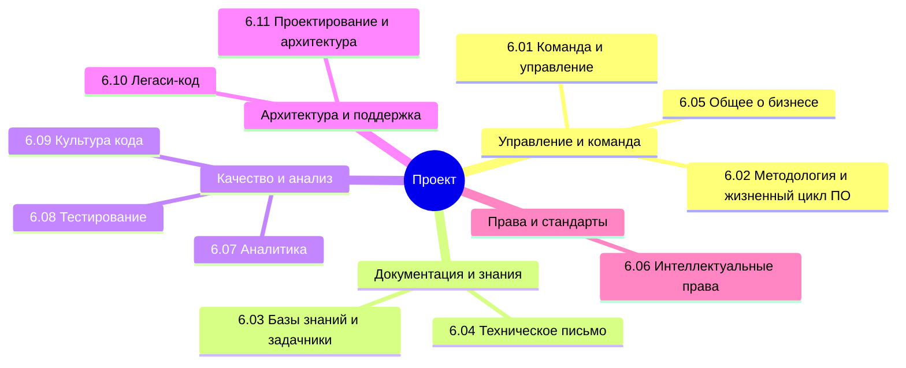

## Оглавление

Как мы уже выяснили, разработка в IT - процесс широкий и комплексный, и он охватывает множество направлений, включая как разработку, аналитику и тестирование, так и проектирование, маркетинг и управление.

Вообще, лучше воспользуйтесь содержанием или перейдите к Базе знаний. Но для удобства, я размещу здесь ссылки на основные главы раздела:

<ul>
  <li><a href="/it-knowledge-base/docs/Проект/6.01.%20Команда%20и%20управление/1">6.01. Команда и управление</a></li>
  Организационная структура проектной команды: роли, ответственности, взаимодействие. Методы управления людскими ресурсами, коммуникации, разрешение конфликтов и формирование командной культуры.
  
  <li><a href="/it-knowledge-base/docs/Проект/6.02.%20Методология%20и%20жизненный%20цикл%20ПО/1">6.02. Методология и жизненный цикл ПО</a></li>
  Модели разработки программного обеспечения: каскадная, итеративная, спиральная, Agile. Этапы жизненного цикла — анализ требований, проектирование, реализация, тестирование, сопровождение.
  
  <li><a href="/it-knowledge-base/docs/Проект/6.03.%20Базы%20знаний%20и%20задачники/1">6.03. Базы знаний и задачники</a></li>
  Средства централизованного хранения информации: документация, вики, трекеры задач. Интеграция с процессами разработки, поддержка преемственности и эффективного поиска решений.
  
  <li><a href="/it-knowledge-base/docs/Проект/6.04.%20Техническое%20письмо/1">6.04. Техническое письмо</a></li>
  Принципы создания чёткой и однозначной технической документации: спецификации, руководства, отчёты, API-документация. Структура, стиль, терминология и контроль качества текстов.
  
  <li><a href="/it-knowledge-base/docs/Проект/6.05.%20Общее%20о%20бизнесе/1">6.05. Общее о бизнесе</a></li>
  Понимание бизнес-контекста: цели, метрики, процессы, заинтересованные стороны. Влияние бизнес-логики на требования к системам и приоритезацию разработки.
  
  <li><a href="/it-knowledge-base/docs/Проект/6.06.%20Интеллектуальные%20права/1">6.06. Интеллектуальные права</a></li>
  Правовые аспекты владения кодом, дизайнами, алгоритмами. Лицензирование ПО (открытое и проприетарное), авторские права, патенты, соглашения NDA и передача прав.
  
  <li><a href="/it-knowledge-base/docs/Проект/6.07.%20Аналитика/1">6.07. Аналитика</a></li>
  Сбор, обработка и интерпретация данных о работе системы и поведении пользователей. Использование метрик для принятия решений, оптимизации продукта и оценки эффективности.
  
  <li><a href="/it-knowledge-base/docs/Проект/6.08.%20Тестирование/1">6.08. Тестирование</a></li>
  Методы проверки корректности ПО: модульное, интеграционное, сквозное, регрессионное тестирование. Автоматизация, тестовые окружения, стратегии покрытия и обеспечение качества.
  
  <li><a href="/it-knowledge-base/docs/Проект/6.09.%20Культура%20кода/1">6.09. Культура кода</a></li>
  Нормы и практики, формирующие качество кодовой базы: рецензирование (code review), единый стиль, стандарты именования, комментарии, модульность и повторное использование.
  
  <li><a href="/it-knowledge-base/docs/Проект/6.10.%20Легаси-код/1">6.10. Легаси-код</a></li>
  Работа с унаследованным программным обеспечением: анализ, рефакторинг, документирование, миграция. Управление техническим долгом и поддержка систем без исходных материалов.
  
  <li><a href="/it-knowledge-base/docs/Проект/6.11.%20Проектирование%20и%20архитектура/1">6.11. Проектирование и архитектура</a></li>
  Принципы построения масштабируемых, поддерживаемых и отказоустойчивых систем. Выбор архитектурных решений, моделирование компонентов, взаимодействие модулей и учёт нефункциональных требований.
</ul>

Представим себе ситуацию. Вы - бизнесмен, которому нужно обеспечить автоматизацию процесса согласования договоров в организации. К этой идее вы пришли либо самостоятельно, либо увидели на форуме презентацию новой технологии. Но у вас строительная компания, и вам нужна помощь профессионалов!

Так, вас судьба привела к договору на оказание услуг по разработке информационной системы силами исполнителя. Этим исполнителем оказывается некая IT-компания, у которой всё чётко поставлено и организовано. И эта организация управления проектами в сфере информационных технологий является таким же специфичным для отрасли стилем, как и ведение проектов в строительстве, или финансовой сфере.

Общий поток всегда один:

Договоренность - Выполнение работ/оказание услуг - Сдача результата в срок.

И чтобы сдать результат в срок в строгом соответствии с условиями договора, нужно внутри организации-исполнителя грамотно поставить «конвейер» поставки продуктов. Для этого мы должны собрать команду, которая включает в себя руководителя проекта (с которого будем требовать), всех сопутствующих обслуживающих менеджеров и специалистов (эксперты, финансисты, бухгалтера, экономисты, юристы, маркетологи, администраторы, безопасники и прочие важные спецы), и самое главное - команду разработки.

В этой команде разработки мы должны включить несколько важных категорий:

1. Архитектор системы. Он должен будет, по договорённости с руководством и с заказчиком-бизнесменом, обсудить единую общую картину, как всё должно работать в результате, и именно ему предстоит всё распределить, спроектировать, и подготовить итоговое крупное видение всех элементов системы. Он проектирует набор инструментов, языков, протоколов, способов интеграции, согласует коммуникации и тому подобное, абсолютно так же, как главный архитектор здания. Это, как можно понять, должен быть самый грамотный специалист, с большим опытом работы, ведь именно его ошибка будет стоить максимально дорого. Если ошибается архитектор в выборе технологии или подхода, вся система будет не соответствовать ожиданиям и это очень, очень плохо.
2. Аналитики. Тут могут быть разные ребята - бизнес-аналитики, системные аналитики, аналитики данных, но они объединены единой целью - разобраться, и детализировать конкретные направления, которые решил архитектор. Ошибка аналитика является второй по приоритетности, так как он должен изучить логику, и если реализация будет хромать из-за него, придётся откатываться назад по целому направлению.
3. Разработчики. Это «строители», которые будут строить по проекту и анализу, как по чертежам. Это глубокие технические специалисты, которые сами разберутся с кодом и низкоуровневыми проблемами, но при этом они не лезут в выбранные решения по технологиям и реализациям. Аналитиком сказано, что нужно сделать так - разработчик сделает именно так, как сказано, так как он не видит всей картины. Пример со строителями - они положат бетонные плиты и кирпичи именно там, где сказано в проекте, их обязанность - соблюдать точность, ведь они не знают всей задумки. Сказано на 5 сантиметров выше - значит делаем так. Если это плохое решение, отвечать будет тот, кто выставил требование. Ошибку разработчика можно исправить, попросить переделать, пофиксить баг, изменить код, переписать и улучшить. Так что она третья в приоритете.
4. Тестировщики. Это те, кто проверит, точно ли в соответствии с требованиями реализована работа программы. Словом, точно ли там 5 сантиметров? По приоритетности ошибки тестировщика спорно. По идее, это четвертый приоритет, но всё же могут быть ситуации и критичные. С одной стороны, если ошибка допущена, и не замечена тестировщиком, то она всё равно есть, и выплывает позже рано или поздно, и её останется лишь исправить. Если это ошибка разработчика. Ошибку аналитика или архитектора тестировщик лишь выявит/не выявит, но природа ошибки, как её приоритет, сохранится за ответственными лицами. Поэтому ответственность тестировщика равнозначная любому проверяющему - если пропустить важный момент, то ошибка тестировщика лишь сохранит чужую ошибку. Можно сказать, что тестировщик это второй шанс, спасительная инстанция, которая может в перспективе защитить от убытков. Многие IT-компании (особенно в игровой индустрии) высший приоритет ставят именно тестированию, чтобы ничего не упустить.

И в этой книге мы должны будем разобраться, как всем этим «хозяйством» грамотно управлять. Нужно узнать, как проектируются системы - паттерны проектирования, принципы SOLID, архитектурные стили (монолит, микросервисы), а также как работать аналитику, тестировщику, как работать с задачами и документацией. Если вы менеджер или планируете управлять командой в дальнейшем, вам неизбежно придётся изучить всю внутреннюю кухню работы над проектом.

Проекты бывают разные, порой они требуют глубокого изучения предметной области, а порой представляют собой уже кем-то созданный проект, который надо «подхватить» и вытащить из болота. Тогда перед нами открывается новая проблема - когда кто-то уже сделал работу, а нам придётся в ней разобраться. Это мы тоже разберём, изучив культуру кода, хороший тон, соглашения, и конечно легаси-код, как работать с чужим кодом.

Здесь сосредоточимся на команде, процессе и ответственности. В реальном мире заказчик не спросит, как мы написали код, нас спросят, решена ли задача.

Помните - вас нанимают не потому что вы умный или хороший, а потому что вы решаете проблему заказчика/работодателя.

