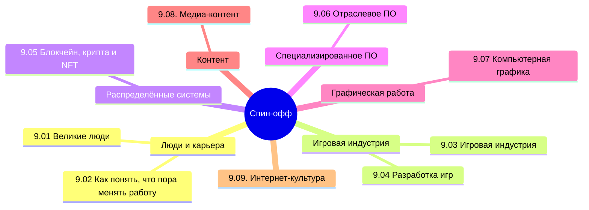

  ОБЯЗАТЕЛЬНО
  ДЛЯ НОВИЧКОВ

---

## О разделе

Что ж, я думаю, это финальная книга из цикла, которая не является обязательной, но может быть интересной для энтузиастов, к тому же может существенно повысить знания. Здесь включено всё то, что не вошло в другие книги из-за своих спецификаций.

Вообще, лучше воспользуйтесь содержанием или перейдите к Базе знаний. Но для удобства, я размещу здесь ссылки на основные главы раздела:

---

## Великие люди

- [9.01. Великие люди](/encyclopedia/Спин-офф/9.01.%20Великие%20люди/1)
- [9.01. Итоги](/encyclopedia/Спин-офф/9.01.%20Великие%20люди/2)
- [9.01. Чек-лист самопроверки](/encyclopedia/Спин-офф/9.01.%20Великие%20люди/3)

---

## Как понять, что пора менять работу

- [9.02. Как понять, что пора менять работу](/encyclopedia/Спин-офф/9.02.%20Как%20понять,%20что%20пора%20менять%20работу/1)
- [9.02. Итоги](/encyclopedia/Спин-офф/9.02.%20Как%20понять,%20что%20пора%20менять%20работу/2)
- [9.02. Чек-лист самопроверки](/encyclopedia/Спин-офф/9.02.%20Как%20понять,%20что%20пора%20менять%20работу/3)

---

## Игровая индустрия

- [9.03. Игровая индустрия](/encyclopedia/Спин-офф/9.03.%20Игровая%20индустрия/1)
- [9.03. Кризис игровой индустрии](/encyclopedia/Спин-офф/9.03.%20Игровая%20индустрия/11)
- [9.03. Студии и независимые разработчики](/encyclopedia/Спин-офф/9.03.%20Игровая%20индустрия/111)
- [9.03. Издатели игр](/encyclopedia/Спин-офф/9.03.%20Игровая%20индустрия/112)
- [9.03. Цифровые магазины и физические дистрибьюторы](/encyclopedia/Спин-офф/9.03.%20Игровая%20индустрия/113)
- [9.03. Игровые платформы](/encyclopedia/Спин-офф/9.03.%20Игровая%20индустрия/114)
- [9.03. PC](/encyclopedia/Спин-офф/9.03.%20Игровая%20индустрия/1141)
- [9.03. Мобильные игры](/encyclopedia/Спин-офф/9.03.%20Игровая%20индустрия/1142)
- [9.03. Игровые консоли](/encyclopedia/Спин-офф/9.03.%20Игровая%20индустрия/1143)
- [9.03. Как устроен Xbox Series S и Series X](/encyclopedia/Спин-офф/9.03.%20Игровая%20индустрия/11431)
- [9.03. Как устроен Steam Deck и Steam Machine](/encyclopedia/Спин-офф/9.03.%20Игровая%20индустрия/11432)
- [9.03. Как устроена Nintendo Switch](/encyclopedia/Спин-офф/9.03.%20Игровая%20индустрия/11433)
- [9.03. Как устроена Playstation 5](/encyclopedia/Спин-офф/9.03.%20Игровая%20индустрия/11434)
- [9.03. Виртуальная реальность](/encyclopedia/Спин-офф/9.03.%20Игровая%20индустрия/115)
- [9.03. Монетизация](/encyclopedia/Спин-офф/9.03.%20Игровая%20индустрия/116)
- [9.03. Аркадные автоматы](/encyclopedia/Спин-офф/9.03.%20Игровая%20индустрия/117)
- [9.03. Сообщество и контент](/encyclopedia/Спин-офф/9.03.%20Игровая%20индустрия/118)
- [9.03. Работа в игровой индустрии](/encyclopedia/Спин-офф/9.03.%20Игровая%20индустрия/119)
- [9.03. Java игры](/encyclopedia/Спин-офф/9.03.%20Игровая%20индустрия/120)
- [9.03. Dendy и NES](/encyclopedia/Спин-офф/9.03.%20Игровая%20индустрия/121)
- [9.03. Sega Mega Drive и Genesis игры](/encyclopedia/Спин-офф/9.03.%20Игровая%20индустрия/122)
- [9.03. Легенды](/encyclopedia/Спин-офф/9.03.%20Игровая%20индустрия/123)
- [9.03. Производительность портативных игровых устройств](/encyclopedia/Спин-офф/9.03.%20Игровая%20индустрия/998)
- [9.03. Итоги](/encyclopedia/Спин-офф/9.03.%20Игровая%20индустрия/999)
- [9.03. Чек-лист самопроверки](/encyclopedia/Спин-офф/9.03.%20Игровая%20индустрия/999)

---

## Разработка игр

- [9.04. Разработка игр](/encyclopedia/Спин-офф/9.04.%20Разработка%20игр/1)
- [9.04. Дорожная карта геймдева](/encyclopedia/Спин-офф/9.04.%20Разработка%20игр/11)
- [9.04. Команда разработки](/encyclopedia/Спин-офф/9.04.%20Разработка%20игр/111)
- [9.04. Игровой движок](/encyclopedia/Спин-офф/9.04.%20Разработка%20игр/112)
- [9.04. Виды игровых движков](/encyclopedia/Спин-офф/9.04.%20Разработка%20игр/113)
- [9.04. Языки программирования игр](/encyclopedia/Спин-офф/9.04.%20Разработка%20игр/114)
- [9.04. Моделирование](/encyclopedia/Спин-офф/9.04.%20Разработка%20игр/115)
- [9.04. Текстуры](/encyclopedia/Спин-офф/9.04.%20Разработка%20игр/116)
- [9.04. Гейм-дизайн](/encyclopedia/Спин-офф/9.04.%20Разработка%20игр/117)
- [9.04. PC](/encyclopedia/Спин-офф/9.04.%20Разработка%20игр/118)
- [9.04. PlayStation](/encyclopedia/Спин-офф/9.04.%20Разработка%20игр/119)
- [9.04. Nintendo](/encyclopedia/Спин-офф/9.04.%20Разработка%20игр/120)
- [9.04. Xbox](/encyclopedia/Спин-офф/9.04.%20Разработка%20игр/121)
- [9.04. Мобильные игры](/encyclopedia/Спин-офф/9.04.%20Разработка%20игр/122)
- [9.04. Оптимизация игр](/encyclopedia/Спин-офф/9.04.%20Разработка%20игр/123)
- [9.04. Тестирование игр](/encyclopedia/Спин-офф/9.04.%20Разработка%20игр/124)
- [9.04. Разработка на Roblox](/encyclopedia/Спин-офф/9.04.%20Разработка%20игр/2)
- [9.04. Справочник по Roblox](/encyclopedia/Спин-офф/9.04.%20Разработка%20игр/201)
- [9.04. Разработка в Minecraft](/encyclopedia/Спин-офф/9.04.%20Разработка%20игр/21)
- [9.04. Разработка на Unity](/encyclopedia/Спин-офф/9.04.%20Разработка%20игр/3)
- [9.04. Справочник по Unity](/encyclopedia/Спин-офф/9.04.%20Разработка%20игр/301)
- [9.04. Справочник по Unreal Engine](/encyclopedia/Спин-офф/9.04.%20Разработка%20игр/401)
- [9.04. Архитектура гонок](/encyclopedia/Спин-офф/9.04.%20Разработка%20игр/31)
- [9.04. Ритм игры](/encyclopedia/Спин-офф/9.04.%20Разработка%20игр/32)
- [9.04. Unreal Engine](/encyclopedia/Спин-офф/9.04.%20Разработка%20игр/4)
- [9.04. Итоги](/encyclopedia/Спин-офф/9.04.%20Разработка%20игр/998)
- [9.04. Чек-лист самопроверки](/encyclopedia/Спин-офф/9.04.%20Разработка%20игр/999)

---

## Блокчейн, крипта и NFT

- [9.05. Блокчейн, крипта и NFT](/encyclopedia/Спин-офф/9.05.%20Блокчейн,%20крипта%20и%20NFT/1)
- [9.05. Итоги](/encyclopedia/Спин-офф/9.05.%20Блокчейн,%20крипта%20и%20NFT/2)
- [9.05. Чек-лист самопроверки](/encyclopedia/Спин-офф/9.05.%20Блокчейн,%20крипта%20и%20NFT/3)

---

## Отраслевое ПО

- [9.06. Отраслевое ПО](/encyclopedia/Спин-офф/9.06.%20Отраслевое%20ПО/1)
- [9.06. Adobe](/encyclopedia/Спин-офф/9.06.%20Отраслевое%20ПО/11)
- [9.06. Справочник по Adobe Photoshop](/encyclopedia/Спин-офф/9.06.%20Отраслевое%20ПО/111)
- [9.06. Итоги](/encyclopedia/Спин-офф/9.06.%20Отраслевое%20ПО/2)
- [9.06. Чек-лист самопроверки](/encyclopedia/Спин-офф/9.06.%20Отраслевое%20ПО/3)

---

## Компьютерная графика

- [9.08. Компьютерная графика](/encyclopedia/Спин-офф/9.08.%20Компьютерная%20графика/1)
- [9.08. Растровая графика](/encyclopedia/Спин-офф/9.08.%20Компьютерная%20графика/11)
- [9.08. Векторная графика](/encyclopedia/Спин-офф/9.08.%20Компьютерная%20графика/12)
- [9.08. 3D-графика и анимация](/encyclopedia/Спин-офф/9.08.%20Компьютерная%20графика/13)
- [9.08. Алгоритмы растеризации](/encyclopedia/Спин-офф/9.08.%20Компьютерная%20графика/14)
- [9.08. Итоги](/encyclopedia/Спин-офф/9.08.%20Компьютерная%20графика/2)
- [9.08. Чек-лист самопроверки](/encyclopedia/Спин-офф/9.08.%20Компьютерная%20графика/3)

---

## Медиа-контент

- [9.09. Видео](/encyclopedia/Спин-офф/9.09.%20Медиа-контент/1)
- [9.09. Аудио](/encyclopedia/Спин-офф/9.09.%20Медиа-контент/11)
- [9.09. Онлайн-контент и стриминг](/encyclopedia/Спин-офф/9.09.%20Медиа-контент/12)
- [9.09. Онлайн-кинотеатры](/encyclopedia/Спин-офф/9.09.%20Медиа-контент/13)
- [9.09. Итоги](/encyclopedia/Спин-офф/9.09.%20Медиа-контент/2)
- [9.09. Чек-лист самопроверки](/encyclopedia/Спин-офф/9.09.%20Медиа-контент/3)

---

## Интернет-культура

- [9.10. Основы интернет-культуры](/encyclopedia/Спин-офф/9.10.%20Интернет-культура/1)
- [9.10. Инфраструктура взаимодействия](/encyclopedia/Спин-офф/9.10.%20Интернет-культура/111)
- [9.10. Пользовательские роли и социальные типы](/encyclopedia/Спин-офф/9.10.%20Интернет-культура/112)
- [9.10. Социальные и этические нормы](/encyclopedia/Спин-офф/9.10.%20Интернет-культура/113)
- [9.10. Экономические и организационные сообщества](/encyclopedia/Спин-офф/9.10.%20Интернет-культура/114)
- [9.10. Маркетинг и манипуляция](/encyclopedia/Спин-офф/9.10.%20Интернет-культура/115)
- [9.10. Культурные артефакты и трансляция](/encyclopedia/Спин-офф/9.10.%20Интернет-культура/116)
- [9.10. Кросс-контекстные явления](/encyclopedia/Спин-офф/9.10.%20Интернет-культура/117)
- [9.10. Меметика](/encyclopedia/Спин-офф/9.10.%20Интернет-культура/118)
- [9.10. Итоги](/encyclopedia/Спин-офф/9.10.%20Интернет-культура/998)
- [9.10. Итоговый чек-лист](/encyclopedia/Спин-офф/9.10.%20Интернет-культура/999)

Собственно, начнём мы с небольших оступлений для повышения знаний, выполнив обзор великих людей в сфере IT - это основоположники технологий, создатели языков, инженеры, игроделы, предприниматели и прочие важные личности, которым мы должны быть благодарны.

У профессионала возникают проблемы. Всегда. Поэтому мы разберём психологический аспект работы "айтишника", изучим явления выгорания, усталости, желания сменить работы, токсичность и всё в таком духе. Это важная тема, которую поначалу недооценивают - но именно поэтому люди "сгорают" и убегают из сферы. Вы же не хотите всё бросить? Вот я хочу вас поддержать.

Игровая индустрия - это тема, которая интересна не каждому, но многие питают иллюзии. Первая, которую я раскрою сразу - это то, что в разработке игр платят мало, ниже всех остальных в IT. Игроделов и не так сильно уважают в отрасли, потому что считают это менее серьезной работой. Но действительно ли так всё плохо? А что если вам интересна именно разработка игр, и вы в будущем подарите нам что-то прекрасное? Вот поэтому мы не упустим такой шанс, разберём всю индустрию разработки игр, начиная со студий и издателей, заканчивая всеми платформами, монетизацией, и конечно работой в игровой индустрии.

Геймдев, или разработка видеоигр, это сложная тема, включающая в себя как проектирование, так и работу с игровыми движками, моделированием, текстурированием, оптимизацией и тестированием на разных игровых платформах. Здесь придётся помучаться, ведь там целая наука гейм-дизайна.
Затем мы прихватим ещё две отрасли - ИИ и крипта.

Касательно блокчейна, криптографии и NFT, нам понадобится изучить криптоосновы, которые приведут нас к пониманию работы криптовалют, шифрования, токенов, смарт-карт и прочего в этой сфере. Это более нишевая сфера, но всё же она IT.

Последнее, чем мы займемся - это нейросети. Сейчас на них тренд, и я расскажу о них то, что нужно знать - история, что такое ИИ, нейроны, нейронные сети, машинное обучение. Мы научимся создавать свои нейросети и подключать их к своим программам. У ИИ есть множество проблем, так что и без них не обойтись.

---
