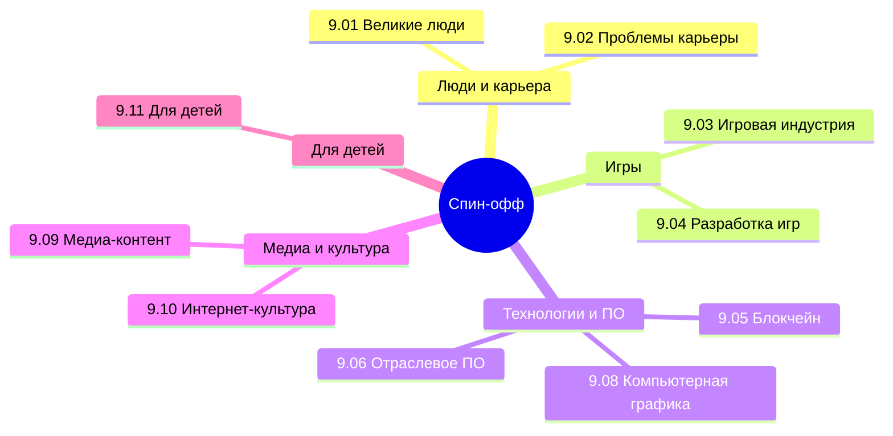

  ОБЯЗАТЕЛЬНО
  ДЛЯ НОВИЧКОВ

---

## О разделе

Факультативная «книга» цикла: темы, которые не входят в обязательное ядро, но сильно расширяют кругозор — от выгорания в IT до геймдева, стриминга и интернет-культуры. **9.03**, **9.04** и **9.11** читаются на [games.spirzen.ru](https://games.spirzen.ru/games/intro) и [kids.spirzen.ru](https://kids.spirzen.ru/kids/intro); остальные подразделы — на spirzen.ru. Раздел **не заменяет** [ИИ (раздел 6)](/encyclopedia/6-ai/6-01-vvedenie-v-ii/intro) — нейросети как дисциплина живут там.

Полное содержание — в боковой навигации энциклопедии. Ниже — быстрые входы по подразделам.

---

## 9.01 Великие люди

- [Великие люди — о разделе](/encyclopedia/9-spinoff/9-01-velikie-lyudi/intro)
- [Великие люди](/encyclopedia/9-spinoff/9-01-velikie-lyudi/1)
- [Итоги](/encyclopedia/9-spinoff/9-01-velikie-lyudi/2)
- [Чек-лист](/encyclopedia/9-spinoff/9-01-velikie-lyudi/3)

---

## 9.02 Проблемы карьеры в IT

- [О разделе](/encyclopedia/9-spinoff/9-02-kak-ponyat-chto-pora-menyat-rabotu/intro)
- [Признаки смены работы](/encyclopedia/9-spinoff/9-02-kak-ponyat-chto-pora-menyat-rabotu/1)
- [Когда дело не в вас: платформы с высоким порогом](/encyclopedia/9-spinoff/9-02-kak-ponyat-chto-pora-menyat-rabotu/6)
- [Границы и разговор с руководителем](/encyclopedia/9-spinoff/9-02-kak-ponyat-chto-pora-menyat-rabotu/4)
- [Выгорание — восстановление](/encyclopedia/9-spinoff/9-02-kak-ponyat-chto-pora-menyat-rabotu/5)
- [Итоги](/encyclopedia/9-spinoff/9-02-kak-ponyat-chto-pora-menyat-rabotu/2)
- [Чек-лист](/encyclopedia/9-spinoff/9-02-kak-ponyat-chto-pora-menyat-rabotu/3)

---

## 9.03 Игровая индустрия

> Канонический раздел — **[games.spirzen.ru](https://games.spirzen.ru/games/9-03-igrovaya-industriya/intro)**. Ссылки ниже на spirzen редиректят.

- [О разделе](https://games.spirzen.ru/games/9-03-igrovaya-industriya/intro)
- [Игровая индустрия](https://games.spirzen.ru/games/9-03-igrovaya-industriya/1)
- [Киберспорт](/encyclopedia/9-spinoff/9-03-igrovaya-industriya/125)
- [Live-service](/encyclopedia/9-spinoff/9-03-igrovaya-industriya/126)
- [UGC-платформы](/encyclopedia/9-spinoff/9-03-igrovaya-industriya/127)
- [Эмуляция ретро](/encyclopedia/9-spinoff/9-03-igrovaya-industriya/128)
- [Linux-гейминг и Proton](/encyclopedia/9-spinoff/9-03-igrovaya-industriya/11438)
- [Steam](/encyclopedia/9-spinoff/9-03-igrovaya-industriya/11435)
- [Игроведение](/encyclopedia/9-spinoff/9-03-igrovaya-industriya/game-studies/intro)
- [Итоги](/encyclopedia/9-spinoff/9-03-igrovaya-industriya/998) · [Чек-лист](/encyclopedia/9-spinoff/9-03-igrovaya-industriya/999)

---

## 9.04 Разработка игр

> Канонический раздел — **[games.spirzen.ru](https://games.spirzen.ru/games/9-04-razrabotka-igr/intro)**.

- [О разделе](https://games.spirzen.ru/games/9-04-razrabotka-igr/intro)
- [Дорожная карта геймдева](/encyclopedia/9-spinoff/9-04-razrabotka-igr/11)
- [Godot — первая игра](/encyclopedia/9-spinoff/9-04-razrabotka-igr/207)
- [Unity](/encyclopedia/9-spinoff/9-04-razrabotka-igr/3) · [Unreal](/encyclopedia/9-spinoff/9-04-razrabotka-igr/4) · [UE6](/encyclopedia/9-spinoff/9-04-razrabotka-igr/129) · [Verse](/encyclopedia/9-spinoff/9-04-razrabotka-igr/130) · [Roblox](/encyclopedia/9-spinoff/9-04-razrabotka-igr/2)
- [Звук — FMOD и Wwise](/encyclopedia/9-spinoff/9-04-razrabotka-igr/126)
- [Игровая доступность](/encyclopedia/9-spinoff/9-04-razrabotka-igr/127)
- [ИИ в играх](/encyclopedia/9-spinoff/9-04-razrabotka-igr/128)
- [Практикум](/encyclopedia/9-spinoff/9-04-razrabotka-igr/praktikum-razrabotki-igr/intro)
- [Итоги](/encyclopedia/9-spinoff/9-04-razrabotka-igr/998) · [Чек-лист](/encyclopedia/9-spinoff/9-04-razrabotka-igr/999)

---

## 9.05 Блокчейн, крипта и NFT

- [О разделе](/encyclopedia/9-spinoff/9-05-blokcheyn-kripta-i-nft/intro)
- [Блокчейн, крипта и NFT](/encyclopedia/9-spinoff/9-05-blokcheyn-kripta-i-nft/1)
- [Практикум Ledger Lab](/encyclopedia/9-spinoff/9-05-blokcheyn-kripta-i-nft/1010)
- [Итоги](/encyclopedia/9-spinoff/9-05-blokcheyn-kripta-i-nft/2) · [Чек-лист](/encyclopedia/9-spinoff/9-05-blokcheyn-kripta-i-nft/3)

---

## 9.06 Отраслевое ПО

- [О разделе](/encyclopedia/9-spinoff/9-06-otraslevoe-po/intro)
- [Отраслевое ПО](/encyclopedia/9-spinoff/9-06-otraslevoe-po/1)
- [Figma для разработчика](/encyclopedia/9-spinoff/9-06-otraslevoe-po/113)
- [Adobe](/encyclopedia/9-spinoff/9-06-otraslevoe-po/11) · [Autodesk](/encyclopedia/9-spinoff/9-06-otraslevoe-po/112)
- [Итоги](/encyclopedia/9-spinoff/9-06-otraslevoe-po/2) · [Чек-лист](/encyclopedia/9-spinoff/9-06-otraslevoe-po/3)

---

## 9.08 Компьютерная графика

- [О разделе](/encyclopedia/9-spinoff/9-08-kompyuternaya-grafika/intro)
- [Основы](/encyclopedia/9-spinoff/9-08-kompyuternaya-grafika/1)
- [Blender](/encyclopedia/9-spinoff/9-08-kompyuternaya-grafika/131)
- [Итоги](/encyclopedia/9-spinoff/9-08-kompyuternaya-grafika/2) · [Чек-лист](/encyclopedia/9-spinoff/9-08-kompyuternaya-grafika/3)

---

## 9.09 Медиа-контент

- [О разделе](/encyclopedia/9-spinoff/9-09-media-kontent/intro)
- [Видео](/encyclopedia/9-spinoff/9-09-media-kontent/1)
- [OBS — стрим и запись](/encyclopedia/9-spinoff/9-09-media-kontent/14)
- [Онлайн-контент и стриминг](/encyclopedia/9-spinoff/9-09-media-kontent/12)
- [Итоги](/encyclopedia/9-spinoff/9-09-media-kontent/2) · [Чек-лист](/encyclopedia/9-spinoff/9-09-media-kontent/3)

---

## 9.10 Интернет-культура

- [О разделе](/encyclopedia/9-spinoff/9-10-internet-kultura/intro)
- [Основы](/encyclopedia/9-spinoff/9-10-internet-kultura/1)
- [Discord и Telegram для IT](/encyclopedia/9-spinoff/9-10-internet-kultura/135)
- [Open Source и GitHub](/encyclopedia/9-spinoff/9-10-internet-kultura/133)
- [Итоги](/encyclopedia/9-spinoff/9-10-internet-kultura/998) · [Чек-лист](/encyclopedia/9-spinoff/9-10-internet-kultura/999)

---

## 9.11 Для детей

> Канонический раздел — **[kids.spirzen.ru](https://kids.spirzen.ru/kids/intro)**.

- [Для детей — о разделе](https://kids.spirzen.ru/kids/intro)
- [Компьютер](https://kids.spirzen.ru/kids/1-computer/intro)
- [Код](https://kids.spirzen.ru/kids/5-kod/intro)

---

## С чего начать новичку

| Интерес | Маршрут |
|---------|---------|
| Не выгореть в IT | [9.02/1](/encyclopedia/9-spinoff/9-02-kak-ponyat-chto-pora-menyat-rabotu/1) → [4](/encyclopedia/9-spinoff/9-02-kak-ponyat-chto-pora-menyat-rabotu/4) → [5](/encyclopedia/9-spinoff/9-02-kak-ponyat-chto-pora-menyat-rabotu/5) |
| Сделать игру | [9.04/intro](/encyclopedia/9-spinoff/9-04-razrabotka-igr/intro) → [Godot 207](/encyclopedia/9-spinoff/9-04-razrabotka-igr/207) или [Roblox 203](/encyclopedia/9-spinoff/9-04-razrabotka-igr/203) |
| Стрим / YouTube | [OBS 14](/encyclopedia/9-spinoff/9-09-media-kontent/14) → [стриминг 12](/encyclopedia/9-spinoff/9-09-media-kontent/12) |
| Влиться в сообщество | [Discord/Telegram 135](/encyclopedia/9-spinoff/9-10-internet-kultura/135) |
| UI от дизайнера | [Figma 113](/encyclopedia/9-spinoff/9-06-otraslevoe-po/113) |

---
