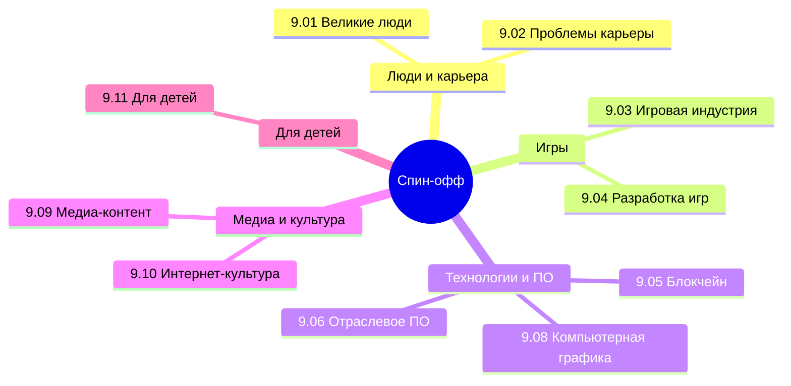

  ОБЯЗАТЕЛЬНО
  ДЛЯ НОВИЧКОВ

---

## О разделе

Факультативная «книга» цикла: темы, которые не входят в обязательное ядро, но сильно расширяют кругозор — от выгорания в IT до геймдева, стриминга и интернет-культуры. **9.03**, **9.04** и **9.11** читаются на [games.spirzen.ru](https://games.spirzen.ru/games/intro) и [kids.spirzen.ru](https://kids.spirzen.ru/kids/intro); остальные подразделы — на spirzen.ru. Раздел **не заменяет** [ИИ (раздел 6)](/encyclopedia/6-ai/6-01-vvedenie-v-ii/intro) — нейросети как дисциплина живут там.

Полное содержание — в боковой навигации энциклопедии. Ниже — быстрые входы по подразделам.

---

## Великие люди

<ul class="it-toc-articles">
  <li><a href="/encyclopedia/9-spinoff/9-01-velikie-lyudi/1">9.01. Великие люди</a></li>
  <li><a href="/encyclopedia/9-spinoff/9-01-velikie-lyudi/2">9.01. Великие люди — итоги</a></li>
  <li><a href="/encyclopedia/9-spinoff/9-01-velikie-lyudi/3">9.01. Великие люди — чек-лист</a></li>
</ul>

---

## Как понять, что пора менять работу

<ul class="it-toc-articles">
  <li><a href="/encyclopedia/9-spinoff/9-02-kak-ponyat-chto-pora-menyat-rabotu/1">9.02. Признаки необходимости смены работы в IT</a></li>
  <li><a href="/encyclopedia/9-spinoff/9-02-kak-ponyat-chto-pora-menyat-rabotu/2">9.02. Как понять, что пора менять работу — итоги</a></li>
  <li><a href="/encyclopedia/9-spinoff/9-02-kak-ponyat-chto-pora-menyat-rabotu/3">9.02. Как понять, что пора менять работу — чек-лист</a></li>
  <li><a href="/encyclopedia/9-spinoff/9-02-kak-ponyat-chto-pora-menyat-rabotu/4">9.02. Границы, on-call и разговор с руководителем</a></li>
  <li><a href="/encyclopedia/9-spinoff/9-02-kak-ponyat-chto-pora-menyat-rabotu/5">9.02. Выгорание в IT — восстановление</a></li>
  <li><a href="/encyclopedia/9-spinoff/9-02-kak-ponyat-chto-pora-menyat-rabotu/6">9.02. Когда дело не в вас: платформы с высоким порогом входа</a></li>
</ul>

---

## Игровая индустрия

<ul class="it-toc-articles">
  <li><a href="/encyclopedia/9-spinoff/9-03-igrovaya-industriya/1">9.03. Игровая индустрия</a></li>
  <li><a href="/encyclopedia/9-spinoff/9-03-igrovaya-industriya/11">9.03. Кризис игровой индустрии</a></li>
  <li><a href="/encyclopedia/9-spinoff/9-03-igrovaya-industriya/111">9.03. Студии и независимые разработчики</a></li>
  <li><a href="/encyclopedia/9-spinoff/9-03-igrovaya-industriya/112">9.03. Издатели игр</a></li>
  <li><a href="/encyclopedia/9-spinoff/9-03-igrovaya-industriya/113">9.03. Цифровые магазины и физические дистрибьюторы</a></li>
  <li><a href="/encyclopedia/9-spinoff/9-03-igrovaya-industriya/114">9.03. Игровые платформы</a></li>
  <li><a href="/encyclopedia/9-spinoff/9-03-igrovaya-industriya/115">9.03. Монетизация</a></li>
  <li><a href="/encyclopedia/9-spinoff/9-03-igrovaya-industriya/116">9.03. Аркадные автоматы</a></li>
  <li><a href="/encyclopedia/9-spinoff/9-03-igrovaya-industriya/117">9.03. Сообщество и контент</a></li>
  <li><a href="/encyclopedia/9-spinoff/9-03-igrovaya-industriya/118">9.03. Работа в игровой индустрии</a></li>
  <li><a href="/encyclopedia/9-spinoff/9-03-igrovaya-industriya/119">9.03. Java игры</a></li>
  <li><a href="/encyclopedia/9-spinoff/9-03-igrovaya-industriya/120">9.03. Dendy и NES</a></li>
  <li><a href="/encyclopedia/9-spinoff/9-03-igrovaya-industriya/121">9.03. Sega Mega Drive и Genesis игры</a></li>
  <li><a href="/encyclopedia/9-spinoff/9-03-igrovaya-industriya/122">9.03. Легенды</a></li>
  <li><a href="/encyclopedia/9-spinoff/9-03-igrovaya-industriya/123">9.03. Производительность портативных игровых устройств</a></li>
  <li><a href="/encyclopedia/9-spinoff/9-03-igrovaya-industriya/124">9.03. Игровые выставки, шоукейсы и презентации</a></li>
  <li><a href="/encyclopedia/9-spinoff/9-03-igrovaya-industriya/125">9.03. Киберспорт — как устроена индустрия</a></li>
  <li><a href="/encyclopedia/9-spinoff/9-03-igrovaya-industriya/126">9.03. Live-service игры</a></li>
  <li><a href="/encyclopedia/9-spinoff/9-03-igrovaya-industriya/127">9.03. UGC-платформы — Roblox, Fortnite Creative и аналоги</a></li>
  <li><a href="/encyclopedia/9-spinoff/9-03-igrovaya-industriya/128">9.03. Эмуляция ретро-игр — легально и технически</a></li>
  <li><a href="/encyclopedia/9-spinoff/9-03-igrovaya-industriya/998">9.03. Игровая индустрия — итоги</a></li>
  <li><a href="/encyclopedia/9-spinoff/9-03-igrovaya-industriya/999">9.03. Игровая индустрия — чек-лист</a></li>
  <li><a href="/encyclopedia/9-spinoff/9-03-igrovaya-industriya/1141">9.03. Почему AAA-разработка такая дорогая</a></li>
  <li><a href="/encyclopedia/9-spinoff/9-03-igrovaya-industriya/1142">9.03. Мобильные игры</a></li>
  <li><a href="/encyclopedia/9-spinoff/9-03-igrovaya-industriya/1143">9.03. Игровые консоли</a></li>
  <li><a href="/encyclopedia/9-spinoff/9-03-igrovaya-industriya/1144">9.03. Виртуальная реальность</a></li>
  <li><a href="/encyclopedia/9-spinoff/9-03-igrovaya-industriya/11431">9.03. Как устроен Xbox Series S и Series X</a></li>
  <li><a href="/encyclopedia/9-spinoff/9-03-igrovaya-industriya/11432">9.03. Как устроен Steam Deck и Steam Machine</a></li>
  <li><a href="/encyclopedia/9-spinoff/9-03-igrovaya-industriya/11433">9.03. Как устроена Nintendo Switch</a></li>
  <li><a href="/encyclopedia/9-spinoff/9-03-igrovaya-industriya/11434">9.03. Как устроена Playstation 5</a></li>
  <li><a href="/encyclopedia/9-spinoff/9-03-igrovaya-industriya/11435">9.03. Steam</a></li>
  <li><a href="/encyclopedia/9-spinoff/9-03-igrovaya-industriya/11436">9.03. PlayStation Store</a></li>
  <li><a href="/encyclopedia/9-spinoff/9-03-igrovaya-industriya/11437">9.03. Nintendo eShop</a></li>
  <li><a href="/encyclopedia/9-spinoff/9-03-igrovaya-industriya/11438">9.03. Linux-гейминг и Proton</a></li>
  <li><a href="/encyclopedia/9-spinoff/9-03-igrovaya-industriya/11439">9.03. История DirectX — от DOS до нейросетей</a></li>
  <li><a href="/encyclopedia/9-spinoff/9-03-igrovaya-industriya/11440">9.03. Как устроена Nintendo Switch 2</a></li>
  <li><a href="/encyclopedia/9-spinoff/9-03-igrovaya-industriya/11441">9.03. Как устроен Steam Machine</a></li>
  <li><a href="/encyclopedia/9-spinoff/9-03-igrovaya-industriya/114301">9.03. Xbox Game Pass</a></li>
</ul>

---

## Игроведение

<ul class="it-toc-articles">
  <li><a href="/encyclopedia/9-spinoff/9-03-igrovaya-industriya/game-studies/1">9.03. Diablo</a></li>
  <li><a href="/encyclopedia/9-spinoff/9-03-igrovaya-industriya/game-studies/11">9.03. Starcraft</a></li>
  <li><a href="/encyclopedia/9-spinoff/9-03-igrovaya-industriya/game-studies/12">9.03. Warcraft</a></li>
  <li><a href="/encyclopedia/9-spinoff/9-03-igrovaya-industriya/game-studies/13">9.03. Monster Hunter</a></li>
  <li><a href="/encyclopedia/9-spinoff/9-03-igrovaya-industriya/game-studies/14">9.03. DOOM</a></li>
  <li><a href="/encyclopedia/9-spinoff/9-03-igrovaya-industriya/game-studies/15">9.03. Warhammer</a></li>
  <li><a href="/encyclopedia/9-spinoff/9-03-igrovaya-industriya/game-studies/16">9.03. The Witcher</a></li>
  <li><a href="/encyclopedia/9-spinoff/9-03-igrovaya-industriya/game-studies/17">9.03. The Sims</a></li>
  <li><a href="/encyclopedia/9-spinoff/9-03-igrovaya-industriya/game-studies/101">9.03. Overwatch</a></li>
  <li><a href="/encyclopedia/9-spinoff/9-03-igrovaya-industriya/game-studies/111">9.03. The Elder Scrolls</a></li>
  <li><a href="/encyclopedia/9-spinoff/9-03-igrovaya-industriya/game-studies/112">9.03. Super Mario</a></li>
  <li><a href="/encyclopedia/9-spinoff/9-03-igrovaya-industriya/game-studies/113">9.03. Mortal Kombat</a></li>
  <li><a href="/encyclopedia/9-spinoff/9-03-igrovaya-industriya/game-studies/114">9.03. Street Fighter</a></li>
  <li><a href="/encyclopedia/9-spinoff/9-03-igrovaya-industriya/game-studies/115">9.03. Resident Evil</a></li>
  <li><a href="/encyclopedia/9-spinoff/9-03-igrovaya-industriya/game-studies/116">9.03. Far Cry</a></li>
  <li><a href="/encyclopedia/9-spinoff/9-03-igrovaya-industriya/game-studies/117">9.03. Assassin's Creed</a></li>
  <li><a href="/encyclopedia/9-spinoff/9-03-igrovaya-industriya/game-studies/118">9.03. Dragon Age</a></li>
  <li><a href="/encyclopedia/9-spinoff/9-03-igrovaya-industriya/game-studies/119">9.03. Devil May Cry</a></li>
  <li><a href="/encyclopedia/9-spinoff/9-03-igrovaya-industriya/game-studies/120">9.03. Dead Space</a></li>
  <li><a href="/encyclopedia/9-spinoff/9-03-igrovaya-industriya/game-studies/121">9.03. Cyberpunk 2077</a></li>
  <li><a href="/encyclopedia/9-spinoff/9-03-igrovaya-industriya/game-studies/122">9.03. Crysis</a></li>
  <li><a href="/encyclopedia/9-spinoff/9-03-igrovaya-industriya/game-studies/123">9.03. Call of Duty</a></li>
  <li><a href="/encyclopedia/9-spinoff/9-03-igrovaya-industriya/game-studies/124">9.03. Final Fantasy</a></li>
  <li><a href="/encyclopedia/9-spinoff/9-03-igrovaya-industriya/game-studies/125">9.03. Halo</a></li>
  <li><a href="/encyclopedia/9-spinoff/9-03-igrovaya-industriya/game-studies/126">9.03. Grand Theft Auto</a></li>
  <li><a href="/encyclopedia/9-spinoff/9-03-igrovaya-industriya/game-studies/127">9.03. Жанры видеоигр — маршрут</a></li>
  <li><a href="/encyclopedia/9-spinoff/9-03-igrovaya-industriya/game-studies/128">9.03. DRM и Denuvo в играх</a></li>
  <li><a href="/encyclopedia/9-spinoff/9-03-igrovaya-industriya/game-studies/129">9.03. Игровые консоли — маршрут</a></li>
</ul>

---

## Разработка игр

<ul class="it-toc-articles">
  <li><a href="/encyclopedia/9-spinoff/9-04-razrabotka-igr/1">9.04. Процесс разработки видеоигр</a></li>
  <li><a href="/encyclopedia/9-spinoff/9-04-razrabotka-igr/2">9.04. Разработка на Roblox</a></li>
  <li><a href="/encyclopedia/9-spinoff/9-04-razrabotka-igr/3">9.04. Разработка на Unity</a></li>
  <li><a href="/encyclopedia/9-spinoff/9-04-razrabotka-igr/4">9.04. Unreal Engine</a></li>
  <li><a href="/encyclopedia/9-spinoff/9-04-razrabotka-igr/11">9.04. Дорожная карта геймдева</a></li>
  <li><a href="/encyclopedia/9-spinoff/9-04-razrabotka-igr/21">9.04. Разработка в Minecraft</a></li>
  <li><a href="/encyclopedia/9-spinoff/9-04-razrabotka-igr/31">9.04. Архитектура гонок</a></li>
  <li><a href="/encyclopedia/9-spinoff/9-04-razrabotka-igr/32">9.04. Ритм игры</a></li>
  <li><a href="/encyclopedia/9-spinoff/9-04-razrabotka-igr/111">9.04. Команда разработки</a></li>
  <li><a href="/encyclopedia/9-spinoff/9-04-razrabotka-igr/112">9.04. Игровой движок</a></li>
  <li><a href="/encyclopedia/9-spinoff/9-04-razrabotka-igr/113">9.04. Виды игровых движков</a></li>
  <li><a href="/encyclopedia/9-spinoff/9-04-razrabotka-igr/114">9.04. Языки программирования игр</a></li>
  <li><a href="/encyclopedia/9-spinoff/9-04-razrabotka-igr/115">9.04. Моделирование</a></li>
  <li><a href="/encyclopedia/9-spinoff/9-04-razrabotka-igr/116">9.04. Текстуры</a></li>
  <li><a href="/encyclopedia/9-spinoff/9-04-razrabotka-igr/117">9.04. Гейм-дизайн</a></li>
  <li><a href="/encyclopedia/9-spinoff/9-04-razrabotka-igr/118">9.04. PC</a></li>
  <li><a href="/encyclopedia/9-spinoff/9-04-razrabotka-igr/119">9.04. PlayStation</a></li>
  <li><a href="/encyclopedia/9-spinoff/9-04-razrabotka-igr/120">9.04. Nintendo</a></li>
  <li><a href="/encyclopedia/9-spinoff/9-04-razrabotka-igr/121">9.04. Xbox</a></li>
  <li><a href="/encyclopedia/9-spinoff/9-04-razrabotka-igr/122">9.04. Мобильные игры</a></li>
  <li><a href="/encyclopedia/9-spinoff/9-04-razrabotka-igr/123">9.04. Оптимизация игр</a></li>
  <li><a href="/encyclopedia/9-spinoff/9-04-razrabotka-igr/124">9.04. Тестирование игр</a></li>
  <li><a href="/encyclopedia/9-spinoff/9-04-razrabotka-igr/125">9.04. Каталог open-source клонов игр</a></li>
  <li><a href="/encyclopedia/9-spinoff/9-04-razrabotka-igr/126">9.04. Звук и музыка в играх — FMOD и Wwise</a></li>
  <li><a href="/encyclopedia/9-spinoff/9-04-razrabotka-igr/127">9.04. Игровая доступность (accessibility)</a></li>
  <li><a href="/encyclopedia/9-spinoff/9-04-razrabotka-igr/128">9.04. ИИ в играх</a></li>
  <li><a href="/encyclopedia/9-spinoff/9-04-razrabotka-igr/129">9.04. Unreal Engine 6</a></li>
  <li><a href="/encyclopedia/9-spinoff/9-04-razrabotka-igr/130">9.04. Verse</a></li>
  <li><a href="/encyclopedia/9-spinoff/9-04-razrabotka-igr/201">9.04. Справочник по Roblox</a></li>
  <li><a href="/encyclopedia/9-spinoff/9-04-razrabotka-igr/202">9.04. Экономика Roblox</a></li>
  <li><a href="/encyclopedia/9-spinoff/9-04-razrabotka-igr/203">9.04. Studio — первая игра</a></li>
  <li><a href="/encyclopedia/9-spinoff/9-04-razrabotka-igr/204">9.04. Практикум — обби</a></li>
  <li><a href="/encyclopedia/9-spinoff/9-04-razrabotka-igr/205">9.04. Практикум — королевская битва</a></li>
  <li><a href="/encyclopedia/9-spinoff/9-04-razrabotka-igr/206">9.04. Три &quot;М&quot; на Roblox</a></li>
  <li><a href="/encyclopedia/9-spinoff/9-04-razrabotka-igr/207">9.04. Godot — первая игра</a></li>
  <li><a href="/encyclopedia/9-spinoff/9-04-razrabotka-igr/301">9.04. Справочник по Unity</a></li>
  <li><a href="/encyclopedia/9-spinoff/9-04-razrabotka-igr/401">9.04. Справочник по Unreal Engine</a></li>
  <li><a href="/encyclopedia/9-spinoff/9-04-razrabotka-igr/998">9.04. Разработка игр — итоги</a></li>
  <li><a href="/encyclopedia/9-spinoff/9-04-razrabotka-igr/999">9.04. Разработка игр — чек-лист</a></li>
  <li><a href="/encyclopedia/9-spinoff/9-04-razrabotka-igr/1171">9.04. Опыт игрока и мотивационные модели</a></li>
  <li><a href="/encyclopedia/9-spinoff/9-04-razrabotka-igr/1172">9.04. Механики и пространство состояний</a></li>
  <li><a href="/encyclopedia/9-spinoff/9-04-razrabotka-igr/1173">9.04. Системы, петли обратной связи и баланс</a></li>
  <li><a href="/encyclopedia/9-spinoff/9-04-razrabotka-igr/1174">9.04. Геймплей и core loop</a></li>
  <li><a href="/encyclopedia/9-spinoff/9-04-razrabotka-igr/1175">9.04. Макроструктура, нарратив и метагейм</a></li>
  <li><a href="/encyclopedia/9-spinoff/9-04-razrabotka-igr/1176">9.04. Прототип и playtest дизайна</a></li>
</ul>

---

## Практикум разработки игр

<ul class="it-toc-articles">
  <li><a href="/encyclopedia/9-spinoff/9-04-razrabotka-igr/praktikum-razrabotki-igr/2">9.04. Python — Match3</a></li>
  <li><a href="/encyclopedia/9-spinoff/9-04-razrabotka-igr/praktikum-razrabotki-igr/3">9.04. Python — Ping Pong</a></li>
  <li><a href="/encyclopedia/9-spinoff/9-04-razrabotka-igr/praktikum-razrabotki-igr/4">9.04. Python — Racing</a></li>
  <li><a href="/encyclopedia/9-spinoff/9-04-razrabotka-igr/praktikum-razrabotki-igr/5">9.04. Python — Tetris</a></li>
  <li><a href="/encyclopedia/9-spinoff/9-04-razrabotka-igr/praktikum-razrabotki-igr/6">9.04. Python — диаблоид</a></li>
  <li><a href="/encyclopedia/9-spinoff/9-04-razrabotka-igr/praktikum-razrabotki-igr/7">9.04. Python — карточная стратегия</a></li>
  <li><a href="/encyclopedia/9-spinoff/9-04-razrabotka-igr/praktikum-razrabotki-igr/8">9.04. Java — Java Survivors</a></li>
  <li><a href="/encyclopedia/9-spinoff/9-04-razrabotka-igr/praktikum-razrabotki-igr/9">9.04. TypeScript — OnlineCardGame</a></li>
  <li><a href="/encyclopedia/9-spinoff/9-04-razrabotka-igr/praktikum-razrabotki-igr/10">9.04. Python — Bubble Shooter</a></li>
  <li><a href="/encyclopedia/9-spinoff/9-04-razrabotka-igr/praktikum-razrabotki-igr/11">9.04. Python — Space Invaders</a></li>
</ul>

---

## Блокчейн, криптовалюты и NFT

<ul class="it-toc-articles">
  <li><a href="/encyclopedia/9-spinoff/9-05-blokcheyn-kripta-i-nft/1">9.05. Блокчейн, крипта и NFT</a></li>
  <li><a href="/encyclopedia/9-spinoff/9-05-blokcheyn-kripta-i-nft/2">9.05. Блокчейн, криптовалюты и NFT — итоги</a></li>
  <li><a href="/encyclopedia/9-spinoff/9-05-blokcheyn-kripta-i-nft/3">9.05. Блокчейн, криптовалюты и NFT — чек-лист</a></li>
  <li><a href="/encyclopedia/9-spinoff/9-05-blokcheyn-kripta-i-nft/11">9.05. Криптовалюты</a></li>
  <li><a href="/encyclopedia/9-spinoff/9-05-blokcheyn-kripta-i-nft/1010">9.05. Практикум Ledger Lab</a></li>
  <li><a href="/encyclopedia/9-spinoff/9-05-blokcheyn-kripta-i-nft/1011">9.05. Практикум 1 — блокчейн</a></li>
  <li><a href="/encyclopedia/9-spinoff/9-05-blokcheyn-kripta-i-nft/1012">9.05. Практикум 2 — криптография</a></li>
  <li><a href="/encyclopedia/9-spinoff/9-05-blokcheyn-kripta-i-nft/1013">9.05. Практикум 3 — ledger</a></li>
  <li><a href="/encyclopedia/9-spinoff/9-05-blokcheyn-kripta-i-nft/1014">9.05. Практикум 4 — compliance</a></li>
</ul>

---

## Отраслевое ПО

<ul class="it-toc-articles">
  <li><a href="/encyclopedia/9-spinoff/9-06-otraslevoe-po/1">9.06. Отраслевое программное обеспечение</a></li>
  <li><a href="/encyclopedia/9-spinoff/9-06-otraslevoe-po/2">9.06. Отраслевое ПО — итоги</a></li>
  <li><a href="/encyclopedia/9-spinoff/9-06-otraslevoe-po/3">9.06. Отраслевое ПО — чек-лист</a></li>
  <li><a href="/encyclopedia/9-spinoff/9-06-otraslevoe-po/11">9.06. Adobe</a></li>
  <li><a href="/encyclopedia/9-spinoff/9-06-otraslevoe-po/111">9.06. Справочник по Adobe Photoshop</a></li>
  <li><a href="/encyclopedia/9-spinoff/9-06-otraslevoe-po/112">9.06. Autodesk</a></li>
  <li><a href="/encyclopedia/9-spinoff/9-06-otraslevoe-po/113">9.06. Figma для разработчика</a></li>
</ul>

---

## Компьютерная графика

<ul class="it-toc-articles">
  <li><a href="/encyclopedia/9-spinoff/9-08-kompyuternaya-grafika/1">9.08. Основы компьютерной графики</a></li>
  <li><a href="/encyclopedia/9-spinoff/9-08-kompyuternaya-grafika/2">9.08. Компьютерная графика — итоги</a></li>
  <li><a href="/encyclopedia/9-spinoff/9-08-kompyuternaya-grafika/3">9.08. Компьютерная графика — чек-лист</a></li>
  <li><a href="/encyclopedia/9-spinoff/9-08-kompyuternaya-grafika/11">9.08. Растровая графика</a></li>
  <li><a href="/encyclopedia/9-spinoff/9-08-kompyuternaya-grafika/12">9.08. Векторная графика</a></li>
  <li><a href="/encyclopedia/9-spinoff/9-08-kompyuternaya-grafika/13">9.08. 3D-графика и анимация</a></li>
  <li><a href="/encyclopedia/9-spinoff/9-08-kompyuternaya-grafika/14">9.08. Алгоритмы растеризации</a></li>
  <li><a href="/encyclopedia/9-spinoff/9-08-kompyuternaya-grafika/15">9.08. 2D-геометрия и отсечение</a></li>
  <li><a href="/encyclopedia/9-spinoff/9-08-kompyuternaya-grafika/16">9.08. Пространственные структуры и ускорение</a></li>
  <li><a href="/encyclopedia/9-spinoff/9-08-kompyuternaya-grafika/17">9.08. Видимость и буфер глубины</a></li>
  <li><a href="/encyclopedia/9-spinoff/9-08-kompyuternaya-grafika/18">9.08. OpenGL и шейдеры</a></li>
  <li><a href="/encyclopedia/9-spinoff/9-08-kompyuternaya-grafika/131">9.08. Blender</a></li>
</ul>

---

## Медиа-контент

<ul class="it-toc-articles">
  <li><a href="/encyclopedia/9-spinoff/9-09-media-kontent/1">9.09. Видео</a></li>
  <li><a href="/encyclopedia/9-spinoff/9-09-media-kontent/2">9.09. Медиа-контент — итоги</a></li>
  <li><a href="/encyclopedia/9-spinoff/9-09-media-kontent/3">9.09. Медиа-контент — чек-лист</a></li>
  <li><a href="/encyclopedia/9-spinoff/9-09-media-kontent/11">9.09. Аудио</a></li>
  <li><a href="/encyclopedia/9-spinoff/9-09-media-kontent/12">9.09. Онлайн-контент и стриминг</a></li>
  <li><a href="/encyclopedia/9-spinoff/9-09-media-kontent/13">9.09. Онлайн-кинотеатры</a></li>
  <li><a href="/encyclopedia/9-spinoff/9-09-media-kontent/14">9.09. OBS — стрим и запись</a></li>
</ul>

---

## Интернет-культура

<ul class="it-toc-articles">
  <li><a href="/encyclopedia/9-spinoff/9-10-internet-kultura/1">9.10. Основы интернет-культуры</a></li>
  <li><a href="/encyclopedia/9-spinoff/9-10-internet-kultura/11">9.10. Форумы и имиджборды</a></li>
  <li><a href="/encyclopedia/9-spinoff/9-10-internet-kultura/111">9.10. Технологическая инфраструктура цифрового взаимодействия</a></li>
  <li><a href="/encyclopedia/9-spinoff/9-10-internet-kultura/112">9.10. Пользовательские роли и социальные типы</a></li>
  <li><a href="/encyclopedia/9-spinoff/9-10-internet-kultura/113">9.10. Социальные и этические нормы</a></li>
  <li><a href="/encyclopedia/9-spinoff/9-10-internet-kultura/114">9.10. Экономические и организационные сообщества</a></li>
  <li><a href="/encyclopedia/9-spinoff/9-10-internet-kultura/115">9.10. Маркетинг и манипуляция</a></li>
  <li><a href="/encyclopedia/9-spinoff/9-10-internet-kultura/116">9.10. Культурные артефакты и трансляция</a></li>
  <li><a href="/encyclopedia/9-spinoff/9-10-internet-kultura/117">9.10. Кросс-контекстные явления</a></li>
  <li><a href="/encyclopedia/9-spinoff/9-10-internet-kultura/118">9.10. Меметика</a></li>
  <li><a href="/encyclopedia/9-spinoff/9-10-internet-kultura/120">9.10. Форумная культура Рунета</a></li>
  <li><a href="/encyclopedia/9-spinoff/9-10-internet-kultura/121">9.10. Башорг и цитатники рунета</a></li>
  <li><a href="/encyclopedia/9-spinoff/9-10-internet-kultura/122">9.10. Анонимность на имиджбордах и в рунете</a></li>
  <li><a href="/encyclopedia/9-spinoff/9-10-internet-kultura/123">9.10. Луркояз — сетевой жаргон и штампы рунета</a></li>
  <li><a href="/encyclopedia/9-spinoff/9-10-internet-kultura/124">9.10. Мессенджер, соцсеть и блог — три формата общения</a></li>
  <li><a href="/encyclopedia/9-spinoff/9-10-internet-kultura/125">9.10. Модерация и админ на площадках</a></li>
  <li><a href="/encyclopedia/9-spinoff/9-10-internet-kultura/126">9.10. Роли и идентичность в сети</a></li>
  <li><a href="/encyclopedia/9-spinoff/9-10-internet-kultura/127">9.10. Мемы рунета — примеры и контекст</a></li>
  <li><a href="/encyclopedia/9-spinoff/9-10-internet-kultura/128">9.10. Неолурк — как читать справочник по рунету</a></li>
  <li><a href="/encyclopedia/9-spinoff/9-10-internet-kultura/129">9.10. Чят, IRC и синхронное общение в рунете</a></li>
  <li><a href="/encyclopedia/9-spinoff/9-10-internet-kultura/130">9.10. Веб 2.0 и эпоха пользовательского контента</a></li>
  <li><a href="/encyclopedia/9-spinoff/9-10-internet-kultura/131">9.10. Рунетские IT-формулы</a></li>
  <li><a href="/encyclopedia/9-spinoff/9-10-internet-kultura/132">9.10. Нейросети в публичном дискурсе</a></li>
  <li><a href="/encyclopedia/9-spinoff/9-10-internet-kultura/133">9.10. Open Source, GitHub, DevOps и веб-стек</a></li>
  <li><a href="/encyclopedia/9-spinoff/9-10-internet-kultura/134">9.10. ЖЖ и Одноклассники — рунет до ленты алгоритмов</a></li>
  <li><a href="/encyclopedia/9-spinoff/9-10-internet-kultura/135">9.10. Discord и Telegram для IT-сообществ</a></li>
  <li><a href="/encyclopedia/9-spinoff/9-10-internet-kultura/136">9.10. IT-законы и эмпирические принципы</a></li>
  <li><a href="/encyclopedia/9-spinoff/9-10-internet-kultura/998">9.10. Интернет-культура — итоги</a></li>
  <li><a href="/encyclopedia/9-spinoff/9-10-internet-kultura/999">9.10. Интернет-культура — чек-лист</a></li>
</ul>

---

## Для детей

<ul class="it-toc-articles">
  <li><a href="/encyclopedia/9-spinoff/9-11-dlya-detey/forkids">9.11. Для детей — о разделе</a></li>
</ul>

---

## Компьютер

<ul class="it-toc-articles">
  <li><a href="/encyclopedia/9-spinoff/9-11-dlya-detey/1-computer/1">9.11. Знакомимся с компьютером</a></li>
  <li><a href="/encyclopedia/9-spinoff/9-11-dlya-detey/1-computer/11">9.11. Физические компоненты</a></li>
  <li><a href="/encyclopedia/9-spinoff/9-11-dlya-detey/1-computer/12">9.11. Простые действия</a></li>
  <li><a href="/encyclopedia/9-spinoff/9-11-dlya-detey/1-computer/13">9.11. Основы безопасности</a></li>
  <li><a href="/encyclopedia/9-spinoff/9-11-dlya-detey/1-computer/14">9.11. Файловая система</a></li>
  <li><a href="/encyclopedia/9-spinoff/9-11-dlya-detey/1-computer/15">9.11. Основы ОС</a></li>
  <li><a href="/encyclopedia/9-spinoff/9-11-dlya-detey/1-computer/16">9.11. Сеть</a></li>
  <li><a href="/encyclopedia/9-spinoff/9-11-dlya-detey/1-computer/17">9.11. Цифровой сигнал и двоичный код</a></li>
  <li><a href="/encyclopedia/9-spinoff/9-11-dlya-detey/1-computer/18">9.11. Транзисторы и микросхемы</a></li>
  <li><a href="/encyclopedia/9-spinoff/9-11-dlya-detey/1-computer/19">9.11. Память изнутри</a></li>
  <li><a href="/encyclopedia/9-spinoff/9-11-dlya-detey/1-computer/20">9.11. Процессор — как он работает</a></li>
  <li><a href="/encyclopedia/9-spinoff/9-11-dlya-detey/1-computer/98">9.11. Компьютер — итоги</a></li>
</ul>

---

## Видеоигры и компьютерные игры

<ul class="it-toc-articles">
  <li><a href="/encyclopedia/9-spinoff/9-11-dlya-detey/2-video-games/1">9.11. Видеоигры</a></li>
  <li><a href="/encyclopedia/9-spinoff/9-11-dlya-detey/2-video-games/11">9.11. Игровые жанры и интеллект</a></li>
  <li><a href="/encyclopedia/9-spinoff/9-11-dlya-detey/2-video-games/12">9.11. Онлайн</a></li>
  <li><a href="/encyclopedia/9-spinoff/9-11-dlya-detey/2-video-games/13">9.11. Моддинг</a></li>
  <li><a href="/encyclopedia/9-spinoff/9-11-dlya-detey/2-video-games/14">9.11. Дизайн</a></li>
  <li><a href="/encyclopedia/9-spinoff/9-11-dlya-detey/2-video-games/15">9.11. Классические игры</a></li>
  <li><a href="/encyclopedia/9-spinoff/9-11-dlya-detey/2-video-games/16">9.11. Аркады</a></li>
  <li><a href="/encyclopedia/9-spinoff/9-11-dlya-detey/2-video-games/17">9.11. Бесплатные игры в Steam</a></li>
  <li><a href="/encyclopedia/9-spinoff/9-11-dlya-detey/2-video-games/18">9.11. Nintendo Switch</a></li>
  <li><a href="/encyclopedia/9-spinoff/9-11-dlya-detey/2-video-games/19">9.11. PlayStation</a></li>
  <li><a href="/encyclopedia/9-spinoff/9-11-dlya-detey/2-video-games/20">9.11. Xbox</a></li>
  <li><a href="/encyclopedia/9-spinoff/9-11-dlya-detey/2-video-games/21">9.11. Стрелялки</a></li>
  <li><a href="/encyclopedia/9-spinoff/9-11-dlya-detey/2-video-games/22">9.11. RPG</a></li>
  <li><a href="/encyclopedia/9-spinoff/9-11-dlya-detey/2-video-games/23">9.11. Гонки</a></li>
  <li><a href="/encyclopedia/9-spinoff/9-11-dlya-detey/2-video-games/24">9.11. Симуляторы</a></li>
  <li><a href="/encyclopedia/9-spinoff/9-11-dlya-detey/2-video-games/25">9.11. Стратеги</a></li>
  <li><a href="/encyclopedia/9-spinoff/9-11-dlya-detey/2-video-games/26">9.11. Как разрабатывают игры</a></li>
  <li><a href="/encyclopedia/9-spinoff/9-11-dlya-detey/2-video-games/27">9.11. Godot и Construct 3</a></li>
  <li><a href="/encyclopedia/9-spinoff/9-11-dlya-detey/2-video-games/98">9.11. Видеоигры и компьютерные игры — итоги</a></li>
</ul>

---

## Развитие

<ul class="it-toc-articles">
  <li><a href="/encyclopedia/9-spinoff/9-11-dlya-detey/3-development/1">9.11. Алгоритм</a></li>
  <li><a href="/encyclopedia/9-spinoff/9-11-dlya-detey/3-development/11">9.11. Задачи</a></li>
  <li><a href="/encyclopedia/9-spinoff/9-11-dlya-detey/3-development/12">9.11. Анализ и отладка</a></li>
  <li><a href="/encyclopedia/9-spinoff/9-11-dlya-detey/3-development/13">9.11. IT лексика</a></li>
  <li><a href="/encyclopedia/9-spinoff/9-11-dlya-detey/3-development/14">9.11. Документы</a></li>
  <li><a href="/encyclopedia/9-spinoff/9-11-dlya-detey/3-development/15">9.11. История</a></li>
  <li><a href="/encyclopedia/9-spinoff/9-11-dlya-detey/3-development/16">9.11. Цифровая гигиена</a></li>
  <li><a href="/encyclopedia/9-spinoff/9-11-dlya-detey/3-development/17">9.11. CoSpaces Edu</a></li>
  <li><a href="/encyclopedia/9-spinoff/9-11-dlya-detey/3-development/18">9.11. Tinkercad</a></li>
  <li><a href="/encyclopedia/9-spinoff/9-11-dlya-detey/3-development/98">9.11. Развитие — итоги</a></li>
</ul>

---

## Программы

<ul class="it-toc-articles">
  <li><a href="/encyclopedia/9-spinoff/9-11-dlya-detey/4-programmy/1">9.11. Программы</a></li>
  <li><a href="/encyclopedia/9-spinoff/9-11-dlya-detey/4-programmy/2">9.11. Текст</a></li>
  <li><a href="/encyclopedia/9-spinoff/9-11-dlya-detey/4-programmy/3">9.11. Презентаци</a></li>
  <li><a href="/encyclopedia/9-spinoff/9-11-dlya-detey/4-programmy/4">9.11. Графика</a></li>
  <li><a href="/encyclopedia/9-spinoff/9-11-dlya-detey/4-programmy/5">9.11. Таблицы</a></li>
  <li><a href="/encyclopedia/9-spinoff/9-11-dlya-detey/4-programmy/6">9.11. Браузер</a></li>
  <li><a href="/encyclopedia/9-spinoff/9-11-dlya-detey/4-programmy/98">9.11. Программы — итоги</a></li>
</ul>

---

## Программирование

<ul class="it-toc-articles">
  <li><a href="/encyclopedia/9-spinoff/9-11-dlya-detey/5-kod/1">9.11. Введение в программирование</a></li>
  <li><a href="/encyclopedia/9-spinoff/9-11-dlya-detey/5-kod/2">9.11. Блоки</a></li>
  <li><a href="/encyclopedia/9-spinoff/9-11-dlya-detey/5-kod/3">9.11. Scratch</a></li>
  <li><a href="/encyclopedia/9-spinoff/9-11-dlya-detey/5-kod/4">9.11. Edublocks</a></li>
  <li><a href="/encyclopedia/9-spinoff/9-11-dlya-detey/5-kod/5">9.11. Типы данных</a></li>
  <li><a href="/encyclopedia/9-spinoff/9-11-dlya-detey/5-kod/6">9.11. Программа на Python</a></li>
  <li><a href="/encyclopedia/9-spinoff/9-11-dlya-detey/5-kod/7">9.11. Программа на JavaScript</a></li>
  <li><a href="/encyclopedia/9-spinoff/9-11-dlya-detey/5-kod/8">9.11. Путеводитель по языкам</a></li>
  <li><a href="/encyclopedia/9-spinoff/9-11-dlya-detey/5-kod/9">9.11. MIT App Inventor</a></li>
  <li><a href="/encyclopedia/9-spinoff/9-11-dlya-detey/5-kod/10">9.11. PascalABC.NET</a></li>
  <li><a href="/encyclopedia/9-spinoff/9-11-dlya-detey/5-kod/11">9.11. Кумир</a></li>
  <li><a href="/encyclopedia/9-spinoff/9-11-dlya-detey/5-kod/31">9.11. Стартовые проекты MIT Scratch</a></li>
  <li><a href="/encyclopedia/9-spinoff/9-11-dlya-detey/5-kod/32">9.11. Scratch: платформер и демосцена</a></li>
  <li><a href="/encyclopedia/9-spinoff/9-11-dlya-detey/5-kod/33">9.11. Практика 1 — радуга</a></li>
  <li><a href="/encyclopedia/9-spinoff/9-11-dlya-detey/5-kod/34">9.11. Практика 2 — лабиринт</a></li>
  <li><a href="/encyclopedia/9-spinoff/9-11-dlya-detey/5-kod/35">9.11. Практика 3 — баскетбол</a></li>
  <li><a href="/encyclopedia/9-spinoff/9-11-dlya-detey/5-kod/36">9.11. Практика 4 — арканоид</a></li>
  <li><a href="/encyclopedia/9-spinoff/9-11-dlya-detey/5-kod/37">9.11. Практика 5 — астероиды</a></li>
  <li><a href="/encyclopedia/9-spinoff/9-11-dlya-detey/5-kod/38">9.11. Практика 6 — платформер</a></li>
  <li><a href="/encyclopedia/9-spinoff/9-11-dlya-detey/5-kod/39">9.11. Метод обучения</a></li>
  <li><a href="/encyclopedia/9-spinoff/9-11-dlya-detey/5-kod/40">9.11. Практика — Прыг-скок</a></li>
  <li><a href="/encyclopedia/9-spinoff/9-11-dlya-detey/5-kod/41">9.11. Python — структуры данных</a></li>
  <li><a href="/encyclopedia/9-spinoff/9-11-dlya-detey/5-kod/42">9.11. Python — turtle</a></li>
  <li><a href="/encyclopedia/9-spinoff/9-11-dlya-detey/5-kod/43">9.11. Python — классы</a></li>
  <li><a href="/encyclopedia/9-spinoff/9-11-dlya-detey/5-kod/44">9.11. Практика — платформер</a></li>
  <li><a href="/encyclopedia/9-spinoff/9-11-dlya-detey/5-kod/98">9.11. Программирование — итоги</a></li>
</ul>
