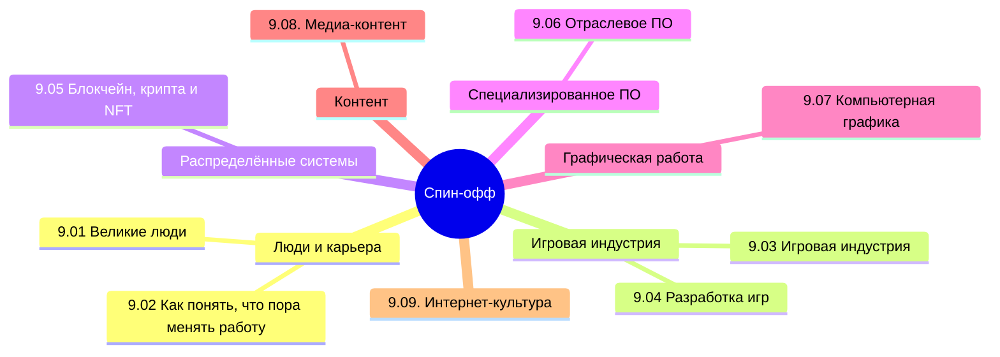

  ОБЯЗАТЕЛЬНО
  ДЛЯ НОВИЧКОВ

## О разделе

Что ж, я думаю, это финальная книга из цикла, которая не является обязательной, но может быть интересной для энтузиастов, к тому же может существенно повысить знания. Здесь включено всё то, что не вошло в другие книги из-за своих спецификаций.

Вообще, лучше воспользуйтесь содержанием или перейдите к Базе знаний. Но для удобства, я размещу здесь ссылки на основные главы раздела:

## Великие люди

<ul>
  <li>
  <ul>
  Великие люди
  <li><a href="/encyclopedia/Спин-офф/9.01.%20Великие%20люди/1">9.01. Великие люди</a></li>
  <li><a href="/encyclopedia/Спин-офф/9.01.%20Великие%20люди/2">9.01. Итоги</a></li>
  <li><a href="/encyclopedia/Спин-офф/9.01.%20Великие%20люди/3">9.01. Чек-лист самопроверки</a></li>
  </ul>
  </li>
  
</ul>

## Как понять, что пора менять работу

<ul>
  
  <li>
  <ul>
  Как понять, что пора менять работу
  <li><a href="/encyclopedia/Спин-офф/9.02.%20Как%20понять,%20что%20пора%20менять%20работу/1">9.02. Как понять, что пора менять работу</a></li>
  <li><a href="/encyclopedia/Спин-офф/9.02.%20Как%20понять,%20что%20пора%20менять%20работу/2">9.02. Итоги</a></li>
  <li><a href="/encyclopedia/Спин-офф/9.02.%20Как%20понять,%20что%20пора%20менять%20работу/3">9.02. Чек-лист самопроверки</a></li>
  </ul>
  </li>
  
</ul>

## Игровая индустрия

<ul>
  
  <li>
  <ul>
  Игровая индустрия
  <li><a href="/encyclopedia/Спин-офф/9.03.%20Игровая%20индустрия/1">9.03. Игровая индустрия</a></li>
  <li><a href="/encyclopedia/Спин-офф/9.03.%20Игровая%20индустрия/11">9.03. Кризис игровой индустрии</a></li>
  <li><a href="/encyclopedia/Спин-офф/9.03.%20Игровая%20индустрия/111">9.03. Студии и независимые разработчики</a></li>
  <li><a href="/encyclopedia/Спин-офф/9.03.%20Игровая%20индустрия/112">9.03. Издатели игр</a></li>
  <li><a href="/encyclopedia/Спин-офф/9.03.%20Игровая%20индустрия/113">9.03. Цифровые магазины и физические дистрибьюторы</a></li>
  <li><a href="/encyclopedia/Спин-офф/9.03.%20Игровая%20индустрия/114">9.03. Игровые платформы</a></li>
  <li><a href="/encyclopedia/Спин-офф/9.03.%20Игровая%20индустрия/1141">9.03. PC</a></li>
  <li><a href="/encyclopedia/Спин-офф/9.03.%20Игровая%20индустрия/1142">9.03. Мобильные игры</a></li>
  <li><a href="/encyclopedia/Спин-офф/9.03.%20Игровая%20индустрия/1143">9.03. Игровые консоли</a></li>
  <li><a href="/encyclopedia/Спин-офф/9.03.%20Игровая%20индустрия/11431">9.03. Как устроен Xbox Series S и Series X</a></li>
  <li><a href="/encyclopedia/Спин-офф/9.03.%20Игровая%20индустрия/11432">9.03. Как устроен Steam Deck и Steam Machine</a></li>
  <li><a href="/encyclopedia/Спин-офф/9.03.%20Игровая%20индустрия/11433">9.03. Как устроена Nintendo Switch</a></li>
  <li><a href="/encyclopedia/Спин-офф/9.03.%20Игровая%20индустрия/11434">9.03. Как устроена Playstation 5</a></li>
  <li><a href="/encyclopedia/Спин-офф/9.03.%20Игровая%20индустрия/115">9.03. Виртуальная реальность</a></li>
  <li><a href="/encyclopedia/Спин-офф/9.03.%20Игровая%20индустрия/116">9.03. Монетизация</a></li>
  <li><a href="/encyclopedia/Спин-офф/9.03.%20Игровая%20индустрия/117">9.03. Аркадные автоматы</a></li>
  <li><a href="/encyclopedia/Спин-офф/9.03.%20Игровая%20индустрия/118">9.03. Сообщество и контент</a></li>
  <li><a href="/encyclopedia/Спин-офф/9.03.%20Игровая%20индустрия/119">9.03. Работа в игровой индустрии</a></li>
  <li><a href="/encyclopedia/Спин-офф/9.03.%20Игровая%20индустрия/120">9.03. Java игры</a></li>
  <li><a href="/encyclopedia/Спин-офф/9.03.%20Игровая%20индустрия/121">9.03. Dendy и NES</a></li>
  <li><a href="/encyclopedia/Спин-офф/9.03.%20Игровая%20индустрия/122">9.03. Sega Mega Drive и Genesis игры</a></li>
  <li><a href="/encyclopedia/Спин-офф/9.03.%20Игровая%20индустрия/123">9.03. Легенды</a></li>
  <li><a href="/encyclopedia/Спин-офф/9.03.%20Игровая%20индустрия/998">9.03. Производительность портативных игровых устройств</a></li>
  <li><a href="/encyclopedia/Спин-офф/9.03.%20Игровая%20индустрия/999">9.03. Итоги</a></li>
  <li><a href="/encyclopedia/Спин-офф/9.03.%20Игровая%20индустрия/999">9.03. Чек-лист самопроверки</a></li>
  </ul>
  </li>
  
</ul>

## Разработка игр

<ul>
  
  <li>
  <ul>
  Разработка игр
  <li><a href="/encyclopedia/Спин-офф/9.04.%20Разработка%20игр/1">9.04. Разработка игр</a></li>
  <li><a href="/encyclopedia/Спин-офф/9.04.%20Разработка%20игр/11">9.04. Дорожная карта геймдева</a></li>
  <li><a href="/encyclopedia/Спин-офф/9.04.%20Разработка%20игр/111">9.04. Команда разработки</a></li>
  <li><a href="/encyclopedia/Спин-офф/9.04.%20Разработка%20игр/112">9.04. Игровой движок</a></li>
  <li><a href="/encyclopedia/Спин-офф/9.04.%20Разработка%20игр/113">9.04. Виды игровых движков</a></li>
  <li><a href="/encyclopedia/Спин-офф/9.04.%20Разработка%20игр/114">9.04. Языки программирования игр</a></li>
  <li><a href="/encyclopedia/Спин-офф/9.04.%20Разработка%20игр/115">9.04. Моделирование</a></li>
  <li><a href="/encyclopedia/Спин-офф/9.04.%20Разработка%20игр/116">9.04. Текстуры</a></li>
  <li><a href="/encyclopedia/Спин-офф/9.04.%20Разработка%20игр/117">9.04. Гейм-дизайн</a></li>
  <li><a href="/encyclopedia/Спин-офф/9.04.%20Разработка%20игр/118">9.04. PC</a></li>
  <li><a href="/encyclopedia/Спин-офф/9.04.%20Разработка%20игр/119">9.04. PlayStation</a></li>
  <li><a href="/encyclopedia/Спин-офф/9.04.%20Разработка%20игр/120">9.04. Nintendo</a></li>
  <li><a href="/encyclopedia/Спин-офф/9.04.%20Разработка%20игр/121">9.04. Xbox</a></li>
  <li><a href="/encyclopedia/Спин-офф/9.04.%20Разработка%20игр/122">9.04. Мобильные игры</a></li>
  <li><a href="/encyclopedia/Спин-офф/9.04.%20Разработка%20игр/123">9.04. Оптимизация игр</a></li>
  <li><a href="/encyclopedia/Спин-офф/9.04.%20Разработка%20игр/124">9.04. Тестирование игр</a></li>
  <li><a href="/encyclopedia/Спин-офф/9.04.%20Разработка%20игр/2">9.04. Разработка на Roblox</a></li>
  <li><a href="/encyclopedia/Спин-офф/9.04.%20Разработка%20игр/201">9.04. Справочник по Roblox</a></li>
  <li><a href="/encyclopedia/Спин-офф/9.04.%20Разработка%20игр/21">9.04. Разработка в Minecraft</a></li>
  <li><a href="/encyclopedia/Спин-офф/9.04.%20Разработка%20игр/3">9.04. Разработка на Unity</a></li>
  <li><a href="/encyclopedia/Спин-офф/9.04.%20Разработка%20игр/301">9.04. Справочник по Unity</a></li>
  <li><a href="/encyclopedia/Спин-офф/9.04.%20Разработка%20игр/401">9.04. Справочник по Unreal Engine</a></li>
  <li><a href="/encyclopedia/Спин-офф/9.04.%20Разработка%20игр/31">9.04. Архитектура гонок</a></li>
  <li><a href="/encyclopedia/Спин-офф/9.04.%20Разработка%20игр/32">9.04. Ритм игры</a></li>
  <li><a href="/encyclopedia/Спин-офф/9.04.%20Разработка%20игр/4">9.04. Unreal Engine</a></li>
  <li><a href="/encyclopedia/Спин-офф/9.04.%20Разработка%20игр/998">9.04. Итоги</a></li>
  <li><a href="/encyclopedia/Спин-офф/9.04.%20Разработка%20игр/999">9.04. Чек-лист самопроверки</a></li>
  </ul>
  </li>
  
</ul>

## Блокчейн, крипта и NFT

<ul>
  
  <li>
  <ul>
  Блокчейн, крипта и NFT
  <li><a href="/encyclopedia/Спин-офф/9.05.%20Блокчейн,%20крипта%20и%20NFT/1">9.05. Блокчейн, крипта и NFT</a></li>
  <li><a href="/encyclopedia/Спин-офф/9.05.%20Блокчейн,%20крипта%20и%20NFT/2">9.05. Итоги</a></li>
  <li><a href="/encyclopedia/Спин-офф/9.05.%20Блокчейн,%20крипта%20и%20NFT/3">9.05. Чек-лист самопроверки</a></li>
  </ul>
  </li>
  
</ul>

## Отраслевое ПО

<ul>
  
  <li>
  <ul>
  Отраслевое ПО
  <li><a href="/encyclopedia/Спин-офф/9.06.%20Отраслевое%20ПО/1">9.06. Отраслевое ПО</a></li>
  <li><a href="/encyclopedia/Спин-офф/9.06.%20Отраслевое%20ПО/11">9.06. Adobe</a></li>
  <li><a href="/encyclopedia/Спин-офф/9.06.%20Отраслевое%20ПО/111">9.06. Справочник по Adobe Photoshop</a></li>
  <li><a href="/encyclopedia/Спин-офф/9.06.%20Отраслевое%20ПО/2">9.06. Итоги</a></li>
  <li><a href="/encyclopedia/Спин-офф/9.06.%20Отраслевое%20ПО/3">9.06. Чек-лист самопроверки</a></li>
  </ul>
  </li>
  
</ul>

## Компьютерная графика

<ul>
  
  <li>
  <ul>
  Компьютерная графика
  <li><a href="/encyclopedia/Спин-офф/9.08.%20Компьютерная%20графика/1">9.08. Компьютерная графика</a></li>
  <li><a href="/encyclopedia/Спин-офф/9.08.%20Компьютерная%20графика/11">9.08. Растровая графика</a></li>
  <li><a href="/encyclopedia/Спин-офф/9.08.%20Компьютерная%20графика/12">9.08. Векторная графика</a></li>
  <li><a href="/encyclopedia/Спин-офф/9.08.%20Компьютерная%20графика/13">9.08. 3D-графика и анимация</a></li>
  <li><a href="/encyclopedia/Спин-офф/9.08.%20Компьютерная%20графика/14">9.08. Алгоритмы растеризации</a></li>
  <li><a href="/encyclopedia/Спин-офф/9.08.%20Компьютерная%20графика/2">9.08. Итоги</a></li>
  <li><a href="/encyclopedia/Спин-офф/9.08.%20Компьютерная%20графика/3">9.08. Чек-лист самопроверки</a></li>
  </ul>
  </li>
  
</ul>

## Медиа-контент

<ul>
  
  <li>
  <ul>
  Медиа-контент
  <li><a href="/encyclopedia/Спин-офф/9.09.%20Медиа-контент/1">9.09. Видео</a></li>
  <li><a href="/encyclopedia/Спин-офф/9.09.%20Медиа-контент/11">9.09. Аудио</a></li>
  <li><a href="/encyclopedia/Спин-офф/9.09.%20Медиа-контент/12">9.09. Онлайн-контент и стриминг</a></li>
  <li><a href="/encyclopedia/Спин-офф/9.09.%20Медиа-контент/13">9.09. Онлайн-кинотеатры</a></li>
  <li><a href="/encyclopedia/Спин-офф/9.09.%20Медиа-контент/2">9.09. Итоги</a></li>
  <li><a href="/encyclopedia/Спин-офф/9.09.%20Медиа-контент/3">9.09. Чек-лист самопроверки</a></li>
  </ul>
  </li>
  
</ul>

## Интернет-культура

<ul>
  
  <li>
  <ul>
  Интернет-культура
  <li><a href="/encyclopedia/Спин-офф/9.10.%20Интернет-культура/1">9.10. Основы интернет-культуры</a></li>
  <li><a href="/encyclopedia/Спин-офф/9.10.%20Интернет-культура/111">9.10. Инфраструктура взаимодействия</a></li>
  <li><a href="/encyclopedia/Спин-офф/9.10.%20Интернет-культура/112">9.10. Пользовательские роли и социальные типы</a></li>
  <li><a href="/encyclopedia/Спин-офф/9.10.%20Интернет-культура/113">9.10. Социальные и этические нормы</a></li>
  <li><a href="/encyclopedia/Спин-офф/9.10.%20Интернет-культура/114">9.10. Экономические и организационные сообщества</a></li>
  <li><a href="/encyclopedia/Спин-офф/9.10.%20Интернет-культура/115">9.10. Маркетинг и манипуляция</a></li>
  <li><a href="/encyclopedia/Спин-офф/9.10.%20Интернет-культура/116">9.10. Культурные артефакты и трансляция</a></li>
  <li><a href="/encyclopedia/Спин-офф/9.10.%20Интернет-культура/117">9.10. Кросс-контекстные явления</a></li>
  <li><a href="/encyclopedia/Спин-офф/9.10.%20Интернет-культура/118">9.10. Меметика</a></li>
  <li><a href="/encyclopedia/Спин-офф/9.10.%20Интернет-культура/998">9.10. Итоги</a></li>
  <li><a href="/encyclopedia/Спин-офф/9.10.%20Интернет-культура/999">9.10. Итоговый чек-лист</a></li>
  </ul>
  </li>
  
</ul>

Собственно, начнём мы с небольших оступлений для повышения знаний, выполнив обзор великих людей в сфере IT - это основоположники технологий, создатели языков, инженеры, игроделы, предприниматели и прочие важные личности, которым мы должны быть благодарны.

У профессионала возникают проблемы. Всегда. Поэтому мы разберём психологический аспект работы "айтишника", изучим явления выгорания, усталости, желания сменить работы, токсичность и всё в таком духе. Это важная тема, которую поначалу недооценивают - но именно поэтому люди "сгорают" и убегают из сферы. Вы же не хотите всё бросить? Вот я хочу вас поддержать.

Игровая индустрия - это тема, которая интересна не каждому, но многие питают иллюзии. Первая, которую я раскрою сразу - это то, что в разработке игр платят мало, ниже всех остальных в IT. Игроделов и не так сильно уважают в отрасли, потому что считают это менее серьезной работой. Но действительно ли так всё плохо? А что если вам интересна именно разработка игр, и вы в будущем подарите нам что-то прекрасное? Вот поэтому мы не упустим такой шанс, разберём всю индустрию разработки игр, начиная со студий и издателей, заканчивая всеми платформами, монетизацией, и конечно работой в игровой индустрии.

Геймдев, или разработка видеоигр, это сложная тема, включающая в себя как проектирование, так и работу с игровыми движками, моделированием, текстурированием, оптимизацией и тестированием на разных игровых платформах. Здесь придётся помучаться, ведь там целая наука гейм-дизайна.
Затем мы прихватим ещё две отрасли - ИИ и крипта.

Касательно блокчейна, криптографии и NFT, нам понадобится изучить криптоосновы, которые приведут нас к пониманию работы криптовалют, шифрования, токенов, смарт-карт и прочего в этой сфере. Это более нишевая сфера, но всё же она IT.

Последнее, чем мы займемся - это нейросети. Сейчас на них тренд, и я расскажу о них то, что нужно знать - история, что такое ИИ, нейроны, нейронные сети, машинное обучение. Мы научимся создавать свои нейросети и подключать их к своим программам. У ИИ есть множество проблем, так что и без них не обойтись.

---
