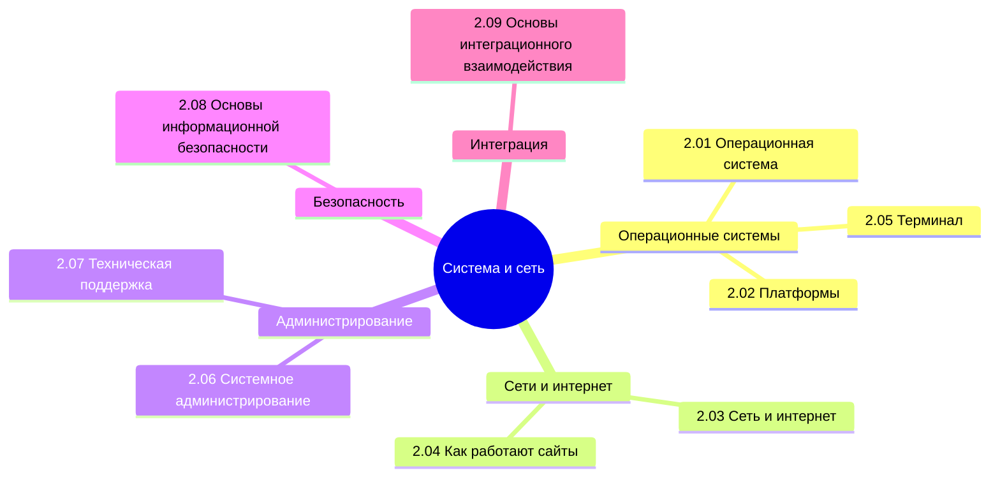

  ОБЯЗАТЕЛЬНО
  ДЛЯ НОВИЧКОВ

---

## О разделе

Приветствую! Надеюсь, вы ознакомились с первыми шагами и готовы продвигаться дальше. Если поначалу мы только разгонялись, с целью разобраться, как вообще всё устроено - от устройства компьютера до особенностей ведения бизнеса в сфере информационных технологий, то сейчас мы уже считаемся продвинутыми пользователями. Теперь мы переходим к более сложным и специализированным темам, и поэтому придётся думать и работать, и конечно много учить.

Теперь пора приступить к системной части.

Вообще, лучше воспользуйтесь содержанием или перейдите к Базе знаний. Но для удобства, я размещу здесь ссылки на основные главы раздела:

---

## Операционная система

- [2.01. Операционная система](/encyclopedia/Система%20и%20сеть/2.01.%20Операционная%20система/1)
- [2.01. Виды операционных систем](/encyclopedia/Система%20и%20сеть/2.01.%20Операционная%20система/2)
- [2.01. Основы UNIX](/encyclopedia/Система%20и%20сеть/2.01.%20Операционная%20система/211)
- [2.01. Ядро ОС](/encyclopedia/Система%20и%20сеть/2.01.%20Операционная%20система/3)
- [2.01. Windows](/encyclopedia/Система%20и%20сеть/2.01.%20Операционная%20система/4)
- [2.01. Справочник по Windows 11](/encyclopedia/Система%20и%20сеть/2.01.%20Операционная%20система/41)
- [2.01. Устройство файловой системы Windows](/encyclopedia/Система%20и%20сеть/2.01.%20Операционная%20система/411)
- [2.01. Иероглифы в Windows](/encyclopedia/Система%20и%20сеть/2.01.%20Операционная%20система/412)
- [2.01. Windows или Linux](/encyclopedia/Система%20и%20сеть/2.01.%20Операционная%20система/413)
- [2.01. Linux](/encyclopedia/Система%20и%20сеть/2.01.%20Операционная%20система/5)
- [2.01. Справочник по Linux](/encyclopedia/Система%20и%20сеть/2.01.%20Операционная%20система/51)
- [2.01. Дескриптор процесса в Linux](/encyclopedia/Система%20и%20сеть/2.01.%20Операционная%20система/5111)
- [2.01. Управление памятью в Linux](/encyclopedia/Система%20и%20сеть/2.01.%20Операционная%20система/5112)
- [2.01. Процесс загрузки Linux](/encyclopedia/Система%20и%20сеть/2.01.%20Операционная%20система/5113)
- [2.01. Жизненный цикл процесса в Linux](/encyclopedia/Система%20и%20сеть/2.01.%20Операционная%20система/5114)
- [2.01. Управление процессами в Linux](/encyclopedia/Система%20и%20сеть/2.01.%20Операционная%20система/5115)
- [2.01. Распределение памяти](/encyclopedia/Система%20и%20сеть/2.01.%20Операционная%20система/5116)
- [2.01. Планирование процессора](/encyclopedia/Система%20и%20сеть/2.01.%20Операционная%20система/5117)
- [2.01. Гонки и критические секции](/encyclopedia/Система%20и%20сеть/2.01.%20Операционная%20система/5118)
- [2.01. Тупики (deadlock)](/encyclopedia/Система%20и%20сеть/2.01.%20Операционная%20система/5119)
- [2.01. Подсистема ввода-вывода](/encyclopedia/Система%20и%20сеть/2.01.%20Операционная%20система/5120)
- [2.01. Алгоритмы замещения страниц](/encyclopedia/Система%20и%20сеть/2.01.%20Операционная%20система/5121)
- [2.01. История операционных систем](/encyclopedia/Система%20и%20сеть/2.01.%20Операционная%20система/9)
- [2.01. Требования к ОС](/encyclopedia/Система%20и%20сеть/2.01.%20Операционная%20система/10)
- [2.01. macOS](/encyclopedia/Система%20и%20сеть/2.01.%20Операционная%20система/6)
- [2.01. iOS](/encyclopedia/Система%20и%20сеть/2.01.%20Операционная%20система/7)
- [2.01. Справочник по iOS](/encyclopedia/Система%20и%20сеть/2.01.%20Операционная%20система/71)
- [2.01. Android](/encyclopedia/Система%20и%20сеть/2.01.%20Операционная%20система/8)
- [2.01. Справочник по Android](/encyclopedia/Система%20и%20сеть/2.01.%20Операционная%20система/81)
- [2.01. Итоги](/encyclopedia/Система%20и%20сеть/2.01.%20Операционная%20система/98)
- [2.01. Чек-лист самопроверки](/encyclopedia/Система%20и%20сеть/2.01.%20Операционная%20система/99)

---

## Платформы

- [2.02. Платформы](/encyclopedia/Система%20и%20сеть/2.02.%20Платформы/1)
- [2.02. Сервер](/encyclopedia/Система%20и%20сеть/2.02.%20Платформы/111)
- [2.02. Виртуализация](/encyclopedia/Система%20и%20сеть/2.02.%20Платформы/2)
- [2.02. Платформы программных продуктов](/encyclopedia/Система%20и%20сеть/2.02.%20Платформы/3)
- [2.02. Социальные сети](/encyclopedia/Система%20и%20сеть/2.02.%20Платформы/311)
- [2.02. Системные требования и как их читать](/encyclopedia/Система%20и%20сеть/2.02.%20Платформы/312)
- [2.02. Итоги](/encyclopedia/Система%20и%20сеть/2.02.%20Платформы/98)
- [2.02. Чек-лист самопроверки](/encyclopedia/Система%20и%20сеть/2.02.%20Платформы/99)

---

## Сеть и интернет

- [2.03. Что такое сеть и интернет](/encyclopedia/Система%20и%20сеть/2.03.%20Сеть%20и%20интернет/1)
- [2.03. История сетевых технологий](/encyclopedia/Система%20и%20сеть/2.03.%20Сеть%20и%20интернет/2)
- [2.03. Сетевые устройства](/encyclopedia/Система%20и%20сеть/2.03.%20Сеть%20и%20интернет/21)
- [2.03. Как соединены устройства в глобальной сети](/encyclopedia/Система%20и%20сеть/2.03.%20Сеть%20и%20интернет/211)
- [2.03. Глобальная доставка контента](/encyclopedia/Система%20и%20сеть/2.03.%20Сеть%20и%20интернет/212)
- [2.03. URL URI URN](/encyclopedia/Система%20и%20сеть/2.03.%20Сеть%20и%20интернет/3)
- [2.03. Протоколы, порты и процесс соединения](/encyclopedia/Система%20и%20сеть/2.03.%20Сеть%20и%20интернет/4)
- [2.03. Основы IP-адресации](/encyclopedia/Система%20и%20сеть/2.03.%20Сеть%20и%20интернет/41)
- [2.03. CORS](/encyclopedia/Система%20и%20сеть/2.03.%20Сеть%20и%20интернет/411)
- [2.03. Что происходит при загрузке сайта](/encyclopedia/Система%20и%20сеть/2.03.%20Сеть%20и%20интернет/5)
- [2.03. Домен и хостинг](/encyclopedia/Система%20и%20сеть/2.03.%20Сеть%20и%20интернет/511)
- [2.03. DNS](/encyclopedia/Система%20и%20сеть/2.03.%20Сеть%20и%20интернет/6)
- [2.03. Интернет-провайдер](/encyclopedia/Система%20и%20сеть/2.03.%20Сеть%20и%20интернет/61)
- [2.03. Справочник по HTTP](/encyclopedia/Система%20и%20сеть/2.03.%20Сеть%20и%20интернет/611)
- [2.03. Скорость интернета](/encyclopedia/Система%20и%20сеть/2.03.%20Сеть%20и%20интернет/612)
- [2.03. Виртуальная частная сеть](/encyclopedia/Система%20и%20сеть/2.03.%20Сеть%20и%20интернет/613)
- [2.03. Прокси-серверы](/encyclopedia/Система%20и%20сеть/2.03.%20Сеть%20и%20интернет/614)
- [2.03. Сетевой трафик](/encyclopedia/Система%20и%20сеть/2.03.%20Сеть%20и%20интернет/615)
- [2.03. Защита сети](/encyclopedia/Система%20и%20сеть/2.03.%20Сеть%20и%20интернет/616)
- [2.03. Cookie](/encyclopedia/Система%20и%20сеть/2.03.%20Сеть%20и%20интернет/7)
- [2.03. Беспроводные сети](/encyclopedia/Система%20и%20сеть/2.03.%20Сеть%20и%20интернет/71)
- [2.03. Прочие технологии сети](/encyclopedia/Система%20и%20сеть/2.03.%20Сеть%20и%20интернет/8)
- [2.03. Государственный контроль за Интернетом](/encyclopedia/Система%20и%20сеть/2.03.%20Сеть%20и%20интернет/91)
- [2.03. Итоги](/encyclopedia/Система%20и%20сеть/2.03.%20Сеть%20и%20интернет/98)
- [2.03. Чек-лист самопроверки](/encyclopedia/Система%20и%20сеть/2.03.%20Сеть%20и%20интернет/99)

---

## Как работают сайты и веб-сайты

- [2.04. Сайты и веб-сайты](/encyclopedia/Система%20и%20сеть/2.04.%20Как%20работают%20сайты%20и%20веб-сайты/1)
- [2.04. Адресная строка](/encyclopedia/Система%20и%20сеть/2.04.%20Как%20работают%20сайты%20и%20веб-сайты/11)
- [2.04. Веб-приложение](/encyclopedia/Система%20и%20сеть/2.04.%20Как%20работают%20сайты%20и%20веб-сайты/111)
- [2.04. Закладки и вкладки](/encyclopedia/Система%20и%20сеть/2.04.%20Как%20работают%20сайты%20и%20веб-сайты/1111)
- [2.04. Внутренние ошибки браузера](/encyclopedia/Система%20и%20сеть/2.04.%20Как%20работают%20сайты%20и%20веб-сайты/1112)
- [2.04. Веб-серверы](/encyclopedia/Система%20и%20сеть/2.04.%20Как%20работают%20сайты%20и%20веб-сайты/112)
- [2.04. Конструкторы веб-сайтов](/encyclopedia/Система%20и%20сеть/2.04.%20Как%20работают%20сайты%20и%20веб-сайты/113)
- [2.04. Архитектурные и производственные особенности веб-приложений](/encyclopedia/Система%20и%20сеть/2.04.%20Как%20работают%20сайты%20и%20веб-сайты/114)
- [2.04. Фоновые процессы и работа без интернета](/encyclopedia/Система%20и%20сеть/2.04.%20Как%20работают%20сайты%20и%20веб-сайты/115)
- [2.04. Хранение данных веб-приложений](/encyclopedia/Система%20и%20сеть/2.04.%20Как%20работают%20сайты%20и%20веб-сайты/116)
- [2.04. Push-рассылка и уведомления](/encyclopedia/Система%20и%20сеть/2.04.%20Как%20работают%20сайты%20и%20веб-сайты/117)
- [2.04. SEO-оптимизация](/encyclopedia/Система%20и%20сеть/2.04.%20Как%20работают%20сайты%20и%20веб-сайты/118)
- [2.04. Рекомендации и предпочтения](/encyclopedia/Система%20и%20сеть/2.04.%20Как%20работают%20сайты%20и%20веб-сайты/119)
- [2.04. Дизайн сайтов](/encyclopedia/Система%20и%20сеть/2.04.%20Как%20работают%20сайты%20и%20веб-сайты/2)
- [2.04. Реклама](/encyclopedia/Система%20и%20сеть/2.04.%20Как%20работают%20сайты%20и%20веб-сайты/3)
- [2.04. Итоги](/encyclopedia/Система%20и%20сеть/2.04.%20Как%20работают%20сайты%20и%20веб-сайты/998)
- [2.04. Чек-лист самопроверки](/encyclopedia/Система%20и%20сеть/2.04.%20Как%20работают%20сайты%20и%20веб-сайты/999)

---

## Терминал

- [2.05. Терминал](/encyclopedia/Система%20и%20сеть/2.05.%20Терминал/1)
- [2.05. Скрипты в Unix](/encyclopedia/Система%20и%20сеть/2.05.%20Терминал/111)
- [2.05. Скрипты в среде Windows на PowerShell](/encyclopedia/Система%20и%20сеть/2.05.%20Терминал/112)
- [2.05. Итоги](/encyclopedia/Система%20и%20сеть/2.05.%20Терминал/2)
- [2.05. Чек-лист самопроверки](/encyclopedia/Система%20и%20сеть/2.05.%20Терминал/3)

---

## Системное администрирование

- [2.06. Системное администрирование](/encyclopedia/Система%20и%20сеть/2.06.%20Системное%20администрирование/1)
- [2.06. Установка операционной системы](/encyclopedia/Система%20и%20сеть/2.06.%20Системное%20администрирование/2)
- [2.06. Инфраструктура](/encyclopedia/Система%20и%20сеть/2.06.%20Системное%20администрирование/3)
- [2.06. Настройка сервера](/encyclopedia/Система%20и%20сеть/2.06.%20Системное%20администрирование/4)
- [2.06. Настройка компьютеров](/encyclopedia/Система%20и%20сеть/2.06.%20Системное%20администрирование/5)
- [2.06. Сеть и соединения](/encyclopedia/Система%20и%20сеть/2.06.%20Системное%20администрирование/6)
- [2.06. Домашняя сеть](/encyclopedia/Система%20и%20сеть/2.06.%20Системное%20администрирование/61)
- [2.06. NAT и проброс портов](/encyclopedia/Система%20и%20сеть/2.06.%20Системное%20администрирование/7)
- [2.06. Планирование задач](/encyclopedia/Система%20и%20сеть/2.06.%20Системное%20администрирование/8)
- [2.06. Обработка ошибок](/encyclopedia/Система%20и%20сеть/2.06.%20Системное%20администрирование/9)
- [2.06. Данные и СУБД](/encyclopedia/Система%20и%20сеть/2.06.%20Системное%20администрирование/91)
- [2.06. Метрика, мониторинг и логирование](/encyclopedia/Система%20и%20сеть/2.06.%20Системное%20администрирование/92)
- [2.06. Работа с Linux](/encyclopedia/Система%20и%20сеть/2.06.%20Системное%20администрирование/93)
- [2.06. Итоги](/encyclopedia/Система%20и%20сеть/2.06.%20Системное%20администрирование/98)
- [2.06. Чек-лист самопроверки](/encyclopedia/Система%20и%20сеть/2.06.%20Системное%20администрирование/99)

---

## Техническая поддержка

- [2.07. Понятие и задачи техподдержки](/encyclopedia/Система%20и%20сеть/2.07.%20Техническая%20поддержка/1)
- [2.07. История техподдержки](/encyclopedia/Система%20и%20сеть/2.07.%20Техническая%20поддержка/111)
- [2.07. Обработка обращений](/encyclopedia/Система%20и%20сеть/2.07.%20Техническая%20поддержка/112)
- [2.07. Разбор проблем](/encyclopedia/Система%20и%20сеть/2.07.%20Техническая%20поддержка/113)
- [2.07. Базы решений и типовые запросы](/encyclopedia/Система%20и%20сеть/2.07.%20Техническая%20поддержка/114)
- [2.07. Управление обращениями](/encyclopedia/Система%20и%20сеть/2.07.%20Техническая%20поддержка/115)
- [2.07. Линии (уровни) техподдержки](/encyclopedia/Система%20и%20сеть/2.07.%20Техническая%20поддержка/116)
- [2.07. Оценка обслуживания](/encyclopedia/Система%20и%20сеть/2.07.%20Техническая%20поддержка/117)
- [2.07. ITSM](/encyclopedia/Система%20и%20сеть/2.07.%20Техническая%20поддержка/118)
- [2.07. Итоги](/encyclopedia/Система%20и%20сеть/2.07.%20Техническая%20поддержка/998)
- [2.07. Чек-лист самопроверки](/encyclopedia/Система%20и%20сеть/2.07.%20Техническая%20поддержка/999)

---

## Основы информационной безопасности

- [2.08. Основы информационной безопасности](/encyclopedia/Система%20и%20сеть/2.08.%20Основы%20информационной%20безопасности/1)
- [2.08. Аутентификация и авторизация](/encyclopedia/Система%20и%20сеть/2.08.%20Основы%20информационной%20безопасности/111)
- [2.08. Лечение компьютера от вирусов](/encyclopedia/Система%20и%20сеть/2.08.%20Основы%20информационной%20безопасности/112)
- [2.08. Почему нельзя подключаться к открытым WiFi](/encyclopedia/Система%20и%20сеть/2.08.%20Основы%20информационной%20безопасности/113)
- [2.08. Как устроены пароли](/encyclopedia/Система%20и%20сеть/2.08.%20Основы%20информационной%20безопасности/114)
- [2.08. Файерволлы](/encyclopedia/Система%20и%20сеть/2.08.%20Основы%20информационной%20безопасности/115)
- [2.08. Шифрование и SSH](/encyclopedia/Система%20и%20сеть/2.08.%20Основы%20информационной%20безопасности/116)
- [2.08. Итоги](/encyclopedia/Система%20и%20сеть/2.08.%20Основы%20информационной%20безопасности/2)
- [2.08. Чек-лист самопроверки](/encyclopedia/Система%20и%20сеть/2.08.%20Основы%20информационной%20безопасности/3)

---

## Основы интеграционного взаимодействия

- [2.09. Интеграция](/encyclopedia/Система%20и%20сеть/2.09.%20Основы%20интеграционного%20взаимодействия/1)
- [2.09. Виды взаимодействия](/encyclopedia/Система%20и%20сеть/2.09.%20Основы%20интеграционного%20взаимодействия/111)
- [2.09. Интеграционный поток](/encyclopedia/Система%20и%20сеть/2.09.%20Основы%20интеграционного%20взаимодействия/112)
- [2.09. Интеграционная авторизация](/encyclopedia/Система%20и%20сеть/2.09.%20Основы%20интеграционного%20взаимодействия/1121)
- [2.09. Сессия](/encyclopedia/Система%20и%20сеть/2.09.%20Основы%20интеграционного%20взаимодействия/113)
- [2.09. История интеграций](/encyclopedia/Система%20и%20сеть/2.09.%20Основы%20интеграционного%20взаимодействия/114)
- [2.09. Веб-сервисы](/encyclopedia/Система%20и%20сеть/2.09.%20Основы%20интеграционного%20взаимодействия/115)
- [2.09. Запрос-ответ](/encyclopedia/Система%20и%20сеть/2.09.%20Основы%20интеграционного%20взаимодействия/116)
- [2.09. API](/encyclopedia/Система%20и%20сеть/2.09.%20Основы%20интеграционного%20взаимодействия/117)
- [2.09. HTTP](/encyclopedia/Система%20и%20сеть/2.09.%20Основы%20интеграционного%20взаимодействия/118)
- [2.09. Асинхронная коммуникация](/encyclopedia/Система%20и%20сеть/2.09.%20Основы%20интеграционного%20взаимодействия/119)
- [2.09. Реактивная коммуникация](/encyclopedia/Система%20и%20сеть/2.09.%20Основы%20интеграционного%20взаимодействия/120)
- [2.09. Брокеры сообщений](/encyclopedia/Система%20и%20сеть/2.09.%20Основы%20интеграционного%20взаимодействия/121)
- [2.09. RabbitMQ](/encyclopedia/Система%20и%20сеть/2.09.%20Основы%20интеграционного%20взаимодействия/122)
- [2.09. Kafka](/encyclopedia/Система%20и%20сеть/2.09.%20Основы%20интеграционного%20взаимодействия/123)
- [2.09. Другие особенности](/encyclopedia/Система%20и%20сеть/2.09.%20Основы%20интеграционного%20взаимодействия/124)
- [2.09. Реализация интеграции](/encyclopedia/Система%20и%20сеть/2.09.%20Основы%20интеграционного%20взаимодействия/125)
- [2.09. SOAP](/encyclopedia/Система%20и%20сеть/2.09.%20Основы%20интеграционного%20взаимодействия/126)
- [2.09. Прочие фреймворки](/encyclopedia/Система%20и%20сеть/2.09.%20Основы%20интеграционного%20взаимодействия/127)
- [2.09. Руководство по работе с Postman и curl](/encyclopedia/Система%20и%20сеть/2.09.%20Основы%20интеграционного%20взаимодействия/2)
- [2.09. Итоги](/encyclopedia/Система%20и%20сеть/2.09.%20Основы%20интеграционного%20взаимодействия/998)
- [2.09. Чек-лист самопроверки](/encyclopedia/Система%20и%20сеть/2.09.%20Основы%20интеграционного%20взаимодействия/999)

---

## Железо

- [2.10. Аппаратное обеспечение](/encyclopedia/Система%20и%20сеть/2.10.%20Железо/1)
- [2.10. Архитектура фон Неймана](/encyclopedia/Система%20и%20сеть/2.10.%20Железо/11)
- [2.10. Контроллеры](/encyclopedia/Система%20и%20сеть/2.10.%20Железо/111)
- [2.10. Встраиваемые системы](/encyclopedia/Система%20и%20сеть/2.10.%20Железо/112)
- [2.10. Программируемое устройство](/encyclopedia/Система%20и%20сеть/2.10.%20Железо/113)
- [2.10. Программатор](/encyclopedia/Система%20и%20сеть/2.10.%20Железо/114)
- [2.10. Микросхемы и чипы](/encyclopedia/Система%20и%20сеть/2.10.%20Железо/115)
- [2.10. Компоненты микросхем](/encyclopedia/Система%20и%20сеть/2.10.%20Железо/116)
- [2.10. Как программируют устройства](/encyclopedia/Система%20и%20сеть/2.10.%20Железо/117)
- [2.10. Протоколы автоматизации зданий](/encyclopedia/Система%20и%20сеть/2.10.%20Железо/118)
- [2.10. Работа с беспроводными технологиями](/encyclopedia/Система%20и%20сеть/2.10.%20Железо/119)
- [2.10. Modbus](/encyclopedia/Система%20и%20сеть/2.10.%20Железо/120)
- [2.10. Как система даёт сигнал на дисплей для отображения пикселя](/encyclopedia/Система%20и%20сеть/2.10.%20Железо/2)
- [2.10. Дата-центр](/encyclopedia/Система%20и%20сеть/2.10.%20Железо/3)

Вообще, что такое система? Попробуйте себе ответить на этот вопрос, что вам пришло в голову? Windows? Android? Какая-то платформа или архитектура? Под это понятие можно подобрать почти всё, ведь система это множество элементов, находящихся в связях друг с другом. А всё вокруг нас состоит из этих элементов.

Есть даже целое направление методологии, рассматривающей любой объект как систему - это системный подход. Технически да, возьмите что угодно - это будет целостный комплекс взаимосвязанных элементов, и вопрос лишь в том, какой объект брать.

В IT система сильно зависит от контекста, но суть всегда одна - это некая совокупность элементов, действующих вместе как одно целое и выполняющих этим определённую функцию.

Системой может быть некая платформа, включающая в себе множество модулей, программ, приложений, взаимодействующих между собой, и всё целиком служит какой-то единой цели. Фактически, любая система на самом деле нужна, чтобы кто-то зарабатывал деньги, ведь это основа экономики. Разработчик не возьмётся за разработку, если ему не нужны деньги, заказчик не будет платить, если ему не нужны ещё большие деньги. И операционная система тоже кому-то приносит прибыль, и это техногиганты.

Вроде бы логично. Но есть такое явление, как Linux.

Обычно большинство систем предоставляются в пользование бесплатно лишь в образовательных целях. Но ведь они позволяют заработать денежные средства, путем использования операционной системы как некой платформы для разработки или эксплуатации уже разработанных программ! И именно поэтому создатели зачастую считают как-то вроде "не-не, если ты зарабатываешь, то будь добр делиться с нами", и коммерческое использование ограничивается. Однако Linux (как и множество других открытых решений) изменили мир, создав категорию свободного и открытого программного обеспечения с общедоступными (открытыми) исходными кодами. Сейчас нам уже не кажется это чем-то новым или необычным, но это меняет всё.
И прежде, чем мы продолжим погружение, давайте разберём такой вид информационных систем, как операционные системы - каких они бывают видов, какие особенности имеет каждая. Кроме этого, понадобится изучить терминал (консоль), чтобы понимать, как она запускается, и чем может пригодится пользователю.

Потом нам понадобится изучить платформы, которые тоже представляют собой некую систему. И после этого приступим к самой важной части - сети.
Мир уже привык к тому, что мы все соединены и обладаем круглосуточным и бесперебойным доступом к сети. И когда отключают интернет (технические сбои или неуплата), или блокируется доступ к какому-то сервису, то начинается паника, которая удивляет, наводя мысли о том, что мы абсолютно и полностью зависимы от интернет-соединения. Теперь же нам понадобится разобраться в сетях, изучив протоколы, порты, особенности процессов соединений. Нужно понять, как работает это всё в совокупности, и нам нельзя здесь пробегаться поверхностно. Например, знаете ли вы что такое DNS, SSH, Cookie и WebSocket? Если нет, то изучение критично - иначе потом будем спотыкаться.

После изучения основ сетевых соединений важно рассмотреть особенности работы сайтов и веб-приложений. Думаю, всем интересно узнать, как же оно всё устроено - структура и состав сайта, этапы создания сайта. Важно понимать, что ещё мы не погружаемся в HTML/CSS/JavaScript, а изучаем устройство. Причем, придётся изучить и основы интеграционного взаимодействия, чтобы понимать, как приложения общаются друг с другом - а это уже API, веб-сервисы, и многое другое.

Но самое вкусное оставим "технарям". Здесь база системного администрирования (установки, настройки, инфраструктура, сервера и компьютеры и прочие тонкости магии админа), техническая поддержка и основы информационной безопасности. Будьте внимательны, и старайтесь понять всё, так как это лишь начало нашего сложного технического пути.
---
