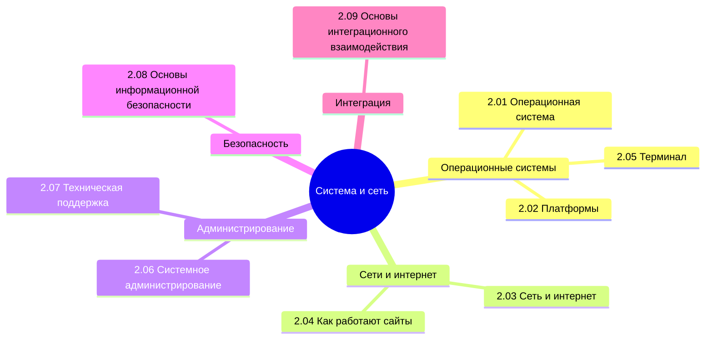

  ОБЯЗАТЕЛЬНО
  ДЛЯ НОВИЧКОВ

---

## О разделе

Приветствую! Надеюсь, вы ознакомились с первыми шагами и готовы продвигаться дальше. Если поначалу мы только разгонялись, с целью разобраться, как вообще всё устроено - от устройства компьютера до особенностей ведения бизнеса в сфере информационных технологий, то сейчас мы уже считаемся продвинутыми пользователями. Теперь мы переходим к более сложным и специализированным темам, и поэтому придётся думать и работать, и конечно много учить.

Теперь пора приступить к системной части.

Вообще, лучше воспользуйтесь содержанием или перейдите к Базе знаний. Но для удобства, я размещу здесь ссылки на основные главы раздела:

---

## Операционная система

<ul class="it-toc-articles">
  <li><a href="/encyclopedia/2-system-network/2-01-operatsionnaya-sistema/1">2.01. Операционные системы</a></li>
  <li><a href="/encyclopedia/2-system-network/2-01-operatsionnaya-sistema/2">2.01. Классификация операционных систем</a></li>
  <li><a href="/encyclopedia/2-system-network/2-01-operatsionnaya-sistema/3">2.01. Ядро операционной системы</a></li>
  <li><a href="/encyclopedia/2-system-network/2-01-operatsionnaya-sistema/4">2.01. Windows</a></li>
  <li><a href="/encyclopedia/2-system-network/2-01-operatsionnaya-sistema/5">2.01. Linux</a></li>
  <li><a href="/encyclopedia/2-system-network/2-01-operatsionnaya-sistema/6">2.01. macOS</a></li>
  <li><a href="/encyclopedia/2-system-network/2-01-operatsionnaya-sistema/7">2.01. iOS</a></li>
  <li><a href="/encyclopedia/2-system-network/2-01-operatsionnaya-sistema/8">2.01. Android</a></li>
  <li><a href="/encyclopedia/2-system-network/2-01-operatsionnaya-sistema/9">2.01. История операционных систем</a></li>
  <li><a href="/encyclopedia/2-system-network/2-01-operatsionnaya-sistema/10">2.01. Требования к ОС и подходы к реализации</a></li>
  <li><a href="/encyclopedia/2-system-network/2-01-operatsionnaya-sistema/41">2.01. Справочник по Windows 11</a></li>
  <li><a href="/encyclopedia/2-system-network/2-01-operatsionnaya-sistema/51">2.01. Справочник по Linux</a></li>
  <li><a href="/encyclopedia/2-system-network/2-01-operatsionnaya-sistema/52">2.01. Линус Торвальдс — ядро Linux и Git</a></li>
  <li><a href="/encyclopedia/2-system-network/2-01-operatsionnaya-sistema/71">2.01. Справочник по iOS</a></li>
  <li><a href="/encyclopedia/2-system-network/2-01-operatsionnaya-sistema/81">2.01. Справочник по Android</a></li>
  <li><a href="/encyclopedia/2-system-network/2-01-operatsionnaya-sistema/98">2.01. Операционная система — итоги</a></li>
  <li><a href="/encyclopedia/2-system-network/2-01-operatsionnaya-sistema/99">2.01. Операционная система — чек-лист</a></li>
  <li><a href="/encyclopedia/2-system-network/2-01-operatsionnaya-sistema/211">2.01. Основы UNIX-систем</a></li>
  <li><a href="/encyclopedia/2-system-network/2-01-operatsionnaya-sistema/411">2.01. Устройство файловой системы Windows</a></li>
  <li><a href="/encyclopedia/2-system-network/2-01-operatsionnaya-sistema/412">2.01. Поддержка локализации и символов в Windows</a></li>
  <li><a href="/encyclopedia/2-system-network/2-01-operatsionnaya-sistema/413">2.01. Сравнение Windows и Linux</a></li>
  <li><a href="/encyclopedia/2-system-network/2-01-operatsionnaya-sistema/414">2.01. Эмуляция, виртуализация и Wine</a></li>
  <li><a href="/encyclopedia/2-system-network/2-01-operatsionnaya-sistema/415">2.01. Windows 11 — настройка и работа</a></li>
  <li><a href="/encyclopedia/2-system-network/2-01-operatsionnaya-sistema/4111">2.01. Работа памяти в Windows</a></li>
  <li><a href="/encyclopedia/2-system-network/2-01-operatsionnaya-sistema/5111">2.01. Дескрипторы процессов в Linux</a></li>
  <li><a href="/encyclopedia/2-system-network/2-01-operatsionnaya-sistema/5112">2.01. Управление памятью в Linux</a></li>
  <li><a href="/encyclopedia/2-system-network/2-01-operatsionnaya-sistema/5113">2.01. Загрузка операционной системы Linux</a></li>
  <li><a href="/encyclopedia/2-system-network/2-01-operatsionnaya-sistema/5114">2.01. Жизненный цикл процесса в Linux</a></li>
  <li><a href="/encyclopedia/2-system-network/2-01-operatsionnaya-sistema/5115">2.01. Управление процессами в Linux</a></li>
  <li><a href="/encyclopedia/2-system-network/2-01-operatsionnaya-sistema/5116">2.01. Механизмы распределения памяти в ОС</a></li>
  <li><a href="/encyclopedia/2-system-network/2-01-operatsionnaya-sistema/5117">2.01. Планирование процессора — классические алгоритмы</a></li>
  <li><a href="/encyclopedia/2-system-network/2-01-operatsionnaya-sistema/5118">2.01. Гонки, критические секции и разделяемая память</a></li>
  <li><a href="/encyclopedia/2-system-network/2-01-operatsionnaya-sistema/5119">2.01. Тупики (deadlock) и защита от них</a></li>
  <li><a href="/encyclopedia/2-system-network/2-01-operatsionnaya-sistema/5120">2.01. Подсистема ввода-вывода в ОС</a></li>
  <li><a href="/encyclopedia/2-system-network/2-01-operatsionnaya-sistema/5121">2.01. Алгоритмы замещения страниц</a></li>
</ul>

---

## Платформы

<ul class="it-toc-articles">
  <li><a href="/encyclopedia/2-system-network/2-02-platformy/1">2.02. Платформы в IT</a></li>
  <li><a href="/encyclopedia/2-system-network/2-02-platformy/2">2.02. Виртуализация</a></li>
  <li><a href="/encyclopedia/2-system-network/2-02-platformy/3">2.02. Программные платформы</a></li>
  <li><a href="/encyclopedia/2-system-network/2-02-platformy/21">2.02. Инструменты виртуализации</a></li>
  <li><a href="/encyclopedia/2-system-network/2-02-platformy/98">2.02. Платформы — итоги</a></li>
  <li><a href="/encyclopedia/2-system-network/2-02-platformy/99">2.02. Платформы — чек-лист</a></li>
  <li><a href="/encyclopedia/2-system-network/2-02-platformy/111">2.02. Серверные платформы</a></li>
  <li><a href="/encyclopedia/2-system-network/2-02-platformy/311">2.02. Социальные сети</a></li>
  <li><a href="/encyclopedia/2-system-network/2-02-platformy/312">2.02. Системные требования и как их читать</a></li>
  <li><a href="/encyclopedia/2-system-network/2-02-platformy/3001">2.02. Корпоративное ПО</a></li>
  <li><a href="/encyclopedia/2-system-network/2-02-platformy/3002">2.02. Платформенные решения в бизнесе</a></li>
</ul>

---

## Сеть и интернет

<ul class="it-toc-articles">
  <li><a href="/encyclopedia/2-system-network/2-03-set-i-internet/1">2.03. Сеть и интернет - основы и принципы работы</a></li>
  <li><a href="/encyclopedia/2-system-network/2-03-set-i-internet/2">2.03. История развития сетевых технологий</a></li>
  <li><a href="/encyclopedia/2-system-network/2-03-set-i-internet/3">2.03. URL URI URN</a></li>
  <li><a href="/encyclopedia/2-system-network/2-03-set-i-internet/4">2.03. Сетевые протоколы, порты и установка соединения</a></li>
  <li><a href="/encyclopedia/2-system-network/2-03-set-i-internet/5">2.03. Что происходит при загрузке сайта</a></li>
  <li><a href="/encyclopedia/2-system-network/2-03-set-i-internet/6">2.03. DNS - система доменных имён и её работа</a></li>
  <li><a href="/encyclopedia/2-system-network/2-03-set-i-internet/7">2.03. Cookie</a></li>
  <li><a href="/encyclopedia/2-system-network/2-03-set-i-internet/8">2.03. Дополнительные сетевые технологии</a></li>
  <li><a href="/encyclopedia/2-system-network/2-03-set-i-internet/11">2.03. HTTP и HTTPS</a></li>
  <li><a href="/encyclopedia/2-system-network/2-03-set-i-internet/21">2.03. Сетевые устройства - маршрутизаторы, коммутаторы, модемы</a></li>
  <li><a href="/encyclopedia/2-system-network/2-03-set-i-internet/41">2.03. Основы IP-адресации</a></li>
  <li><a href="/encyclopedia/2-system-network/2-03-set-i-internet/42">2.03. Надёжная доставка — от идеи к TCP</a></li>
  <li><a href="/encyclopedia/2-system-network/2-03-set-i-internet/61">2.03. Интернет-провайдер</a></li>
  <li><a href="/encyclopedia/2-system-network/2-03-set-i-internet/71">2.03. Беспроводные сети - Wi-Fi, Bluetooth, LTE</a></li>
  <li><a href="/encyclopedia/2-system-network/2-03-set-i-internet/81">2.03. Как работать с сетью</a></li>
  <li><a href="/encyclopedia/2-system-network/2-03-set-i-internet/91">2.03. Государственное регулирование интернета</a></li>
  <li><a href="/encyclopedia/2-system-network/2-03-set-i-internet/98">2.03. Сеть и интернет — итоги</a></li>
  <li><a href="/encyclopedia/2-system-network/2-03-set-i-internet/99">2.03. Сеть и интернет — чек-лист</a></li>
  <li><a href="/encyclopedia/2-system-network/2-03-set-i-internet/211">2.03. Архитектура глобальной сети</a></li>
  <li><a href="/encyclopedia/2-system-network/2-03-set-i-internet/212">2.03. Глобальная доставка контента - CDN и кэширование</a></li>
  <li><a href="/encyclopedia/2-system-network/2-03-set-i-internet/220">2.03. Ускорение интернета</a></li>
  <li><a href="/encyclopedia/2-system-network/2-03-set-i-internet/404">2.03. Приватность, self-hosting и домашняя сеть</a></li>
  <li><a href="/encyclopedia/2-system-network/2-03-set-i-internet/411">2.03. CORS - механизм междоменных запросов</a></li>
  <li><a href="/encyclopedia/2-system-network/2-03-set-i-internet/421">2.03. TCP — соединение, окно и перегрузка</a></li>
  <li><a href="/encyclopedia/2-system-network/2-03-set-i-internet/505">2.03. Сетевые и системные диагностические утилиты</a></li>
  <li><a href="/encyclopedia/2-system-network/2-03-set-i-internet/511">2.03. Домен и хостинг</a></li>
  <li><a href="/encyclopedia/2-system-network/2-03-set-i-internet/611">2.03. Справочник по HTTP-протоколу</a></li>
  <li><a href="/encyclopedia/2-system-network/2-03-set-i-internet/612">2.03. Измерение и оптимизация скорости интернета</a></li>
  <li><a href="/encyclopedia/2-system-network/2-03-set-i-internet/613">2.03. Виртуальные частные сети (VPN)</a></li>
  <li><a href="/encyclopedia/2-system-network/2-03-set-i-internet/614">2.03. Прокси-серверы</a></li>
  <li><a href="/encyclopedia/2-system-network/2-03-set-i-internet/615">2.03. Анализ и мониторинг сетевого трафика</a></li>
  <li><a href="/encyclopedia/2-system-network/2-03-set-i-internet/616">2.03. Методы защиты компьютерной сети</a></li>
  <li><a href="/encyclopedia/2-system-network/2-03-set-i-internet/617">2.03. Браузерные бенчмарки и производительность</a></li>
  <li><a href="/encyclopedia/2-system-network/2-03-set-i-internet/618">2.03. Справочник по сетевым протоколам и портам</a></li>
  <li><a href="/encyclopedia/2-system-network/2-03-set-i-internet/619">2.03. Справочник по IP-адресам и CIDR</a></li>
  <li><a href="/encyclopedia/2-system-network/2-03-set-i-internet/620">2.03. Настройки сетевых адаптеров в Windows</a></li>
  <li><a href="/encyclopedia/2-system-network/2-03-set-i-internet/2111">2.03. Настройка домашнего роутера</a></li>
</ul>

---

## Веб-сайты и веб-приложения

<ul class="it-toc-articles">
  <li><a href="/encyclopedia/2-system-network/2-04-kak-rabotayut-sayty-i-veb-sayty/1">2.04. Сайты и веб-сайты</a></li>
  <li><a href="/encyclopedia/2-system-network/2-04-kak-rabotayut-sayty-i-veb-sayty/2">2.04. Дизайн веб-интерфейсов</a></li>
  <li><a href="/encyclopedia/2-system-network/2-04-kak-rabotayut-sayty-i-veb-sayty/3">2.04. Рекламные технологии в вебе</a></li>
  <li><a href="/encyclopedia/2-system-network/2-04-kak-rabotayut-sayty-i-veb-sayty/11">2.04. Адресная строка браузера</a></li>
  <li><a href="/encyclopedia/2-system-network/2-04-kak-rabotayut-sayty-i-veb-sayty/111">2.04. Архитектура веб-приложений</a></li>
  <li><a href="/encyclopedia/2-system-network/2-04-kak-rabotayut-sayty-i-veb-sayty/112">2.04. Веб-серверы</a></li>
  <li><a href="/encyclopedia/2-system-network/2-04-kak-rabotayut-sayty-i-veb-sayty/113">2.04. Конструкторы сайтов</a></li>
  <li><a href="/encyclopedia/2-system-network/2-04-kak-rabotayut-sayty-i-veb-sayty/114">2.04. Архитектурные особенности современных веб-приложений</a></li>
  <li><a href="/encyclopedia/2-system-network/2-04-kak-rabotayut-sayty-i-veb-sayty/115">2.04. Фоновая работа и офлайн-режим веб-приложений</a></li>
  <li><a href="/encyclopedia/2-system-network/2-04-kak-rabotayut-sayty-i-veb-sayty/116">2.04. Хранение данных в браузере и на сервере</a></li>
  <li><a href="/encyclopedia/2-system-network/2-04-kak-rabotayut-sayty-i-veb-sayty/117">2.04. Push-уведомления и рассылки</a></li>
  <li><a href="/encyclopedia/2-system-network/2-04-kak-rabotayut-sayty-i-veb-sayty/118">2.04. SEO-оптимизация</a></li>
  <li><a href="/encyclopedia/2-system-network/2-04-kak-rabotayut-sayty-i-veb-sayty/119">2.04. Персонализация и пользовательские предпочтения</a></li>
  <li><a href="/encyclopedia/2-system-network/2-04-kak-rabotayut-sayty-i-veb-sayty/120">2.04. Web API в браузере</a></li>
  <li><a href="/encyclopedia/2-system-network/2-04-kak-rabotayut-sayty-i-veb-sayty/121">2.04. Web API на практике - примеры кода</a></li>
  <li><a href="/encyclopedia/2-system-network/2-04-kak-rabotayut-sayty-i-veb-sayty/122">2.04. Справочник по Tilda</a></li>
  <li><a href="/encyclopedia/2-system-network/2-04-kak-rabotayut-sayty-i-veb-sayty/123">2.04. BB-код — разметка постов на форумах</a></li>
  <li><a href="/encyclopedia/2-system-network/2-04-kak-rabotayut-sayty-i-veb-sayty/124">2.04. История браузера и приватность на клиенте</a></li>
  <li><a href="/encyclopedia/2-system-network/2-04-kak-rabotayut-sayty-i-veb-sayty/125">2.04. Интернет, сайт и HTTP — связь с культурой сети</a></li>
  <li><a href="/encyclopedia/2-system-network/2-04-kak-rabotayut-sayty-i-veb-sayty/127">2.04. Движки браузеров и линейки продуктов</a></li>
  <li><a href="/encyclopedia/2-system-network/2-04-kak-rabotayut-sayty-i-veb-sayty/128">2.04. HTTPS и TLS — шифрование веба</a></li>
  <li><a href="/encyclopedia/2-system-network/2-04-kak-rabotayut-sayty-i-veb-sayty/129">2.04. Polling, Long Polling, SSE и Webhook</a></li>
  <li><a href="/encyclopedia/2-system-network/2-04-kak-rabotayut-sayty-i-veb-sayty/130">2.04. Метрики производительности веб-страницы</a></li>
  <li><a href="/encyclopedia/2-system-network/2-04-kak-rabotayut-sayty-i-veb-sayty/212">2.04. CDN, origin и кэш</a></li>
  <li><a href="/encyclopedia/2-system-network/2-04-kak-rabotayut-sayty-i-veb-sayty/998">2.04. Веб-сайты и веб-приложения — итоги</a></li>
  <li><a href="/encyclopedia/2-system-network/2-04-kak-rabotayut-sayty-i-veb-sayty/999">2.04. Веб-сайты и веб-приложения — чек-лист</a></li>
  <li><a href="/encyclopedia/2-system-network/2-04-kak-rabotayut-sayty-i-veb-sayty/1111">2.04. Управление закладками и вкладками в браузере</a></li>
  <li><a href="/encyclopedia/2-system-network/2-04-kak-rabotayut-sayty-i-veb-sayty/1112">2.04. Обработка внутренних ошибок браузера</a></li>
</ul>

---

## Терминал

<ul class="it-toc-articles">
  <li><a href="/encyclopedia/2-system-network/2-05-terminal/1">2.05. Терминал - интерфейс командной строки</a></li>
  <li><a href="/encyclopedia/2-system-network/2-05-terminal/2">2.05. Терминал — итоги</a></li>
  <li><a href="/encyclopedia/2-system-network/2-05-terminal/3">2.05. Терминал — чек-лист</a></li>
  <li><a href="/encyclopedia/2-system-network/2-05-terminal/11">2.05. Знаки препинания в командной строке</a></li>
  <li><a href="/encyclopedia/2-system-network/2-05-terminal/101">2.05. Основные команды в Linux</a></li>
  <li><a href="/encyclopedia/2-system-network/2-05-terminal/102">2.05. Основные команды Windows</a></li>
  <li><a href="/encyclopedia/2-system-network/2-05-terminal/103">2.05. Сценарии для автоматизации</a></li>
  <li><a href="/encyclopedia/2-system-network/2-05-terminal/104">2.05. Поиск текста в файлах — grep, findstr и Select-String</a></li>
  <li><a href="/encyclopedia/2-system-network/2-05-terminal/111">2.05. Написание скриптов в Unix-системах</a></li>
  <li><a href="/encyclopedia/2-system-network/2-05-terminal/112">2.05. Автоматизация задач в Windows с помощью PowerShell</a></li>
  <li><a href="/encyclopedia/2-system-network/2-05-terminal/114">2.05. Справочник CLI-утилит и исполняемых файлов</a></li>
  <li><a href="/encyclopedia/2-system-network/2-05-terminal/1131">2.05. Работа с PuTTY</a></li>
  <li><a href="/encyclopedia/2-system-network/2-05-terminal/1132">2.05. Утилита make</a></li>
  <li><a href="/encyclopedia/2-system-network/2-05-terminal/1133">2.05. Утилита curl</a></li>
</ul>

---

## Системное администрирование

<ul class="it-toc-articles">
  <li><a href="/encyclopedia/2-system-network/2-06-sistemnoe-administrirovanie/1">2.06. Администрирование</a></li>
  <li><a href="/encyclopedia/2-system-network/2-06-sistemnoe-administrirovanie/2">2.06. Установка и первоначальная настройка ОС</a></li>
  <li><a href="/encyclopedia/2-system-network/2-06-sistemnoe-administrirovanie/3">2.06. ИТ-инфраструктура</a></li>
  <li><a href="/encyclopedia/2-system-network/2-06-sistemnoe-administrirovanie/4">2.06. Настройка и обслуживание серверов</a></li>
  <li><a href="/encyclopedia/2-system-network/2-06-sistemnoe-administrirovanie/5">2.06. Конфигурация рабочих станций</a></li>
  <li><a href="/encyclopedia/2-system-network/2-06-sistemnoe-administrirovanie/6">2.06. Сетевые подключения и диагностика</a></li>
  <li><a href="/encyclopedia/2-system-network/2-06-sistemnoe-administrirovanie/7">2.06. NAT и проброс портов</a></li>
  <li><a href="/encyclopedia/2-system-network/2-06-sistemnoe-administrirovanie/8">2.06. Планирование и автоматизация задач</a></li>
  <li><a href="/encyclopedia/2-system-network/2-06-sistemnoe-administrirovanie/9">2.06. Диагностика и обработка системных ошибок</a></li>
  <li><a href="/encyclopedia/2-system-network/2-06-sistemnoe-administrirovanie/10">2.06. Виртуальные машины, Home Lab и переход на Linux</a></li>
  <li><a href="/encyclopedia/2-system-network/2-06-sistemnoe-administrirovanie/11">2.06. Microsoft PowerToys и утилиты рабочей станции Windows</a></li>
  <li><a href="/encyclopedia/2-system-network/2-06-sistemnoe-administrirovanie/31">2.06. Сетевые аномалии и системные процессы</a></li>
  <li><a href="/encyclopedia/2-system-network/2-06-sistemnoe-administrirovanie/61">2.06. Организация домашней сети</a></li>
  <li><a href="/encyclopedia/2-system-network/2-06-sistemnoe-administrirovanie/62">2.06. Идентичность Microsoft Entra и RBAC</a></li>
  <li><a href="/encyclopedia/2-system-network/2-06-sistemnoe-administrirovanie/63">2.06. Windows Server — начало работы</a></li>
  <li><a href="/encyclopedia/2-system-network/2-06-sistemnoe-administrirovanie/64">2.06. Управление службами в Windows</a></li>
  <li><a href="/encyclopedia/2-system-network/2-06-sistemnoe-administrirovanie/91">2.06. Работа с базами данных в администрировании</a></li>
  <li><a href="/encyclopedia/2-system-network/2-06-sistemnoe-administrirovanie/92">2.06. Мониторинг, метрики и логирование систем</a></li>
  <li><a href="/encyclopedia/2-system-network/2-06-sistemnoe-administrirovanie/93">2.06. Администрирование Linux-систем</a></li>
  <li><a href="/encyclopedia/2-system-network/2-06-sistemnoe-administrirovanie/94">2.06. Полнотекстовый поиск для приложений</a></li>
  <li><a href="/encyclopedia/2-system-network/2-06-sistemnoe-administrirovanie/95">2.06. Windows на рабочей станции — жизненный цикл</a></li>
  <li><a href="/encyclopedia/2-system-network/2-06-sistemnoe-administrirovanie/96">2.06. GNU/Linux — рабочие столы и споры окружений</a></li>
  <li><a href="/encyclopedia/2-system-network/2-06-sistemnoe-administrirovanie/97">2.06. Windows — Store, защита, диспетчер и &quot;сборки&quot;</a></li>
  <li><a href="/encyclopedia/2-system-network/2-06-sistemnoe-administrirovanie/98">2.06. Системное администрирование — итоги</a></li>
  <li><a href="/encyclopedia/2-system-network/2-06-sistemnoe-administrirovanie/99">2.06. Системное администрирование — чек-лист</a></li>
  <li><a href="/encyclopedia/2-system-network/2-06-sistemnoe-administrirovanie/100">2.06. Диагностика производительности Linux</a></li>
  <li><a href="/encyclopedia/2-system-network/2-06-sistemnoe-administrirovanie/101">2.06. Системы аутентификации</a></li>
  <li><a href="/encyclopedia/2-system-network/2-06-sistemnoe-administrirovanie/411">2.06. Групповые политики в Windows</a></li>
</ul>

---

## Практикум Zabbix

<ul class="it-toc-articles">
  <li><a href="/encyclopedia/2-system-network/2-06-sistemnoe-administrirovanie/zabbix-praktikum/1">2.06. Практикум Zabbix — что это и как работает</a></li>
  <li><a href="/encyclopedia/2-system-network/2-06-sistemnoe-administrirovanie/zabbix-praktikum/2">2.06. Практикум Zabbix — установка сервера и агентов</a></li>
  <li><a href="/encyclopedia/2-system-network/2-06-sistemnoe-administrirovanie/zabbix-praktikum/3">2.06. Практикум Zabbix — первый хост, элемент и триггер</a></li>
  <li><a href="/encyclopedia/2-system-network/2-06-sistemnoe-administrirovanie/zabbix-praktikum/4">2.06. Практикум Zabbix — шаблоны и оповещения</a></li>
  <li><a href="/encyclopedia/2-system-network/2-06-sistemnoe-administrirovanie/zabbix-praktikum/5">2.06. Практикум Zabbix — мониторинг Linux и Windows</a></li>
  <li><a href="/encyclopedia/2-system-network/2-06-sistemnoe-administrirovanie/zabbix-praktikum/6">2.06. Практикум Zabbix — веб-проверки и автодобнаружение</a></li>
</ul>

---

## Практикум Prometheus и Grafana

<ul class="it-toc-articles">
  <li><a href="/encyclopedia/2-system-network/2-06-sistemnoe-administrirovanie/prometheus-grafana-praktikum/1">2.06. Практикум Prometheus — архитектура и модель данных</a></li>
  <li><a href="/encyclopedia/2-system-network/2-06-sistemnoe-administrirovanie/prometheus-grafana-praktikum/2">2.06. Практикум Prometheus — установка и первые метрики</a></li>
  <li><a href="/encyclopedia/2-system-network/2-06-sistemnoe-administrirovanie/prometheus-grafana-praktikum/3">2.06. Практикум Prometheus — типы метрик и PromQL</a></li>
  <li><a href="/encyclopedia/2-system-network/2-06-sistemnoe-administrirovanie/prometheus-grafana-praktikum/4">2.06. Практикум Grafana — источники данных и дашборды</a></li>
  <li><a href="/encyclopedia/2-system-network/2-06-sistemnoe-administrirovanie/prometheus-grafana-praktikum/5">2.06. Практикум Prometheus — экспортёры и инструментирование</a></li>
  <li><a href="/encyclopedia/2-system-network/2-06-sistemnoe-administrirovanie/prometheus-grafana-praktikum/6">2.06. Практикум Prometheus — Alertmanager и Grafana Alerting</a></li>
  <li><a href="/encyclopedia/2-system-network/2-06-sistemnoe-administrirovanie/prometheus-grafana-praktikum/7">2.06. Практикум — Loki, Tempo и Mimir</a></li>
  <li><a href="/encyclopedia/2-system-network/2-06-sistemnoe-administrirovanie/prometheus-grafana-praktikum/8">2.06. Практикум — Alloy, Beyla, Faro и Pyroscope</a></li>
  <li><a href="/encyclopedia/2-system-network/2-06-sistemnoe-administrirovanie/prometheus-grafana-praktikum/9">2.06. Практикум — OpenTelemetry, k6 и итоговый стенд</a></li>
  <li><a href="/encyclopedia/2-system-network/2-06-sistemnoe-administrirovanie/prometheus-grafana-praktikum/usage">2.06. Как пользоваться</a></li>
</ul>

---

## Восстановление данных

<ul class="it-toc-articles">
  <li><a href="/encyclopedia/2-system-network/2-06-sistemnoe-administrirovanie/data-restoring/1">2.06. Как хранятся файлы</a></li>
  <li><a href="/encyclopedia/2-system-network/2-06-sistemnoe-administrirovanie/data-restoring/11">2.06. Что может угрожать данным</a></li>
  <li><a href="/encyclopedia/2-system-network/2-06-sistemnoe-administrirovanie/data-restoring/111">2.06. Резервные копии</a></li>
  <li><a href="/encyclopedia/2-system-network/2-06-sistemnoe-administrirovanie/data-restoring/112">2.06. Восстановление из бэкапов</a></li>
  <li><a href="/encyclopedia/2-system-network/2-06-sistemnoe-administrirovanie/data-restoring/113">2.06. Восстановление без бэкапов</a></li>
  <li><a href="/encyclopedia/2-system-network/2-06-sistemnoe-administrirovanie/data-restoring/114">2.06. Правила работы с жестким диском</a></li>
</ul>

---

## Техническая поддержка

<ul class="it-toc-articles">
  <li><a href="/encyclopedia/2-system-network/2-07-tehnicheskaya-podderzhka/1">2.07. Понятие и задачи техподдержки</a></li>
  <li><a href="/encyclopedia/2-system-network/2-07-tehnicheskaya-podderzhka/111">2.07. Эволюция служб технической поддержки</a></li>
  <li><a href="/encyclopedia/2-system-network/2-07-tehnicheskaya-podderzhka/112">2.07. Приём и обработка пользовательских обращений</a></li>
  <li><a href="/encyclopedia/2-system-network/2-07-tehnicheskaya-podderzhka/113">2.07. Диагностика и решение технических проблем</a></li>
  <li><a href="/encyclopedia/2-system-network/2-07-tehnicheskaya-podderzhka/114">2.07. Базы знаний и типовые сценарии поддержки</a></li>
  <li><a href="/encyclopedia/2-system-network/2-07-tehnicheskaya-podderzhka/115">2.07. Управление жизненным циклом обращений</a></li>
  <li><a href="/encyclopedia/2-system-network/2-07-tehnicheskaya-podderzhka/116">2.07. Уровни технической поддержки (L1, L2, L3)</a></li>
  <li><a href="/encyclopedia/2-system-network/2-07-tehnicheskaya-podderzhka/117">2.07. Оценка качества обслуживания пользователей</a></li>
  <li><a href="/encyclopedia/2-system-network/2-07-tehnicheskaya-podderzhka/118">2.07. ITSM в работе поддержки</a></li>
  <li><a href="/encyclopedia/2-system-network/2-07-tehnicheskaya-podderzhka/119">2.07. ITAM в работе поддержки</a></li>
  <li><a href="/encyclopedia/2-system-network/2-07-tehnicheskaya-podderzhka/998">2.07. Техническая поддержка — итоги</a></li>
  <li><a href="/encyclopedia/2-system-network/2-07-tehnicheskaya-podderzhka/999">2.07. Техническая поддержка — чек-лист</a></li>
</ul>

---

## Основы информационной безопасности

<ul class="it-toc-articles">
  <li><a href="/encyclopedia/2-system-network/2-08-osnovy-informatsionnoy-bezopasnosti/1">2.08. Основы информационной безопасности</a></li>
  <li><a href="/encyclopedia/2-system-network/2-08-osnovy-informatsionnoy-bezopasnosti/2">2.08. Основы информационной безопасности — итоги</a></li>
  <li><a href="/encyclopedia/2-system-network/2-08-osnovy-informatsionnoy-bezopasnosti/3">2.08. Основы информационной безопасности — чек-лист</a></li>
  <li><a href="/encyclopedia/2-system-network/2-08-osnovy-informatsionnoy-bezopasnosti/111">2.08. Аутентификация и авторизация</a></li>
  <li><a href="/encyclopedia/2-system-network/2-08-osnovy-informatsionnoy-bezopasnosti/112">2.08. Антивирусная защита и лечение заражённых систем</a></li>
  <li><a href="/encyclopedia/2-system-network/2-08-osnovy-informatsionnoy-bezopasnosti/113">2.08. Риски открытых Wi-Fi сетей</a></li>
  <li><a href="/encyclopedia/2-system-network/2-08-osnovy-informatsionnoy-bezopasnosti/114">2.08. Устройство и надёжность паролей</a></li>
  <li><a href="/encyclopedia/2-system-network/2-08-osnovy-informatsionnoy-bezopasnosti/115">2.08. Фаерволы</a></li>
  <li><a href="/encyclopedia/2-system-network/2-08-osnovy-informatsionnoy-bezopasnosti/116">2.08. Шифрование данных и протокол SSH</a></li>
  <li><a href="/encyclopedia/2-system-network/2-08-osnovy-informatsionnoy-bezopasnosti/117">2.08. DDoS и отказ в обслуживании</a></li>
  <li><a href="/encyclopedia/2-system-network/2-08-osnovy-informatsionnoy-bezopasnosti/118">2.08. JWT — семь строк, которые обходят авторизацию</a></li>
  <li><a href="/encyclopedia/2-system-network/2-08-osnovy-informatsionnoy-bezopasnosti/119">2.08. Смена пароля — пропущенный шаг re-auth</a></li>
  <li><a href="/encyclopedia/2-system-network/2-08-osnovy-informatsionnoy-bezopasnosti/120">2.08. Админка по ?isAdmin=true</a></li>
</ul>

---

## Основы интеграционного взаимодействия

<ul class="it-toc-articles">
  <li><a href="/encyclopedia/2-system-network/2-09-osnovy-integratsionnogo-vzaimodeystviya/1">2.09. Интеграция</a></li>
  <li><a href="/encyclopedia/2-system-network/2-09-osnovy-integratsionnogo-vzaimodeystviya/2">2.09. Работа с Postman и curl для тестирования API</a></li>
  <li><a href="/encyclopedia/2-system-network/2-09-osnovy-integratsionnogo-vzaimodeystviya/111">2.09. Типы взаимодействия между системами</a></li>
  <li><a href="/encyclopedia/2-system-network/2-09-osnovy-integratsionnogo-vzaimodeystviya/112">2.09. Интеграционные потоки данных</a></li>
  <li><a href="/encyclopedia/2-system-network/2-09-osnovy-integratsionnogo-vzaimodeystviya/113">2.09. Управление сессиями в распределённых системах</a></li>
  <li><a href="/encyclopedia/2-system-network/2-09-osnovy-integratsionnogo-vzaimodeystviya/114">2.09. История развития интеграционных технологий</a></li>
  <li><a href="/encyclopedia/2-system-network/2-09-osnovy-integratsionnogo-vzaimodeystviya/115">2.09. Веб-сервисы</a></li>
  <li><a href="/encyclopedia/2-system-network/2-09-osnovy-integratsionnogo-vzaimodeystviya/116">2.09. Модель запрос-ответ в сетевом взаимодействии</a></li>
  <li><a href="/encyclopedia/2-system-network/2-09-osnovy-integratsionnogo-vzaimodeystviya/117">2.09. API - интерфейсы прикладного программирования</a></li>
  <li><a href="/encyclopedia/2-system-network/2-09-osnovy-integratsionnogo-vzaimodeystviya/118">2.09. HTTP как основа веб-интеграций</a></li>
  <li><a href="/encyclopedia/2-system-network/2-09-osnovy-integratsionnogo-vzaimodeystviya/119">2.09. Асинхронная коммуникация между сервисами</a></li>
  <li><a href="/encyclopedia/2-system-network/2-09-osnovy-integratsionnogo-vzaimodeystviya/120">2.09. Реактивные системы и потоки данных</a></li>
  <li><a href="/encyclopedia/2-system-network/2-09-osnovy-integratsionnogo-vzaimodeystviya/121">2.09. Брокеры сообщений и зачем нужны очереди</a></li>
  <li><a href="/encyclopedia/2-system-network/2-09-osnovy-integratsionnogo-vzaimodeystviya/122">2.09. RabbitMQ - работа с очередями сообщений</a></li>
  <li><a href="/encyclopedia/2-system-network/2-09-osnovy-integratsionnogo-vzaimodeystviya/123">2.09. Apache Kafka - потоковая обработка данных</a></li>
  <li><a href="/encyclopedia/2-system-network/2-09-osnovy-integratsionnogo-vzaimodeystviya/124">2.09. Дополнительные аспекты интеграции</a></li>
  <li><a href="/encyclopedia/2-system-network/2-09-osnovy-integratsionnogo-vzaimodeystviya/125">2.09. Реализация интеграционных решений</a></li>
  <li><a href="/encyclopedia/2-system-network/2-09-osnovy-integratsionnogo-vzaimodeystviya/126">2.09. Протокол SOAP</a></li>
  <li><a href="/encyclopedia/2-system-network/2-09-osnovy-integratsionnogo-vzaimodeystviya/127">2.09. Современные интеграционные фреймворки</a></li>
  <li><a href="/encyclopedia/2-system-network/2-09-osnovy-integratsionnogo-vzaimodeystviya/128">2.09. OData — протокол открытых данных</a></li>
  <li><a href="/encyclopedia/2-system-network/2-09-osnovy-integratsionnogo-vzaimodeystviya/129">2.09. Redis в интеграции и кэшировании</a></li>
  <li><a href="/encyclopedia/2-system-network/2-09-osnovy-integratsionnogo-vzaimodeystviya/130">2.09. REST, GraphQL и gRPC — стили API</a></li>
  <li><a href="/encyclopedia/2-system-network/2-09-osnovy-integratsionnogo-vzaimodeystviya/131">2.09. Пагинация в API — шесть распространённых схем</a></li>
  <li><a href="/encyclopedia/2-system-network/2-09-osnovy-integratsionnogo-vzaimodeystviya/132">2.09. 12 советов по безопасности API</a></li>
  <li><a href="/encyclopedia/2-system-network/2-09-osnovy-integratsionnogo-vzaimodeystviya/133">2.09. Идемпотентность и семантика доставки</a></li>
  <li><a href="/encyclopedia/2-system-network/2-09-osnovy-integratsionnogo-vzaimodeystviya/134">2.09. Практика подключения MongoDB, Redis, RabbitMQ и Kafka в распределённой системе</a></li>
  <li><a href="/encyclopedia/2-system-network/2-09-osnovy-integratsionnogo-vzaimodeystviya/998">2.09. Основы интеграционного взаимодействия — итоги</a></li>
  <li><a href="/encyclopedia/2-system-network/2-09-osnovy-integratsionnogo-vzaimodeystviya/999">2.09. Основы интеграционного взаимодействия — чек-лист</a></li>
</ul>

---

## Аппаратное обеспечение

<ul class="it-toc-articles">
  <li><a href="/encyclopedia/2-system-network/2-10-zhelezo/1">2.10. Аппаратное обеспечение</a></li>
  <li><a href="/encyclopedia/2-system-network/2-10-zhelezo/2">2.10. Отображение пикселей</a></li>
  <li><a href="/encyclopedia/2-system-network/2-10-zhelezo/3">2.10. Дата-центры</a></li>
  <li><a href="/encyclopedia/2-system-network/2-10-zhelezo/11">2.10. Архитектура фон Неймана</a></li>
  <li><a href="/encyclopedia/2-system-network/2-10-zhelezo/98">2.10. Аппаратное обеспечение — итоги</a></li>
  <li><a href="/encyclopedia/2-system-network/2-10-zhelezo/101">2.10. Безопасная работа с компонентами</a></li>
  <li><a href="/encyclopedia/2-system-network/2-10-zhelezo/111">2.10. Контроллеры</a></li>
  <li><a href="/encyclopedia/2-system-network/2-10-zhelezo/112">2.10. Встраиваемые системы</a></li>
  <li><a href="/encyclopedia/2-system-network/2-10-zhelezo/113">2.10. Программируемое устройство</a></li>
  <li><a href="/encyclopedia/2-system-network/2-10-zhelezo/114">2.10. Программаторы</a></li>
  <li><a href="/encyclopedia/2-system-network/2-10-zhelezo/115">2.10. Микросхемы и интегральные схемы</a></li>
  <li><a href="/encyclopedia/2-system-network/2-10-zhelezo/116">2.10. Внутреннее устройство микросхем</a></li>
  <li><a href="/encyclopedia/2-system-network/2-10-zhelezo/117">2.10. Программирование аппаратных устройств</a></li>
  <li><a href="/encyclopedia/2-system-network/2-10-zhelezo/118">2.10. Протоколы автоматизации зданий</a></li>
  <li><a href="/encyclopedia/2-system-network/2-10-zhelezo/119">2.10. Беспроводные технологии - Bluetooth, Zigbee, NFC</a></li>
  <li><a href="/encyclopedia/2-system-network/2-10-zhelezo/120">2.10. Протокол Modbus</a></li>
  <li><a href="/encyclopedia/2-system-network/2-10-zhelezo/121">2.10. Современные системы хранения данных</a></li>
  <li><a href="/encyclopedia/2-system-network/2-10-zhelezo/122">2.10. RISC и CISC</a></li>
  <li><a href="/encyclopedia/2-system-network/2-10-zhelezo/123">2.10. Порядок байтов — endianness</a></li>
  <li><a href="/encyclopedia/2-system-network/2-10-zhelezo/124">2.10. Шины компьютера — обзор</a></li>
  <li><a href="/encyclopedia/2-system-network/2-10-zhelezo/1011">2.10. Последовательность сборки компьютера</a></li>
  <li><a href="/encyclopedia/2-system-network/2-10-zhelezo/1012">2.10. Диагностика неисправностей при первом запуске</a></li>
  <li><a href="/encyclopedia/2-system-network/2-10-zhelezo/1013">2.10. Tinkercad Circuits и Arduino</a></li>
</ul>
