# Архитектура «Вселенная IT» (it-knowledge-base)

> Служебный документ репозитория (`info/`, **не** попадает в `npm run build`).  
> Язык подписей: русский; имена технологий, путей и API — как в коде.  
> Детальные таблицы и перечни файлов: [`PROJECT-TECHNICAL.md`](./PROJECT-TECHNICAL.md).  
> Дата описания: **2026-05-29**.

---

## Как читать этот документ

| № | Схема | Вопрос, на который отвечает |
|---|--------|------------------------------|
| 1 | [Контекст системы](#1-контекст-системы-c4-уровень-1) | Кто с кем взаимодействует снаружи репозитория? |
| 2 | [Карта репозитория](#2-карта-репозитория) | Из чего состоит проект на диске? |
| 3 | [Пайплайн сборки](#3-пайплайн-сборки) | Что запускается до и во время `docusaurus build`? |
| 4 | [Модель контента](#4-модель-контента) | Как устроены `docs/`, URL и sidebar? |
| 5 | [Конфигурация Docusaurus](#5-конфигурация-docusaurus) | Плагины, темы, webpack, redirects |
| 6 | [Runtime в браузере](#6-runtime-в-браузере) | Что грузится у читателя на клиенте? |
| 7 | [Рендер статьи](#7-рендер-одной-статьи-sequence) | Путь одной страницы от MDX до UI |
| 8 | [Слой демо](#8-слой-интерактивных-демо) | React-виджеты, chunks, движки |
| 9 | [Поиск и wiki-ссылки](#9-поиск-и-wiki-ссылки) | Индексы и remark-плагин |
| 10 | [Деплой](#10-деплой-и-хостинг) | CI → GitHub Pages → spirzen.ru |

**Draw.io (одна большая схема):** [`it-universe-architecture.drawio`](./it-universe-architecture.drawio) — открыть в [diagrams.net](https://app.diagrams.net/) или VS Code (расширение Draw.io). Пересборка: `node scripts/generate-architecture-drawio.mjs`.

**Mermaid:** проверка в [Mermaid Live](https://mermaid.live) или preview Markdown. Фрагменты можно вставлять в статьи (`markdown.mermaid: true` в `docusaurus.config.js`).

---

## 1. Контекст системы (C4, уровень 1)

Статический read-only сайт: **нет backend**, **нет БД**, **нет сессий пользователей**. Вся «логика» — на этапе сборки (Node.js) и в браузере (React).

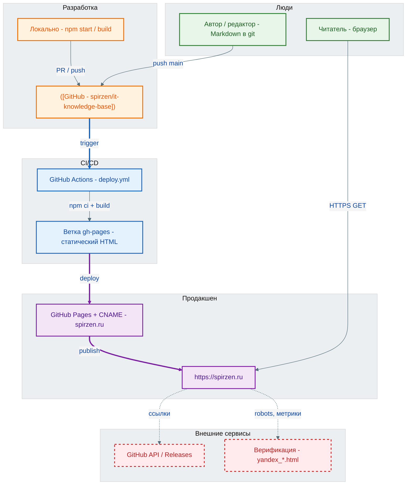

**Ограничения продакшена:**

- Поиск **Algolia** в конфиге закомментирован → свой клиентский поиск по `doc-search-index.json`.
- `onBrokenLinks: 'warn'` — битые ссылки не останавливают сборку.
- Контент: CC BY-NC-SA 4.0; код сайта: MIT.

---

## 2. Карта репозитория

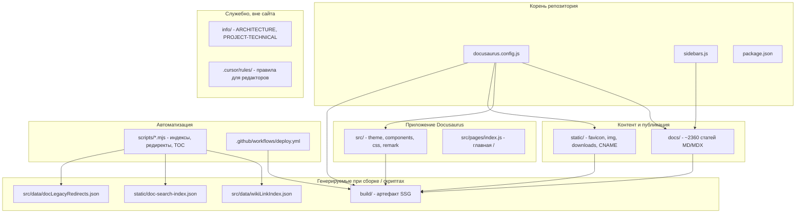

---

## 3. Пайплайн сборки

Команды из `package.json`. **Перед** `docusaurus start` / `build` всегда идут препроцессоры контента.

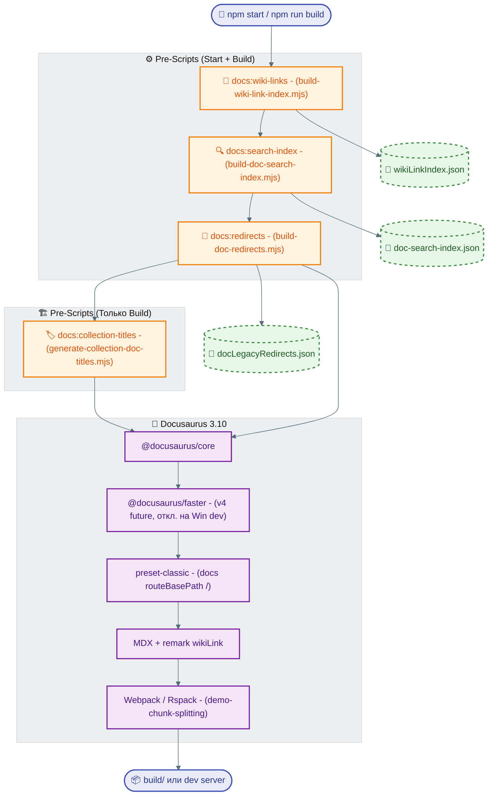

### Скрипты `scripts/` (основные для архитектуры)

| npm script | Выход | Назначение |
|------------|--------|------------|
| `docs:wiki-links` | `src/data/wikiLinkIndex.json` | Индекс `[[термин]]` → URL |
| `docs:search-index` | `static/doc-search-index.json` | Клиентский полнотекстовый поиск |
| `docs:redirects` | `src/data/docLegacyRedirects.json` | Старые URL → новые |
| `docs:collection-titles` | `src/data/collectionDocTitles.json` | Подписи в подборках sidebar |
| `docs:demo-registry` | `info/demo-registry.md` | Реестр демо ↔ статьи |
| `docs:toc` | обновление `docs/toc.md` | Общее содержание |

Остальные `docs:fix-*`, `docs:enrich-*` — **офлайн-обслуживание** контента, не входят в обязательный путь `start`/`build`.

---

## 4. Модель контента

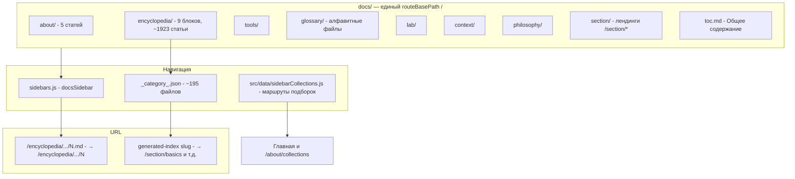

### Энциклопедия — девять блоков

| Каталог | Лендинг (пример) | Роль |
|---------|------------------|------|
| `1-basics/` | `/section/basics` | Цифровая грамотность, основы |
| `2-system-network/` | `/section/system-network` | ОС, сеть, железо |
| `3-data-markup/` | `/section/data-markup` | Данные, SQL, HTML, CSS |
| `4-code-dev/` | `/section/code-dev` | Разработка, OOP, паттерны |
| `5-languages/` | `/section/languages` | Языки программирования |
| `6-ai/` | `/section/ai` | ИИ и ML |
| `7-project/` | `/section/project` | Проектирование, менеджмент |
| `8-infra-security/` | `/section/infra-security` | DevOps, облака, ИБ |
| `9-spinoff/` | `/section/spinoff` | Смежные темы, карьера |

**Именование статей:** `intro.md`, числовые `1.md`, `41.md`, хабы `99.md` / `999.md` с виджетами. `numberPrefixParser: false` — префиксы в имени файла **не** скрываются в URL.

**Изображения:** рядом со статьёй в `docs/**`, не в `static/` (кроме глобальных ресурсов сайта).

---

## 5. Конфигурация Docusaurus

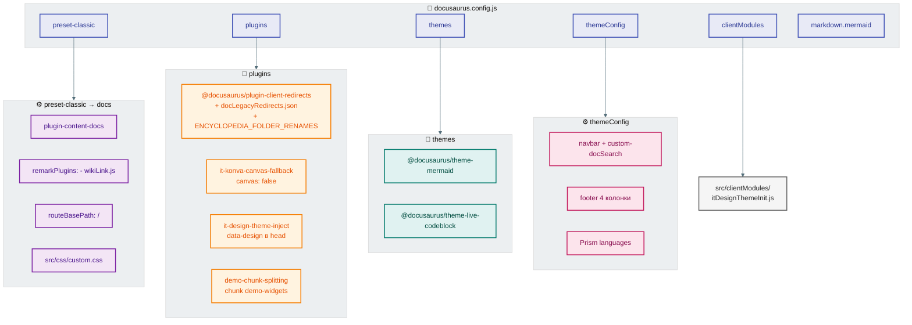

### Swizzle темы (`src/theme/`)

| Компонент | Назначение |
|-----------|------------|
| `Root` | `DocSidebarFallbackProvider` |
| `DocItem/Layout` | PDF, SeeAlso, Related, прогресс главы, кликабельные HTML-теги |
| `DocSidebar/Desktop/Content` | Фильтр пунктов sidebar, ресайз ширины |
| `DocSidebarItem/Category` | Категории sidebar (стандартное поведение) |
| `Navbar/Layout`, `MobileSidebar` | Оболочка шапки |
| `NavbarItem/DocSearch` | Кнопка поиска + `DocSearchModal` |
| `DocRoot/Layout` | Обёртка страницы документации |

---

## 6. Runtime в браузере

После загрузки статического HTML/React-бандла.

```mermaid
%%{init: {'theme': 'base', 'themeVariables': { 'primaryColor': '#e3f2fd', 'primaryTextColor': '#0d47a1', 'primaryBorderColor': '#1565c0', 'lineColor': '#546e7a', 'secondaryColor': '#f5f5f5', 'tertiaryColor': '#eceff1'}}}%%

flowchart TD
  %% === СТИЛИ ===
  classDef browser fill:#e8eaf6,stroke:#3f51b5,stroke-width:2px,color:#283593
  classDef shell fill:#f3e5f5,stroke:#7b1fa2,stroke-width:2px,color:#4a148c
  classDef pageTypes fill:#e8f5e9,stroke:#2e7d32,stroke-width:2px,color:#1b5e20
  classDef docChrome fill:#fff3e0,stroke:#f57c00,stroke-width:2px,color:#e65100
  classDef clientData fill:#e0f7fa,stroke:#00838f,stroke-width:2px,color:#004d40,stroke-dasharray: 5 5

  %% === УЗЛЫ ===
  Browser["🌐 Браузер читателя"]:::browser

  subgraph shell ["🖼️ Оболочка сайта"]
    direction TD
    RootTheme["theme/Root"]:::shell
    Navbar["Navbar + DocSearch Ctrl+K"]:::shell
    Sidebar["DocSidebar + фильтр"]:::shell
    Footer["Footer"]:::shell
    Design["data-design тема&#10;localStorage: it-universe-design"]:::shell
  end

  subgraph pageTypes ["📄 Типы страниц"]
    direction TD
    Home["src/pages/index.js&#10;hero, разделы, APK"]:::pageTypes
    DocPage["Любая статья docs/"]:::pageTypes
  end

  subgraph docChrome ["⚙️ Обвязка статьи swizzle"]
    direction TD
    Breadcrumbs["DocBreadcrumbs"]:::docChrome
    PDF["ArticlePdfExport&#10;html2canvas + jspdf lazy"]:::docChrome
    TOC["TOC desktop/mobile"]:::docChrome
    Progress["ChapterProgress"]:::docChrome
    SeeAlso["ArticleSeeAlso"]:::docChrome
    Related["ArticleRelated"]:::docChrome
    Paginator["DocItemPaginator"]:::docChrome
  end

  subgraph clientData ["📦 Данные с сервера статики"]
    direction TB
    SearchJSON["doc-search-index.json"]:::clientData
    StaticFiles["static/img, downloads, …"]:::clientData
  end

  %% === СВЯЗИ ===
  Browser --> shell
  shell --> pageTypes
  DocPage --> docChrome
  Navbar --> SearchJSON
  Home --> StaticFiles
```

---

## 7. Рендер одной статьи (sequence)

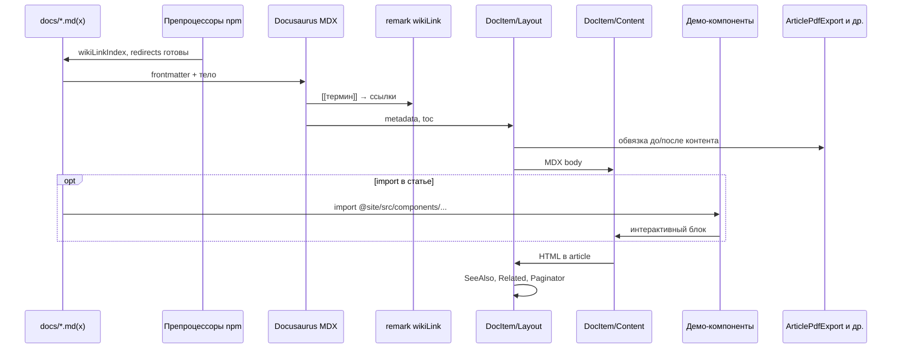

---

## 8. Слой интерактивных демо

**~350+** файлов `.jsx` / `.js` / `.tsx` в `src/components/` (включая `shared/*Engine.js`). В статьях подключаются выборочно через MDX `import`.

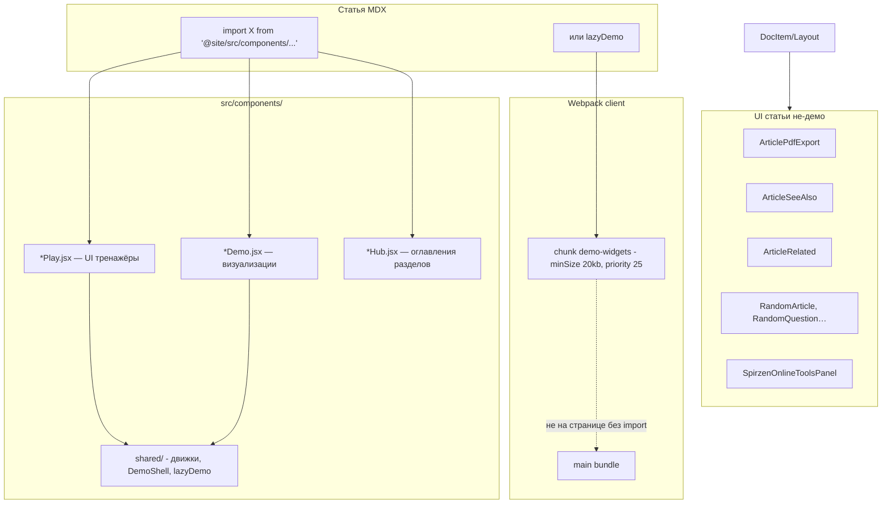

### Рекомендуемый стек одного демо

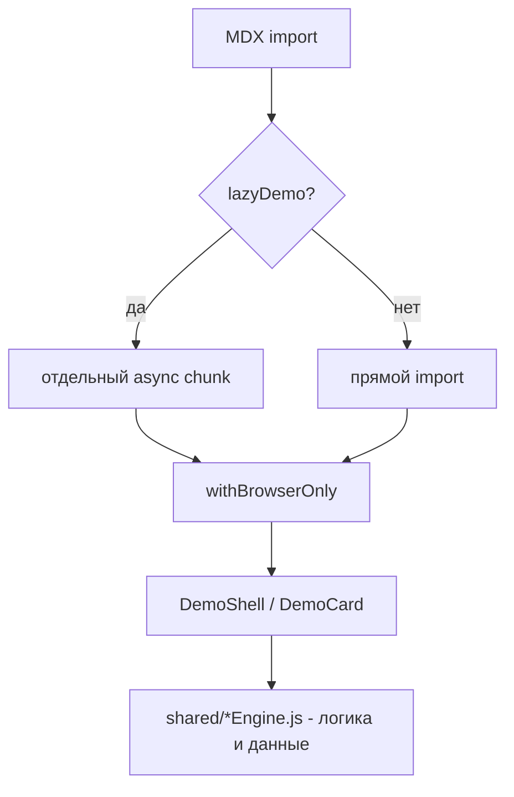

Реестр привязок: `npm run docs:demo-registry` → [`info/demo-registry.md`](./demo-registry.md).

---

## 9. Поиск и wiki-ссылки

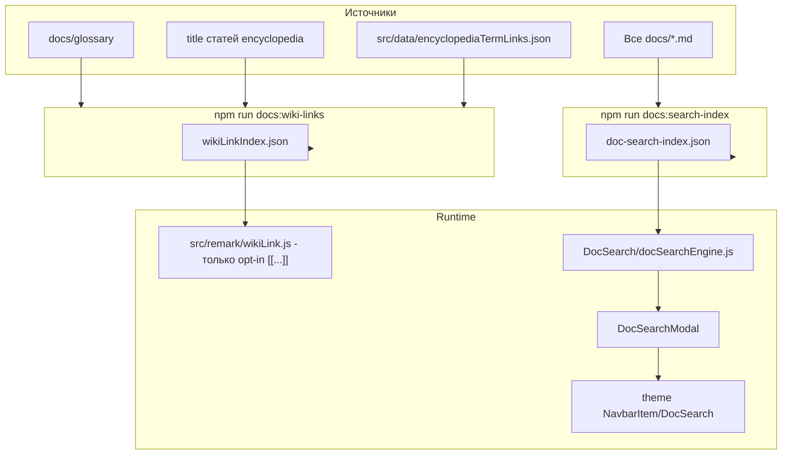

**Важно:** обычный текст статей **не** автолинкуется; только явный синтаксис `[[термин]]`, `[[термин|подпись]]`, `[[/path]]`. Подробности для авторов: [`info/wiki-links.md`](./wiki-links.md).

**Связанные темы:** frontmatter `related:` → `ArticleRelated` (отдельно от wiki и от «См. также»).

---

## 10. Деплой и хостинг

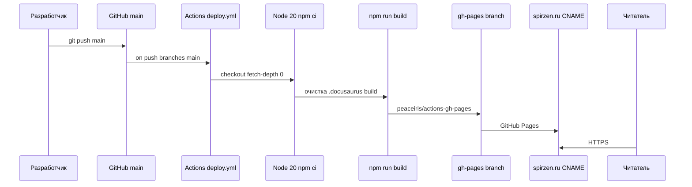

| Артефакт | Путь / роль |
|----------|-------------|
| `static/CNAME` | Домен `spirzen.ru` |
| `static/.nojekyll` | Статика без Jekyll |
| `static/robots.txt` | SEO |
| `static/downloads/it-universe.apk` | Android-приложение |
| `build/` | Результат SSG (не в git) |

---

## 11. Потоки данных (сводка)

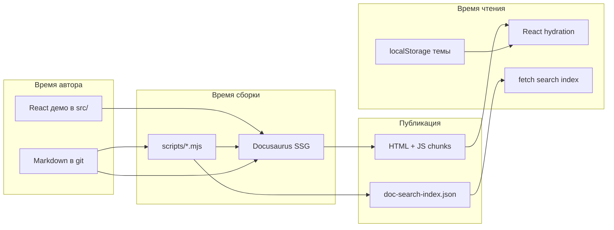

---

## 12. Ключевые файлы (шпаргалка)

| Файл | Роль в архитектуре |
|------|---------------------|
| `docusaurus.config.js` | Центр: preset, plugins, themes, redirects, chunks |
| `sidebars.js` | Дерево навигации + подборки |
| `src/remark/wikiLink.js` | `[[wiki]]` в MDX |
| `src/data/wikiLinkIndex.json` | Генерируемый индекс wiki |
| `static/doc-search-index.json` | Генерируемый индекс поиска |
| `src/data/docLegacyRedirects.json` | Генерируемые URL-редиректы |
| `src/theme/DocItem/Layout/index.tsx` | Обвязка каждой статьи |
| `src/components/DocSearch/*` | Клиентский поиск |
| `src/css/custom.css` | Глобальные стили, теги статей |
| `.github/workflows/deploy.yml` | CI → GitHub Pages |

---

## Связанные документы

- [`PROJECT-TECHNICAL.md`](./PROJECT-TECHNICAL.md) — полный технический справочник, таблицы, frontmatter
- [`PROJECT-FILE-TREE.txt`](./PROJECT-FILE-TREE.txt) — дерево путей
- [`demo-registry.md`](./demo-registry.md) — демо ↔ статьи
- [`wiki-links.md`](./wiki-links.md) — авторская инструкция по `[[ссылкам]]`

---

*При изменении архитектуры (новый плагин, скрипт сборки, swizzle) обновляйте соответствующую секцию и дату в шапке файла.*
