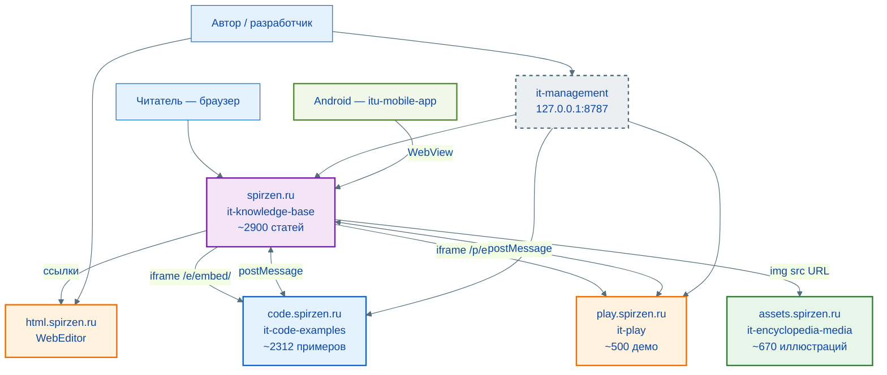
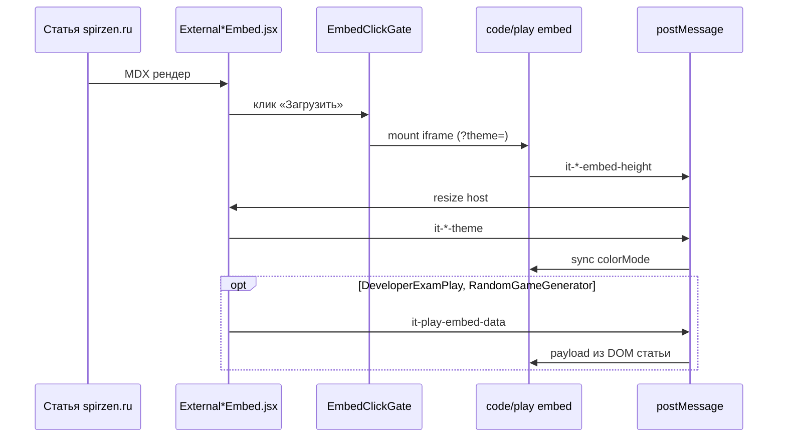

# Экосистема «Вселенная IT»

> Служебный документ (`info/`, не входит в `npm run build`).  
> Описывает **все репозитории**, интеграцию между сервисами, протоколы обмена и локальную разработку.  
> Дата описания: **2026-06-09**.

**Связанные документы:**

| Документ | Фокус |
|----------|--------|
| [`ARCHITECTURE.md`](./ARCHITECTURE.md) | Архитектура энциклопедии (Docusaurus, сборка, runtime) |
| [`PROJECT-TECHNICAL.md`](./PROJECT-TECHNICAL.md) | Технический справочник it-knowledge-base |
| [`../it-code-examples/AGENTS.md`](../../it-code-examples/AGENTS.md) | Каталог кода |
| [`../it-play/AGENTS.md`](../../it-play/AGENTS.md) | Интерактивные демо |
| [`../../it-management/README.md`](../../it-management/README.md) | Локальная панель управления |
| [`../it-encyclopedia-media/README.md`](../it-encyclopedia-media/README.md) | Иллюстрации, assets.spirzen.ru |

---

## 1. Обзор экосистемы

«Вселенная IT» — не один репозиторий, а **распределённая статическая платформа**: пять публичных доменов на GitHub Pages (spirzen.ru, code, play, assets, html), локальная панель разработчика и мобильный клиент. На продакшене **нет общего backend** — связь между сервисами идёт через **HTTPS**: code и play — **iframe + postMessage**, иллюстрации — **прямые URL** с assets.spirzen.ru, WebEditor — **ссылки** из статей на html.spirzen.ru.

**Локализация:** архитектура экосистемы готова к добавлению языков (`i18n-ready`), но на текущем этапе используется стратегия `not i18n now`: дополнительные языки не внедряются и не планируются, так как это нерационально при текущем масштабе контента.



### Масштаб (июнь 2026)

| Компонент | Репозиторий | Продакшен | Контент |
|-----------|-------------|-----------|---------|
| Энциклопедия | `it-knowledge-base` | [spirzen.ru](https://spirzen.ru/) | ~2900 статей (9 блоков), ~3400 материалов в `docs/` |
| Примеры кода | `it-code-examples` | [code.spirzen.ru](https://code.spirzen.ru/) | ~2312 примеров |
| Интерактив | `it-play` | [play.spirzen.ru](https://play.spirzen.ru/) | ~500 демо |
| Медиа | `it-encyclopedia-media` | [assets.spirzen.ru](https://assets.spirzen.ru/) | ~670 иллюстраций, `media-manifest.json` |
| Веб-редактор | [`WebEditor`](https://github.com/Spirzen/WebEditor) | [html.spirzen.ru](https://html.spirzen.ru/) | HTML/CSS/JS, живой предпросмотр |
| Панель управления | `it-management` | только локально | веб-проекты экосистемы |
| Мобильное приложение | `itu-mobile-app` | APK / магазины | WebView → spirzen.ru |
| Глоссарий (портал) | `it-terms` | [terms.spirzen.ru](https://terms.spirzen.ru/) | ~69 буквенных страниц, Astro |
| Глоссарий (портал) | `it-terms` | [terms.spirzen.ru](https://terms.spirzen.ru/) | ~69 буквенных страниц, Astro |
| Лаборатория (портал) | `it-lab` | [lab.spirzen.ru](https://lab.spirzen.ru/) | ~180 статей, Astro, embed code/play |
| Инструменты (портал) | `it-tools` | [tools.spirzen.ru](https://tools.spirzen.ru/) | ~64 статьи, Astro, play embeds |

### Контентные порталы (Astro, 1 repo = 1 домен)

Разделы **Глоссарий**, **Лаборатория** и **Инструменты** вынесены с spirzen.ru на отдельные GitHub Pages-домены. В KB: `exclude` в docs, client-redirects на портал, sidebar — внешняя ссылка. Источник правды после миграции — `content/` в репозитории портала (`it-terms`, `it-lab`, `it-tools`).

| Раздел | KB path (архив) | Портал | Redirect |
|--------|-----------------|--------|----------|
| Глоссарий | `docs/glossary/` | terms.spirzen.ru | `glossaryExternalRedirects.json` |
| Лаборатория | `docs/lab/` | lab.spirzen.ru | `labExternalRedirects.json` |
| Инструменты | `docs/tools/` | tools.spirzen.ru | `toolsExternalRedirects.json` |

Следующие: games/kids — фазы 4.

### Правило размещения контента

| Тип материала | Куда | Как в статье |
|---------------|------|--------------|
| Текст, навигация, SEO | `it-knowledge-base` | Markdown / MDX |
| Глоссарий (термины) | `it-terms` → terms.spirzen.ru | Markdown в `content/glossary/` |
| Практика (лаборатория) | `it-lab` → lab.spirzen.ru | Markdown в `content/lab/` |
| Обзоры инструментов | `it-tools` → tools.spirzen.ru | Markdown в `content/tools/` |
| Короткий фрагмент (3–15 строк) | `it-knowledge-base` | fenced code block |
| Длинный листинг, мультифайл, практикум | `it-code-examples` | `ExternalCodeEmbed` |
| Тяжёлый React-симулятор, визуализация | `it-play` | `ExternalPlayEmbed` |
| Практика HTML/CSS/JS в браузере | [`WebEditor`](https://github.com/Spirzen/WebEditor) | ссылка / `SpirzenOnlineToolLink` → html.spirzen.ru |
| Иллюстрации, скриншоты, экспорт диаграмм | `it-encyclopedia-media` | `` |
| Лёгкий inline-виджет | `it-knowledge-base` | `import` + `<Component />` с `lazyDemo` |

---

## 2. Стек по сервисам

### 2.1. spirzen.ru — it-knowledge-base

| Слой | Технология |
|------|------------|
| SSG | Docusaurus **3.10**, React **19** |
| Ускорение сборки | `@docusaurus/faster`, `future.v4` |
| Контент | Markdown / MDX в `docs/` |
| Диаграммы | `@docusaurus/theme-mermaid` |
| Lab (живой код) | `@docusaurus/theme-live-codeblock` |
| Подсветка inline | Prism (`prism-react-renderer`) |
| PDF статей | `html2canvas` + `jspdf` (lazy) |
| Поиск | Собственный **DocSearch** → `static/doc-search-index.json` |
| Wiki-ссылки | remark `[[термин]]` → `wikiLinkIndex.json` |
| Деплой | GitHub Actions → `actions/deploy-pages@v4` |
| Node.js | ≥ 20 |

### 2.2. code.spirzen.ru — it-code-examples

| Слой | Технология |
|------|------------|
| SSG | Astro **5**, `output: 'static'` |
| Подсветка | **Shiki** на этапе сборки (light + dark) |
| Runtime | Vanilla JS: вкладки, copy, fullscreen, catalog-search, embed-resize, theme |
| Контент | `examples/<язык>/<slug>/` + `meta.json` |
| Деплой | GitHub Actions → GitHub Pages |
| Node.js | ≥ 20 |

### 2.3. play.spirzen.ru — it-play

| Слой | Технология |
|------|------------|
| SSG | Astro **5** + `@astrojs/react` |
| UI | React **19** islands (`client:load` на embed) |
| Графика | `konva`, `react-konva` |
| Утилиты | `html2canvas`, `jspdf`, `qrcode`, `uuid` |
| Контент | `plays/<category>/<slug>/meta.json` + `src/components/demos/` |
| Деплой | GitHub Actions → GitHub Pages |
| Node.js | ≥ 20 |

### 2.3a. html.spirzen.ru — WebEditor

| Слой | Технология |
|------|------------|
| Репозиторий | [`Spirzen/WebEditor`](https://github.com/Spirzen/WebEditor) |
| Хостинг | GitHub Pages (`html.spirzen.ru`) |
| Назначение | Редактор HTML, CSS и JavaScript с живым предпросмотром |
| Связь с энциклопедией | Ссылки из статей (`SpirzenOnlineToolLink`), хаб тренажёров (`ExternalPlayEmbed` с `src`) |

### 2.4. it-management (локально)

| Слой | Технология |
|------|------------|
| Сервер | Node **≥20**, модуль `http` (без npm-зависимостей) |
| UI | Статический HTML/CSS/JS в `public/` |
| API | REST + SSE (`/api/projects/:id/logs/stream`) |
| Доступ | `http://127.0.0.1:8787/` (`ADMIN_PORT`) |

### 2.5. itu-mobile-app

| Слой | Технология |
|------|------------|
| Framework | **.NET MAUI 10** |
| Контент | WebView → spirzen.ru |
| Офлайн-поиск | `Resources/Raw/search-manifest.json` |
| App ID | `ru.spirzen.ituniverse` |

### 2.6. assets.spirzen.ru — it-encyclopedia-media

| Слой | Технология |
|------|------------|
| Хостинг | GitHub Pages, **без сборки контента** |
| Дерево файлов | `public/encyclopedia/<путь-статьи>/…` |
| Общие диаграммы | `public/encyclopedia/_shared/img/` |
| Каталог для витрины | `public/media-manifest.json` (генерируется при деплое) |
| Деплой | GitHub Actions → `node scripts/generate-manifest.mjs` → Pages |
| Node.js | ≥ 20 (только скрипты) |

Путь в media-репозитории повторяет путь статьи в `docs/encyclopedia/` (без префикса `docs/encyclopedia`). В markdown энциклопедии — абсолютный URL `https://assets.spirzen.ru/encyclopedia/…`. Миграция из KB: `node scripts/migrate-from-kb.mjs` в `it-encyclopedia-media`.

---

## 3. Домены, порты и URL

### Продакшен

| Сервис | Домен | `BASE` | CNAME |
|--------|-------|--------|-------|
| Энциклопедия | `https://spirzen.ru` | `/` | `static/CNAME` |
| Код | `https://code.spirzen.ru` | `/` | `public/CNAME` |
| Play | `https://play.spirzen.ru` | `/` | `public/CNAME` |
| Медиа | `https://assets.spirzen.ru` | `/` | `public/CNAME` |

### Локальная разработка

| Сервис | Порт | URL | Env-переменные |
|--------|------|-----|----------------|
| Энциклопедия | **3000** | `http://localhost:3000/` | `IT_CODE_EXAMPLES_URL`, `IT_PLAY_URL` |
| Code | **4321** | `http://localhost:4321/` | `IT_CODE_EXAMPLES_SITE`, `IT_CODE_EXAMPLES_BASE` |
| Play | **4322** | `http://localhost:4322/` | `IT_PLAY_SITE`, `IT_PLAY_BASE` |
| Management | **8787** | `http://127.0.0.1:8787/` | `ADMIN_PORT`, `UNIVERSE_ROOT` |

При dev на `localhost:3000` энциклопедия **автоматически** подставляет локальные URL embed-сервисов (`embedServiceUrl.js`), даже если в конфиге указан прод.

### Канонические маршруты

**Code:**

| Назначение | Путь |
|------------|------|
| Каталог | `/` |
| Полная страница | `/e/<язык>/<slug>/` |
| Embed (iframe) | `/e/embed/<язык>/<slug>/` |
| Серия | `/series/<id>/` |

**Play:**

| Назначение | Путь |
|------------|------|
| Каталог | `/` |
| Полная страница | `/p/<category>/<slug>/` |
| Embed (iframe) | `/p/embed/<category>/<slug>/` |

**Устаревшее:** префикс `/it-code-examples/` — только legacy-зеркало postbuild и редирект `404.html`. В новых ссылках не использовать.

---

## 4. Интеграция между сервисами

### 4.1. Архитектурный паттерн

Связь **односторонняя по данным, двусторонняя по UI**:

1. Статья на spirzen.ru рендерит React-обёртку (`ExternalCodeEmbed` / `ExternalPlayEmbed`).
2. Обёртка создаёт `<iframe src="https://code|play.spirzen.ru/.../embed/...">`.
3. Дочерний документ шлёт высоту родителю через `postMessage`.
4. Родитель синхронизирует тему (light/dark) и при необходимости передаёт данные (`embed-data`).

Нет общего API, OAuth, WebSocket между доменами — только **статический HTML** и **браузерный postMessage**.



### 4.2. Компоненты родителя (it-knowledge-base)

| Файл | Роль |
|------|------|
| `src/components/ExternalCodeEmbed.jsx` | iframe → code.spirzen.ru |
| `src/components/ExternalPlayEmbed.jsx` | iframe → play.spirzen.ru |
| `src/constants/codeExamples.js` | URL builder, trusted origins (code) |
| `src/constants/playExamples.js` | URL builder, trusted origins (play) |
| `src/constants/embedServiceUrl.js` | подмена prod → localhost:4321/4322 |
| `src/components/shared/EmbedClickGate.jsx` | click-to-load перед iframe |
| `src/components/shared/lazyExternalEmbed.js` | lazy chunk для embed-компонентов |
| `src/components/shared/useEmbedViewport.js` | очередь загрузки, стабильная высота |
| `src/components/shared/embedScrollLock.js` | блокировка скролла при fullscreen |
| `src/remark/lazyMdxDemoImports.js` | MDX: import External* → lazy |

**Конфигурация URL** — `docusaurus.config.js` → `customFields`:

```javascript
customFields: {
  codeExamplesUrl: process.env.IT_CODE_EXAMPLES_URL || 'https://code.spirzen.ru',
  playExamplesUrl: process.env.IT_PLAY_URL || 'https://play.spirzen.ru',
}
```

### 4.3. Компоненты дочерних сервисов

**Code:**

| Файл | Роль |
|------|------|
| `src/pages/e/embed/[...slug].astro` | маршрут embed |
| `src/layouts/EmbedLayout.astro` | CSP `frame-ancestors`, минимальный chrome |
| `public/scripts/embed-resize.js` | `it-code-embed-height` |
| `public/scripts/theme.js` | `it-code-theme`, `localStorage.theme` |
| `public/scripts/code-toolbar.js` | fullscreen → `it-code-fullscreen` |

**Play:**

| Файл | Роль |
|------|------|
| `src/pages/p/embed/[...slug].astro` | маршрут embed |
| `src/layouts/EmbedLayout.astro` | CSP |
| `public/scripts/embed-resize.js` | `it-play-embed-height` |
| `public/scripts/theme.js` | `it-play-theme` |
| `src/lib/useEmbedPlayProps.ts` | приём `it-play-embed-data` |
| `src/components/shared/useDemoFullscreen.js` | `it-play-fullscreen` |

### 4.4. Протокол postMessage

Все сообщения — объекты `{ type: string, ...payload }`. Родитель **всегда** проверяет `event.origin` по whitelist.

#### Code ↔ Encyclopedia

| `type` | Направление | Payload | Назначение |
|--------|-------------|---------|------------|
| `it-code-embed-height` | iframe → parent | `{ height: number }` | авто-высота блока |
| `it-code-theme` | parent → iframe | `{ theme: 'light' \| 'dark' }` | синхрон с Docusaurus colorMode |
| `it-code-fullscreen` | iframe → parent | `{ active: boolean }` | полноэкранный просмотр кода |
| `it-code-fullscreen-close` | parent → iframe | `{}` | закрытие по Escape |

Дополнительно: `?theme=light|dark` в URL iframe; `localStorage.theme` на стороне code (как у Docusaurus).

#### Play ↔ Encyclopedia

| `type` | Направление | Payload | Назначение |
|--------|-------------|---------|------------|
| `it-play-embed-height` | iframe → parent | `{ height: number }` | авто-высота |
| `it-play-theme` | parent → iframe | `{ theme: 'light' \| 'dark' }` | синхрон темы |
| `it-play-fullscreen` | iframe → parent | `{ active: boolean }` | полноэкранный режим демо |
| `it-play-fullscreen-close` | parent → iframe | `{}` | Escape |
| `it-play-embed-data` | parent → iframe | `{ payload: Record<string, unknown> }` | DOM-данные статьи (экзамен, каталог игр) |

`embed-data` используется в `DeveloperExamPlay`, `RandomGameGenerator`: родитель читает разметку статьи и передаёт структурированный payload в iframe после load.

#### Trusted origins (родитель)

```javascript
// codeExamples.js
['https://code.spirzen.ru', 'http://localhost:4321', 'http://127.0.0.1:4321', ...]

// playExamples.js
['https://play.spirzen.ru', 'http://localhost:4322', 'http://127.0.0.1:4322', ...]
```

#### CSP (дочерние сервисы)

`Content-Security-Policy: frame-ancestors 'self' https://spirzen.ru http://localhost:3000 http://127.0.0.1:3000`

### 4.5. UX-конвейер embed на стороне энциклопедии

1. **Remark** `lazyMdxDemoImports` — `import ExternalCodeEmbed` в MDX не тянет iframe сразу в main bundle.
2. **EmbedClickGate** — пользователь кликает «Загрузить интерактив» (экономия трафика и CPU).
3. **useEmbedViewport** — iframe монтируется при попадании в viewport; очередь ограничивает параллельные загрузки.
4. **useStableEmbedHeight** — сглаживание скачков высоты при ResizeObserver.
5. **Fullscreen** — диалог поверх статьи, scroll lock через `embedScrollLock`.

### 4.6. Подключение в статье

**Код:**

```jsx
import ExternalCodeEmbed from '@site/src/components/ExternalCodeEmbed';

<ExternalCodeEmbed example="python/hello-world" title="Python — Hello World" />
```

**Интерактив:**

```jsx
import ExternalPlayEmbed from '@site/src/components/ExternalPlayEmbed';

<ExternalPlayEmbed example="code-basics/block-builder" title="Конструктор блоков" />
```

**С данными из DOM:**

```jsx
<ExternalPlayEmbed
  example="lab/developer-exam-play"
  title="Экзамен разработчика"
  embedData={{ questions: [...] }}
/>
```

В `meta.json` дочернего сервиса — обратная ссылка `encyclopediaUrl: "https://spirzen.ru/..."`.

---

## 5. Поиск в экосистеме

| Уровень | Где | Реализация |
|---------|-----|------------|
| Статьи энциклопедии | spirzen.ru | `DocSearch` (Ctrl+K) → `doc-search-index.json` |
| Примеры кода | code.spirzen.ru | `catalog-search.js` на главной |
| Демо play | play.spirzen.ru | `catalog-search.js` на главной |
| Мобильное приложение | APK | `search-manifest.json` |
| Файлы в панели | it-management | поиск по дереву `docs/` / `examples/` / `plays/` |

Algolia **не используется** (закомментирован в Docusaurus). Поиск по статьям — полностью клиентский, без внешних SaaS.

---

## 6. Деплой и CI/CD

Каждый публичный репозиторий деплоится **независимо** через GitHub Actions на свой custom domain (три лимита GitHub Pages).

| Репозиторий | Workflow | Артефакт | Домен |
|-------------|----------|----------|-------|
| it-knowledge-base | `.github/workflows/deploy.yml` | `build/` | spirzen.ru |
| it-code-examples | `.github/workflows/deploy.yml` | `dist/` | code.spirzen.ru |
| it-play | `.github/workflows/deploy.yml` | `dist/` | play.spirzen.ru |
| it-encyclopedia-media | `.github/workflows/deploy.yml` | `public/` | assets.spirzen.ru |

**Энциклопедия:** `actions/deploy-pages@v4`, checkout `fetch-depth: 0` (даты коммитов в footer), swap 10 GB на runner для тяжёлой сборки.

**Code:** postbuild зеркалирует `dist/` → `dist/it-code-examples/` для legacy URL.

**Локальный деплой** (альтернатива): it-management → Deploy на проект → `git init` в `build/`/`dist/` → force-push `gh-pages`.

---

## 7. it-management — центр локальной разработки

Репозиторий `it-management` — **панель оператора** для всех трёх веб-проектов. Не публикуется, слушает только `127.0.0.1`.

**Запуск:**

```bash
cd it-management
npm start
# или launch.bat / start-admin.bat (Windows)
```

**Возможности:**

- Start / Stop / Restart dev-серверов (порты 3000, 4321, 4322)
- Build и Deploy каждого проекта
- SSE-логи в реальном времени
- Просмотр дерева контента (`docs/`, `examples/`, `plays/`)
- Сводная статистика экосистемы
- Открытие браузера / проводника

`UNIVERSE_ROOT` по умолчанию — родительская папка `it-management` (ожидается `F:\ITUniverse` с соседними репозиториями).

---

## 8. Миграции контента (история апгрейда)

Массовый перенос с монолитного Docusaurus на отдельные домены:

| Направление | Скрипты | Масштаб |
|-------------|---------|---------|
| Листинги → code | `it-code-examples/scripts/migrate-*.mjs` + manifest JSON | ~2312 примеров |
| Демо → play | `it-play/scripts/migrate-*.mjs` + KB `migrate-*-to-play.mjs` | ~500 демо |
| Иллюстрации → assets | `it-encyclopedia-media/scripts/migrate-from-kb.mjs` | ~670 файлов, ~680 ссылок в markdown |
| Статьи KB | `ExternalCodeEmbed` / `ExternalPlayEmbed` + URL assets в markdown | тысячи встраиваний |

После миграции тяжёлые компоненты удаляются из `it-knowledge-base/src/components/` (`remove-migrated-play-components.mjs`); растровые файлы — из `docs/encyclopedia/**` и `static/img/` (кроме логотипов сайта).

---

## 9. Рекомендуемый локальный workflow

1. Клонировать соседние репозитории в одну папку (`ITUniverse/`).
2. Запустить `it-management` → Start All (или по отдельности).
3. Открыть `http://localhost:3000` — embed автоматически укажут на `:4321` и `:4322`.
4. При правках контракта postMessage — синхронно обновлять родитель и дочерний сервис + этот документ.

---

## 10. Ключевые файлы (шпаргалка)

```
it-knowledge-base/
  docusaurus.config.js          # customFields URLs
  src/components/ExternalCodeEmbed.jsx
  src/components/ExternalPlayEmbed.jsx
  src/constants/{codeExamples,playExamples,embedServiceUrl}.js
  static/doc-search-index.json  # генерируется при сборке

it-code-examples/
  astro.config.mjs
  public/scripts/{embed-resize,theme,code-toolbar}.js
  src/layouts/EmbedLayout.astro

it-play/
  astro.config.mjs
  public/scripts/{embed-resize,theme}.js
  src/lib/useEmbedPlayProps.ts

it-encyclopedia-media/
  public/encyclopedia/          # иллюстрации по пути статьи
  public/encyclopedia/_shared/img/  # общие диаграммы (архитектура и т.п.)
  scripts/migrate-from-kb.mjs
  scripts/generate-manifest.mjs

it-management/
  lib/config.mjs                # проекты экосистемы, порты, env
  server.mjs                    # HTTP API
```

---

*При изменении протокола postMessage, URL-схемы или состава экосистемы обновляйте этот файл, [`ARCHITECTURE.md`](./ARCHITECTURE.md) и README соответствующих репозиториев.*
