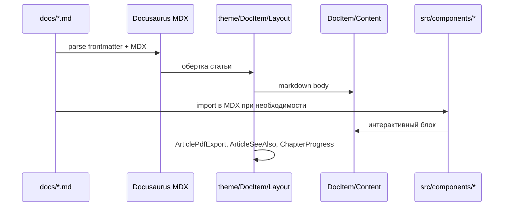

# Вселенная IT — техническая документация проекта

> Служебный справочник репозитория (не публикуется на сайте).  
> Дата сборки описания: **2026-05-18**.  
> Полный перечень путей (3605 строк): [`PROJECT-FILE-TREE.txt`](./PROJECT-FILE-TREE.txt).  
> Реестр демо и привязка к статьям: [`demo-registry.md`](./demo-registry.md) (`npm run docs:demo-registry`).

---

## 1. Назначение и контекст

**"Вселенная IT"** (`it-knowledge-base`) — открытая образовательная энциклопедия по информационным технологиям. Публичный сайт: [spirzen.ru](https://spirzen.ru/). Репозиторий: [github.com/spirzen/it-knowledge-base](https://github.com/spirzen/it-knowledge-base).

| Параметр | Значение |
|----------|----------|
| Формат | Статический сайт (SSG), без backend |
| Язык интерфейса | Только русский (`locales: ['ru']`) |
| Лицензия контента | CC BY-NC-SA 4.0 |
| Лицензия кода | MIT |
| Автор / методист | Тагиров Тимур Владиславович |

Цель архитектуры контента — единая проверяемая модель IT-знаний: от цифровой грамотности до DevOps, языков программирования и смежных дисциплин. Материалы пишутся с 2018 года; сайт на Docusaurus запущен в 2025 году. В репозитории **~2361** статья в `docs/` (Markdown/MDX) плюс **~667** изображений в дереве `docs/`.

Ограничения продакшена:

- Встроенный поиск Algolia **не подключён** (закомментирован в конфиге).
- Read-only: нет авторизации и пользовательских данных.
- `onBrokenLinks: 'warn'` — битые ссылки не роняют сборку, но попадают в лог.

---

## 2. Архитектура системы

### 2.1. Слои

```mermaid
flowchart TB
  subgraph build [Сборка]
    Node[Node.js 20+]
    DC[@docusaurus/core 3.10]
    Faster[@docusaurus/faster + future.v4]
    Node --> DC --> Faster
  end

  subgraph sources [Источники]
    Docs[docs/*.md MDX]
    Src[src/ React theme]
    Static[static/]
    CFG[docusaurus.config.js + sidebars.js]
  end

  subgraph output [Результат]
    BuildDir[build/ статический HTML]
    GHP[GitHub Pages → spirzen.ru]
  end

  sources --> DC
  DC --> BuildDir --> GHP
```

### 2.2. Поток рендеринга страницы статьи



### 2.3. Ключевые технологии

| Область | Стек |
|---------|------|
| Сборка | Docusaurus 3.10, `@docusaurus/faster`, `future.v4: true` |
| UI | React 19 |
| Контент | Markdown / MDX в `docs/` |
| Диаграммы | `@docusaurus/theme-mermaid` |
| Живой код (lab) | `@docusaurus/theme-live-codeblock` |
| Подсветка | Prism (`prism-react-renderer`) |
| PDF статей | `html2canvas` + `jspdf` (ленивая загрузка в `ArticlePdfExport`) |
| Деплой | GitHub Actions → ветка `gh-pages` |

---

## 3. Структура репозитория

### 3.1. Дерево верхнего уровня

```
it-knowledge-base/
├── docusaurus.config.js      # главный конфиг Docusaurus
├── sidebars.js               # боковое меню (ручные подборки + autogenerated)
├── package.json
├── tsconfig.json
├── README.md
├── deploy.bat / start.bat    # локальные скрипты Windows
├── .github/workflows/deploy.yml
├── docs/                     # весь контент сайта (routeBasePath: '/')
├── src/                      # React: компоненты, theme swizzle, CSS
├── static/                   # favicon, img, downloads (APK), CNAME, robots.txt
├── scripts/                  # generate-demo-registry.mjs
├── info/                     # служебная документация (не в сборке)
└── build/                    # артефакт npm run build (в .gitignore)
```

### 3.2. Статистика файлов (без node_modules, .git, build)

| Расширение | Количество | Назначение |
|------------|------------|------------|
| `.md` | ~2363 | Статьи и служебные markdown |
| `.png` | ~662 | Иллюстрации в `docs/` |
| `.json` | ~201 | `_category_.json` и конфиги |
| `.jsx` | 48 | Интерактивные демо |
| `.js` | 32 | Демо и утилиты |
| `.css` | 8 | Глобальные и модульные стили |
| `.mjs` | 36 | Скрипты (в т.ч. вне `scripts/`) |
| `.tsx` / `.ts` | 5 | Theme swizzle, типы |

**Всего путей в репозитории:** 3605 — см. [`PROJECT-FILE-TREE.txt`](./PROJECT-FILE-TREE.txt).

### 3.3. Каталог `docs/` — разделы сайта

| Папка | Статей (.md/.mdx) | Роль |
|-------|-------------------|------|
| `encyclopedia/` | 1923 | Ядро: теория и практика IT по 9 блокам |
| `lab/` | 123 | Лаборатория: вопросы, тренажёры, кейсы, экзамены |
| `glossary/` | 69 | Алфавитный глоссарий |
| `context/` | 90 | Отраслевой контекст (fintech, healthcare, …) |
| `tools/` | 62 | Справочник инструментов |
| `philosophy/` | 51 | Рефлексия, этика, познание |
| `section/` | 37 | Лендинги разделов энциклопедии (`/section/*`) |
| `about/` | 5 | О проекте, автор, лицензия, теги |

Дополнительно: `docs/toc.md` — "Общее содержание" в sidebar (ручной HTML-оглавление + `DocCardList`).

### 3.4. Энциклопедия — девять блоков

| Каталог | Статей | Slug лендинга (пример) |
|---------|--------|-------------------------|
| `1-basics/` | 265 | `/section/basics` |
| `2-system-network/` | 178 | `/section/system-network` |
| `3-data-markup/` | 144 | `/section/data-markup` |
| `4-code-dev/` | 154 | `/section/code-dev` |
| `5-languages/` | 627 | `/section/languages` |
| `6-ai/` | 41 | `/section/ai` |
| `7-project/` | 196 | `/section/project` |
| `8-infra-security/` | 139 | `/section/infra-security` |
| `9-spinoff/` | 178 | `/section/spinoff` |

Именование подпапок: `N-NN-slug` или `N.NN. Name` (исторические варианты). В каждой главе обычно есть `intro.md`, статьи с числовыми именами (`1.md`, `41.md`, …), иногда `99.md` / `999.md` как хабы с демо-виджетами.

### 3.5. `_category_.json`

Файлы задают подпись в sidebar, порядок (`position`) и **лендинги разделов** (`generated-index`):

```json
{
  "label": "1. Основы",
  "link": {
    "type": "generated-index",
    "title": "1. Основы",
    "description": "Оглавление раздела 1. Основы",
    "slug": "/section/basics"
  }
}
```

В репозитории **~195** файлов `_category_.json` (в основном под `docs/encyclopedia/`).

### 3.6. `static/`

| Файл | Назначение |
|------|------------|
| `static/CNAME` | Домен GitHub Pages (`spirzen.ru`) |
| `static/img/logoITU.png`, `docusaurus.png` | Логотипы |
| `static/favicon.ico` | Иконка (дублируется в `img/`) |
| `static/robots.txt` | SEO |
| `static/.nojekyll` | Отключение Jekyll на Pages |
| `static/yandex_*.html` | Верификация Яндекса |
| `static/downloads/it-universe.apk` | Сборка Android-приложения "Вселенная IT" для прямой загрузки |

Файлы из `static/` копируются в корень сайта при сборке без изменения пути: APK доступен по URL `/downloads/it-universe.apk` (на проде — `https://spirzen.ru/downloads/it-universe.apk`).

На главной (`src/pages/index.js`) под кнопками hero выводится ссылка **"Скачать APK"** (`useBaseUrl` + атрибут `download`). Стили блока — `src/pages/index.module.css` (классы `apkStrip`, `apkButton`).

При обновлении приложения замените файл в `static/downloads/` (имя лучше оставлять постоянным, чтобы не менять ссылку в коде). Учитывайте размер в Git: крупные APK (&gt;50 МБ) лучше выкладывать через [GitHub Releases](https://docs.github.com/en/repositories/releasing-projects-on-github/about-releases) и ставить внешнюю ссылку вместо хранения в репозитории.

Изображения статей хранятся **рядом со статьями** в `docs/**` (не в `static/`).

---

## 4. `docusaurus.config.js` — описание

Файл: корень репозитория. Экспорт CommonJS `module.exports`.

### 4.1. Сайт и маршрутизация

| Поле | Значение | Смысл |
|------|----------|--------|
| `title` | Вселенная IT | Заголовок вкладки |
| `url` | `https://spirzen.ru` | Канонический URL |
| `baseUrl` | `/` | Корень сайта |
| `trailingSlash` | `false` | URL без завершающего `/` |
| `favicon` | `img/favicon.ico` | Из `static/` |
| `onBrokenLinks` | `warn` | Мягкая проверка ссылок |

### 4.2. i18n

Только локаль `ru`, направление `ltr`.

### 4.3. Preset `classic`

```javascript
docs: {
  sidebarPath: './sidebars.js',
  editUrl: undefined,           // ссылка "Редактировать" отключена
  showLastUpdateAuthor: false,
  showLastUpdateTime: true,     // дата из git при сборке
  routeBasePath: '/',           // документация в корне, не /docs/
  numberPrefixParser: false,    // имена 1.md, 41.md не скрывают префиксы
},
blog: false,
theme: { customCss: './src/css/custom.css' },
```

### 4.4. Плагин `demo-chunk-splitting`

Кастомный webpack-плагин: на клиенте выносит `src/components/` в chunk `demo-widgets` (`splitChunks`, `minSize: 20000`, `priority: 25`) — уменьшает начальный бандл страниц без демо.

### 4.5. `themeConfig`

- **Prism** — дополнительные языки: bash, cobol, cpp, csharp, docker, fortran, go, java, kotlin, lisp, lua, php, rust, sql и др.
- **navbar** — `docSidebar` → `docsSidebar` ("Энциклопедия"), ссылки "О проекте", "Манифест", "Поддержать".
- **footer** — четыре колонки ссылок на разделы и GitHub.
- **algolia** — закомментирован.

### 4.6. Markdown и темы

```javascript
markdown: { mermaid: true },
themes: [
  '@docusaurus/theme-mermaid',
  '@docusaurus/theme-live-codeblock',
],
future: { v4: true, faster: true },
staticDirectories: ['static'],
```

---

## 5. `sidebars.js` — описание

Файл экспортирует объект `{ docsSidebar: [...] }`. Один sidebar ID совпадает с `sidebarId: 'docsSidebar'` в navbar.

### 5.1. Структура верхнего уровня

| # | Тип | Label | Механизм наполнения |
|---|-----|-------|---------------------|
| 1 | category | О проекте | Явный список: `about/project`, `author`, `license`, `manifest` |
| 2 | category | Энциклопедия | `autogenerated` → `dirName: 'encyclopedia'` |
| 3 | category | Подборки | **20+ ручных** тематических треков (грамотность, веб, DevOps, справочники, …) |
| 4 | category | Инструменты | `autogenerated` → `tools` |
| 5 | category | Глоссарий | `autogenerated` → `glossary` |
| 6 | category | Лаборатория | `autogenerated` → `lab` |
| 7 | category | Контекст | `autogenerated` → `context` |
| 8 | category | Философия | `autogenerated` → `philosophy` |
| 9 | doc | Общее содержание | `id: 'toc'` → `docs/toc.md` |

### 5.2. Autogenerated vs ручные подборки

- **Autogenerated** строит дерево из файловой структуры + `_category_.json` (порядок папок, `position`, collapsible).
- **Подборки** — кураторские списки `docId` без дублирования файлов: одна статья может быть в энциклопедии и в нескольких подборках.
- Блок **"Справочники"** в sidebar (строки ~339–424) — длинный перечень reference-статей (команды, шпаргалки).

### 5.3. Связь с "См. также"

Компонент `ArticleSeeAlso` читает **тот же** sidebar (`docsSidebar`), находит соседний контейнер текущей статьи и показывает до **12** карточек (`DocCardList`). Логика в `articleSeeAlsoUtils.js`. На `intro` и при `see_also: false` блок скрыт.

### 5.4. Правки sidebar

1. Новая папка под `docs/encyclopedia/` — обычно достаточно `_category_.json`; autogenerated подхватит сам.
2. Тематический трек — добавить `docId` в нужную подкатегорию "Подборки".
3. `docId` = путь без расширения: `encyclopedia/1-basics/1-08-kak-rabotaet-kompyuter/intro`.

---

## 6. Контент: front matter, теги, соглашения

### 6.1. Типичный front matter

```yaml
---
title: Заголовок статьи
sidebar_label: Короткая подпись
tags: [beginner, required, developer]   # опционально, Docusaurus tags
see_also: false                          # отключить "См. также"
pdf_export: false                        # скрыть кнопку PDF
hide_table_of_contents: true
---
```

### 6.2. HTML-теги в теле статьи (не frontmatter)

В статьях используются блоки, стилизованные в `custom.css`:

```html
<div class="article-tags">
  <span class="tag tag-required">ОБЯЗАТЕЛЬНО</span>
  <span class="tag tag-beginner">ДЛЯ НОВИЧКОВ</span>
</div>
<span class="complexity-badge">Разработчику</span>
```

`DocItem/Layout` делает `.tag` и `.complexity-badge` кликабельными → переход на `/tags/{slug}` (маппинг в `index.tsx`: `required`, `beginner`, `developer`, `analytic`, …). Документация для авторов: `docs/about/tags.md`, `docs/about/project.md`.

### 6.3. Подключение демо в MDX/Markdown

```md
import TerminalEmulator from '@site/src/components/TerminalEmulator.js';

<TerminalEmulator />
```

После добавления/переименования компонента: `npm run docs:demo-registry`.

### 6.4. Хабы `99.md` / `999.md`

Часто консолидируют `RandomChecklistItem` или другие виджеты для раздела; см. реестр демо.

### 6.5. Перекрёстные ссылки

- **Opt-in в тексте:** `[[термин]]`, `[[термин|подпись]]`, `[[/path]]` — remark-плагин `src/remark/wikiLink.js`; обычный текст не трогается.
- **Индекс:** `npm run docs:wiki-links` → `src/data/wikiLinkIndex.json` (глоссарий + уникальные title + `encyclopediaTermLinks.json`).
- **Front matter `related:`** — блок "Связанные темы" (`ArticleRelated`), без правки абзацев.
- Инструкция для авторов: `info/wiki-links.md` (служебный файл, не в сборке сайта).

---

## 7. `src/` — компоненты и порядок подключения

### 7.1. Порядок инициализации (от конфига к странице)

1. **`docusaurus.config.js`** — preset, `customCss`, plugins, themes.
2. **`src/css/custom.css`** — глобальные переменные IFM, типографика, теги, таблицы; `@import './demo-widgets.css'`.
3. **Swizzle `@theme/DocItem/Layout`** — обёртка каждой статьи.
4. **Swizzle `@theme/DocSidebar/Desktop/Content`** — поиск/фильтр по sidebar.
5. **`src/pages/index.js`** — главная (`@theme/Layout` + hero + карточки разделов).
6. **MDX-статья** — при `import` монтирует демо внутри `DocItemContent`.

### 7.2. Цепочка для интерактивного демо (рекомендуемый стек)

```
MDX import
  → (опционально) lazyDemo(() => import(...))  // отдельный chunk
  → (опционально) withBrowserOnly(Component)   // SSR-safe
  → DemoShell / DemoCard                       // классы .it-demo*
  → (опционально) styleTokens.js               // inline-стили от CSS-переменных
```

| Модуль | Путь | Роль |
|--------|------|------|
| `DemoShell` | `shared/DemoShell.jsx` | Обёртка `.it-demo`, карточка `DemoCard` |
| `lazyDemo` | `shared/lazyDemo.js` | `React.lazy` + `Suspense` + skeleton |
| `withBrowserOnly` | `shared/withBrowserOnly.jsx` | `BrowserOnly` + `DemoShell` |
| `demoFallback` | `shared/demoFallback.jsx` | Плейсхолдер загрузки |
| `styleTokens` | `shared/styleTokens.js` | `colors`, `demoContainer()`, кнопки |
| `useBreakpoint` | `shared/useBreakpoint.js` | Адаптив для демо |

### 7.3. UI статьи (не демо)

| Компонент | Файл | Подключение |
|-----------|------|-------------|
| Layout статьи | `theme/DocItem/Layout/index.tsx` | Swizzle: PDF, SeeAlso, прогресс, кликабельные теги |
| PDF | `ArticlePdfExport.jsx` + `utils/exportArticlePdf.js` | В Layout, ленивый импорт pdf-библиотек |
| См. также | `ArticleSeeAlso.jsx` + `articleSeeAlsoUtils.js` | После контента, перед footer |
| Sidebar filter | `theme/DocSidebar/Desktop/Content/index.tsx` | Поле фильтрации пунктов меню |
| Главная | `pages/index.js` + `index.module.css` | Маршрут `/`; кнопка скачивания APK → `/downloads/it-universe.apk` |
| Фон | `AnimatedBackground.tsx` | Только главная (если подключён) |

### 7.4. Полный список демо-компонентов (`src/components/`)

**67** файлов демо в корне `components/` (+ `shared/`). Актуальная привязка к статьям — в [`demo-registry.md`](./demo-registry.md).

#### Алгоритмы, код, выполнение

| Компонент | Файл |
|-----------|------|
| AlgoCodeVisualizer | `AlgoCodeVisualizer.jsx` |
| BlockBuilder | `BlockBuilder.jsx` |
| BuildProcessFlow | `BuildProcessFlow.jsx` |
| CodeTransformationDemo | `CodeTransformationDemo.jsx` |
| CompilerSimulator | `CompilerSimulator.jsx` |
| DebuggerEmulator | `DebuggerEmulator.jsx` |
| FunctionSimulator | `FunctionSimulator.jsx` |
| GitEmulator | `GitEmulator.jsx` |
| LexicalScopeVisualizer | `LexicalScopeVisualizer.js` |
| LoopsSimulator | `LoopsSimulator.jsx` |
| MethodCallSimulator | `MethodCallSimulator.jsx` |
| ModuleDependencyGraph | `ModuleDependencyGraph.jsx` |
| ObjectLifecycleSimulator | `ObjectLifecycleSimulator.jsx` |
| ProcessThreadVisualizer | `ProcessThreadVisualizer.jsx` |
| GarbageCollectorDemo | `GarbageCollectorDemo.jsx` |

#### Асинхронность и интеграции

| Компонент | Файл |
|-----------|------|
| AsynchronousInteraction | `AsynchronousInteraction.jsx` |
| SynchronousInteraction | `SynchronousInteraction.jsx` |
| ReactiveInteraction | `ReactiveInteraction.jsx` |
| SessionInteraction | `SessionInteraction.jsx` |
| RaceConditionDemo | `RaceConditionDemo.jsx` |
| RequestResponseModel | `RequestResponseModel.js` |
| AuthenticationFlow | `AuthenticationFlow.js` |
| HttpRequestAnalyzer | `HttpRequestAnalyzer.js` |
| SOAPTrainer | `SOAPTrainer.js` |
| RabbitMQSimulation | `RabbitMQSimulation.js` |
| KafkaSimulation | `KafkaSimulation.js` |
| ScalingDemo | `ScalingDemo.jsx` |

#### Данные, SQL, структуры

| Компонент | Файл |
|-----------|------|
| DataStructureGraph | `DataStructureGraph.jsx` |
| DataStructureHierarchy | `DataStructureHierarchy.jsx` |
| DataStructureKeyValue | `DataStructureKeyValue.jsx` |
| DataStructureLinear | `DataStructureLinear.jsx` |
| DataStructureQueue | `DataStructureQueue.jsx` |
| DataStructureStack | `DataStructureStack.jsx` |
| DataStructureTable | `DataStructureTable.jsx` |
| SqlTrainer | `SqlTrainer.js` |
| SqlInsertTrainer | `SqlInsertTrainer.js` |
| SqlUpdateTrainer | `SqlUpdateTrainer.js` |
| SqlDeleteTrainer | `SqlDeleteTrainer.js` |
| SqlJoinTrainer | `SqlJoinTrainer.js` |
| ORMDemo | `ORMDemo.jsx` |
| HTMLPlayground | `HTMLPlayground.js` |

#### Инфраструктура, DevOps, облако

| Компонент | Файл |
|-----------|------|
| CicdDemo | `CicdDemo.jsx` |
| DockerEmulator | `DockerEmulator.jsx` |
| DockerfileBuilder | `DockerfileBuilder.jsx` |
| ContainerOrchestrator | `ContainerOrchestrator.jsx` |
| BackupDemo | `BackupDemo.jsx` |
| LowNoCodeDemo | `LowNoCodeDemo.jsx` |

#### ОС, железо, сеть, терминал

| Компонент | Файл |
|-----------|------|
| ComputerBootSequence | `ComputerBootSequence.jsx` |
| BIOSemulator | `BIOSemulator.js` |
| TerminalEmulator | `TerminalEmulator.js` |
| IpAddressAnalyzer | `IpAddressAnalyzer.js` |
| DomainLevelAnalyzer | `DomainLevelAnalyzer.js` |
| UrlUriRnConverter | `UrlUriRnConverter.js` |

#### ООП, проект, тестирование

| Компонент | Файл |
|-----------|------|
| DIDemo | `DIDemo.jsx` |
| DIPDemo | `DIPDemo.jsx` |
| SoftwareLifecycleDemo | `SoftwareLifecycleDemo.jsx` |
| RequirementsAnalysisDemo | `RequirementsAnalysisDemo.jsx` |
| TestingBasicsDemo | `TestingBasicsDemo.jsx` |
| InteractiveRoadmap | `InteractiveRoadmap.js` |

#### Прочее

| Компонент | Файл |
|-----------|------|
| MobileAppEmulator | `MobileAppEmulator.jsx` |
| NeuralNetworkDemo | `NeuralNetworkDemo.jsx` |
| TextEncoderConverter | `TextEncoderConverter.js` |
| EnglishWordRandomizer | `EnglishWordRandomizer.js` |
| RandomChecklistItem | `RandomChecklistItem.js` |
| RandomQuestionFromArticle | `RandomQuestionFromArticle.js` |
| RandomGameGenerator | `RandomGameGenerator.js` |
| Timer | `Timer.jsx` (импорт в статье; файл может отсутствовать — см. "Импорты без файла" в реестре) |

**Служебные (не демо):** `articleSeeAlsoUtils.js` — утилиты sidebar для SeeAlso.

---

## 8. Стили — файлы и порядок работы

### 8.1. Файлы

| Файл | Область |
|------|---------|
| `src/css/custom.css` | Глобальная тема Docusaurus (IFM variables), статьи, теги, таблицы, hero, PDF |
| `src/css/demo-widgets.css` | Классы `.it-demo*` для React-демо |
| `src/theme/DocItem/Layout/styles.module.css` | Прогресс главы, колонки, кликабельные теги |
| `src/theme/DocSidebar/Desktop/Content/styles.module.css` | Поле поиска в sidebar |
| `src/components/ArticleSeeAlso.module.css` | Блок "См. также" |
| `src/components/ArticlePdfExport.module.css` | Панель экспорта PDF |
| `src/pages/index.module.css` | Главная страница |
| `src/components/AnimatedBackground.module.css` | Анимированный фон (главная) |

Подключение: только `custom.css` указан в `docusaurus.config.js`; остальные — CSS Modules через импорт в компонентах. `demo-widgets.css` подключается через `@import` в начале `custom.css`.

### 8.2. Секции `custom.css`

| § | Строки ~(от) | Содержание |
|---|--------------|------------|
| 1 | 3 | CSS-переменные `:root` и `[data-theme='dark']` (primary #7B68EE, фоны, sidebar) |
| 2 | 114 | Глобальная типографика, `prefers-reduced-motion`, lazy images |
| 3 | 139 | Hero, кнопки главной |
| 4 | 180 | Navbar, sidebar |
| 5 | 350 | Контент статьи, `.article-tags`, `.complexity-badge`, callout |
| 6 | 551 | Таблицы |
| 7 | 601 | Код и Prism |
| 8 | 859 | Карточки DocCard |
| 9 | 977 | Адаптив `@media (max-width: 996px)` |
| 10 | 1029 | Footer |
| — | 1078 | Декоративные эффекты заголовков ("свистелки") |
| — | 1199 | PDF-экспорт и `@media print` |

### 8.3. Рабочий процесс со стилями

1. **Глобальные изменения темы** — править переменные в §1 `custom.css` (светлая и тёмная тема параллельно).
2. **Новое демо** — предпочитать классы из `demo-widgets.css` + обёртку `DemoShell`; для inline — `styleTokens.js`, не хардкодить hex вне токенов.
3. **Локальная вёрстка компонента** — CSS Module рядом с `.jsx` только если стили не нужны в markdown.
4. **Теги в статьях** — использовать существующие классы `.tag-*` / `.complexity-badge`; маппинг URL в `DocItem/Layout/index.tsx`.
5. **Проверка** — `npm start`, переключить светлую/тёмную тему; для PDF — кнопка на статье и стили § PDF.
6. **Не дублировать** — крупные блоки таблиц/кода уже в §5–7; демо-специфика — в `demo-widgets.css`.

### 8.4. `demo-widgets.css`

Префикс `.it-demo`: переменные `--demo-gap`, `--demo-surface`, сетки `--2`/`--3`, кнопки, терминал, алерты. Тёмная тема переопределяет `--demo-highlight`. Классы согласованы с разметкой `DemoShell` / `DemoCard`.

---

## 9. Скрипты, сборка, CI

### 9.1. npm-скрипты (`package.json`)

| Команда | Действие |
|---------|----------|
| `npm start` | Dev-сервер |
| `npm run build` | Production; `NODE_OPTIONS=--max-old-space-size=8192` (Windows: `set` в script) |
| `npm run serve` | Просмотр `build/` |
| `npm run clear` | Очистка кэша `.docusaurus` |
| `npm run docs:demo-registry` | Генерация `info/demo-registry.md` |

Требования: **Node ≥ 20**, npm ≥ 9; для дат статей — **git history** (`fetch-depth: 0` в CI).

### 9.2. `scripts/generate-demo-registry.mjs`

Сканирует `src/components/*.jsx?` и импорты `@site/src/components/...` в `docs/`. Исключает UI: `ArticlePdfExport`, `ArticleSeeAlso`, `AnimatedBackground`, `Timer`, папку `shared/`.

### 9.3. GitHub Actions (`.github/workflows/deploy.yml`)

Триггер: `push` на `main`. Шаги: `checkout` (full history) → Node 20 → `npm ci` → удаление `.docusaurus`, `.cache`, `build` → `npm run build` → `peaceiris/actions-gh-pages` в `gh-pages` (`force_orphan: true`).

### 9.4. Локальные bat-файлы

`start.bat`, `deploy.bat` — обёртки для Windows (см. корень репозитория).

---

## 10. TypeScript

`tsconfig.json`: `strict: false`, `include`: `src/**/*`, конфиги Docusaurus. Swizzle-файлы theme — `.tsx`; большинство демо — `.jsx`/`.js`. Алиасы `@site/*` и `@theme/*` резолвятся на сборке.

---

## 11. Приложения

### A. Полный список файлов

**[`info/PROJECT-FILE-TREE.txt`](./PROJECT-FILE-TREE.txt)** — все 3605 относительных путей (исключены `node_modules`, `.git`, `build`, `.docusaurus`, `.cache`).

Пересоздать дерево:

```bash
node -e "
const fs=require('fs'),p=require('path');
const r='.';
const skip=new Set(['node_modules','.git','.docusaurus','build','.cache']);
function tree(d){return fs.readdirSync(d,{withFileTypes:true}).filter(e=>!skip.has(e.name)).sort((a,b)=>a.name.localeCompare(b.name,'ru')).flatMap(e=>{const fp=p.join(d,e.name);const rel=p.relative(r,fp).replace(/\\\\/g,'/');return e.isDirectory()?[rel+'/',...tree(fp)]:[rel];});}
fs.writeFileSync('info/PROJECT-FILE-TREE.txt',tree(r).join('\n'));
"
```

### B. Реестр демо

**[`info/demo-registry.md`](./demo-registry.md)** — таблица компонент → число статей → примеры ссылок.

### C. Связанные пользовательские документы

| Документ | Путь |
|----------|------|
| Краткий README | `/README.md` |
| О проекте (контент) | `docs/about/project.md` |
| Манифест | `docs/about/manifest.md` |
| Система тегов | `docs/about/tags.md` |
| Общее содержание | `docs/toc.md` |

---

*Документ предназначен для разработчиков и редакторов репозитория. При изменении архитектуры обновляйте этот файл и при необходимости перегенерируйте `PROJECT-FILE-TREE.txt` и `demo-registry.md`.*
